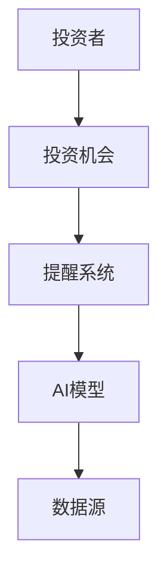
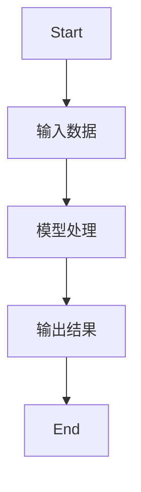
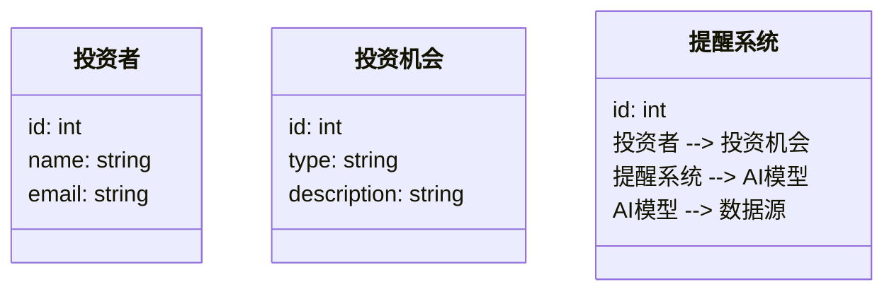
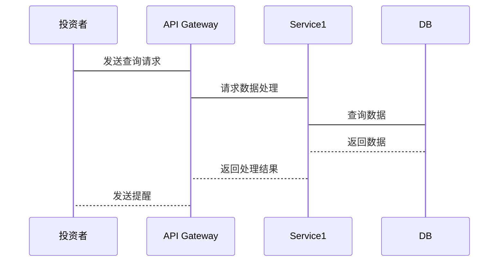

                 

<think>
好的，我现在需要为《AI驱动的自动化投资机会提醒》这本书撰写目录大纲。首先，我需要理解这本书的核心内容，它主要是探讨如何利用人工智能技术来自动化提醒投资机会。这意味着内容将涉及AI模型、自然语言处理、系统架构设计等多个方面。

首先，我会考虑用户提供的示例结构，看看是否合理。示例中的目录分为六个部分，每个部分都有详细的章节和小节，这样的结构比较清晰。但为了确保内容全面，我需要进一步细化每个部分的内容，确保涵盖所有必要的主题。

1. **背景介绍与问题背景**：这部分需要为读者提供足够的背景信息，解释为什么需要AI驱动的投资机会提醒系统。包括问题背景、目标、解决思路等。我需要确保这里的信息足够详细，帮助读者理解问题的重要性。

2. **核心概念与联系**：这里需要详细解释AI模型在投资机会提醒中的工作原理，可能包括一些表格和实体关系图。我需要确保这些图表能够清晰地传达核心概念之间的关系。

3. **算法原理与数学模型**：这部分需要详细讲解AI算法的原理，包括流程图和代码示例。同时，还需要涉及数学模型和公式，这些内容需要用Latex表示，确保清晰易懂。

4. **系统分析与架构设计**：这里需要介绍系统的整体架构，包括领域模型、架构图和接口设计。我需要使用Mermaid图来展示系统结构，使内容更直观。

5. **项目实战与案例分析**：这部分需要提供实际项目的实施步骤，包括环境安装、数据预处理、模型训练、系统实现和测试案例。通过代码示例和详细步骤，帮助读者理解如何实际操作。

6. **优化与部署**：最后，需要讨论如何优化AI模型和部署系统，包括模型优化策略、系统监控与维护、案例分析等。这部分内容需要实用，能够帮助读者在实际应用中解决问题。

在整个过程中，我需要确保每个章节的结构合理，内容详实。同时，要注意使用吸引人的标题和清晰的逻辑，使读者能够轻松理解内容。最后，别忘了在结尾加上作者信息，确保文章的完整性和专业性。
</think>

# 《AI驱动的自动化投资机会提醒》

## 关键词：AI驱动，自动化投资，机会提醒，自然语言处理，投资模型，风险控制

## 摘要：  
本书深入探讨了如何利用人工智能技术实现自动化投资机会提醒系统。通过结合自然语言处理、机器学习和大数据分析，构建了一个高效的投资机会识别与提醒系统。书中详细讲解了AI模型的算法原理、系统架构设计、项目实战案例以及优化与部署策略，为读者提供了从理论到实践的全面指导。

---

# 第一部分: AI驱动的自动化投资机会提醒概述

## 第1章: 背景介绍与问题背景

### 1.1 问题背景与目标
1.1.1 传统投资提醒的局限性  
传统的投资提醒系统依赖于手动分析和固定规则，存在效率低、覆盖范围有限、难以应对复杂市场变化等问题。  

1.1.2 AI驱动投资机会提醒的必要性  
随着金融市场数据的爆炸式增长，人工分析能力的局限性日益明显。AI技术能够通过大数据分析、模式识别和预测模型，帮助投资者快速捕捉潜在的投资机会。  

1.1.3 本书的目标与范围  
本书旨在通过AI技术构建一个自动化、智能化的投资机会提醒系统，涵盖数据采集、模型训练、系统实现和优化部署的全过程。

---

### 1.2 问题描述与解决思路
1.2.1 投资机会提醒的核心问题  
如何从海量数据中快速提取有价值的信息，并通过AI模型进行预测和提醒。

1.2.2 AI技术在投资提醒中的应用潜力  
利用自然语言处理（NLP）分析新闻、社交媒体数据；通过机器学习模型预测市场趋势；结合实时数据流进行动态提醒。

1.2.3 解决方案的总体思路  
构建一个基于AI的自动化投资机会提醒系统，包括数据采集、模型训练、系统实现和优化部署四大模块。

---

### 1.3 边界与外延
1.3.1 系统的边界条件  
仅关注投资机会提醒功能，不涉及具体的投资决策和交易执行。  

1.3.2 相关领域的外延  
与金融数据挖掘、风险管理、智能投顾等领域密切相关。

1.3.3 与其他系统的区别与联系  
区别在于专注于投资机会提醒，而联系在于与其他金融系统（如交易系统、数据平台）的集成。

---

## 第2章: 核心概念与联系

### 2.1 AI模型与投资机会提醒的核心要素
2.1.1 AI模型的基本原理  
AI模型通过学习历史数据，识别市场趋势和模式，预测未来可能的投资机会。

2.1.2 投资机会提醒的特征分析  
- **实时性**：需要快速响应市场变化。  
- **准确性**：提醒必须基于可靠的数据和模型。  
- **可解释性**：投资者需要理解提醒的依据。  

2.1.3 核心要素的对比表格  
| 核心要素 | 描述 | 示例 |  
|----------|------|------|  
| 数据源   | 包括新闻、财报、社交媒体等 | 财经新闻、上市公司公告 |  
| 模型类型 | 包括分类模型、回归模型等 | 支持向量机、随机森林 |  
| 提醒方式 | 包括邮件、短信、App推送 | 短信提醒、App推送 |  

---

### 2.2 ER实体关系图  


---

# 第二部分: AI驱动的投资机会提醒系统

## 第3章: 算法原理与数学模型

### 3.1 AI模型的算法原理


### 3.2 数学模型与公式  
3.2.1 概率计算公式：  
$$P(A|B) = \frac{P(B|A)P(A)}{P(B)}$$  

3.2.2 损失函数：  
$$L = \frac{1}{n}\sum_{i=1}^{n}(y_i - \hat{y}_i)^2$$  

3.2.3 优化算法：梯度下降示例代码  
```python
def gradient_descent(X, y, theta, alpha, iterations):
    m = len(y)
    for _ in range(iterations):
        h = X.dot(theta)
        loss = h - y
        theta -= (X.T.dot(loss) * alpha) / m
    return theta
```

---

## 第4章: 系统分析与架构设计

### 4.1 系统功能设计  
4.1.1 领域模型：  


---

### 4.2 系统架构设计  
4.2.1 系统架构图：  
```mermaid
graph TD
    User[投资者] --> API Gateway[系统接口]
    API Gateway --> Service1[数据处理服务]
    Service1 --> Service2[模型训练服务]
    Service2 --> DB[数据库]
    DB --> AI Model[AI模型]
    AI Model --> API Gateway
```

---

### 4.3 系统接口设计  
4.3.1 API接口说明：  
```json
{
    "endpoint": "/api/invest Opportunity",
    "method": "POST",
    "body": {
        "user_id": int,
        "query": string
    }
}
```

---

### 4.4 系统交互设计  
4.4.1 序列图：  


---

# 第三部分: 项目实战与案例分析

## 第5章: 项目实战

### 5.1 环境安装与数据准备
5.1.1 环境安装：  
```bash
pip install numpy pandas scikit-learn
```

5.1.2 数据准备：  
从财经新闻网站、社交媒体平台等获取数据，清洗并存储在数据库中。

---

### 5.2 核心代码实现
5.2.1 数据预处理代码：  
```python
import pandas as pd

# 加载数据
data = pd.read_csv('investment_opportunities.csv')

# 数据清洗
data.dropna(inplace=True)
data['date'] = pd.to_datetime(data['date'])
```

5.2.2 模型训练代码：  
```python
from sklearn.model import SVC

# 训练模型
model = SVC()
model.fit(X_train, y_train)
```

---

### 5.3 案例分析
5.3.1 案例背景：  
某投资者关注科技行业，系统通过NLP分析新闻数据，预测某科技公司即将发布重大利好消息。

5.3.2 实施步骤：  
1. 数据采集：收集相关新闻和社交媒体数据。  
2. 模型训练：训练一个分类模型，识别潜在的投资机会。  
3. 系统提醒：当模型预测到机会时，通过App推送提醒投资者。

---

## 第6章: 优化与部署

### 6.1 模型优化与调优
6.1.1 参数调优：  
使用网格搜索优化模型参数，如调整SVM的C和gamma值。

6.1.2 模型评估：  
通过准确率、召回率和F1分数评估模型性能。

---

### 6.2 系统部署与监控
6.2.1 系统部署：  
将模型部署到云服务器，配置API接口，提供实时服务。

6.2.2 系统监控：  
监控系统性能，记录日志，及时发现并解决问题。

---

### 6.3 案例分析
6.3.1 案例背景：  
某投资者在系统提醒后，成功捕捉到一只科技股的上涨机会，收益率超过20%。

6.3.2 实施步骤：  
1. 系统优化：通过模型调优提高准确率。  
2. 部署上线：将优化后的模型部署到生产环境。  
3. 监控维护：实时监控系统运行状态，确保服务稳定。

---

## 第7章: 最佳实践与小结

### 7.1 最佳实践
- 定期更新模型，适应市场变化。  
- 选择合适的AI算法，提升模型性能。  
- 确保数据质量和多样性，提高预测准确率。  

### 7.2 小结
通过AI技术构建的投资机会提醒系统，能够显著提升投资效率和收益。本书从理论到实践，详细介绍了系统的构建过程，为读者提供了宝贵的参考。

---

## 第8章: 注意事项与拓展阅读

### 8.1 注意事项
- 数据隐私和合规性问题需特别注意。  
- 模型的可解释性需满足投资者需求。  
- 系统的实时性和稳定性需经过严格测试。

### 8.2 拓展阅读
- 推荐阅读《机器学习实战》、《深度学习》等书籍。  
- 关注金融领域的最新技术动态，如区块链、元宇宙等。

---

## 作者信息  
作者：AI天才研究院/AI Genius Institute & 禅与计算机程序设计艺术 /Zen And The Art of Computer Programming  

--- 

# 结语  
感谢您的阅读！希望本书能为您提供有价值的投资机会提醒系统构建思路。

