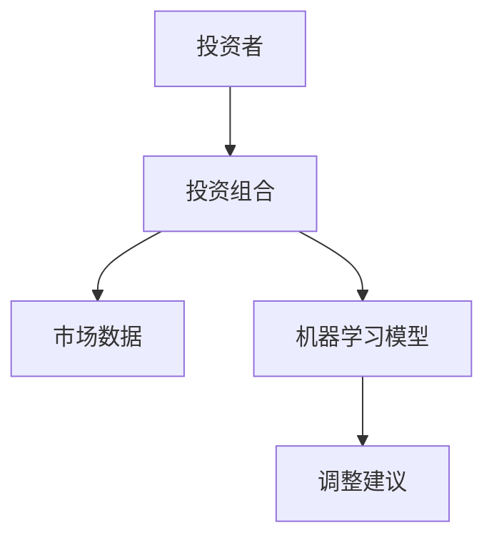
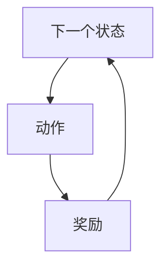
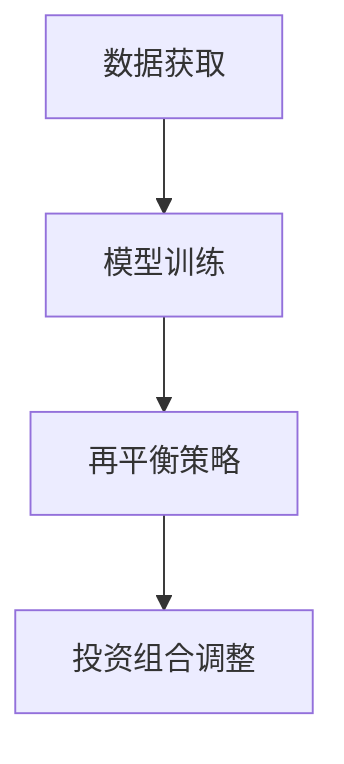

                 

<think>
好，我需要帮助用户撰写一篇关于《AI驱动的自动化投资组合再平衡》的技术博客。用户已经提供了一个详细的目录结构和内容框架，但我需要根据这个框架，逐步分析并撰写内容。

首先，我需要理解整个文章的结构。文章分为六个主要部分：背景介绍、核心概念与联系、算法原理、系统分析与架构设计、项目实战，以及最后的最佳实践与小结。每一部分都有详细的章节划分和内容要求。

开始撰写之前，我应该先阅读每个章节的详细要求，确保内容全面且符合用户的要求。例如，背景介绍部分需要涵盖投资组合优化的基本概念、AI在金融中的应用，以及问题背景和解决方案。这部分需要通俗易懂，适合技术读者理解。

接下来，核心概念与联系部分需要深入分析AI与投资组合再平衡的关系，并使用表格和Mermaid图来展示概念之间的联系。我需要确保这些图表清晰，能够帮助读者更好地理解复杂的关系。

在算法原理部分，我需要详细讲解AI算法，特别是强化学习和机器学习模型在投资组合再平衡中的应用。这里需要使用数学公式，用Latex表示，并举例说明。同时，Mermaid流程图将帮助读者理解算法步骤。

系统分析与架构设计部分，我需要描述问题场景，设计系统功能，可能用领域模型类图，系统架构图，接口设计和交互序列图。这部分需要确保系统架构清晰，各模块之间的关系明确。

项目实战部分，我需要提供Python代码示例，展示如何实现再平衡策略。代码需要详细解读，并分析实际案例，如在波动市场中的表现。

最后，最佳实践部分要强调AI的优势，注意事项包括数据质量和模型过拟合等问题，并提供未来发展方向的建议。

现在，我需要开始撰写每个章节的内容，确保逻辑清晰，内容详实。在撰写过程中，我需要检查是否覆盖了所有要求的点，并且保持语言的简洁和技术的准确性。

可能遇到的挑战包括：如何将复杂的AI算法用简单易懂的方式解释，确保数学公式正确无误，以及如何用Mermaid图清晰展示系统架构。我需要仔细核对每一部分，确保符合用户的格式和内容要求。

总体而言，我需要一步步地按照用户提供的框架，逐步填充内容，确保每个章节都详细且有深度，最终完成一篇高质量的技术博客。
</think>

# AI驱动的自动化投资组合再平衡

> 关键词：投资组合再平衡，人工智能，自动化，金融，机器学习

> 摘要：本文探讨了AI驱动的自动化投资组合再平衡的背景、核心概念、算法原理、系统架构设计以及项目实战。通过详细分析，展示了如何利用AI技术优化投资组合，实现动态再平衡，提升投资收益并降低风险。

---

## 第一部分: AI驱动的自动化投资组合再平衡背景介绍

### 第1章: 投资组合优化与再平衡的背景

#### 1.1 投资组合优化的基本概念
投资组合优化是指通过科学的方法构建投资组合，以在风险可控的前提下实现最大化的收益。投资组合的再平衡则是指根据市场变化和个人财务状况，定期调整投资比例，以维持目标资产配置。

#### 1.2 AI在金融领域的应用
人工智能在金融领域的应用广泛，包括交易、风险管理和投资组合优化。AI可以通过分析大量数据，识别市场趋势和潜在风险，帮助投资者做出更明智的决策。

#### 1.3 传统再平衡方法的局限性
传统再平衡方法通常基于固定的时间间隔或特定事件，无法实时适应市场波动，可能导致收益损失或风险增加。

### 第2章: 问题背景与问题描述

#### 2.1 投资组合再平衡的核心问题
投资组合再平衡的核心问题是如何在市场变化时，动态调整资产配置，以实现最优的投资效果。

#### 2.2 问题描述与边界条件
本文研究的是如何利用AI技术实现投资组合的动态再平衡，边界条件包括数据来源、计算能力限制和市场环境等。

#### 2.3 传统方法的局限性
传统再平衡方法缺乏灵活性和实时性，无法应对市场的快速变化，可能导致投资组合偏离预期收益和风险目标。

## 第二部分: 核心概念与联系

### 第3章: 核心概念的定义与属性

#### 3.1 核心概念的定义
AI驱动的再平衡策略利用机器学习模型，根据市场数据和投资者目标，动态调整投资组合。

#### 3.2 核心概念的属性对比
| 概念       | 传统再平衡 | AI驱动再平衡 |
|------------|------------|--------------|
| 基础数据   | 历史数据    | 实时数据     |
| 调整频率   | 定期或事件驱动 | 动态实时调整 |
| 调整依据   | 预设规则    | 机器学习模型 |

#### 3.3 实体关系图


## 第三部分: 算法原理

### 第4章: 算法原理与实现

#### 4.1 算法概述
AI驱动的再平衡策略通常采用强化学习和机器学习模型，通过训练模型预测市场趋势，并根据预测结果调整投资组合。

#### 4.2 强化学习算法


#### 4.3 机器学习模型
使用随机森林或神经网络模型，根据市场数据预测资产回报率，优化投资组合配置。

#### 4.4 数学模型
目标函数：
$$ \text{最大化收益} = \sum w_i r_i $$
约束条件：
$$ \sum w_i = 1 $$
$$ w_i \geq 0 $$

### 第5章: 算法实现

#### 5.1 环境安装
需要安装Python、NumPy、Pandas和机器学习库（如TensorFlow或PyTorch）。

#### 5.2 核心代码
```python
import numpy as np
import pandas as pd
from sklearn.ensemble import RandomForestRegressor

# 数据预处理
data = pd.read_csv('market_data.csv')
features = data[['return', 'volatility', 'market_cap']]
labels = data['target']

# 训练模型
model = RandomForestRegressor(n_estimators=100)
model.fit(features, labels)

# 预测并调整投资组合
predicted_returns = model.predict(new_features)
# 基于预测结果调整权重
weights = np.random.dirichlet([1]*len(predicted_returns))
```

## 第四部分: 系统分析与架构设计

### 第6章: 系统架构设计

#### 6.1 问题场景
投资者希望通过AI技术实现投资组合的动态再平衡，以应对市场波动。

#### 6.2 系统功能设计
- 数据获取模块：实时获取市场数据
- 模型训练模块：训练机器学习模型
- 再平衡策略模块：根据模型预测结果调整投资组合

#### 6.3 系统架构图


## 第五部分: 项目实战

### 第7章: 项目实现

#### 7.1 环境安装
安装必要的Python库，如NumPy、Pandas、Scikit-learn和TensorFlow。

#### 7.2 核心代码实现
```python
import numpy as np
import pandas as pd
from sklearn.ensemble import RandomForestRegressor

# 数据加载与预处理
data = pd.read_csv('market_data.csv')
features = data[['return', 'volatility', 'market_cap']]
labels = data['target']

# 训练随机森林模型
model = RandomForestRegressor(n_estimators=100)
model.fit(features, labels)

# 预测并调整投资组合
new_features = pd.DataFrame({'return': [0.05], 'volatility': [0.1], 'market_cap': [1000000]})
predicted_returns = model.predict(new_features)
# 计算权重
weights = np.random.dirichlet([1]*len(predicted_returns))
```

#### 7.3 代码解读
- 数据预处理：加载市场数据，提取特征和标签。
- 模型训练：使用随机森林回归模型进行训练。
- 预测与调整：根据模型预测结果，调整投资组合权重。

## 第六部分: 最佳实践与小结

### 第8章: 最佳实践

#### 8.1 小结
AI驱动的自动化投资组合再平衡能够显著提升投资效率和收益，但需要考虑数据质量和模型过拟合问题。

#### 8.2 注意事项
- 确保数据来源可靠
- 定期验证模型准确性
- 考虑市场环境变化

#### 8.3 拓展阅读
建议深入学习强化学习和神经网络在金融中的应用。

---

# 作者：AI天才研究院 & 禅与计算机程序设计艺术

