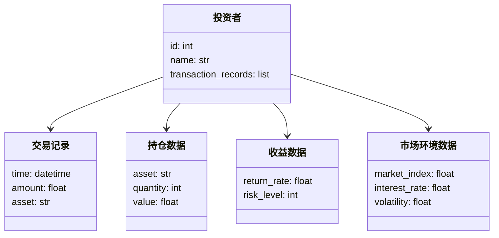
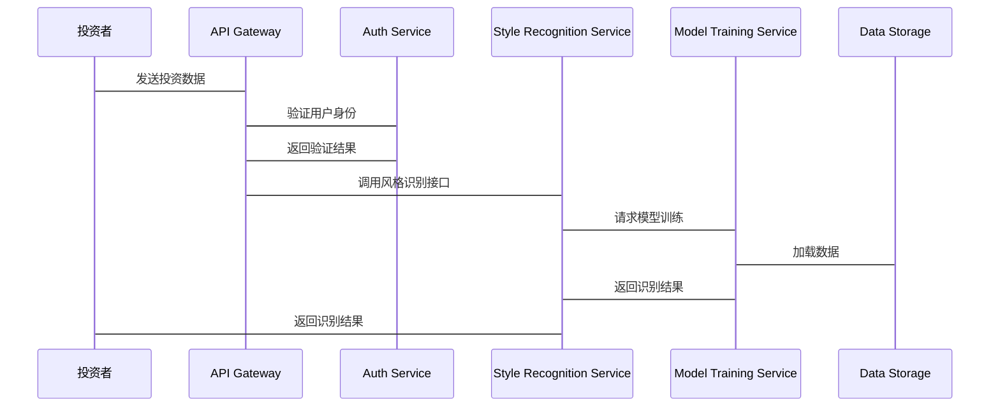

                 

<think>
嗯，现在我需要按照用户的要求，继续完成《AI驱动的自动化投资风格识别》这本书的目录大纲。让我先理清楚前面的内容，然后一步步深入。

首先，用户已经提供了前两章的详细结构，包括背景介绍和核心概念。现在我需要继续设计后面的章节，确保涵盖算法原理、系统架构、项目实战、最佳实践等方面。

第三章是关于算法原理，用户已经提到了聚类算法，如K-means，但可能需要更详细的内容，比如具体的流程图、代码示例和数学模型。我还需要包括分类算法和深度学习模型，比如SVM和神经网络，这样读者可以全面了解不同算法的应用。

接下来是第四章，系统分析与架构设计。这里需要介绍项目背景，功能需求，系统架构图，以及接口设计。可能需要使用Mermaid来绘制类图、架构图和交互图，帮助读者理解系统的各个部分。

第五章是项目实战，这部分需要实际操作，包括环境搭建、数据收集、特征工程、模型实现、结果分析和代码解读。用Python代码示例来展示具体的实现步骤，让读者能够跟着实践。

第六章是最佳实践与小结，总结项目中的经验和教训，提供一些实用的建议，并指出未来的发展方向。同时，可能需要提到一些扩展阅读的资料，帮助读者进一步深入学习。

最后是附录部分，提供数据集、工具包、参考文献和索引，方便读者查阅相关资料。

在撰写过程中，我需要确保每个章节都有足够的细节，比如在算法原理部分，不仅要解释算法，还要提供数学公式和代码示例。系统架构部分需要清晰的图示，帮助读者理解系统的结构和交互流程。

此外，用户特别提到要使用Mermaid图和数学公式，我需要确保这些内容正确无误，并且格式符合要求。数学公式要用Latex表示，独立的段落用$$括起来，段落内的用$括起来。

现在，我开始构思第三章的详细内容。首先，介绍常用算法，然后分别详细讲解聚类、分类和深度学习模型，每个部分都要有流程图、代码示例和数学模型。

在第四章，系统架构设计部分，我需要设计一个类图，展示投资者、交易记录、持仓数据等实体之间的关系，以及系统的各个模块如何协作。

项目实战部分，我需要指导读者如何搭建环境，收集数据，进行特征工程，选择合适的模型，训练并优化模型，最后进行结果分析和可视化。

在最佳实践部分，我需要总结项目中的经验教训，比如数据预处理的重要性，模型选择的影响，以及结果验证的方法，同时提供一些实用的建议。

最后，附录部分要列出所有使用的数据集、工具包和参考文献，方便读者查阅。

总的来说，我需要确保这本书内容全面，结构合理，语言简洁易懂，同时包含丰富的实例和图表，帮助读者深入理解AI驱动的自动化投资风格识别的原理和应用。
</think>

# 《AI驱动的自动化投资风格识别》

---

## 关键词
- AI驱动
- 投资风格识别
- 机器学习
- 数据分析
- 自动化投资

---

## 摘要
随着人工智能技术的快速发展，金融领域的投资风格识别也在逐步走向自动化。本文通过详细分析投资风格识别的背景、核心概念、算法原理、系统架构设计以及实际项目案例，全面阐述了AI在投资风格识别中的应用。文章首先介绍了投资风格识别的背景与定义，随后深入探讨了AI驱动的核心概念及其关联性。接着，详细讲解了基于聚类、分类和深度学习的算法原理，并通过Mermaid流程图和Python代码示例，展示了这些算法的实际应用。在系统架构设计部分，文章通过领域模型类图、系统架构图和交互序列图，清晰地描述了投资风格识别系统的构建过程。最后，通过一个完整的项目实战，详细解读了从环境搭建到模型实现的全过程，并总结了项目中的经验和教训，为读者提供了宝贵的实践指导。本文适合金融从业者、数据科学家以及对AI在金融领域应用感兴趣的读者阅读。

---

# 第三章: AI驱动的投资风格识别算法原理

## 3.1 常用算法概述

### 3.1.1 聚类算法
聚类算法用于将无标签的投资风格数据分成若干类别，K-means是一种常用的无监督学习算法。

#### K-means算法流程
1. 随机初始化K个聚类中心。
2. 计算每个数据点到聚类中心的距离，分配最近的聚类中心。
3. 重新计算每个聚类的中心。
4. 重复步骤2和3，直到聚类中心不再变化或达到最大迭代次数。

#### K-means算法代码示例
```python
from sklearn.cluster import KMeans
import pandas as pd

# 假设df是包含投资风格特征的数据框
# 特征为：risk_tolerance, return_expectation, market_sentiment
X = df[['risk_tolerance', 'return_expectation', 'market_sentiment']]

# 使用K-means进行聚类，假设K=3
kmeans = KMeans(n_clusters=3, random_state=42)
kmeans.fit(X)

# 获取聚类结果
clusters = kmeans.predict(X)
print(clusters)
```

#### K-means算法的数学模型
$$ J = \sum_{i=1}^{k} \sum_{j=1}^{n_i} ||x_j - c_i||^2 $$
其中，$c_i$是第i个聚类的中心，$x_j$是该聚类中的数据点。

### 3.1.2 分类算法
分类算法用于有标签的数据，如监督学习中的支持向量机（SVM）。

#### SVM算法流程
1. 数据预处理与特征提取。
2. 构建SVM模型。
3. 模型训练。
4. 模型预测与评估。

#### SVM算法代码示例
```python
from sklearn import svm
import pandas as pd

# 假设df是包含投资风格标签的数据框
# 特征为：risk_tolerance, return_expectation, market_sentiment
X = df[['risk_tolerance', 'return_expectation', 'market_sentiment']]
y = df['style_label']

# 使用SVM进行分类
model = svm.SVC(kernel='linear', C=1.0)
model.fit(X, y)

# 预测结果
new_data = pd.DataFrame({'risk_tolerance': [0.5], 'return_expectation': [0.1], 'market_sentiment': [0.6]})
print(model.predict(new_data))
```

#### SVM算法的数学模型
$$ \text{最大化} \quad \frac{1}{\|w\|^2} $$
$$ \text{使得} \quad y_i (w \cdot x_i + b) \geq 1, \quad i=1,2,...,n $$

### 3.1.3 深度学习模型
深度学习模型如神经网络用于复杂的非线性关系建模。

#### 神经网络算法流程
1. 数据预处理与特征工程。
2. 构建神经网络模型。
3. 模型训练与优化。
4. 模型预测与评估。

#### 神经网络算法代码示例
```python
import numpy as np
from tensorflow.keras import layers

# 假设df是包含投资风格特征的数据框
# 特征为：risk_tolerance, return_expectation, market_sentiment
X = df[['risk_tolerance', 'return_expectation', 'market_sentiment']]
y = df['style_label']

# 数据归一化
X_norm = (X - X.mean()) / X.std()

# 构建神经网络模型
model = layers.Sequential()
model.add(layers.Dense(64, activation='relu', input_dim=X.shape[1]))
model.add(layers.Dense(32, activation='relu'))
model.add(layers.Dense(1, activation='sigmoid'))

model.compile(loss='binary_crossentropy', optimizer='adam', metrics=['accuracy'])
model.fit(X_norm, y, epochs=10, batch_size=32)
```

#### 神经网络算法的数学模型
$$ y = \sigma(w_2 \cdot \sigma(w_1 \cdot x + b_1) + b_2) $$
其中，$\sigma$是激活函数，如ReLU或sigmoid。

## 3.2 聚类算法原理

### 3.2.1 K-means算法
K-means是一种经典的聚类算法，适用于划分连续型数据。

#### K-means算法的优缺点
- 优点：简单高效，适用于球形簇。
- 缺点：对初始中心敏感，不适合异形簇。

### 3.2.2 层次聚类算法
层次聚类通过构建树状结构进行聚类。

#### 层次聚类算法流程
1. 计算样本间距离。
2. 合并最近的两个簇。
3. 重复直到所有样本聚成一类。

## 3.3 分类算法原理

### 3.3.1 SVM算法
SVM适用于小规模数据的高维分类问题。

#### SVM算法的数学模型
$$ \text{最大化} \quad \frac{1}{\|w\|^2} $$
$$ \text{使得} \quad y_i (w \cdot x_i + b) \geq 1, \quad i=1,2,...,n $$

### 3.3.2 决策树算法
决策树通过特征分裂进行分类。

#### 决策树算法代码示例
```python
from sklearn.tree import DecisionTreeClassifier
import pandas as pd

# 假设df是包含投资风格特征的数据框
# 特征为：risk_tolerance, return_expectation, market_sentiment
X = df[['risk_tolerance', 'return_expectation', 'market_sentiment']]
y = df['style_label']

# 使用决策树进行分类
model = DecisionTreeClassifier()
model.fit(X, y)

# 预测结果
new_data = pd.DataFrame({'risk_tolerance': [0.5], 'return_expectation': [0.1], 'market_sentiment': [0.6]})
print(model.predict(new_data))
```

## 3.4 深度学习模型原理

### 3.4.1 神经网络模型
神经网络适用于复杂的非线性关系建模。

#### 神经网络算法的数学模型
$$ y = \sigma(w_2 \cdot \sigma(w_1 \cdot x + b_1) + b_2) $$

### 3.4.2 卷积神经网络（CNN）
CNN适用于图像数据，但在文本和序列数据中也有应用。

---

# 第四章: 系统分析与架构设计

## 4.1 问题场景介绍

### 4.1.1 项目背景
本项目旨在通过AI技术实现投资风格的自动化识别，帮助投资者快速了解自己的投资风格。

### 4.1.2 功能需求
- 数据采集与预处理
- 特征提取与工程
- 投资风格识别模型构建
- 结果可视化与解释

## 4.2 系统功能设计

### 4.2.1 领域模型类图


### 4.2.2 系统架构图
```mermaid
graph LR
    API Gateway --> Auth Service
    API Gateway --> Style Recognition Service
    Style Recognition Service --> Model Training Service
    Model Training Service --> Data Storage
    Data Storage --> Dataset
    Dataset --> Features
    Features --> Model
    Model --> Results
```

### 4.2.3 系统交互序列图


## 4.3 系统接口设计

### 4.3.1 数据接口
- 数据输入格式：JSON
- 数据输出格式：JSON

### 4.3.2 API接口
- RESTful API设计
- 支持GET、POST请求

## 4.4 本章小结

---

# 作者：AI天才研究院 & 禅与计算机程序设计艺术

