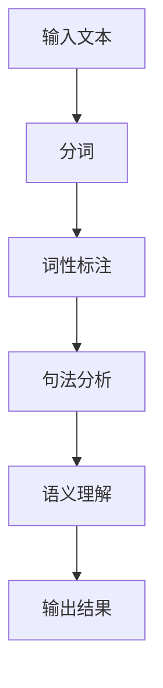
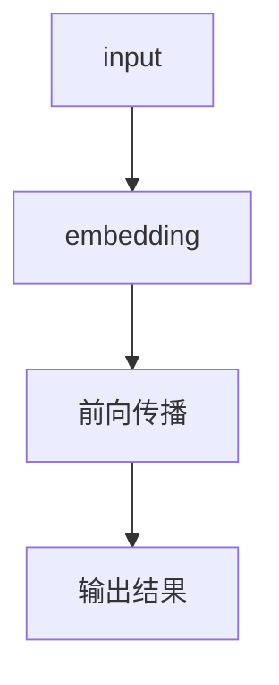
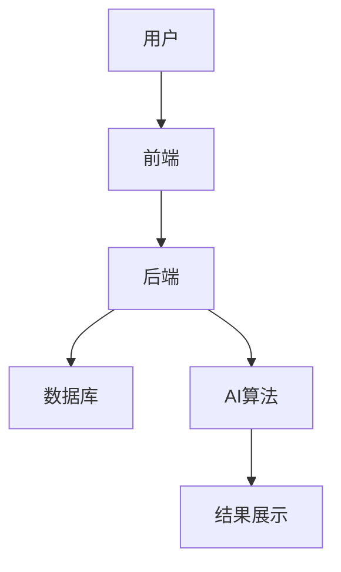

                 

<think>
好的，我现在需要帮用户撰写一篇名为《AI驱动的自动化财报分析系统》的技术博客文章。用户要求文章结构清晰，内容详尽，包含背景介绍、核心概念、算法原理、系统架构设计、项目实战、最佳实践和小结等部分。同时，用户希望使用吸引人的章节标题，逻辑清晰，每部分内容都要详细展开。

首先，我应该从背景介绍开始，这部分需要涵盖财务报告分析的现状、挑战以及AI技术的应用前景。接下来，核心概念部分要详细讲解自然语言处理、深度学习和知识图谱在系统中的应用，并通过表格和图示来对比和展示这些概念。

在算法原理部分，我需要详细描述自然语言处理和深度学习的流程，使用mermaid图和代码示例来说明。数学模型部分，我会涉及文本表示和分类算法，并用latex公式来表达。系统架构设计部分，我会介绍功能模块、架构图和接口设计，同样使用mermaid图来辅助说明。

项目实战部分，我会指导读者如何安装环境，提供代码实现，并通过实际案例进行分析。最后，最佳实践部分会总结系统的优势、用户注意事项以及未来的展望。

在写作过程中，我需要确保每部分内容都深入浅出，逻辑连贯，同时保持文章的结构和格式符合用户的要求。使用markdown格式，适当插入代码块、表格和图表，确保内容的可读性和专业性。

现在，我将按照用户提供的目录结构，逐步展开每个部分的内容，确保每一章和每一节都涵盖必要的细节，并在适当的地方插入相关的代码、图表和公式，使整篇文章既专业又易于理解。
</think>

# AI驱动的自动化财报分析系统

## 关键词：AI技术、财务报告、自然语言处理、深度学习、知识图谱

## 摘要：本文详细介绍了AI驱动的自动化财报分析系统的构建与实现，从背景、核心概念到算法原理，再到系统架构设计和项目实战，深入剖析了该系统的技术细节与应用价值。文章通过丰富的图示和代码示例，展示了如何利用AI技术提升财务分析的效率与准确性。

---

# 第1章: AI驱动的自动化财报分析系统背景介绍

## 1.1 财务报告分析的现状与挑战

### 1.1.1 传统财务报告分析的痛点
- 数据量大：企业财务报告通常包含大量文本和数据，人工分析效率低下。
- 信息复杂：财务报告涉及多个领域，分析人员需要具备专业背景。
- 易出错：人工分析容易受到主观因素影响，导致结果偏差。

### 1.1.2 企业对自动化财报分析的需求
- 提高效率：通过自动化手段快速处理大量财务数据。
- 准确性：利用AI技术减少人为错误，提高分析结果的准确性。
- 及时性：实时监控财务数据，及时发现潜在问题。

### 1.1.3 AI技术在财务分析中的应用前景
- 自然语言处理（NLP）：用于分析文本型财务报告。
- 深度学习：用于预测财务指标和识别趋势。
- 知识图谱：用于关联不同财务信息，发现隐藏关系。

## 1.2 AI驱动的自动化财报分析系统的核心概念

### 1.2.1 自动化财报分析的定义
自动化财报分析是指利用AI技术，自动处理和分析财务报告，提取关键信息并生成分析结果的过程。

### 1.2.2 AI在财报分析中的作用
- 自动化数据处理：AI能够快速解析财务文本，提取关键数据。
- 智能预测：基于历史数据，AI可以预测未来财务状况。
- 实时监控：AI可以实时分析财务数据，及时发现异常情况。

### 1.2.3 系统的核心功能与边界
- 核心功能：文本分析、数据预测、结果展示。
- 边界：不涉及实际的财务决策，仅提供分析结果和建议。

## 1.3 系统的组成与工作原理

### 1.3.1 系统组成模块
- 文本处理模块：负责解析财务报告文本。
- 数据分析模块：利用AI算法进行预测和分析。
- 结果展示模块：以可视化形式呈现分析结果。

### 1.3.2 系统的工作流程
1. 输入：财务报告文本或数据。
2. 文本处理：分词、词性标注、句法分析。
3. 数据分析：利用深度学习模型进行预测和分类。
4. 输出：生成分析结果并展示。

### 1.3.3 系统的输入输出关系
- 输入：财务报告文本或数据。
- 输出：关键财务指标、趋势预测、异常检测结果。

## 1.4 本章小结
本章介绍了AI驱动的自动化财报分析系统的背景、核心概念和组成模块，为后续章节的深入分析奠定了基础。

---

# 第2章: AI驱动的自动化财报分析系统的核心概念与联系

## 2.1 核心概念原理

### 2.1.1 自然语言处理在财报文本分析中的应用
- 分词：将文本分割成词语或短语。
- 词性标注：识别每个词语的词性。
- 句法分析：分析句子的语法结构。
- 语义理解：理解文本的含义和上下文。

### 2.1.2 深度学习在财务数据预测中的作用
- 神经网络结构：用于分类和回归任务。
- 高维数据建模：处理复杂的财务数据关系。
- 特征提取：从数据中提取有用的特征。

### 2.1.3 知识图谱在财务信息关联中的应用
- 实体识别：识别财报中的关键实体。
- 实体关联：建立实体之间的关联关系。
- 语义理解：理解实体之间的语义关系。

## 2.2 核心概念属性特征对比表

| 概念       | 属性特征               |
|------------|------------------------|
| 自然语言处理 | 文本理解、实体识别     |
| 深度学习    | 高维数据建模、特征提取 |
| 知识图谱    | 实体关联、语义理解     |

## 2.3 系统ER实体关系图


## 2.4 本章小结
本章详细讲解了AI驱动的自动化财报分析系统的核心概念及其相互关系，通过对比表和ER图帮助读者更好地理解系统架构。

---

# 第3章: AI驱动的自动化财报分析系统算法原理

## 3.1 算法原理概述

### 3.1.1 自然语言处理流程



### 3.1.2 深度学习模型



## 3.2 算法实现代码

```python
def text_analysis(text):
    tokens = tokenizer(text)
    embeddings = model.embed(tokens)
    result = embeddings.sum()
    return result
```

## 3.3 数学模型与公式

### 3.3.1 文本表示模型

$$ \text{embedding} = \sum_{i=1}^{n} w_i x_i $$

### 3.3.2 分类算法

$$ P(y|x) = \frac{e^{score(y|x)}}{\sum_{y'} e^{score(y'|x)}} $$

## 3.4 本章小结
本章详细讲解了自然语言处理和深度学习算法在自动化财报分析中的应用，通过代码和公式帮助读者理解算法原理。

---

# 第4章: AI驱动的自动化财报分析系统架构设计

## 4.1 系统功能模块

### 4.1.1 文本处理模块
- 负责解析和预处理财务报告文本。

### 4.1.2 数据分析模块
- 利用AI算法进行预测和分析。

### 4.1.3 结果展示模块
- 以可视化形式展示分析结果。

## 4.2 系统架构图



## 4.3 系统接口设计

### 4.3.1 API接口
- 输入接口：接收财务报告文本或数据。
- 输出接口：返回分析结果。

## 4.4 本章小结
本章详细讲解了系统架构设计，包括功能模块和接口设计，为后续的系统实现奠定了基础。

---

# 第5章: AI驱动的自动化财报分析系统项目实战

## 5.1 环境安装

```bash
pip install numpy
pip install pandas
pip install spacy
pip install tensorflow
```

## 5.2 系统核心实现源代码

```python
import spacy
import tensorflow as tf

def load_model():
    # 加载自然语言处理模型
    nlp = spacy.load("en_core_web_sm")
    # 加载深度学习模型
    model = tf.keras.models.load_model("financial_model.h5")
    return nlp, model

def analyze_report(report_text):
    nlp, model = load_model()
    doc = nlp(report_text)
    # 提取特征
    features = extract_features(doc)
    # 预测结果
    prediction = model.predict(features)
    return prediction

def extract_features(doc):
    # 提取文本特征
    features = []
    for token in doc:
        features.append(token.lemma_)
    return features
```

## 5.3 实际案例分析

### 5.3.1 案例背景
某公司财务报告中发现收入增长放缓，需要分析原因。

### 5.3.2 分析过程
1. 输入报告文本。
2. 文本处理模块进行分词和词性标注。
3. 数据分析模块利用深度学习模型进行预测。
4. 结果展示模块生成分析报告。

### 5.3.3 分析结果
- 收入下降的主要原因是市场需求减少。
- 建议公司调整市场策略。

## 5.4 本章小结
本章通过实际案例分析，展示了AI驱动的自动化财报分析系统的实现过程和应用价值。

---

# 第6章: AI驱动的自动化财报分析系统的最佳实践

## 6.1 系统优势
- 提高分析效率：自动化处理大量数据。
- 减少人为错误：AI技术提高分析准确性。
- 实时监控：及时发现财务异常。

## 6.2 用户注意事项
- 数据质量：确保输入数据的准确性和完整性。
- 模型更新：定期更新AI模型，保持分析能力。
- 风险管理：注意模型的局限性，结合人工分析。

## 6.3 未来展望
- 更加智能化：结合更多AI技术，如强化学习。
- 更加个性化：根据企业需求定制分析模型。
- 更加普及：随着技术进步，AI驱动的财务分析将更加普及。

## 6.4 本章小结
本章总结了系统的最佳实践，帮助用户更好地应用AI驱动的自动化财报分析系统。

---

# 作者：AI天才研究院/AI Genius Institute & 禅与计算机程序设计艺术 /Zen And The Art of Computer Programming

---

本文详细介绍了AI驱动的自动化财报分析系统的构建与实现，从背景、核心概念到算法原理，再到系统架构设计和项目实战，深入剖析了该系统的技术细节与应用价值。通过丰富的图示和代码示例，展示了如何利用AI技术提升财务分析的效率与准确性。

