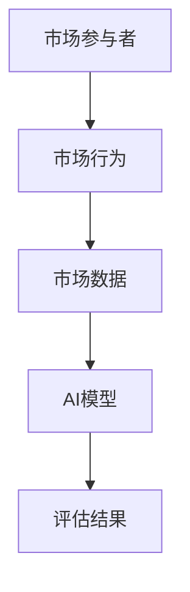
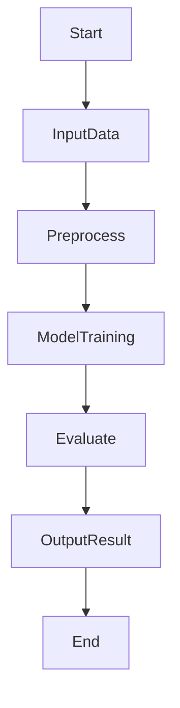
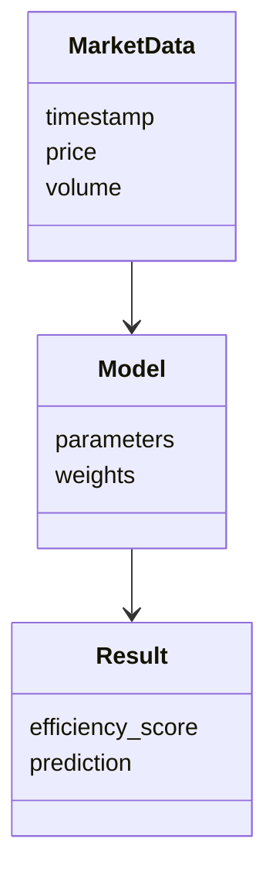
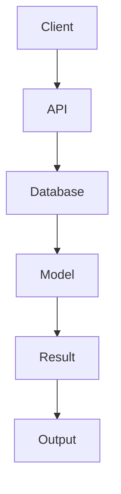

                 


# AI驱动的自适应市场效率评估

> 关键词：AI驱动，市场效率，自适应评估，算法原理，系统架构

> 摘要：本文系统阐述了AI驱动的自适应市场效率评估的核心概念、算法原理、系统架构及实际应用。通过详细的技术分析和实例演示，展示了如何利用AI技术实现动态、精准的市场效率评估，为现代市场分析提供了新的思路和解决方案。

---

# 第一部分: AI驱动的自适应市场效率评估概述

---

## 第1章: 背景与概述

### 1.1 问题背景

#### 1.1.1 市场效率的基本概念
市场效率是指市场参与者能够以最低成本、最快速度完成交易，并使市场价格反映所有相关信息的能力。传统市场效率评估依赖于静态模型和固定假设，难以应对复杂多变的市场环境。

#### 1.1.2 当前市场效率评估的挑战
- 数据量爆炸性增长，传统方法难以处理。
- 市场参与者行为复杂化，导致模型失效。
- 市场动态变化快，静态模型无法适应。

#### 1.1.3 AI驱动的必要性
AI技术能够处理海量数据，识别复杂模式，实时更新模型，为市场效率评估提供新的解决方案。

---

### 1.2 问题描述

#### 1.2.1 自适应市场效率评估的定义
自适应市场效率评估是一种动态、实时的市场分析方法，利用AI技术根据市场环境的变化自动调整评估模型和参数。

#### 1.2.2 传统市场效率评估的局限性
- 依赖假设：假设市场参与者理性、信息对称。
- 静态模型：无法适应市场环境的变化。
- 数据处理能力有限：难以处理高频交易和大数据。

#### 1.2.3 AI在市场效率评估中的作用
- 数据处理：AI能够处理海量数据，提取关键特征。
- 模型优化：AI能够实时更新模型，适应市场变化。
- 预测能力：AI能够预测市场趋势，辅助决策。

---

### 1.3 问题解决

#### 1.3.1 AI驱动的自适应评估方法
- 数据驱动：基于实时数据构建模型。
- 模型更新：利用反馈机制实时优化模型。
- 动态调整：根据市场变化自动调整评估参数。

#### 1.3.2 数据驱动与模型驱动的结合
- 数据驱动：从市场数据中提取特征。
- 模型驱动：基于经济理论构建模型。
- 结合方法：数据驱动提供实时信息，模型驱动提供理论支持。

#### 1.3.3 自适应评估的核心流程
1. 数据采集：实时收集市场数据。
2. 数据预处理：清洗和特征提取。
3. 模型训练：构建和优化AI模型。
4. 模型评估：验证模型性能。
5. 结果应用：输出评估结果并指导决策。

---

### 1.4 边界与外延

#### 1.4.1 自适应评估的适用范围
- 金融市场：股票、期货等。
- 实体经济：供应链、物流等。
- 新兴市场：区块链、加密货币等。

#### 1.4.2 与其他市场分析方法的区分
- 传统方法：基于统计分析和经济理论。
- AI驱动：基于机器学习和大数据分析。
- 区别：动态性、实时性和数据驱动性。

#### 1.4.3 未来发展的可能方向
- 多模态数据：结合文本、图像等多种数据源。
- 深度学习：利用更复杂的模型提高准确性。
- 边缘计算：在边缘设备上实时处理数据。

---

### 1.5 概念结构与核心要素

#### 1.5.1 自适应评估的系统架构
1. 数据源：市场数据、新闻、社交媒体。
2. 数据处理：清洗、特征提取。
3. AI模型：机器学习、深度学习模型。
4. 评估结果：市场效率评分、趋势预测。

#### 1.5.2 核心要素的定义与关系
- 数据：输入，驱动模型训练。
- 模型：核心，决定评估结果。
- 结果：输出，指导市场决策。

#### 1.5.3 系统的核心逻辑框架
1. 数据输入：实时市场数据。
2. 数据处理：清洗和特征提取。
3. 模型训练：优化参数。
4. 模型评估：验证性能。
5. 结果输出：市场效率评分。

---

## 第2章: 核心概念与联系

### 2.1 核心概念原理

#### 2.1.1 自适应市场的动态特性
- 动态性：市场环境不断变化。
- 复杂性：参与者行为多样。
- 不确定性：市场预测难度大。

#### 2.1.2 AI模型在市场分析中的应用
- 价格预测：利用时间序列模型预测价格走势。
- 风险评估：识别市场中的风险因素。
- 交易策略：基于模型生成交易信号。

#### 2.1.3 数据流与模型更新机制
- 数据流：实时数据输入模型。
- 模型更新：利用反馈机制优化模型。
- 数据驱动：模型根据新数据自动调整。

---

### 2.2 核心概念属性对比

| 对比维度 | 传统方法 | AI驱动方法 |
|----------|----------|------------|
| 数据来源 | 静态数据 | 实时数据     |
| 模型复杂度 | 简单 | 复杂         |
| 处理速度 | 离线 | 实时         |
| 适应性 | 低 | 高             |

---

### 2.3 ER实体关系图



---

## 第3章: 算法原理讲解

### 3.1 算法原理概述

#### 3.1.1 自适应评估的核心算法
- 算法类型：机器学习（如随机森林、神经网络）。
- 算法目标：预测市场效率变化。
- 算法特点：实时更新、动态调整。

#### 3.1.2 算法的基本思想
- 输入：实时市场数据。
- 输出：市场效率评分。
- 核心：动态调整模型参数。

#### 3.1.3 算法的优化方向
- 提高预测精度：优化模型结构。
- 加强实时性：减少计算延迟。
- 提升鲁棒性：增强模型的抗干扰能力。

---

### 3.2 算法流程图



---

### 3.3 算法实现代码

```python
def adaptive_market_efficiency(data):
    # 数据预处理
    processed_data = preprocess(data)
    # 模型训练
    model = train_model(processed_data)
    # 模型评估
    score = evaluate(model, processed_data)
    return score
```

---

### 3.4 算法的数学模型

#### 3.4.1 损失函数
$$ L = \frac{1}{n}\sum_{i=1}^{n}(y_i - \hat{y_i})^2 $$

#### 3.4.2 优化器
$$ \theta_{new} = \theta_{old} - \eta \cdot \frac{\partial L}{\partial \theta} $$

---

## 第4章: 系统分析与架构设计

### 4.1 系统架构设计

#### 4.1.1 领域模型设计



#### 4.1.2 系统架构设计



---

## 第5章: 项目实战

### 5.1 项目介绍

#### 5.1.1 环境安装
- Python 3.8+
- TensorFlow、Keras、Scikit-learn

#### 5.1.2 系统核心实现

```python
def preprocess(data):
    # 数据清洗和特征提取
    pass

def train_model(data):
    # 模型训练
    pass

def evaluate(model, data):
    # 模型评估
    pass
```

#### 5.1.3 代码应用解读与分析
- 数据预处理：清洗数据，提取特征。
- 模型训练：训练AI模型，优化参数。
- 模型评估：验证模型性能，输出结果。

#### 5.1.4 实际案例分析
- 数据来源：股票市场数据。
- 数据处理：清洗和特征提取。
- 模型训练：训练随机森林模型。
- 模型评估：验证模型的准确性。

---

## 第6章: 总结与展望

### 6.1 最佳实践 tips
- 数据质量：确保数据的完整性和准确性。
- 模型选择：根据场景选择合适的模型。
- 实时性：优化算法，减少延迟。

### 6.2 小结
本文详细介绍了AI驱动的自适应市场效率评估的核心概念、算法原理、系统架构及实际应用。通过理论分析和实例演示，展示了如何利用AI技术实现动态、精准的市场效率评估。

### 6.3 注意事项
- 数据隐私：注意数据的隐私和安全。
- 模型解释性：确保模型的可解释性。
- 系统稳定性：保证系统的稳定运行。

### 6.4 拓展阅读
- 《机器学习实战》
- 《深度学习入门》
- 《AI在金融中的应用》

---

作者：AI天才研究院/AI Genius Institute & 禅与计算机程序设计艺术/Zen And The Art of Computer Programming

