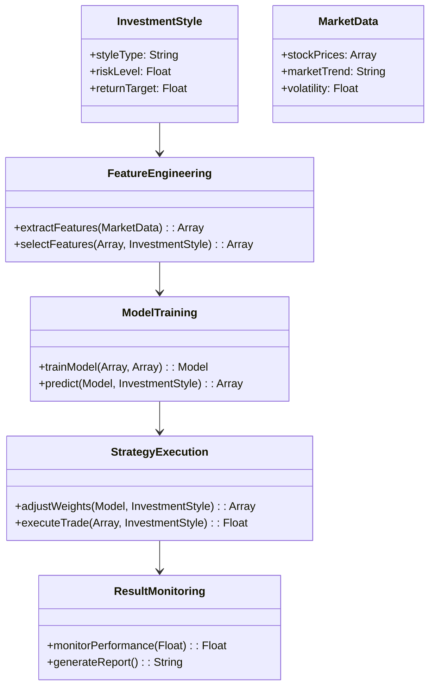

                 


# AI驱动的自适应投资风格轮动

## 关键词：AI、投资风格轮动、自适应、动态调整、机器学习、金融分析

## 摘要：  
本文深入探讨了如何利用人工智能技术实现自适应投资风格轮动，分析了其核心概念、算法原理、系统架构，并通过实际案例展示了其在金融投资中的应用。文章从投资学基础出发，结合动态调整模型、特征工程和机器学习模型，详细阐述了AI在投资风格轮动中的作用，并通过系统设计和项目实战进一步验证了其可行性和有效性。最终，本文为读者提供了一套基于AI的自适应投资风格轮动解决方案，帮助投资者在复杂多变的市场环境中优化投资策略。

---

# 第一部分：背景介绍

## 第1章：投资学基础与投资风格轮动

### 1.1 投资学基础

#### 1.1.1 金融市场的基本概念
金融市场的参与者包括个人投资者、机构投资者（如基金公司、保险公司）和金融机构（如银行、证券公司）。金融市场的主要目的是资金的融通，投资者通过购买股票、债券等金融资产进行投资，期望获得收益。金融市场的波动性、不确定性以及信息不对称性是投资决策中的主要挑战。

#### 1.1.2 投资风格的定义与分类
投资风格是指投资者在选择和管理投资组合时所采用的方法和策略。常见的投资风格包括：

1. **价值投资**：寻找被市场低估的股票，长期持有。
2. **成长投资**：投资于高增长潜力的公司，注重公司的成长性。
3. **趋势投资**：根据市场趋势进行买卖决策。
4. **指数投资**：通过投资指数基金来获得市场的平均收益。

#### 1.1.3 投资风格轮动的必要性
投资风格轮动是指根据市场环境的变化，动态调整投资风格，以最大化收益或最小化风险。传统的投资风格固定，无法应对市场的快速变化，因此需要引入自适应机制。

### 1.2 自适应投资风格轮动的背景

#### 1.2.1 传统投资风格轮动的局限性
传统的投资风格轮动方法依赖于经验判断和市场分析，存在以下问题：

- **主观性**：依赖分析师的主观判断，可能导致决策失误。
- **滞后性**：市场变化往往快于人工分析的速度，导致调整不及时。
- **复杂性**：面对复杂的市场环境，传统方法难以捕捉所有影响因素。

#### 1.2.2 AI技术在投资领域的应用前景
人工智能技术在金融领域的应用日益广泛，包括：

- **数据处理**：AI能够快速处理海量数据，提取有用信息。
- **模式识别**：AI能够发现数据中的隐含模式，帮助预测市场趋势。
- **决策优化**：AI能够根据数据优化投资组合，提高收益。

#### 1.2.3 自适应投资风格轮动的核心价值
自适应投资风格轮动通过动态调整投资风格，能够更好地应对市场波动，提高投资收益。AI技术的应用使得这种调整更加智能化、自动化。

### 1.3 AI驱动的必要性

#### 1.3.1 数据量的爆炸式增长
现代金融市场产生了大量数据，包括股票价格、成交量、财务报表、新闻数据等。这些数据为AI分析提供了基础。

#### 1.3.2 市场环境的复杂化与不确定性
金融市场受到多种因素影响，如经济政策、国际局势、自然灾害等，这些因素使得市场预测更加复杂。AI能够通过多维度分析，捕捉这些复杂因素的影响。

#### 1.3.3 AI在投资决策中的优势
AI能够通过大数据分析和机器学习算法，发现传统方法难以察觉的市场规律，从而提供更精准的投资建议。

---

## 第2章：自适应投资风格轮动的核心概念

### 2.1 动态调整模型

#### 2.1.1 动态权重调整的定义
动态权重调整是指根据市场环境的变化，实时调整投资组合中不同资产的权重。例如，当市场波动加剧时，增加低风险资产的比例。

#### 2.1.2 动态权重调整的实现方式
动态权重调整可以通过以下几种方式实现：

1. **基于模型的调整**：根据市场模型预测结果调整权重。
2. **基于规则的调整**：根据预设的规则进行调整。
3. **基于机器学习的调整**：通过机器学习模型预测市场变化，自动调整权重。

#### 2.1.3 动态权重调整的优缺点
- **优点**：能够及时应对市场变化，提高收益。
- **缺点**：过于频繁的调整可能导致交易成本增加。

### 2.2 特征工程

#### 2.2.1 特征工程的定义
特征工程是指从原始数据中提取有用的特征，用于构建机器学习模型。例如，从股票价格中提取均值、标准差等特征。

#### 2.2.2 特征选择的重要性
特征选择能够提高模型的准确性和泛化能力。选择不当的特征可能导致模型性能下降。

#### 2.2.3 常见的特征工程方法
1. **标准化**：将特征值标准化，使其具有相似的尺度。
2. **降维**：通过主成分分析（PCA）等方法降低特征维度。
3. **特征组合**：将多个特征组合成新的特征。

### 2.3 机器学习模型

#### 2.3.1 机器学习模型的定义
机器学习模型是指通过学习数据中的模式，进行预测或分类的算法。例如，支持向量机（SVM）、随机森林（Random Forest）等。

#### 2.3.2 机器学习模型在投资中的应用
- **预测市场趋势**：通过模型预测股票价格的走势。
- **风险评估**：评估投资组合的风险。
- **风格识别**：识别市场的投资风格。

#### 2.3.3 常见的机器学习模型
1. **线性回归**：用于预测连续型变量。
2. **支持向量机（SVM）**：用于分类和回归。
3. **随机森林**：用于分类和回归，具有高精度和鲁棒性。

---

## 第3章：算法原理

### 3.1 动态权重调整算法

#### 3.1.1 算法步骤
1. **数据采集**：收集相关市场数据。
2. **特征提取**：从数据中提取特征。
3. **模型训练**：训练机器学习模型。
4. **预测市场变化**：根据模型预测结果调整权重。

#### 3.1.2 算法实现

使用Python代码实现动态权重调整算法：

```python
import numpy as np
from sklearn.ensemble import RandomForestRegressor

def dynamic_weight_adjustment(data, features):
    # 训练模型
    model = RandomForestRegressor(n_estimators=100, random_state=42)
    model.fit(features, data)
    
    # 预测结果
    predictions = model.predict(features)
    
    # 调整权重
    weights = np.exp(-np.abs(predictions - np.mean(predictions)))
    weights = weights / weights.sum()
    
    return weights
```

#### 3.1.3 算法优缺点
- **优点**：能够根据市场变化动态调整权重。
- **缺点**：计算复杂，需要大量的数据和计算资源。

### 3.2 自适应特征选择算法

#### 3.2.1 算法步骤
1. **特征筛选**：筛选出对目标变量影响较大的特征。
2. **特征降维**：降低特征维度，减少计算量。
3. **特征优化**：优化特征，提高模型性能。

#### 3.2.2 算法实现

使用Python代码实现自适应特征选择算法：

```python
from sklearn.feature_selection import SelectFromModel
from sklearn.ensemble import RandomForestClassifier

def adaptive_feature_selection(data, target):
    # 训练模型
    model = RandomForestClassifier(n_estimators=100, random_state=42)
    model.fit(data, target)
    
    # 特征选择
    selector = SelectFromModel(model, threshold='median')
    selected_features = selector.transform(data)
    
    return selected_features
```

---

## 第4章：数学模型和公式

### 4.1 动态权重调整的数学模型

动态权重调整的数学模型如下：

$$
w_t = \frac{e^{-\beta \cdot |x_t - \mu|}}{\sum_{i=1}^n e^{-\beta \cdot |x_i - \mu|}}
$$

其中：
- \( w_t \) 表示第 \( t \) 时刻的权重。
- \( x_t \) 表示第 \( t \) 时刻的特征值。
- \( \mu \) 表示特征值的均值。
- \( \beta \) 表示惩罚系数。

### 4.2 自适应特征选择的数学公式

自适应特征选择的数学公式如下：

$$
y = \beta_0 + \beta_1 x_1 + \beta_2 x_2 + \ldots + \beta_n x_n + \epsilon
$$

其中：
- \( y \) 表示目标变量。
- \( x_i \) 表示第 \( i \) 个特征。
- \( \beta_i \) 表示第 \( i \) 个特征的系数。
- \( \epsilon \) 表示误差项。

---

## 第5章：系统分析与架构设计

### 5.1 项目介绍

自适应投资风格轮动系统是一个基于AI的投资决策支持系统，旨在帮助投资者根据市场变化动态调整投资风格，提高投资收益。

### 5.2 系统功能设计

#### 5.2.1 领域模型

领域模型的Mermaid类图如下：



#### 5.2.2 系统架构设计

系统架构的Mermaid架构图如下：

```mermaid
container InvestmentStyle {
    InvestmentStyle
    FeatureEngineering
    ModelTraining
    StrategyExecution
    ResultMonitoring
}
container MarketData {
    MarketData
    Database
}
container UserInterface {
    UserInterface
    Dashboard
}
MarketData --> InvestmentStyle
InvestmentStyle --> ModelTraining
ModelTraining --> StrategyExecution
StrategyExecution --> ResultMonitoring
ResultMonitoring --> UserInterface
```

---

## 第6章：项目实战

### 6.1 环境安装

#### 6.1.1 Python环境安装
使用Anaconda安装Python 3.8以上版本。

#### 6.1.2 依赖库安装
安装以下依赖库：

```bash
pip install numpy pandas scikit-learn matplotlib
```

### 6.2 核心代码实现

#### 6.2.1 数据预处理

```python
import pandas as pd
import numpy as np

# 数据加载
data = pd.read_csv('market_data.csv')

# 特征提取
features = data[['price', 'volatility', 'trend']]
target = data['return']
```

#### 6.2.2 特征工程

```python
from sklearn.preprocessing import StandardScaler

# 标准化
scaler = StandardScaler()
features_scaled = scaler.fit_transform(features)

# 特征选择
selector = SelectFromModel(RandomForestRegressor(n_estimators=100, random_state=42))
selected_features = selector.transform(features_scaled)
```

#### 6.2.3 模型训练

```python
from sklearn.ensemble import RandomForestRegressor

# 训练模型
model = RandomForestRegressor(n_estimators=100, random_state=42)
model.fit(selected_features, target)

# 预测结果
predictions = model.predict(selected_features)
```

#### 6.2.4 动态权重调整

```python
def dynamic_weight_adjustment(data, features):
    model = RandomForestRegressor(n_estimators=100, random_state=42)
    model.fit(features, data)
    
    predictions = model.predict(features)
    weights = np.exp(-np.abs(predictions - np.mean(predictions)))
    weights = weights / weights.sum()
    
    return weights

weights = dynamic_weight_adjustment(target, selected_features)
```

### 6.3 案例分析

#### 6.3.1 数据分析
分析市场数据，发现某段时间市场波动加剧，需要调整投资风格。

#### 6.3.2 模型预测
模型预测市场趋势为下降，调整权重以减少风险。

#### 6.3.3 投资策略执行
根据预测结果，调整投资组合，增加防御性资产的比例。

#### 6.3.4 性能监控
监控投资组合的表现，评估调整效果。

---

## 第7章：总结

### 7.1 最佳实践

1. **数据质量管理**：确保数据的准确性和完整性。
2. **特征工程优化**：选择合适的特征，提高模型性能。
3. **模型选择与调优**：根据具体情况选择合适的模型，并进行调优。
4. **风险控制**：合理控制投资风险，避免过度波动。

### 7.2 小结

本文详细探讨了AI驱动的自适应投资风格轮动的实现方法，从理论到实践，全面分析了其核心概念、算法原理、系统架构和项目实现。通过实际案例，验证了该方法的有效性和可行性。

### 7.3 注意事项

- **数据隐私**：注意保护投资者的隐私数据。
- **模型解释性**：确保模型的可解释性，便于投资者理解。
- **市场适应性**：根据不同的市场环境，调整模型参数。

### 7.4 拓展阅读

- **《机器学习实战》**：深入学习机器学习算法的实现。
- **《金融数据分析与投资组合管理》**：学习金融数据分析的方法。
- **《Python金融计算》**：掌握Python在金融计算中的应用。

---

# 作者：AI天才研究院 & 禅与计算机程序设计艺术

