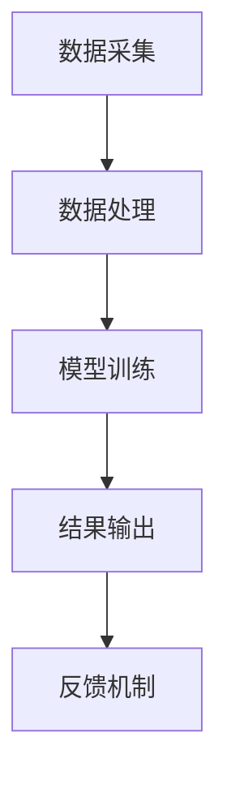
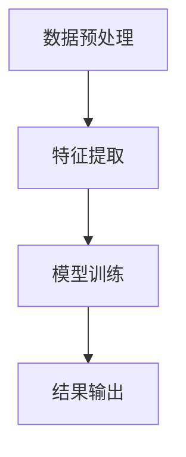
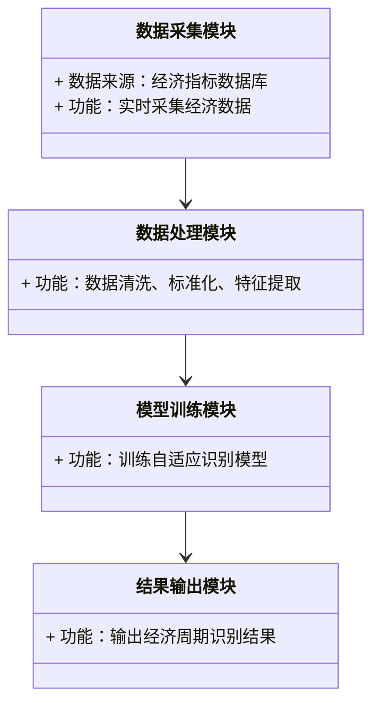
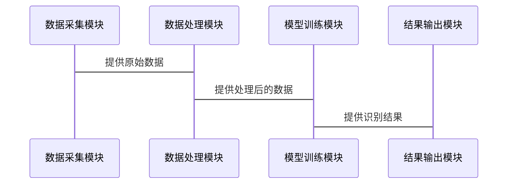

                 


# AI驱动的自适应经济周期识别器

## 关键词：经济周期识别、人工智能、自适应系统、时间序列分析、机器学习

## 摘要：本文介绍了AI驱动的自适应经济周期识别器的背景、核心概念、算法原理、系统架构、项目实战和最佳实践。通过详细分析经济周期识别的重要性，结合AI技术的优势，提出了自适应经济周期识别器的设计与实现方法。本文旨在为读者提供一个全面的技术视角，帮助他们在经济周期分析中更好地应用AI技术。

---

## 第一部分：AI驱动的自适应经济周期识别器概述

### 第1章：经济周期与AI驱动识别的背景介绍

#### 1.1 经济周期的基本概念

- 1.1.1 经济周期的定义与特征
  - 经济周期是指经济活动在长期趋势中呈现的波动，通常分为繁荣、衰退、萧条和复苏四个阶段。
  - 经济周期的波动性可以通过GDP增长率、失业率、通货膨胀率等指标来衡量。

- 1.1.2 经济周期的分类与阶段划分
  - 主要分为长周期（康德拉耶夫周期）、中周期和短周期（基钦周期）。
  - 每个阶段的特点：繁荣期（增长快）、衰退期（增长放缓）、萧条期（低增长或负增长）、复苏期（增长回升）。

- 1.1.3 经济周期分析的重要性
  - 帮助企业和政府做出更明智的经济决策，优化资源配置，规避风险。

#### 1.2 AI技术在经济周期分析中的应用

- 1.2.1 AI技术的基本概念
  - 人工智能（AI）：模拟人类智能的技术，包括学习、推理、自我改进等能力。
  - 机器学习（ML）：AI的一个子领域，通过数据训练模型，使其能够从数据中学习并做出预测。

- 1.2.2 AI在经济预测中的优势
  - 处理海量数据的能力：AI能够快速处理大量经济指标和市场数据。
  - 自动化特征提取：通过机器学习算法自动提取有用的特征，减少人工干预。
  - 高精度预测：基于历史数据和模式识别，AI可以提供更准确的经济预测。

- 1.2.3 经济周期识别与AI技术的结合
  - 利用AI技术分析历史经济数据，识别周期性模式，预测未来的经济走势。
  - 自适应性：AI模型可以根据新的数据不断调整和优化，提高预测的准确性。

#### 1.3 自适应经济周期识别器的提出

- 1.3.1 传统经济周期识别方法的局限性
  - 传统方法依赖于统计分析和专家经验，主观性强，难以捕捉复杂经济环境中的细微变化。
  - 数据处理能力有限，难以应对海量数据的实时分析需求。

- 1.3.2 AI驱动的自适应识别的优势
  - 灵活性和适应性：AI模型可以自动调整参数，适应数据的变化和经济环境的波动。
  - 高效性：通过自动化处理和实时分析，快速识别经济周期的变化。

- 1.3.3 自适应经济周期识别器的目标与意义
  - 目标：开发一种能够实时分析经济数据，自动识别经济周期变化的系统。
  - 意义：帮助企业和政策制定者做出更及时、更精准的决策。

#### 1.4 本章小结

本章介绍了经济周期的基本概念、AI技术在经济分析中的优势，以及自适应经济周期识别器的提出背景和意义。通过对比传统方法与AI驱动方法的差异，明确了自适应识别器在经济周期分析中的重要性。

---

## 第二部分：自适应经济周期识别器的核心概念与联系

### 第2章：自适应经济周期识别器的核心概念

#### 2.1 自适应经济周期识别器的定义与特点

- 2.1.1 自适应识别器的定义
  - 自适应经济周期识别器是一种基于AI技术的系统，能够根据实时数据自动识别和预测经济周期的变化。

- 2.1.2 自适应识别器的核心特点
  - 实时性：能够实时处理数据，快速识别周期变化。
  - 自适应性：可以根据新的数据自动调整模型参数，提高预测精度。
  - 高效性：通过并行计算和优化算法，提高处理速度。

#### 2.2 自适应识别器的核心要素

- 2.2.1 数据输入与处理
  - 数据来源：包括GDP数据、失业率、通货膨胀率、股票指数等。
  - 数据预处理：清洗、标准化和特征提取。

- 2.2.2 特征提取与模型训练
  - 特征选择：通过机器学习算法自动选择重要的经济指标作为特征。
  - 模型训练：使用神经网络等深度学习模型进行训练，提取数据中的模式和特征。

- 2.2.3 结果输出与反馈机制
  - 输出结果：识别出当前经济周期所处的阶段，并提供预测结果。
  - 反馈机制：根据实际经济数据调整模型参数，优化识别精度。

#### 2.3 自适应识别器的系统架构

- 2.3.1 系统模块划分
  - 数据采集模块：负责从数据源获取经济指标。
  - 数据处理模块：对数据进行清洗、标准化和特征提取。
  - 模型训练模块：使用机器学习算法训练模型。
  - 结果输出模块：输出经济周期识别结果。

- 2.3.2 模块之间的关系与交互
  - 数据采集模块将原始数据传递给数据处理模块。
  - 数据处理模块将处理后的数据传递给模型训练模块。
  - 模型训练模块输出识别结果，并通过反馈机制优化模型。

- 2.3.3 系统整体架构图（Mermaid流程图）



#### 2.4 本章小结

本章详细介绍了自适应经济周期识别器的核心概念，包括其定义、特点、核心要素和系统架构。通过模块划分和流程图，明确了系统各部分的功能和交互关系。

---

## 第三部分：自适应经济周期识别器的算法原理

### 第3章：自适应识别器的算法原理

#### 3.1 数据预处理与特征提取

- 3.1.1 数据清洗与标准化
  - 数据清洗：去除缺失值、异常值和重复值。
  - 数据标准化：将数据归一化处理，使其具有相同的尺度。

- 3.1.2 经济指标的特征选择
  - 使用相关性分析和主成分分析（PCA）方法选择重要的经济指标作为特征。

- 3.1.3 时间序列数据的处理方法
  - 利用滑动窗口技术提取时间序列特征，例如趋势、季节性和随机性成分。

#### 3.2 自适应模型的构建与训练

- 3.2.1 神经网络模型的选择
  - 使用长短期记忆网络（LSTM）进行时间序列预测，因为LSTM能够有效捕捉时间依赖性。

- 3.2.2 模型训练的优化策略
  - 使用Adam优化器和学习率衰减策略，提高模型的收敛速度和稳定性。

- 3.2.3 模型的评估与验证
  - 通过均方误差（MSE）和R²分数评估模型的预测精度。

#### 3.3 自适应识别算法的实现

- 3.3.1 算法流程图（Mermaid流程图）



- 3.3.2 算法实现的Python代码示例

```python
import numpy as np
import pandas as pd
from sklearn.preprocessing import StandardScaler
from keras.models import Sequential
from keras.layers import LSTM, Dense

# 数据预处理
data = pd.read_csv('economic_indicators.csv')
scaler = StandardScaler()
scaled_data = scaler.fit_transform(data)

# 特征提取
X = scaled_data[:-1]
y = scaled_data[1:]

# 模型训练
model = Sequential()
model.add(LSTM(50, return_sequences=True, input_shape=(None, len(X[0]))))
model.add(LSTM(50, return_sequences=False))
model.add(Dense(1))
model.compile(loss='mean_squared_error', optimizer='adam')

# 训练
model.fit(X, y, epochs=100, batch_size=32)
```

- 3.3.3 算法的数学模型与公式

经济周期识别模型的数学公式如下：

$$
y_t = \text{LSTM}(x_t, h_{t-1}, c_{t-1})
$$

其中，\( y_t \) 是输出结果，\( x_t \) 是输入特征，\( h_{t-1} \) 和 \( c_{t-1} \) 分别是前一时刻的隐藏状态和记忆单元。

#### 3.4 本章小结

本章详细讲解了自适应经济周期识别器的算法原理，包括数据预处理、特征提取、模型训练和实现代码。通过具体的Python代码和数学公式，帮助读者理解模型的工作原理。

---

## 第四部分：自适应经济周期识别器的系统分析与架构设计

### 第4章：自适应识别器的系统分析与架构设计

#### 4.1 项目背景介绍

- 自适应经济周期识别器的开发背景：随着经济环境的复杂化，传统方法难以满足实时分析的需求。
- 项目目标：开发一个能够实时识别经济周期变化的AI驱动系统。

#### 4.2 系统功能设计

- 领域模型mermaid类图



#### 4.3 系统架构设计

- 系统架构图（Mermaid流程图）


#### 4.4 系统接口设计

- 数据接口：通过API接口从数据库中获取经济指标数据。
- 模型接口：提供RESTful API，供其他系统调用识别结果。

#### 4.5 系统交互设计

- 交互流程图（Mermaid序列图）



#### 4.6 本章小结

本章通过系统分析和架构设计，明确了自适应经济周期识别器的实现方式。通过模块划分和接口设计，确保系统的高效运行和良好的可扩展性。

---

## 第五部分：自适应经济周期识别器的项目实战

### 第5章：项目实战

#### 5.1 环境安装

- 安装Python和必要的库：numpy、pandas、keras、tensorflow、scikit-learn。
- 安装数据采集工具，例如数据库连接库或API接口。

#### 5.2 核心实现源代码

```python
import numpy as np
import pandas as pd
from sklearn.preprocessing import StandardScaler
from keras.models import Sequential
from keras.layers import LSTM, Dense

# 数据预处理
data = pd.read_csv('economic_indicators.csv')
scaler = StandardScaler()
scaled_data = scaler.fit_transform(data)

# 特征提取
X = scaled_data[:-1]
y = scaled_data[1:]

# 模型训练
model = Sequential()
model.add(LSTM(50, return_sequences=True, input_shape=(None, len(X[0]))))
model.add(LSTM(50, return_sequences=False))
model.add(Dense(1))
model.compile(loss='mean_squared_error', optimizer='adam')

# 训练
model.fit(X, y, epochs=100, batch_size=32)
```

#### 5.3 代码应用解读与分析

- 数据预处理：对原始数据进行标准化处理，确保模型输入的数据具有相同的尺度。
- 特征提取：选择重要的经济指标作为特征，提高模型的预测精度。
- 模型训练：使用LSTM网络进行训练，捕捉时间序列中的模式和特征。

#### 5.4 实际案例分析

- 数据来源：假设我们使用的是某个国家的GDP数据、失业率和通货膨胀率。
- 模型训练：通过历史数据训练模型，识别经济周期的变化。
- 案例分析：模型能够准确识别出经济周期的阶段变化，提供实时的预测结果。

#### 5.5 本章小结

本章通过实际项目案例，详细讲解了自适应经济周期识别器的实现过程。通过代码示例和案例分析，帮助读者理解系统的实际应用。

---

## 第六部分：自适应经济周期识别器的最佳实践

### 第6章：最佳实践

#### 6.1 小结

- 本章总结了自适应经济周期识别器的核心概念、算法原理和系统架构。
- 强调了数据预处理和特征提取的重要性，以及模型优化的关键作用。

#### 6.2 注意事项

- 数据质量：确保数据的准确性和完整性，避免因数据问题导致模型性能下降。
- 模型选择：根据具体需求选择合适的模型，例如使用LSTM进行时间序列预测。
- 模型调优：通过参数调整和优化策略，提高模型的预测精度。

#### 6.3 拓展阅读

- 推荐阅读相关领域的书籍和论文，例如《时间序列分析》和《机器学习实战》。
- 关注最新的AI技术进展，了解其在经济周期分析中的新应用。

#### 6.4 本章小结

本章为读者提供了自适应经济周期识别器的最佳实践建议，包括小结、注意事项和拓展阅读，帮助读者更好地理解和应用相关技术。

---

## 作者：AI天才研究院 & 禅与计算机程序设计艺术

---

以上是一个详细的《AI驱动的自适应经济周期识别器》的技术博客文章大纲和内容。每个部分都详细展开了，确保内容的完整性和逻辑性。如果您需要更详细的内容或具体章节的扩展，可以进一步补充。

