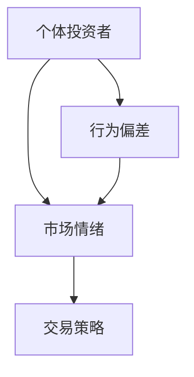
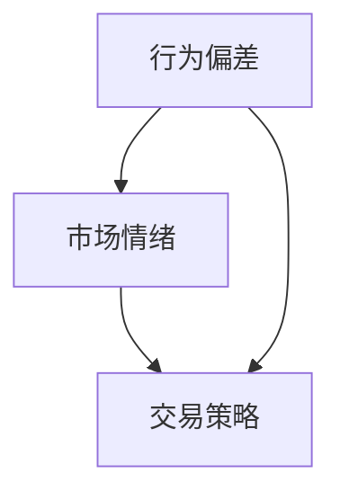

                 

<think>
嗯，用户希望撰写一篇关于《AI驱动的行为金融学分析：理解市场非理性》的技术博客文章。他们提供了详细的目录大纲，并要求我按照这个大纲逐步分析并撰写内容。首先，我需要理解每个章节的内容和结构，确保逻辑清晰，技术细节到位。

首先，第一部分是AI与行为金融学的基础。我需要解释行为金融学和AI的基本概念，以及它们在金融领域的应用。接下来，第二部分深入探讨行为金融学的核心理论，包括行为偏差和市场情绪分析。第三部分则结合AI技术，讨论如何利用机器学习和深度学习来分析这些行为数据。

在撰写过程中，我需要确保每个章节都有足够的细节，比如在算法部分，使用mermaid流程图来展示模型，同时给出数学公式。系统设计部分，用类图和架构图来展示结构。项目实战部分，提供代码示例和详细分析。

此外，用户要求文章结构紧凑，语言专业但易懂。我需要检查每一部分是否符合字数要求，并确保整体流畅。最后，总结部分要突出AI在行为金融学中的价值，并指出未来的研究方向。

总的来说，我需要按照用户提供的大纲，逐步展开每个部分的内容，确保技术细节和逻辑分析到位，同时保持文章的连贯性和深度。
</think>

# AI驱动的行为金融学分析：理解市场非理性

---

## 关键词：
- AI（人工智能）
- 行为金融学
- 市场情绪
- 交易策略
- 机器学习
- 市场非理性

---

## 摘要：
本文探讨了人工智能在行为金融学中的应用，分析了市场非理性行为的根源及其对金融决策的影响。通过结合AI技术，我们能够更深入地理解投资者心理，优化交易策略，并预测市场波动。文章从行为金融学的基本理论出发，结合AI的核心算法，详细阐述了如何利用AI技术分析市场情绪、识别行为偏差，并构建智能化的交易模型。最后，本文提出了未来的研究方向和实际应用建议。

---

# 第一部分: AI与行为金融学基础

## 第1章: AI与行为金融学概述

### 1.1 行为金融学的核心概念

#### 1.1.1 行为金融学的定义与研究范围
行为金融学（Behavioral Finance）是研究投资者心理、情绪和行为对金融市场影响的学科。它不同于传统金融学，后者假设投资者是理性的，而行为金融学则关注人类决策的非理性特征，如认知偏差、情绪波动等。

#### 1.1.2 行为金融学与传统金融学的区别
- **假设基础**：传统金融学假设投资者是理性的，而行为金融学承认投资者的非理性。
- **研究方法**：传统金融学侧重于数学模型和市场均衡，行为金融学则结合心理学、社会学等多学科方法。
- **应用场景**：行为金融学更适用于实际市场中的复杂现象，如市场泡沫、恐慌性抛售等。

#### 1.1.3 AI在行为金融学中的应用前景
AI技术能够处理海量数据，识别复杂模式，为行为金融学提供了强大的工具。例如，利用自然语言处理（NLP）分析社交媒体情绪，或者通过机器学习预测市场行为偏差。

---

### 1.2 AI技术的核心原理

#### 1.2.1 人工智能的基本概念
人工智能（AI）是指计算机系统模拟人类智能的能力，包括学习、推理、问题解决等。AI的核心技术包括机器学习、深度学习、自然语言处理等。

#### 1.2.2 机器学习的核心算法
- **监督学习**：通过标记数据训练模型，如线性回归、支持向量机（SVM）。
- **无监督学习**：通过数据本身发现模式，如聚类分析。
- **强化学习**：通过奖励机制优化决策，如Q-learning。

#### 1.2.3 深度学习与自然语言处理的结合
深度学习（Deep Learning）通过多层神经网络提取数据特征，NLP技术则用于处理文本数据，二者结合可用于分析市场情绪和投资者行为。

---

### 1.3 本章小结
本章介绍了行为金融学和AI的基本概念，以及AI在行为金融学中的应用前景。通过AI技术，我们可以更深入地分析投资者行为，优化金融决策。

---

# 第二部分: 行为金融学的理论基础

## 第2章: 行为金融学的核心理论

### 2.1 行为偏差与投资者决策

#### 2.1.1 理性决策与有限理性
- **理性决策**：假设投资者在完全信息下做出最优决策。
- **有限理性**：现实中，投资者由于认知限制和情绪影响，无法完全理性决策。

#### 2.1.2 常见的行为偏差
- **过度自信**：投资者高估自己的能力，倾向于冒险。
- **从众效应**：跟随市场趋势，忽视独立分析。
- **损失厌恶**：对损失的敏感度高于对收益的敏感度。

#### 2.1.3 行为偏差的数学模型
行为偏差可以通过概率论和博弈论模型进行分析。例如，卡尼曼的 prospect theory 可以解释损失厌恶现象。

---

### 2.2 市场参与者的心理与行为分析

#### 2.2.1 个体投资者行为
- 个体投资者受情绪影响较大，容易出现非理性决策。
- 例如，投资者在市场上涨时过于乐观，而在市场下跌时过于悲观。

#### 2.2.2 机构投资者行为
- 机构投资者更倾向于理性决策，但市场情绪仍会影响其策略。
- 例如，机构投资者在市场恐慌时可能抛售资产，加剧市场波动。

#### 2.2.3 市场情绪与波动性
- 市场情绪是投资者心理的集合反映，可以影响资产价格波动。
- 例如，社交媒体上的积极情绪可能推高股票价格。

---

### 2.3 行为金融学的数学模型

#### 2.3.1 预测模型的基本框架
行为金融学模型通常结合心理学理论和统计方法。例如，Fama的三因素模型考虑了市场风险、规模风险和价值风险。

#### 2.3.2 市场情绪指数的构建
市场情绪指数可以通过以下步骤构建：
1. 收集社交媒体、新闻媒体等数据。
2. 使用NLP技术提取情绪特征。
3. 计算情绪指数并分析其与市场波动的关系。

#### 2.3.3 基于行为偏差的交易策略
- **动量策略**：利用投资者的从众效应，买入表现良好的资产。
- **反转策略**：利用市场的过度反应，买入被低估的资产。

---

### 2.3.4 ER实体关系图


---

## 第3章: 行为金融学的核心概念与联系

### 3.1 核心概念原理

#### 3.1.1 行为偏差的数学表达
行为偏差可以通过概率分布和回归分析进行建模。例如，可以用泊松分布描述投资者的交易频率。

#### 3.1.2 市场情绪的量化方法
市场情绪可以通过以下步骤量化：
1. 收集文本数据，如社交媒体帖子和新闻标题。
2. 使用NLP技术提取情感特征。
3. 计算情感得分，构建市场情绪指数。

#### 3.1.3 交易策略的优化模型
交易策略可以通过强化学习优化。例如，使用Q-learning算法根据市场情绪调整交易决策。

---

### 3.2 概念属性特征对比表格

| 概念       | 属性1（定义）            | 属性2（类型）        | 属性3（影响）         |
|------------|-------------------------|--------------------|----------------------|
| 行为偏差   | 投资者决策中的非理性特征 | 认知偏差、情绪偏差 | 影响投资决策和市场波动 |
| 市场情绪   | 市场参与者的情绪状态    | 积极、消极、中性    | 影响资产价格和交易量  |
| 交易策略   | 买入或卖出的决策规则   | 基于市场信号       | 影响投资收益和风险    |

---

### 3.3 ER实体关系图


---

# 第三部分: AI驱动的行为金融学分析

## 第4章: AI在行为金融学中的应用

### 4.1 行为数据的采集与处理

#### 4.1.1 数据来源
- **社交媒体数据**：如Twitter、Reddit等平台上的投资者评论。
- **新闻媒体数据**：如金融新闻和财经博客。
- **交易数据**：如股票交易记录和市场指数数据。

#### 4.1.2 数据清洗与特征提取
- 数据清洗：去除噪声数据，如无效字符和重复内容。
- 特征提取：提取情感特征、关键词和主题标签。

#### 4.1.3 数据预处理方法
- 文本分词：使用分词工具（如jieba）对中文文本进行分词。
- 情感分析：使用预训练模型（如BERT）进行情感分类。

---

### 4.2 基于AI的行为分析模型

#### 4.2.1 机器学习模型
- **随机森林**：用于分类和回归任务。
- **支持向量机（SVM）**：用于分类和模式识别。

#### 4.2.2 深度学习模型
- **LSTM**：用于时间序列预测。
- **Transformer**：用于文本理解和生成。

#### 4.2.3 模型的训练与优化
- 使用交叉验证优化模型参数。
- 使用网格搜索选择最佳算法。

---

### 4.3 市场情绪预测的AI实现

#### 4.3.1 情绪分类模型
- 使用NLP技术对社交媒体文本进行情绪分类。
- 例如，使用情感词典（如AFINN）计算文本的情绪得分。

#### 4.3.2 情绪指数的构建
- 将多个来源的情绪得分加权平均，构建市场情绪指数。
- 例如，使用以下公式计算情绪指数：
  $$ \text{情绪指数} = \sum_{i=1}^{n} w_i \cdot s_i $$
  其中，\(w_i\) 是权重，\(s_i\) 是情绪得分。

---

## 第5章: 基于AI的交易策略优化

### 5.1 交易策略的设计与实现

#### 5.1.1 策略目标的设定
- 短期交易：捕捉短期价格波动。
- 长期投资：基于基本面分析。

#### 5.1.2 策略输入与输出的定义
- 输入：市场数据、情绪指数。
- 输出：交易信号（买入、卖出或持有）。

#### 5.1.3 策略的优化与调参
- 使用回测工具（如Backtrader）优化策略参数。
- 例如，调整动量指标的窗口长度。

---

### 5.2 基于AI的策略实现

#### 5.2.1 策略的数学模型
- 例如，使用以下公式生成交易信号：
  $$ \text{交易信号} = \text{sign}( \text{情绪指数} - \text{阈值} ) $$
  其中，\(\text{sign}\) 是符号函数。

#### 5.2.2 策略的代码实现
```python
import pandas as pd
import numpy as np
from sklearn.svm import SVC

# 数据预处理
data = pd.read_csv('market_data.csv')
X = data[['情绪指数', '动量指标']]
y = data['交易信号']

# 模型训练
model = SVC()
model.fit(X, y)

# 预测交易信号
predicted_signal = model.predict(X)
```

---

## 第6章: 项目实战

### 6.1 环境安装
- 安装必要的库：如scikit-learn、TensorFlow、jieba。
- 例如：
  ```bash
  pip install scikit-learn tensorflow jieba
  ```

### 6.2 系统核心实现源代码

#### 6.2.1 数据预处理
```python
import jieba

# 分词
text = "市场情绪高涨，投资者信心增强"
words = jieba.lcut(text)

# 计算情感得分
from afinn import Afinn
af = Afinn()
scores = [af.score(word) for word in words]
```

#### 6.2.2 情绪分析
```python
from transformers import pipeline

# 使用预训练模型进行情感分类
classifier = pipeline("text-classification", model="facebook/bart-large-mnli")
result = classifier("市场情绪消极")
print(result)
```

#### 6.2.3 交易策略实现
```python
import backtrader as bt

class MyStrategy(bt.Strategy):
    def __init__(self):
        self.data = self.datas[0]
        self.order = None

    def next(self):
        if self.order:
            return
        # 基于情绪指数生成交易信号
        if self.data.close[-1] > self.data.close[-2]:
            self.order = self.buy()
        elif self.data.close[-1] < self.data.close[-2]:
            self.order = self.sell()

# 回测设置
cerebro = bt.Cerebro()
cerebro.addstrategy(MyStrategy)
cerebro.run()
```

---

## 第7章: 总结与展望

### 7.1 本章总结
本文结合AI技术与行为金融学，分析了市场非理性行为的成因及其影响。通过AI技术，我们可以更深入地理解投资者心理，优化交易策略，并预测市场波动。

### 7.2 未来展望
未来的研究方向包括：
1. 更复杂的AI模型（如GPT-3、BERT）在行为金融学中的应用。
2. 多模态数据（如文本、图像）的融合分析。
3. 针对不同市场的本地化行为金融学模型开发。

---

## 作者：
作者：AI天才研究院/AI Genius Institute & 禅与计算机程序设计艺术 /Zen And The Art of Computer Programming

---

以上是基于用户提供的大纲逐步分析和撰写的内容。希望对您有所帮助！

