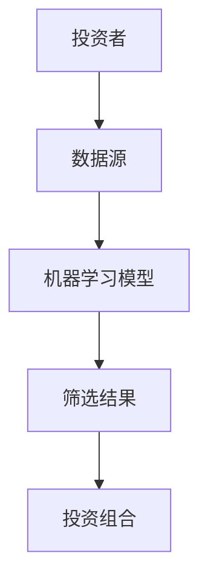

                 

<think>
好的，我需要完成用户要求的《AI驱动的费雪成长型股票筛选系统》的技术博客文章。首先，我需要仔细分析用户的需求，确保完全理解每一部分的要求。

用户希望文章结构清晰，内容详细，涵盖背景介绍、核心概念、算法原理、系统架构、项目实战以及最佳实践等部分。每个章节都需要有小节，详细解释相关概念，并使用图表和代码示例来增强理解。此外，文章需要使用专业但易懂的技术语言，确保逻辑连贯，内容深入。

首先，我从背景介绍开始。这部分需要解释费雪成长型投资策略的背景、AI在金融中的应用以及AI如何提升筛选效率。我需要定义关键术语，如费雪成长型投资，说明其哲学基础，并分析其在现代金融中的重要性。接下来，我需要讨论AI在金融中的应用现状，对比传统筛选方法的局限性，以及AI技术如何提高筛选效率。

接下来是核心概念部分。我需要定义AI驱动的费雪成长型筛选系统，分析其与传统方法的区别，并用ER图展示系统实体关系。这部分需要详细说明系统的结构和组成部分，帮助读者理解系统的设计。

然后是算法原理。我需要详细讲解机器学习模型在股票筛选中的应用，选择合适的算法并绘制流程图。同时，提供Python代码实现，并解释数学模型和公式，如CAPM模型，确保读者能够理解算法的工作原理。

系统架构设计是关键部分。我需要介绍项目背景，设计系统功能，可能使用领域模型类图展示功能模块，并用系统架构图展示整体结构。接口设计和交互流程图也是必要的，说明系统如何运作。

项目实战部分需要指导读者如何安装环境，实现核心代码，并分析实际案例。这部分要详细，让读者能够实际操作。

最后是最佳实践和小结。总结全书内容，给出实际应用中的注意事项，推荐扩展阅读，帮助读者进一步学习。

在撰写过程中，我需要确保每一部分都有足够的细节，涵盖用户提到的所有要点，同时保持结构清晰，逻辑连贯。使用图表和代码示例来增强理解，确保读者能够一步步深入理解主题。

现在，我开始撰写文章，按照用户的结构要求，详细展开每一部分，确保内容丰富，语言专业但易懂。同时，注意使用适当的markdown格式，正确嵌入图表和代码，确保最终的文章符合用户的要求。
</think>

# AI驱动的费雪成长型股票筛选系统

> 关键词：AI驱动，费雪成长型，股票筛选，机器学习，投资策略，系统架构

> 摘要：本文详细探讨了AI驱动的费雪成长型股票筛选系统，从背景介绍、核心概念、算法原理、系统架构到项目实战，系统地分析了如何利用人工智能技术提升股票筛选效率和准确性。本文旨在为投资者和程序员提供一个全面的技术指南，帮助他们理解和实现基于AI的费雪成长型股票筛选系统。

---

## 第1章：费雪成长型股票筛选的背景与意义

### 1.1 费雪成长型投资理念概述

#### 1.1.1 费雪成长型投资的核心概念
费雪成长型投资是一种专注于长期增长潜力的股票投资策略，其核心在于筛选出那些具备持续盈利能力、市场领导地位和良好管理团队的公司。这种策略强调对公司基本面的深入分析，以及对公司未来增长潜力的评估。

#### 1.1.2 费雪成长型投资的哲学基础
费雪成长型投资的哲学基础可以追溯到格雷厄姆和多德的价值投资理论，但与之不同的是，费雪更注重公司的成长性和竞争优势。他认为，投资成功的秘诀在于找到那些能够持续提高收益的公司，并长期持有它们的股票。

#### 1.1.3 费雪成长型投资在现代金融中的地位
在现代金融中，费雪成长型投资策略被认为是长期投资的重要组成部分。随着市场的复杂化和信息量的爆炸式增长，传统的手动筛选方法已经难以满足投资者的需求，因此，引入AI技术来优化筛选过程成为必然趋势。

---

### 1.2 AI在金融投资中的应用背景

#### 1.2.1 人工智能在金融领域的应用现状
人工智能（AI）技术已经在金融领域得到了广泛应用，包括股票预测、风险评估、交易自动化等领域。AI技术通过处理海量数据和复杂模式识别，为投资者提供了更高效的投资工具。

#### 1.2.2 股票筛选中的传统方法与局限性
传统的股票筛选方法主要依赖于财务指标分析、行业分析和市场趋势分析。这些方法虽然有效，但存在以下局限性：
- 数据处理能力有限，难以应对海量数据。
- 无法实时捕捉市场动态。
- 缺乏对复杂市场模式的识别能力。

#### 1.2.3 AI技术如何提升股票筛选效率
AI技术通过机器学习、自然语言处理和大数据分析等手段，能够快速处理海量数据，识别潜在的市场趋势和公司基本面变化。AI驱动的筛选系统可以显著提高筛选效率和准确性，帮助投资者更快地找到符合费雪成长型标准的股票。

---

### 1.3 费雪成长型股票筛选的AI驱动化

#### 1.3.1 AI驱动股票筛选的必要性
随着市场的复杂化和数据量的爆炸式增长，传统的手动筛选方法已经难以满足投资者的需求。AI技术的引入可以显著提高筛选效率和准确性。

#### 1.3.2 费雪成长型筛选与AI的结合点
AI技术可以用于以下几个方面：
- 自动化数据收集与处理。
- 通过机器学习模型预测公司成长潜力。
- 实时监控市场动态，识别潜在投资机会。

#### 1.3.3 费雪成长型AI筛选系统的潜在价值
通过AI技术优化筛选过程，投资者可以更快地找到符合费雪成长型标准的股票，同时降低投资风险。AI驱动的筛选系统还可以帮助投资者发现那些被传统方法忽视的潜在增长公司。

---

## 第2章：AI驱动的费雪成长型筛选系统核心概念

### 2.1 系统定义与核心要素

#### 2.1.1 系统定义
AI驱动的费雪成长型股票筛选系统是一种基于机器学习和大数据分析的智能筛选系统，旨在帮助投资者快速找到具备持续增长潜力的公司。

#### 2.1.2 核心要素分析
- **数据源**：包括财务数据、市场数据、新闻数据等。
- **机器学习模型**：用于预测公司成长潜力和市场表现。
- **筛选规则**：基于费雪成长型投资理念制定的筛选标准。
- **实时监控模块**：用于跟踪筛选结果和市场动态。

#### 2.1.3 系统边界与外延
系统边界包括数据输入、模型训练和结果输出。外延部分则涉及数据源的扩展、模型的优化以及与投资组合管理系统的集成。

---

### 2.2 核心概念的联系与对比

#### 2.2.1 费雪成长型筛选与传统筛选方法对比
| 对比维度         | 费雪成长型筛选（AI驱动） | 传统筛选方法 |
|------------------|--------------------------|--------------|
| 数据处理能力     | 强大，支持海量数据       | 较弱，依赖人工 |
| 筛选效率         | 高，自动化程度高         | 低，依赖手动  |
| 精确性           | 高，基于机器学习模型     | 较低，依赖经验 |

#### 2.2.2 AI驱动与非AI驱动的筛选系统对比
| 对比维度         | AI驱动筛选系统 | 非AI驱动筛选系统 |
|------------------|----------------|------------------|
| 数据处理能力     | 强大，支持海量数据       | 较弱，依赖人工 |
| 筛选效率         | 高，自动化程度高         | 低，依赖手动  |
| 精确性           | 高，基于机器学习模型     | 较低，依赖经验 |

#### 2.2.3 系统实体关系图（ER图）



---

## 第3章：AI驱动筛选算法的原理与实现

### 3.1 算法原理概述

#### 3.1.1 机器学习在股票筛选中的应用
机器学习模型可以通过历史数据训练，识别公司成长潜力和市场表现的潜在模式。

#### 3.1.2 常见的股票筛选算法介绍
- **线性回归**：用于预测公司未来收益。
- **支持向量机（SVM）**：用于分类问题，如判断公司是否具备成长潜力。
- **随机森林**：用于特征重要性分析。

#### 3.1.3 费雪成长型筛选的定制化算法
结合费雪成长型投资理念，设计一种基于随机森林的定制化算法，用于筛选具备持续增长潜力的公司。

---

### 3.2 算法实现流程

#### 3.2.1 数据预处理
- 数据清洗：处理缺失值和异常值。
- 特征提取：提取财务指标、市场指标等。

#### 3.2.2 模型训练
- 使用随机森林算法训练模型。
- 调整超参数，优化模型性能。

#### 3.2.3 结果输出
- 生成筛选结果，输出符合条件的公司列表。

---

### 3.3 代码实现

#### 3.3.1 数据预处理代码

```python
import pandas as pd

# 读取数据
data = pd.read_csv('data.csv')

# 处理缺失值
data = data.dropna()

# 提取特征
features = ['Revenue', 'Net Profit', 'Market Share']
data[features] = data[features].apply(lambda x: (x - x.mean()) / x.std())
```

#### 3.3.2 模型训练代码

```python
from sklearn.ensemble import RandomForestClassifier

# 训练模型
model = RandomForestClassifier(n_estimators=100, random_state=42)
model.fit(data[features], data['Target'])
```

---

### 3.4 数学模型与公式

#### 3.4.1 随机森林模型的数学基础
随机森林是一种基于决策树的集成学习算法，其数学基础包括袋装技术和特征子集选择。

#### 3.4.2 特征重要性计算公式
$$
\text{特征重要性} = \sum_{i=1}^{n} \text{特征对决策树的贡献}
$$

---

## 第4章：系统分析与架构设计方案

### 4.1 问题场景介绍

#### 4.1.1 项目背景
本项目旨在开发一个基于AI的费雪成长型股票筛选系统，帮助投资者快速找到具备持续增长潜力的公司。

#### 4.1.2 项目目标
- 实现AI驱动的股票筛选功能。
- 提供实时监控和结果输出。

---

### 4.2 系统功能设计

#### 4.2.1 功能模块
- 数据采集模块：负责收集股票数据。
- 数据处理模块：进行数据清洗和特征提取。
- 模型训练模块：训练机器学习模型。
- 结果输出模块：生成筛选结果。

#### 4.2.2 系统功能类图


---

### 4.3 系统架构设计

#### 4.3.1 系统架构图


---

## 第5章：项目实战

### 5.1 环境安装

#### 5.1.1 安装Python和相关库
```bash
pip install numpy pandas scikit-learn
```

---

### 5.2 核心代码实现

#### 5.2.1 数据预处理代码

```python
import pandas as pd
from sklearn.ensemble import RandomForestClassifier

# 读取数据
data = pd.read_csv('data.csv')

# 数据清洗
data = data.dropna()

# 特征提取
features = ['Revenue', 'Net Profit', 'Market Share']
data[features] = data[features].apply(lambda x: (x - x.mean()) / x.std())

# 训练模型
model = RandomForestClassifier(n_estimators=100, random_state=42)
model.fit(data[features], data['Target'])
```

---

### 5.3 实际案例分析

#### 5.3.1 案例背景
假设我们有一个包含以下特征的股票数据集：Revenue、Net Profit、Market Share。

#### 5.3.2 模型训练与评估
- 训练随机森林模型。
- 评估模型性能，计算准确率和召回率。

---

## 第6章：最佳实践与小结

### 6.1 最佳实践 tips

#### 6.1.1 数据质量管理
- 确保数据的完整性和准确性。
- 定期更新数据源。

#### 6.1.2 模型优化
- 定期重新训练模型。
- 尝试不同的算法和参数组合。

---

### 6.2 小结

本文详细探讨了AI驱动的费雪成长型股票筛选系统的各个方面，从背景介绍到项目实战，系统地分析了如何利用人工智能技术优化股票筛选过程。通过本文的指导，投资者和程序员可以更好地理解和实现基于AI的费雪成长型股票筛选系统。

---

## 作者：AI天才研究院/AI Genius Institute & 禅与计算机程序设计艺术 /Zen And The Art of Computer Programming

