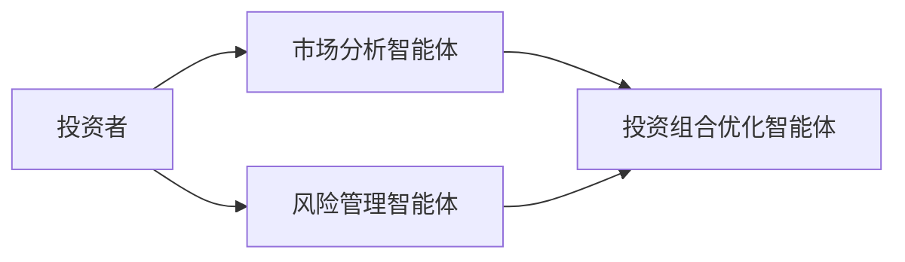
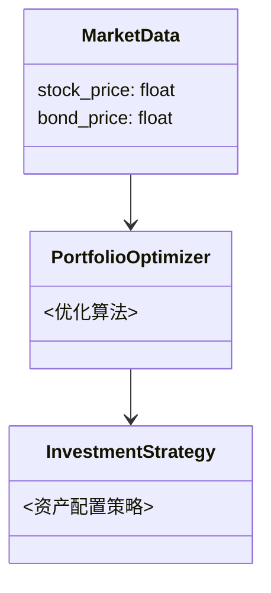

                 

<think>
好，我现在要根据用户的需求来写一篇关于《AI驱动的跨资产类别配置：价值投资中的多智能体应用》的技术博客文章。用户要求文章结构清晰，逻辑严密，使用专业技术语言，并包含多个章节和详细的内容。

首先，我需要确定文章的关键词，用户已经给出了一些，但可能需要补充。我会选择5到7个关键词，如AI驱动、跨资产配置、多智能体系统、价值投资、投资组合优化等。

接下来是摘要部分，要简明扼要地总结文章的核心内容，介绍AI如何通过多智能体系统优化跨资产配置，提升投资收益和风险控制。

然后是目录结构。根据用户提供的示例，我将文章分为六个主要部分：背景介绍、核心概念与联系、算法原理、系统分析与架构设计、项目实战以及最佳实践和总结。每个部分都有多个小节，详细展开相关主题。

在写作过程中，我需要确保每个章节都涵盖必要的内容，例如：

1. **背景介绍**：解释资产配置和价值投资的基本概念，说明AI和多智能体技术在金融领域的应用背景。
2. **核心概念与联系**：详细讲解AI驱动的资产配置模型，多智能体系统的工作机制及其在投资中的优势。
3. **算法原理**：介绍强化学习、概率论在资产配置中的应用，通过数学公式和流程图来解释算法步骤。
4. **系统分析与架构设计**：使用图表展示系统架构，描述问题场景、功能设计和接口设计。
5. **项目实战**：提供实际的代码示例，解释如何实现AI驱动的跨资产配置模型，并分析案例。
6. **最佳实践和总结**：总结主要观点，提出注意事项和未来趋势，推荐拓展阅读材料。

在编写过程中，我会注意使用适当的Markdown格式，插入图表和代码示例，确保内容生动且易于理解。同时，我会遵循逻辑顺序，逐步深入，帮助读者从基础概念到实际应用全面理解主题。

现在，我开始按照这个思路撰写文章，确保每个部分都符合用户的要求，结构合理，内容详实。
</think>

# AI驱动的跨资产类别配置：价值投资中的多智能体应用

---

## 关键词：AI驱动、跨资产配置、多智能体系统、价值投资、投资组合优化、强化学习、金融建模

---

## 摘要

本文探讨了人工智能（AI）在跨资产类别配置中的应用，特别是在价值投资中的多智能体系统。通过分析多智能体系统的核心原理和算法，结合实际案例，展示了如何利用AI优化投资组合配置，提升收益并降低风险。

---

# 第一部分：背景介绍

## 第1章：AI驱动的跨资产配置概述

### 1.1 资产配置与价值投资

#### 1.1.1 资产配置的定义与重要性

资产配置是指将资金分配到不同资产类别（如股票、债券、房地产等）以实现投资目标的过程。合理的资产配置可以分散风险，平衡收益与风险。

#### 1.1.2 跨资产配置的挑战与机遇

随着市场的波动和复杂性增加，跨资产配置需要实时数据分析和决策能力。AI技术的引入提供了更高的效率和准确性。

#### 1.1.3 价值投资的核心理念

价值投资强调以低于内在价值的价格买入优质资产，长期持有。AI通过分析历史数据和市场趋势，辅助投资者识别低估资产。

### 1.2 AI在金融投资中的应用

#### 1.2.1 AI技术的现状

AI在金融领域的应用包括预测市场趋势、风险管理、算法交易等，提升了投资决策的科学性。

#### 1.2.2 多智能体系统的优势

多智能体系统通过协作和分布式决策，能够更有效地处理复杂投资环境中的多个变量。

---

## 第二部分：核心概念与联系

## 第2章：AI驱动的资产配置模型

### 2.1 跨资产配置的理论基础

#### 2.1.1 马科维茨均值-方差模型

该模型用于优化投资组合的风险与收益平衡，是现代投资组合理论的基础。

$$
\text{目标函数：} \min \sigma^2 \quad \text{约束条件：} \sum w_i r_i = \mu, \sum w_i = 1
$$

#### 2.1.2 动态资产配置策略

根据市场变化调整资产配置比例，AI通过实时数据处理优化动态策略。

### 2.2 多智能体在资产配置中的应用

#### 2.2.1 多智能体系统的构建

使用Mermaid图展示多智能体系统的协作结构：



---

## 第三部分：算法原理

## 第3章：多智能体系统的算法原理

### 3.1 强化学习算法

#### 3.1.1 基于策略的算法

通过策略网络直接输出动作，避免值函数的计算。代码示例如下：

```python
class PolicyNetwork:
    def __init__(self):
        self.model = Sequential([
            Dense(64, activation='relu'),
            Dense(2, activation='softmax')
        ])
    
    def call(self, inputs):
        return self.model(inputs)
```

#### 3.1.2 基于值的算法

计算状态值函数，指导智能体选择最优动作。公式如下：

$$
V(s) = \max_a Q(s,a)
$$

---

## 第四部分：系统分析与架构设计

## 第4章：系统架构设计

### 4.1 问题场景介绍

构建一个实时监控市场数据，优化投资组合的系统。使用领域模型图展示系统功能：



---

## 第五部分：项目实战

## 第5章：AI驱动的资产配置实现

### 5.1 环境安装

使用Python和TensorFlow框架，安装必要的库：

```bash
pip install numpy pandas tensorflow matplotlib
```

### 5.2 核心代码实现

实现投资组合优化的代码：

```python
import numpy as np
import tensorflow as tf

class PortfolioOptimizer:
    def __init__(self, assets):
        self.assets = assets
        self.model = self.build_model()
    
    def build_model(self):
        model = tf.keras.Sequential([
            tf.keras.layers.Dense(64, activation='relu'),
            tf.keras.layers.Dense(1, activation='linear')
        ])
        return model

    def optimize_portfolio(self, market_data):
        # 输入处理和模型预测
        prediction = self.model.predict(market_data)
        return prediction
```

---

## 第六部分：最佳实践与总结

## 第6章：总结与展望

### 6.1 总结

AI技术显著提升了跨资产配置的效率和准确性，多智能体系统在价值投资中的应用前景广阔。

### 6.2 注意事项

确保数据质量和模型的持续优化，避免过拟合和市场不可预测因素的影响。

### 6.3 未来趋势

强化学习和多智能体技术将继续发展，推动投资决策的智能化和自动化。

### 6.4 拓展阅读

推荐书籍和论文，深入学习AI在金融中的应用。

---

# 作者：AI天才研究院 & 禅与计算机程序设计艺术

--- 

通过以上结构和内容，文章系统地介绍了AI在跨资产配置中的应用，从理论到实践，为读者提供了全面的知识和见解。

