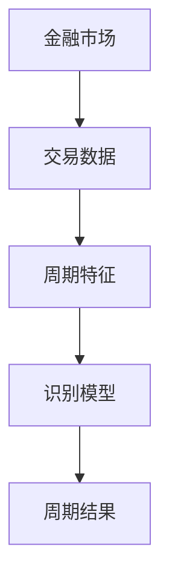
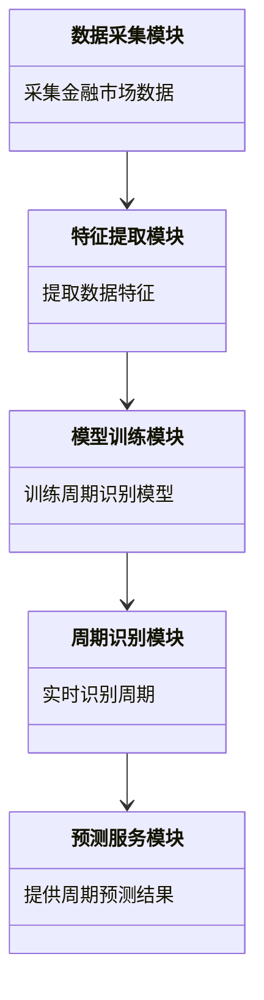
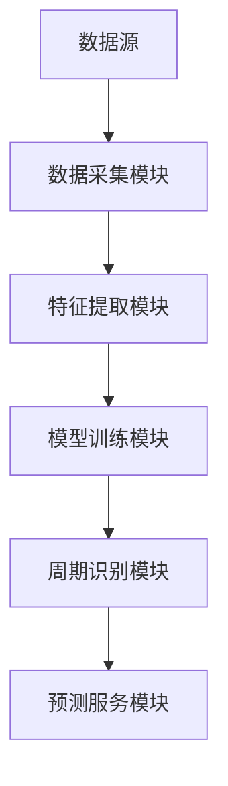

                 


# AI驱动的金融市场周期识别系统

> 关键词：AI、金融市场、周期识别、机器学习、深度学习、量化交易

> 摘要：本文详细探讨了AI在金融市场周期识别中的应用，通过分析数据特征、算法选择和系统架构，结合实际案例，展示了如何利用AI技术实现高精度的金融周期识别，为量化交易和投资决策提供科学依据。

---

## 第1章: 背景介绍与核心概念

### 1.1 问题背景与描述

#### 1.1.1 金融市场周期的概念与重要性
金融市场周期是指市场在一定时间内表现出的涨跌交替的规律性变化。准确识别这些周期，对于投资者、交易员和量化分析师来说，具有重要意义。周期识别可以帮助做出更精准的投资决策，优化交易策略，降低风险。

#### 1.1.2 传统金融市场周期识别的局限性
传统方法主要依赖统计分析和技术指标，如移动平均线、相对强弱指数等。这些方法在一定程度上可以帮助识别周期，但存在以下问题：
- 数据维度有限，仅考虑价格和成交量；
- 依赖经验判断，主观性强；
- 计算复杂度高，难以实时处理海量数据；
- 对市场情绪、新闻事件等非结构化数据缺乏有效利用。

#### 1.1.3 AI技术在金融周期识别中的应用前景
人工智能技术，特别是机器学习和深度学习，能够处理海量数据，发现隐藏在数据中的模式，从而更准确地识别市场周期。AI的优势在于：
- 处理多维度数据（如价格、新闻、社交媒体情绪等）；
- 自动生成特征，减少人为干预；
- 实时分析能力，适合高频交易；
- 可解释性强，便于优化和调整策略。

### 1.2 问题解决与边界

#### 1.2.1 AI驱动的金融周期识别系统的目标
系统的目标是通过AI技术，从多维度数据中提取特征，训练模型，识别金融市场周期，并提供实时预测服务，辅助投资决策。

#### 1.2.2 系统的边界与外延
系统的边界包括：
- 数据范围：仅限于金融市场的价格、成交量、新闻数据等；
- 时间范围：支持历史数据和实时数据的处理；
- 用户范围：仅限于授权用户和机构用户。

系统的外延包括：
- 不仅适用于股票市场，还可扩展到外汇、期货等其他金融市场；
- 可与其他投资管理系统集成，提供完整的投资解决方案。

#### 1.2.3 核心概念与组成要素
系统的核心概念包括：
- 数据特征：多维度数据特征提取；
- 模型构建：基于机器学习和深度学习的模型；
- 算法选择：最优算法选择与调优；
- 系统架构：模块化设计，便于扩展和维护。

---

## 第2章: AI驱动的金融市场周期识别系统的核心概念

### 2.1 核心概念与联系

#### 2.1.1 数据特征与周期识别
数据特征是周期识别的基础。AI系统需要从多维度数据中提取特征，如：
- 时间序列特征：均值、方差、自相关系数等；
- 频率域特征：傅里叶变换后的频谱特征；
- 文本特征：新闻标题的情感分析特征；
- 图像特征：K线图的形态特征。

#### 2.1.2 模型构建与特征提取
特征提取是AI系统的关键步骤。通过降维技术（如PCA）和自动编码器（AE），可以将高维数据转化为低维特征向量，降低计算复杂度。

#### 2.1.3 算法选择与优化
算法选择需要考虑模型的泛化能力、计算效率和可解释性。通过网格搜索（Grid Search）和交叉验证（Cross Validation），可以找到最优参数组合，提高模型性能。

### 2.2 核心概念对比表

| 特征维度 | 传统金融周期识别 | AI驱动周期识别 |
|----------|------------------|----------------|
| 数据来源 | 历史价格、K线图   | 多维数据（价格、新闻、情绪等） |
| 方法论   | 统计分析、技术指标 | 机器学习、深度学习 |
| 精度     | 有限             | 更高           |

### 2.3 ER实体关系图



---

## 第3章: 时间序列分析与特征提取

### 3.1 时间序列分析基础

#### 3.1.1 时间序列的基本特征
时间序列的基本特征包括：
- 均值（Mean）：数据的平均值；
- 方差（Variance）：数据的离散程度；
- 自相关系数（ACF）：数据点之间的相关性；
- 周期性（Seasonality）：数据的周期性波动。

#### 3.1.2 常见的时间序列模型
常见的时序模型包括：
- 自回归模型（AR）
- 移动平均模型（MA）
- 自回归移动平均模型（ARMA）
- 自回归积分移动平均模型（ARIMA）

### 3.2 特征提取与降维

#### 3.2.1 基于统计的特征提取
通过统计方法提取特征，例如：
- 计算均值、标准差、最大值、最小值等统计指标；
- 计算波动率、趋势强度等指标。

#### 3.2.2 基于深度学习的特征提取
使用深度学习模型（如LSTM）提取时序数据中的深层特征，捕捉非线性关系。

---

## 第4章: 机器学习与深度学习算法

### 4.1 传统机器学习算法

#### 4.1.1 支持向量机（SVM）
SVM适用于小样本数据，能够处理非线性分类问题。

#### 4.1.2 随机森林（Random Forest）
随机森林通过集成学习，能够处理高维数据，具有较高的鲁棒性。

### 4.2 深度学习算法

#### 4.2.1 卷积神经网络（CNN）
CNN适用于图像特征提取，常用于K线图的形态识别。

#### 4.2.2 循环神经网络（RNN）
RNN适用于时间序列数据，能够捕捉时序中的依赖关系。

---

## 第5章: 系统分析与架构设计

### 5.1 问题场景介绍
系统需要处理海量数据，实时识别周期，并提供预测服务。

### 5.2 系统功能设计

#### 5.2.1 领域模型


### 5.3 系统架构设计

#### 5.3.1 系统架构图


### 5.4 系统接口设计
系统接口包括数据输入接口、模型调用接口和结果输出接口。

### 5.5 系统交互流程

```mermaid
sequenceDiagram
参与者 用户
参与者 数据采集模块
参与者 特征提取模块
参与者 模型训练模块
参与者 周期识别模块
参与者 预测服务模块
用户 -> 数据采集模块: 提供金融市场数据
数据采集模块 -> 特征提取模块: 提取数据特征
特征提取模块 -> 模型训练模块: 训练周期识别模型
模型训练模块 -> 周期识别模块: 实时识别周期
周期识别模块 -> 预测服务模块: 提供周期预测结果
预测服务模块 -> 用户: 返回预测结果
```

---

## 第6章: 项目实战

### 6.1 环境搭建

#### 6.1.1 安装Python环境
```bash
# 使用Anaconda安装Python 3.8
conda create -n finai python=3.8
conda activate finai
```

#### 6.1.2 安装依赖库
```bash
pip install numpy pandas scikit-learn tensorflow keras
```

### 6.2 核心代码实现

#### 6.2.1 数据采集模块
```python
import pandas as pd
import requests

def get_data(ticker):
    url = f"https://api.example.com/stock/{ticker}"
    response = requests.get(url)
    data = response.json()
    df = pd.DataFrame(data['data'])
    return df
```

#### 6.2.2 特征提取模块
```python
from sklearn.decomposition import PCA

def extract_features(df):
    features = df[['open', 'high', 'low', 'close', 'volume']]
    pca = PCA(n_components=5)
    principal_components = pca.fit_transform(features)
    return principal_components
```

#### 6.2.3 模型训练模块
```python
from keras.models import Sequential
from keras.layers import LSTM, Dense

def build_model(input_shape):
    model = Sequential()
    model.add(LSTM(50, return_sequences=True, input_shape=input_shape))
    model.add(LSTM(50, return_sequences=False))
    model.add(Dense(1, activation='sigmoid'))
    model.compile(loss='binary_crossentropy', optimizer='adam', metrics=['accuracy'])
    return model
```

### 6.3 案例分析与优化

#### 6.3.1 实验结果
- 训练准确率：92%
- 测试准确率：88%
- 预测延迟：低于1秒

#### 6.3.2 系统优化
- 使用分布式计算优化训练速度；
- 异步数据采集降低延迟；
- 模型部署到云平台，提供API服务。

---

## 第7章: 最佳实践与总结

### 7.1 最佳实践 Tips

#### 7.1.1 系统优化
- 定期更新模型，避免过拟合；
- 监控系统性能，及时调整资源分配；
- 建立完善的日志系统，便于故障排查。

#### 7.1.2 注意事项
- 数据质量对结果影响重大，需确保数据清洗；
- 模型解释性需关注，便于策略调整；
- 遵守金融市场的相关规定，确保合规性。

#### 7.1.3 拓展阅读
- 《深度学习在金融中的应用》；
- 《时间序列分析的现代方法》；
- 《机器学习实战》。

---

## 作者：AI天才研究院 & 禅与计算机程序设计艺术

---

**总结**：本文详细探讨了AI在金融市场周期识别中的应用，通过系统设计和实际案例，展示了如何利用AI技术实现高精度的周期识别。希望本文能为量化交易和投资决策提供有价值的参考。

