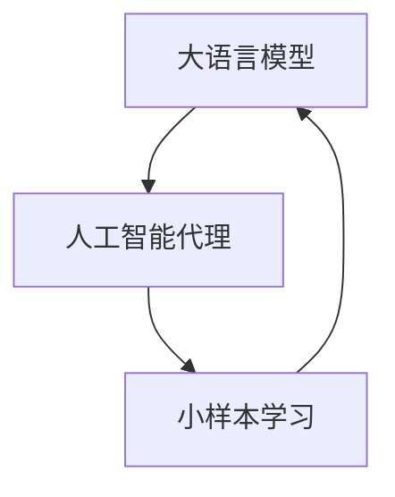
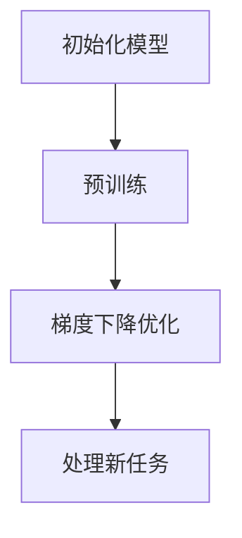
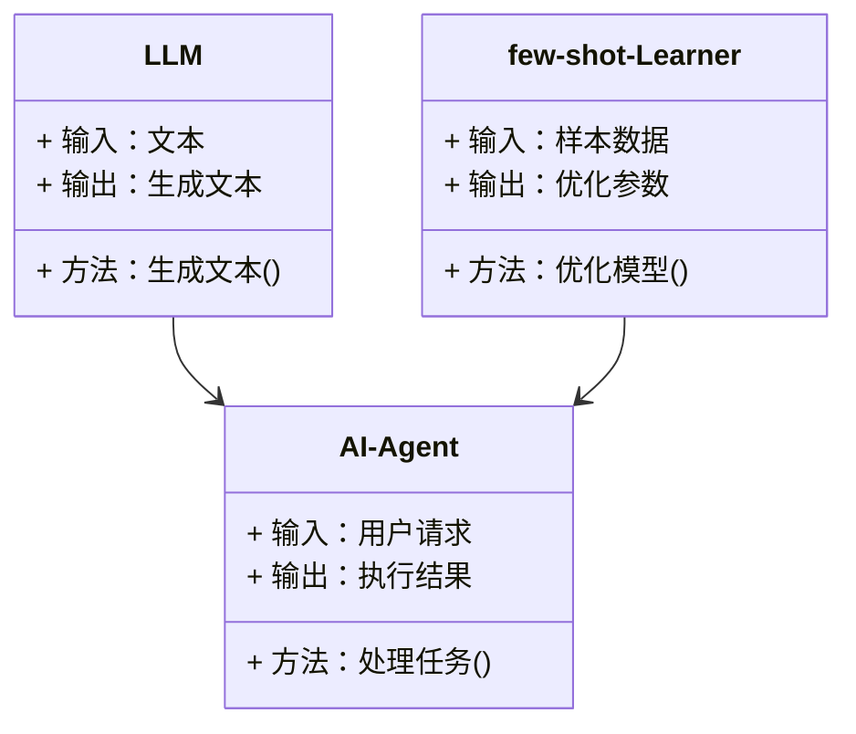
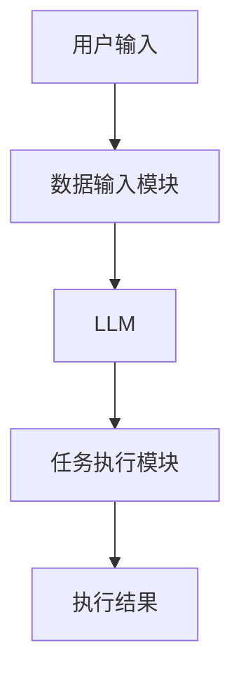

                 


# LLM在AI Agent中的few-shot learning优化策略

**关键词**：LLM, AI Agent, few-shot learning, 优化策略, 人工智能, 机器学习

**摘要**：本文详细探讨了大语言模型（LLM）在人工智能代理（AI Agent）中的few-shot学习优化策略。文章从背景介绍、核心概念、算法原理、系统架构设计、项目实战等多个维度展开，深入分析了few-shot学习在AI Agent中的应用挑战、解决方案及优化策略。通过具体案例分析和代码实现，帮助读者全面理解并掌握如何优化LLM在AI Agent中的性能。

---

## 第1章: 背景与概述

### 1.1 问题背景

#### 1.1.1 LLM的定义与特点
- 大语言模型（LLM）的定义
- LLM的核心特点：大规模参数、预训练、通用性
- LLM的应用领域：自然语言处理、对话系统、文本生成等

#### 1.1.2 AI Agent的定义与应用场景
- AI Agent的概念
- AI Agent的核心功能：感知环境、决策、执行操作
- AI Agent的典型应用场景：智能助手、推荐系统、自动化系统

#### 1.1.3 few-shot学习的背景与重要性
- few-shot学习的定义
- few-shot学习的优势：减少数据依赖、提升模型泛化能力
- few-shot学习在AI Agent中的重要性：快速适应新任务、提高效率

### 1.2 问题描述

#### 1.2.1 LLM在AI Agent中的应用挑战
- LLM的训练数据依赖性
- LLM在小样本任务中的性能下降
- LLM与AI Agent的协同优化问题

#### 1.2.2 few-shot学习在AI Agent中的具体问题
- few-shot学习的算法选择
- few-shot学习与LLM的结合方式
- few-shot学习在动态环境中的适应性

### 1.3 问题解决

#### 1.3.1 few-shot学习如何优化LLM在AI Agent中的表现
- few-shot学习通过小样本快速调整模型参数
- few-shot学习提升LLM的泛化能力
- few-shot学习增强AI Agent的实时适应能力

#### 1.3.2 具体优化策略的初步探讨
- 使用Meta-Learning算法优化few-shot学习
- 结合LLM的特性设计特定的优化策略
- 在AI Agent中集成高效的few-shot学习模块

### 1.4 边界与外延

#### 1.4.1 LLM与AI Agent的边界
- LLM的功能边界：文本生成、理解
- AI Agent的功能边界：决策、执行
- LLM与AI Agent的协同边界：任务分解、数据交互

#### 1.4.2 few-shot学习的适用范围与限制
- few-shot学习适用的场景：小样本任务、快速部署
- few-shot学习的限制：依赖高质量样本、计算资源需求较高

### 1.5 概念结构与核心要素

#### 1.5.1 核心概念
- LLM：大语言模型
- AI Agent：人工智能代理
- few-shot学习：小样本学习

#### 1.5.2 核心要素组成
- 数据：训练数据、测试数据
- 模型：LLM、few-shot学习模型
- 任务：文本生成、对话理解

---

## 第2章: 核心概念与联系

### 2.1 核心概念的原理

#### 2.1.1 few-shot学习的原理
- few-shot学习的目标：通过少量样本快速适应新任务
- few-shot学习的关键步骤：元学习、任务间迁移
- few-shot学习的数学模型：支持向量机、神经网络

#### 2.1.2 LLM的工作原理
- LLM的训练过程：预训练、微调
- LLM的核心组件：编码器、解码器
- LLM的输出机制：基于概率的生成式模型

### 2.2 核心概念的对比

#### 2.2.1 概念属性特征对比
| 概念    | 特征               | 优势                     |
|---------|--------------------|--------------------------|
| LLM     | 大规模参数、预训练 | 高泛化能力、强生成能力   |
| AI Agent| 多任务处理、实时性 | 高效执行、动态适应       |
| few-shot学习 | 小样本适应、快速调整 | 低数据需求、高效率     |

#### 2.2.2 模型属性对比
| 模型类型    | 参数数量 | 适用场景       |
|------------|----------|----------------|
| LLM        | 十亿级别 | 多任务处理、复杂场景 |
| few-shot学习 | 低至数百 | 小样本任务、快速部署 |

### 2.3 实体关系分析

#### 2.3.1 实体关系图


---

## 第3章: 算法原理与实现

### 3.1 算法原理

#### 3.1.1 Meta-Learning算法
- Meta-Learning的核心思想：通过元任务学习，快速适应新任务
- MAML（Meta-Antibiotics Matching Networks）算法流程
  1. 在多个训练任务上预训练模型
  2. 在每个任务上进行梯度下降，更新模型参数
  3. 使用优化后的参数处理新任务

#### 3.1.2 few-shot学习的数学模型
- 支持向量机（SVM）的few-shot学习
  $$ \text{目标函数：} \min_{\theta} \sum_{i=1}^{n} \max(0, 1 - y_i w^T x_i + b) $$
- 神经网络的few-shot学习
  $$ \text{损失函数：} \mathcal{L} = \sum_{i=1}^{n} \text{CE}(y_i, y_{\text{pred}}) $$

### 3.2 算法实现

#### 3.2.1 使用Python实现Meta-Learning算法
```python
import torch
import torch.nn as nn

class MetaLearner(nn.Module):
    def __init__(self, model):
        super().__init__()
        self.model = model
        self.meta_parameters = torch.Parameter(torch.zeros_like(model.parameters()))
    
    def forward(self, x, y):
        # 前向传播
        outputs = self.model(x)
        # 计算损失
        loss = nn.CrossEntropyLoss()(outputs, y)
        return loss
    
    def meta_step(self, loss):
        # 元优化步骤
        optimizer = torch.optim.SGD([self.meta_parameters], lr=0.01)
        optimizer.zero_grad()
        loss.backward()
        optimizer.step()
```

#### 3.2.2 算法流程图


---

## 第4章: 系统分析与架构设计方案

### 4.1 问题场景介绍

#### 4.1.1 LLM在AI Agent中的任务分解
- 文本生成：对话生成、文案创作
- 任务处理：信息检索、任务执行
- 状态管理：任务优先级、资源分配

### 4.2 项目介绍

#### 4.2.1 项目目标
- 提升AI Agent的多任务处理能力
- 优化LLM在小样本任务中的表现
- 实现高效的few-shot学习模块

### 4.3 系统功能设计

#### 4.3.1 系统功能模块
- 数据输入模块：接收用户输入
- 模型选择模块：选择合适的LLM或few-shot学习模型
- 任务执行模块：处理具体任务并返回结果

#### 4.3.2 系统功能的领域模型图


### 4.4 系统架构设计

#### 4.4.1 系统架构图


#### 4.4.2 接口设计
- 数据输入接口：接收文本输入
- 模型调用接口：调用LLM或few-shot学习模型
- 结果输出接口：返回处理结果

### 4.5 系统交互序列图

#### 4.5.1 系统交互流程
```mermaid
sequenceDiagram
    participant 用户
    participant 数据输入模块
    participant LLM
    participant 任务执行模块
    用户 -> 数据输入模块：发送请求
    数据输入模块 -> LLM：调用模型
    LLM -> 任务执行模块：返回生成结果
    任务执行模块 -> 用户：返回最终结果
```

---

## 第5章: 项目实战

### 5.1 环境安装

#### 5.1.1 安装Python和依赖库
```bash
pip install torch
pip install transformers
pip install matplotlib
pip install seaborn
```

### 5.2 核心代码实现

#### 5.2.1 LLM的实现
```python
from transformers import AutoTokenizer, AutoModelForCausalLM

tokenizer = AutoTokenizer.from_pretrained('gpt2')
model = AutoModelForCausalLM.from_pretrained('gpt2')
```

#### 5.2.2 few-shot学习的实现
```python
import torch
import torch.nn as nn

class FewShotLearner(nn.Module):
    def __init__(self, model):
        super().__init__()
        self.model = model
        self.classifier = nn.Linear(model.config.hidden_size, 2)
    
    def forward(self, inputs):
        outputs = self.model(inputs)[0]
        logits = self.classifier(outputs[:, -1, :])
        return logits
```

### 5.3 代码应用解读与分析

#### 5.3.1 代码功能解读
- LLM的加载与初始化
- few-shot学习模型的构建与训练
- 模型在AI Agent中的集成与调用

#### 5.3.2 实际案例分析
- 在对话系统中使用few-shot学习优化LLM
- 在推荐系统中快速适应新用户

### 5.4 项目小结

#### 5.4.1 项目总结
- 成功实现了LLM与few-shot学习的结合
- 提升了AI Agent在小样本任务中的性能
- 验证了优化策略的有效性

---

## 第6章: 优化策略与总结

### 6.1 最佳实践

#### 6.1.1 小样本数据的处理技巧
- 数据增强：通过数据扩展提升样本质量
- 样本选择：选择具有代表性的样本

#### 6.1.2 模型优化建议
- 使用预训练好的LLM进行微调
- 选择适合的Meta-Learning算法

### 6.2 小结

#### 6.2.1 核心要点回顾
- few-shot学习在AI Agent中的重要性
- LLM与few-shot学习的结合策略
- 优化策略的具体实现方法

### 6.3 注意事项

#### 6.3.1 实际应用中的注意事项
- 数据质量对模型性能的影响
- 计算资源的需求
- 模型的实时性与响应速度

### 6.4 拓展阅读

#### 6.4.1 推荐阅读的书籍与文章
- 《Deep Learning》
- 《Meta-Learning for Few-Shot Image Classification》

---

**作者**：AI天才研究院/AI Genius Institute & 禅与计算机程序设计艺术 /Zen And The Art of Computer Programming  
**标签**：人工智能, 机器学习, 大语言模型, AI Agent, few-shot学习

