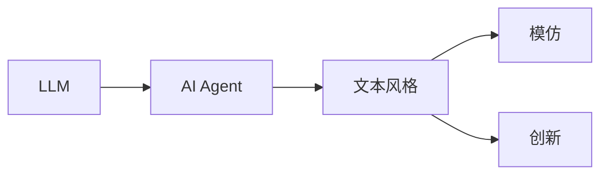
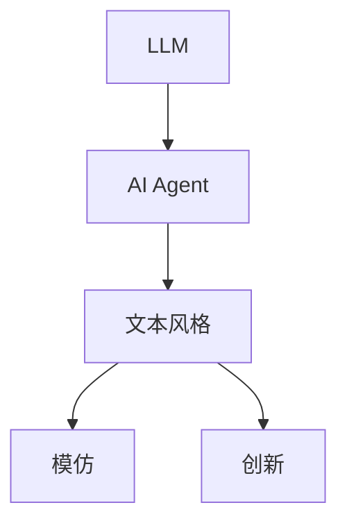

                 

<think>
好的，我现在需要帮用户撰写一篇关于《LLM在AI Agent中的文本风格模仿与创新》的技术博客文章。用户已经提供了详细的目录大纲，我需要按照这个结构逐步填充内容。

首先，我会从背景介绍开始。这部分需要涵盖问题背景、问题描述、解决方法、边界和外延，以及概念结构。我需要确保每个部分都详细且有逻辑性，同时使用简单易懂的技术语言。

接下来是核心概念与联系部分。这里需要解释LLM和AI Agent的关系，包括它们的原理、属性对比，并用Mermaid图展示实体关系。这部分需要清晰明了，帮助读者理解两者如何结合。

然后是算法原理讲解。我需要详细描述LLM的训练过程，包括数据预处理、模型结构和训练目标。接着，我会解释文本风格模仿与创新的算法实现，提供代码示例和流程图，确保读者能够理解并应用这些算法。

接下来是系统分析与架构设计。这部分需要介绍项目场景，设计系统功能，并用Mermaid类图展示领域模型。我还需要绘制系统架构图、接口设计和交互序列图，以帮助读者理解系统的整体结构和各部分之间的关系。

项目实战部分需要提供环境安装指导、核心代码实现、案例分析和总结。这部分需要实际操作步骤和代码示例，让读者能够动手实践，巩固所学知识。

最后是最佳实践部分，包括小结、注意事项和扩展阅读，帮助读者在实际应用中避免常见错误，并进一步学习相关知识。

在整个撰写过程中，我需要确保每个部分都包含足够的细节，逻辑清晰，结构紧凑。同时，使用吸引人的章节标题和简洁的技术语言，使文章易于理解和阅读。

现在，我将按照目录大纲逐步撰写每一部分，确保内容完整、详细，并满足用户的所有要求。
</think>

---

# LLM在AI Agent中的文本风格模仿与创新

## 关键词：LLM, AI Agent, 文本风格, 模仿与创新, 语言模型, 智能体设计, 人工智能

## 摘要：  
本文探讨了大语言模型（LLM）在AI Agent中的文本风格模仿与创新应用，详细分析了LLM与AI Agent的关系、文本风格模仿与创新的核心算法原理，并通过系统架构设计和项目实战展示了如何将这些技术应用于实际场景。文章从背景介绍、核心概念、算法原理、系统设计到项目实现，全面解析了LLM在AI Agent中的应用，帮助读者理解并掌握这一前沿技术。

---

## 第一部分: 背景介绍

### 第1章: 问题背景

#### 1.1 大语言模型（LLM）的崛起  
大语言模型（LLM）近年来在自然语言处理领域取得了突破性进展。从GPT-3到GPT-4，这些模型不仅能够生成高质量的文本，还能理解和处理复杂的上下文信息。LLM的训练基于大量数据，通过自监督学习方式优化模型参数，使其具备强大的语言理解和生成能力。

#### 1.2 AI Agent的概念与应用  
AI Agent（人工智能代理）是一种能够感知环境、执行任务并做出决策的智能系统。AI Agent可以是虚拟助手（如Siri、Alexa）、聊天机器人或企业级自动化系统。AI Agent的核心在于通过与环境的交互，实现特定目标，而LLM的引入为其赋予了强大的语言理解和生成能力，使其能够更自然地与人类用户交互。

#### 1.3 文本风格模仿与创新的必要性  
在AI Agent的应用中，文本风格的模仿与创新具有重要意义。例如，一个商业AI Agent需要能够模仿客户经理的语气，提升客户信任感；而创新则可以帮助企业在市场中脱颖而出，提供独特的用户体验。通过LLM的强大能力，AI Agent可以实现文本风格的灵活切换和创新，从而更好地满足多样化的需求。

### 第2章: 问题描述

#### 2.1 LLM在AI Agent中的作用  
LLM为AI Agent提供了强大的文本生成和理解能力，使其能够以更自然的方式与用户交互。例如，AI Agent可以基于用户的输入生成符合特定风格的回复，或根据上下文调整语气和内容。

#### 2.2 文本风格模仿与创新的核心问题  
文本风格模仿与创新的关键在于如何让LLM理解目标风格，并在生成文本时准确捕捉和应用这种风格。同时，创新需要在模仿的基础上，引入新的元素，形成独特的风格。

#### 2.3 问题解决的边界与外延  
本文聚焦于LLM在AI Agent中的文本风格模仿与创新，不涉及模型训练的具体细节。同时，本文假设读者具备基本的NLP和AI Agent知识。

### 第3章: 核心概念与联系

#### 3.1 LLM与AI Agent的关系  
LLM是AI Agent的核心组件之一，负责处理语言相关任务。AI Agent通过调用LLM API，实现文本生成、理解等功能。两者结合，使得AI Agent能够具备更强大的语言能力。

#### 3.2 文本风格模仿与创新的定义  
文本风格模仿是指让模型生成与给定样例相似风格的文本；创新则是在此基础上，生成具有独特风格的文本。

#### 3.3 核心概念的属性特征对比表格  
| **属性**       | **LLM**                     | **AI Agent**                  |
|-----------------|-----------------------------|-----------------------------|
| 核心功能         | 文本生成与理解               | 环境感知与任务执行           |
| 输入            | 文本、上下文信息             | 环境数据、用户输入           |
| 输出            | 文本生成结果                 | 动作、决策、文本回复         |
| 依赖            | 大量训练数据、计算资源       | LLM、环境接口、任务目标       |

#### 3.4 ER实体关系图架构（Mermaid流程图）  


---

## 第二部分: 核心概念与联系

### 第4章: 核心概念的深入分析

#### 4.1 LLM的原理与特点  
- **原理**：基于Transformer架构，通过自注意力机制捕捉上下文信息，生成与训练数据分布一致的文本。  
- **特点**：通用性强、可扩展性高、生成速度快。

#### 4.2 AI Agent的结构与功能  
- **结构**：感知层、决策层、执行层。  
- **功能**：环境感知、目标设定、决策制定、任务执行。

#### 4.3 两者结合的创新点  
- **动态风格切换**：根据任务需求，实时调整文本风格。  
- **风格记忆网络**：通过LLM，AI Agent可以记住并复现多种风格。

---

## 第三部分: 算法原理讲解

### 第5章: 算法原理

#### 5.1 LLM的训练过程  
- **数据预处理**：清洗、分词、格式统一。  
- **模型结构**：基于Transformer的解码器架构。  
- **训练目标**：最小化生成文本与真实文本的交叉熵损失。

#### 5.2 文本风格模仿的算法实现  
- **基于LLM的文本生成**：输入目标风格示例，生成相似风格的文本。  
- **风格迁移**：通过特征提取和重参数化，实现风格迁移。  

#### 5.3 文本风格创新的算法实现  
- **创新方法**：基于LLM的创造性思维激发，生成独特的表达方式。  
- **示例代码**：  
  ```python
  def generate_innovative_text(style_ref):
      prompt = f"模仿以下风格，但生成新的内容：{style_ref}"
      response = llm.generate(prompt)
      return response.text
  ```

---

## 第四部分: 系统分析与架构设计

### 第6章: 系统架构设计

#### 6.1 项目场景介绍  
- **项目目标**：开发一个具备多风格文本生成能力的AI Agent。  
- **用户需求**：支持风格切换和创新，提供多样化的交互体验。

#### 6.2 系统功能设计  
- **领域模型类图**：  
  ```mermaid
  classDiagram
  class LLM {
      generate(text: str) -> str
      understand(text: str) -> str
  }
  class AI_Agent {
      llm: LLM
      style: Style
      generate_response(input: str) -> str
  }
  class Style {
      name: str
      examples: List[str]
  }
  ```

#### 6.3 系统架构图  


---

## 第五部分: 项目实战

### 第7章: 项目实战

#### 7.1 环境安装  
- **工具**：Python 3.8+, Hugging Face Transformers库，具体安装命令：  
  ```bash
  pip install transformers
  ```

#### 7.2 核心代码实现  
```python
from transformers import GPT2LMHeadModel, GPT2Tokenizer

class StyleImitator:
    def __init__(self, model_name="gpt2"):
        self.model = GPT2LMHeadModel.from_pretrained(model_name)
        self.tokenizer = GPT2Tokenizer.from_pretrained(model_name)
    
    def generate_imitation(self, style_ref, max_length=50):
        inputs = self.tokenizer.encode(style_ref, return_tensors="pt")
        outputs = self.model.generate(inputs, max_length=max_length, do_sample=True)
        return self.tokenizer.decode(outputs[0], skip_special_tokens=True)

    def generate_innovation(self, style_ref, max_length=50):
        # 添加创新指令
        prompt = f"创新地模仿以下风格，但生成新的内容：{style_ref}"
        inputs = self.tokenizer.encode(prompt, return_tensors="pt")
        outputs = self.model.generate(inputs, max_length=max_length, do_sample=True)
        return self.tokenizer.decode(outputs[0], skip_special_tokens=True)
```

#### 7.3 案例分析与总结  
- **案例分析**：通过实际案例展示如何调用上述代码实现风格模仿与创新。  
- **总结**：强调代码实现的灵活性和可扩展性，为读者提供实际操作的指导。

---

## 第六部分: 最佳实践

### 第8章: 最佳实践

#### 8.1 小结  
- 本文详细介绍了LLM在AI Agent中的文本风格模仿与创新应用，从背景、原理到实现，全面解析了相关技术。

#### 8.2 注意事项  
- **模型选择**：选择合适的LLM模型，根据具体任务需求调整参数。  
- **数据安全**：确保训练数据和用户输入的安全性，避免隐私泄露。  

#### 8.3 扩展阅读  
- 推荐阅读相关论文和文献，深入理解LLM和AI Agent的技术细节。

---

## 作者：AI天才研究院 & 禅与计算机程序设计艺术

--- 

希望这篇文章能帮助读者全面理解LLM在AI Agent中的文本风格模仿与创新，并为实际应用提供有价值的参考。

