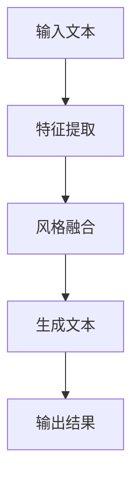

                 


# LLM在AI Agent中的文本风格融合与创新

---

## 关键词：LLM, AI Agent, 文本风格融合, 创新, 大语言模型, 风格迁移

---

## 摘要：

随着大语言模型（LLM）的快速发展，AI Agent在文本处理中的应用日益广泛。本文聚焦于LLM在AI Agent中的文本风格融合与创新，探讨如何利用LLM的强大能力，实现不同文本风格的融合，并在此过程中推动文本生成的创新。文章从背景介绍、核心概念、算法原理、系统架构、项目实战等多方面展开，结合具体案例和代码实现，深入分析LLM在文本风格融合中的应用及其创新潜力。

---

# 正文

---

## 第1章: LLM与AI Agent概述

### 1.1 LLM的基本概念

#### 1.1.1 大语言模型的定义

大语言模型（Large Language Model, LLM）是指经过训练的大型神经网络模型，能够理解和生成自然语言文本。LLM的核心是通过大量数据的训练，学习语言的语法、语义和上下文关系。例如，GPT系列模型就是典型的LLM。

#### 1.1.2 LLM的核心特点

- **大规模训练数据**：LLM通常基于数百万甚至数十亿的文本数据进行训练。
- **深度神经网络**：采用多层神经网络结构，能够捕捉复杂的语言模式。
- **生成与理解能力**：LLM不仅能够生成文本，还能通过上下文理解输入内容，回答问题或完成任务。

#### 1.1.3 LLM与传统NLP模型的区别

传统NLP模型（如SVM、CRF）依赖于特征工程，而LLM通过端到端的深度学习，直接从数据中学习特征，具有更强的泛化能力和灵活性。

---

### 1.2 AI Agent的基本概念

#### 1.2.1 AI Agent的定义

AI Agent（人工智能代理）是指能够感知环境、自主决策并执行任务的智能体。AI Agent可以是软件程序，也可以是机器人，其核心目标是通过与环境交互，完成特定任务。

#### 1.2.2 AI Agent的核心功能

- **感知**：通过传感器或API获取环境信息。
- **决策**：基于获取的信息，选择最优动作。
- **执行**：通过执行器（如API调用）完成任务。

#### 1.2.3 AI Agent的应用场景

AI Agent广泛应用于对话系统、推荐系统、智能助手等领域。例如，Siri、Alexa等智能助手都是典型的AI Agent。

---

### 1.3 LLM在AI Agent中的作用

#### 1.3.1 LLM作为AI Agent的核心驱动力

LLM为AI Agent提供了强大的自然语言处理能力，使其能够理解和生成人类语言，从而更好地与用户交互。

#### 1.3.2 LLM在文本处理中的优势

- **生成能力**：LLM能够生成自然流畅的文本，提升AI Agent的表达能力。
- **上下文理解**：LLM能够理解上下文，使得AI Agent的对话更加连贯。

#### 1.3.3 LLM与AI Agent的结合方式

LLM作为AI Agent的“大脑”，通过处理输入文本、生成输出文本，实现与用户的自然交互。

---

## 第2章: LLM与文本风格的关系

### 2.1 文本风格的定义

#### 2.1.1 文本风格的分类

文本风格可以分为正式、随意、幽默、严肃等类型。每种风格都有其独特的语言特征。

#### 2.1.2 不同文本风格的特点

- **正式风格**：语言严谨，适合正式场合。
- **随意风格**：语言轻松，适合非正式场合。
- **幽默风格**：语言有趣，能够引发笑声。

#### 2.1.3 文本风格的分析方法

文本风格分析通常包括词频分析、句式分析、情感分析等方法。

---

### 2.2 LLM在文本风格分析中的应用

#### 2.2.1 LLM文本风格分析的基本原理

通过LLM对输入文本进行编码，提取其风格特征，然后进行分类。

#### 2.2.2 LLM在风格分类中的优势

- **自动学习**：LLM能够自动学习风格特征，无需手动特征工程。
- **高精度**：通过大规模数据训练，LLM在风格分类上表现出色。

#### 2.2.3 LLM文本风格分析的挑战

- **数据依赖性**：需要大量标注数据。
- **风格漂移**：模型可能受到训练数据偏差的影响。

---

## 第3章: 文本风格融合的背景与意义

### 3.1 文本风格融合的定义

#### 3.1.1 文本风格融合的内涵

将不同风格的文本进行融合，生成新的文本，同时保留多种风格的特点。

#### 3.1.2 文本风格融合的目标

通过融合不同风格，生成更加丰富、多样的文本内容。

#### 3.1.3 文本风格融合的应用场景

文本风格融合在新闻生成、广告文案创作等领域具有广泛的应用。

---

### 3.2 LLM在文本风格融合中的创新

#### 3.2.1 LLM文本风格融合的核心思想

利用LLM的强大生成能力，将多种风格特征融入到文本生成过程中。

#### 3.2.2 LLM在风格融合中的技术优势

- **多风格生成**：LLM能够同时处理多种风格特征，生成多样化的文本。
- **动态调整**：可以根据需求动态调整生成文本的风格比例。

#### 3.2.3 LLM文本风格融合的未来趋势

随着模型的不断优化，文本风格融合将更加智能化、个性化。

---

## 第4章: 文本风格融合的基本原理

### 4.1 文本风格融合的算法流程

#### 4.1.1 文本风格融合的输入输出

- **输入**：多种风格的文本样本。
- **输出**：融合多种风格的生成文本。

#### 4.1.2 文本风格融合的关键步骤

1. **风格特征提取**：通过LLM提取每种风格的特征向量。
2. **风格融合策略**：确定每种风格在生成文本中的权重。
3. **生成文本**：基于融合后的特征向量，生成最终文本。

#### 4.1.3 文本风格融合的挑战

- **特征提取的准确性**：如何准确提取风格特征。
- **风格权重的合理分配**：如何动态调整风格权重。

---

## 第5章: 基于LLM的文本风格融合实现

### 5.1 实验环境搭建

#### 5.1.1 环境配置

- **Python版本**：3.8以上。
- **LLM选择**：使用开源模型如GPT-2。
- **工具安装**：安装PyTorch、Hugging Face库等。

#### 5.1.2 数据准备

- **训练数据**：收集多种风格的文本样本。
- **测试数据**：用于模型评估。

---

### 5.2 文本风格融合的实现

#### 5.2.1 风格特征提取代码

```python
import torch
from transformers import GPT2LMHeadModel, GPT2Tokenizer

# 加载模型
model = GPT2LMHeadModel.from_pretrained('gpt2')
tokenizer = GPT2Tokenizer.from_pretrained('gpt2')

# 输入文本
text = "这是一个幽默的句子。"
# 编码
inputs = tokenizer.encode(text, return_tensors='pt')

# 提取特征向量
with torch.no_grad():
    outputs = model(inputs)
    style_features = outputs.last_hidden_state.mean(dim=1)
```

#### 5.2.2 风格融合策略实现

```python
# 定义风格融合函数
def style_fusion(features, weights):
    weighted_features = features * weights
    fused_feature = torch.sum(weighted_features, dim=1)
    return fused_feature
```

#### 5.2.3 生成融合文本

```python
# 生成融合文本
inputs = tokenizer.encode('这是一个融合了幽默和正式风格的句子。', return_tensors='pt')
with torch.no_grad():
    outputs = model.generate(inputs, max_length=50)
print(tokenizer.decode(outputs[0]))
```

---

## 第6章: 系统架构与优化

### 6.1 系统功能设计

#### 6.1.1 系统模块划分

- **输入模块**：接收用户输入的文本样本。
- **处理模块**：提取风格特征，进行融合。
- **输出模块**：生成融合文本并输出。

#### 6.1.2 系统流程图



---

### 6.2 系统优化策略

#### 6.2.1 模型优化

- **微调优化**：在特定领域数据上对LLM进行微调。
- **参数优化**：调整模型参数，提升风格融合效果。

#### 6.2.2 算法优化

- **动态权重调整**：根据生成结果调整风格权重。
- **多任务学习**：结合其他任务优化风格融合。

---

## 第7章: 项目实战与案例分析

### 7.1 项目背景

本项目旨在通过LLM实现文本风格的融合与创新，提升文本生成的多样性和丰富性。

---

### 7.2 核心代码实现

#### 7.2.1 风格融合代码

```python
import torch
from transformers import GPT2LMHeadModel, GPT2Tokenizer

# 加载模型
model = GPT2LMHeadModel.from_pretrained('gpt2')
tokenizer = GPT2Tokenizer.from_pretrained('gpt2')

# 定义风格融合函数
def style_fusion(features, weights):
    weighted_features = features * weights
    fused_feature = torch.sum(weighted_features, dim=1)
    return fused_feature

# 实验代码
text1 = "这是一个正式的声明。"
text2 = "这是一个随意的聊天。"

# 编码
inputs1 = tokenizer.encode(text1, return_tensors='pt')
inputs2 = tokenizer.encode(text2, return_tensors='pt')

# 提取特征
with torch.no_grad():
    outputs1 = model(inputs1)
    features1 = outputs1.last_hidden_state.mean(dim=1)
    outputs2 = model(inputs2)
    features2 = outputs2.last_hidden_state.mean(dim=1)

# 融合特征
weights = torch.tensor([0.6, 0.4])
fused_feature = style_fusion(torch.cat([features1, features2], dim=0), weights)

# 生成融合文本
inputs = tokenizer.encode("这是一个融合风格的句子。", return_tensors='pt')
with torch.no_grad():
    outputs = model.generate(inputs, max_length=50)
print(tokenizer.decode(outputs[0]))
```

---

## 第8章: 总结与展望

### 8.1 小结

本文系统地探讨了LLM在AI Agent中的文本风格融合与创新，从基础概念到实现方法，结合具体案例，详细分析了LLM在风格融合中的应用。

---

### 8.2 注意事项

在实际应用中，需要注意以下几点：

- **数据质量**：确保训练数据的多样性和代表性。
- **模型调优**：根据具体任务调整模型参数。
- **用户体验**：生成的文本需符合用户期望。

---

### 8.3 未来展望

未来，随着LLM技术的不断进步，文本风格融合将更加智能化、个性化。同时，多模态融合也将成为研究的重点方向。

---

## 作者：AI天才研究院/AI Genius Institute & 禅与计算机程序设计艺术 /Zen And The Art of Computer Programming

---

以上是文章的详细结构和内容。如需进一步调整或补充，请随时告知！

