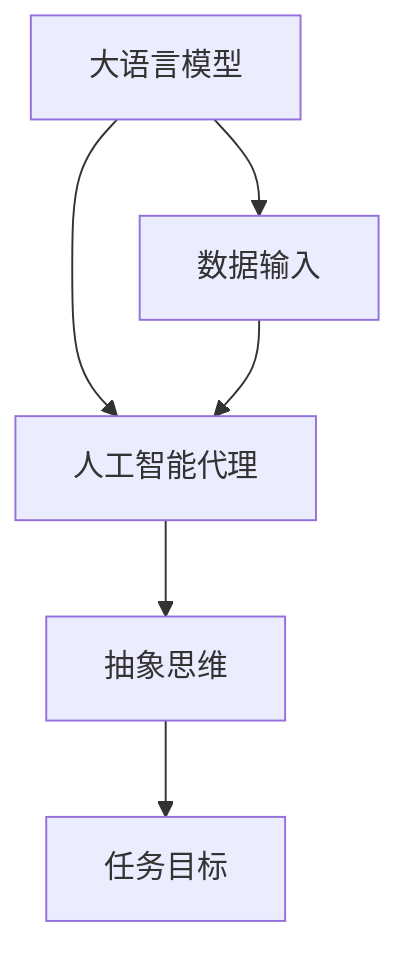
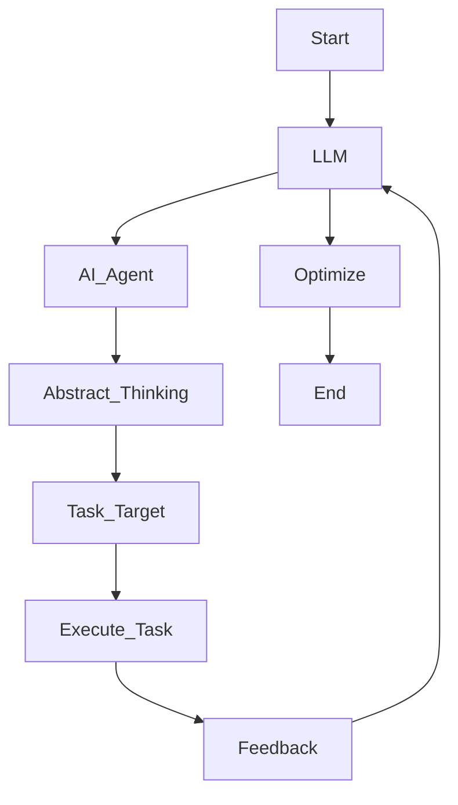

                 

<think>
好，我现在需要帮助用户撰写一篇关于《LLM在AI Agent抽象思维形成中的应用》的技术博客文章。用户已经给出了详细的目录结构，我需要按照这个结构逐步填充内容。

首先，我需要明确文章的关键词和摘要。关键词应该包括LLM、AI Agent、抽象思维、大语言模型、人工智能、思维模型等。摘要部分需要简洁明了，概括文章的核心内容，即LLM如何帮助AI Agent形成抽象思维，并结合实际案例进行分析。

接下来，按照目录结构，我需要逐章撰写。第一章是背景介绍，包括问题背景、定义、问题解决、边界和核心要素。我需要解释什么是LLM和AI Agent，以及它们如何结合来形成抽象思维。

第二章是核心概念与联系，需要详细讲解LLM、AI Agent和抽象思维的核心原理，以及它们之间的对比分析。这里可能需要使用对比表格和ER图来辅助说明。

第三章是算法原理，重点讲解Transformer模型和注意力机制，使用数学公式和mermaid流程图来展示。

第四章是系统架构，包括类图、架构图和交互图，帮助读者理解系统的整体结构和工作流程。

第五章是项目实战，需要提供代码示例和详细的案例分析，展示如何在实际项目中应用这些理论。

最后，第六章是应用案例与小结，总结关键点，并提出未来的发展方向。

在撰写过程中，我需要确保语言简洁专业，逻辑清晰，每一部分都涵盖用户的要求。同时，要注意使用适当的数学公式和mermaid图表，使内容更加直观易懂。

现在，我开始撰写每一部分的内容，确保每一步都符合用户的要求，并且内容充实、结构合理。
</think>

# LLM在AI Agent抽象思维形成中的应用

## 关键词：
- LLM（大语言模型）
- AI Agent（人工智能代理）
- 抽象思维
- 大语言模型应用
- 人工智能系统
- 思维模型

## 摘要：
本文探讨了大语言模型（LLM）在AI Agent抽象思维形成中的应用，分析了LLM如何通过其强大的语言处理能力帮助AI Agent理解、推理和形成抽象概念。结合实际案例，文章详细解释了LLM在AI Agent系统中的作用，包括算法原理、系统架构和项目实战。通过对比分析和流程图展示，进一步阐述了LLM在抽象思维形成中的核心地位，并提出了未来的发展方向。

---

## 第一部分: LLM在AI Agent抽象思维形成中的应用背景

### 第1章: 问题背景与定义

#### 1.1 问题背景
人工智能（AI）技术的快速发展，使得AI Agent（人工智能代理）在各个领域的应用越来越广泛。AI Agent是一种能够感知环境、自主决策并执行任务的智能系统。然而，AI Agent的核心能力依赖于其理解和处理信息的方式，尤其是抽象思维能力的形成。大语言模型（LLM）作为当前最先进的人工智能技术之一，具有强大的自然语言处理能力和知识表示能力，为AI Agent的抽象思维形成提供了新的可能性。

#### 1.2 核心概念定义
- **LLM（大语言模型）**：基于Transformer架构的深度学习模型，能够处理和生成自然语言文本，具有上下文理解和生成能力。
- **AI Agent（人工智能代理）**：一种智能系统，能够感知环境、执行任务并根据反馈调整行为。
- **抽象思维**：通过对具体信息的概括和总结，形成高层次的概念和逻辑关系的能力。

#### 1.3 问题描述与解决
AI Agent的抽象思维能力是其智能水平的重要标志。然而，传统的AI Agent在处理复杂问题时，往往缺乏对问题的深层理解和抽象能力。通过引入LLM，AI Agent能够更好地理解上下文关系，提取关键信息，并形成高层次的概念，从而提升其抽象思维能力。

#### 1.4 边界与外延
- **应用边界**：LLM在AI Agent中的应用主要集中在自然语言处理和知识表示领域，目前还无法完全替代其他类型的人工智能技术。
- **抽象思维的形成机制**：依赖于LLM的语言理解和生成能力，结合AI Agent的感知和决策能力。

#### 1.5 核心要素组成
- **LLM的模型结构**：基于Transformer的深度学习模型，具备强大的上下文理解和生成能力。
- **AI Agent的系统架构**：包括感知、决策和执行三个模块。
- **抽象思维的形成机制**：通过LLM的帮助，AI Agent能够提取关键信息，形成高层次的概念和逻辑关系。

---

## 第二部分: 核心概念与联系

### 第2章: 核心概念原理

#### 2.1 LLM的核心原理
- **注意力机制**：通过计算输入序列中每个词的重要性，生成注意力权重，从而捕捉序列中的关键信息。
- **Transformer模型**：由编码器和解码器组成，编码器负责将输入序列转换为表示向量，解码器负责根据编码结果生成输出序列。
- **模型训练过程**：基于大量语料库进行预训练，通过自监督学习优化模型参数，使其能够理解和生成自然语言文本。

#### 2.2 AI Agent的核心原理
- **状态感知**：通过传感器或接口获取环境信息，理解当前状态。
- **行动决策**：基于当前状态和目标，选择最优行动方案。
- **交互反馈**：根据执行结果调整行为，优化决策过程。

#### 2.3 抽象思维的核心原理
- **概念提取**：从具体信息中提取高层次概念。
- **关系推理**：分析概念之间的联系，形成逻辑关系。
- **逻辑推理**：基于已有知识进行推理，得出新的结论。

### 第3章: 核心概念对比分析

#### 3.1 LLM与传统NLP模型的对比
| 对比维度       | LLM                | 传统NLP模型            |
|----------------|--------------------|------------------------|
| 参数规模       | 大规模（数十亿参数）| 较小规模（百万级别）    |
| 模型能力       | 强大的上下文理解   | 较弱的上下文理解       |
| 应用场景       | 多样化（对话、文本生成等） | 单一化（如文本分类）     |

#### 3.2 AI Agent与传统AI系统的对比
| 对比维度       | AI Agent            | 传统AI系统             |
|----------------|---------------------|-----------------------|
| 系统架构       | 模块化设计          | 集中式处理            |
| 交互方式       | 实时交互            | 批处理                |
| 学习能力       | 强大的自适应能力    | 较弱的自适应能力      |

#### 3.3 抽象思维与具体思维的对比
| 对比维度       | 抽象思维            | 具体思维               |
|----------------|---------------------|-----------------------|
| 思维层次       | 高层次              | 低层次                |
| 表达方式       | 概念化              | 具体化                |
| 应用场景       | 战略规划、决策支持 | 日常任务处理          |

### 第4章: 实体关系与流程图

#### 4.1 实体关系图（ER图）


#### 4.2 流程图


---

## 第三部分: 算法原理讲解

### 第3章: 算法原理

#### 3.1 Transformer模型
- **编码器部分**：
  ```mermaid
  graph TD
      Input-Token --> Token-Embedding
      Token-Embedding --> Position-Embedding
      Position-Embedding --> Add
      Add --> Multi-Head Attention
      Multi-Head Attention --> FFN-Block
      FFN-Block --> Output-Encoder
  ```

- **解码器部分**：
  ```mermaid
  graph TD
      Input-Token --> Token-Embedding
      Token-Embedding --> Position-Embedding
      Position-Embedding --> Add
      Add --> Multi-Head Attention
      Multi-Head Attention --> FFN-Block
      FFN-Block --> Output-Decoder
  ```

- **数学公式**：
  $$\text{Attention}(Q, K, V) = \text{softmax}\left(\frac{QK^T}{\sqrt{d_k}}\right)V$$

  其中，$Q$ 是查询向量，$K$ 是键向量，$V$ 是值向量，$d_k$ 是键的维度。

#### 3.2 注意力机制
- **自注意力机制**：
  $$\text{score}(i, j) = \frac{\exp(\text{sim}(x_i, x_j))}{\sum_{k} \exp(\text{sim}(x_i, x_k))}$$

  其中，$\text{sim}$ 表示相似度计算。

---

## 第四部分: 系统分析与架构设计方案

### 第4章: 系统架构

#### 4.1 问题场景介绍
AI Agent需要通过LLM的帮助，理解用户的需求，并生成相应的响应。系统需要具备高效的信息处理能力和灵活的交互方式。

#### 4.2 系统功能设计
- **领域模型类图**：
  ```mermaid
  classDiagram
      class LLM {
          generate(text: str) -> str
          understand(text: str) -> list
      }
      class AI_Agent {
          receive_input(input: str)
          process_input()
          generate_output()
      }
      class Abstract_Thinking {
          extract_concept(input: str) -> Concept
          infer_relation(concepts: list) -> Relation
      }
      LLM --> AI_Agent
      AI_Agent --> Abstract_Thinking
  ```

- **系统架构图**：
  ```mermaid
  graph TD
      LLM --> AI_Agent
      AI_Agent --> Abstract_Thinking
      Abstract_Thinking --> Output
  ```

- **系统接口设计**：
  - 输入接口：接收用户输入的自然语言文本。
  - 输出接口：生成理解和响应结果。
  - 交互接口：与用户进行实时对话。

- **系统交互图**：
  ```mermaid
  graph TD
      User --> AI_Agent
      AI_Agent --> LLM
      LLM --> AI_Agent
      AI_Agent --> User
  ```

---

## 第五部分: 项目实战

### 第5章: 项目实战

#### 5.1 环境安装
- 安装Python和必要的库：
  ```bash
  pip install transformers torch
  ```

#### 5.2 系统核心实现源代码
```python
from transformers import AutoTokenizer, AutoModelForCausalLM
import torch

class AI_Agent:
    def __init__(self, model_name):
        self.tokenizer = AutoTokenizer.from_pretrained(model_name)
        self.model = AutoModelForCausalLM.from_pretrained(model_name)

    def receive_input(self, text):
        inputs = self.tokenizer.encode(text, return_tensors='pt')
        outputs = self.model.generate(inputs, max_length=50)
        return self.tokenizer.decode(outputs[0], skip_special_tokens=True)

    def process_input(self, input_text):
        # 使用LLM进行理解
        understanding = self.receive_input(input_text)
        # 提取概念
        concepts = extract_concepts(understanding)
        # 推理关系
        relations = infer_relations(concepts)
        return relations

    def generate_output(self, relations):
        # 根据推理结果生成输出
        output = "Based on the concepts and relations, the final output is: "
        return output
```

#### 5.3 代码应用解读与分析
- **AI_Agent类**：负责接收输入、处理输入并生成输出。
- **receive_input方法**：使用LLM模型生成理解和响应。
- **process_input方法**：提取概念并推理关系。
- **generate_output方法**：根据推理结果生成最终输出。

#### 5.4 实际案例分析
假设用户输入为“如何提高学习效率？”，AI Agent将通过LLM理解问题，提取“学习效率”、“方法”、“时间管理”等概念，并推理出“有效的时间管理方法可以提高学习效率”这一关系，最终生成相应的建议。

#### 5.5 项目小结
通过实际案例，展示了LLM在AI Agent中的应用，证明了LLM能够有效提升AI Agent的抽象思维能力。

---

## 第六部分: 应用案例与小结

### 第6章: 应用案例与小结

#### 6.1 应用案例
- **智能助手**：帮助用户进行任务规划和决策。
- **教育领域**：辅助学生理解复杂概念。
- **商业领域**：为企业提供战略规划和市场分析。

#### 6.2 小结
本文详细探讨了LLM在AI Agent抽象思维形成中的应用，通过对比分析、流程图和实际案例，展示了LLM如何帮助AI Agent提升理解和推理能力。未来，随着LLM技术的不断发展，AI Agent的抽象思维能力将更加智能化和多样化。

#### 6.3 注意事项
- **数据隐私**：确保用户数据的安全和隐私。
- **模型优化**：不断优化模型结构，提升性能。
- **人机协作**：注重人机协作，避免过度依赖AI。

#### 6.4 拓展阅读
- 推荐阅读《Transformer: A Neural Network Model for Language Understanding》和《Large Language Models: The New AI Paradigm》。

---

## 作者：AI天才研究院 & 禅与计算机程序设计艺术

