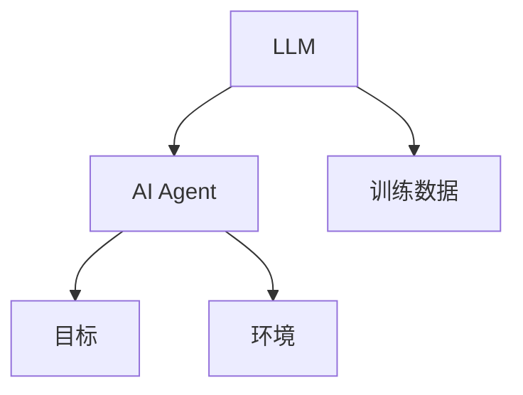

                 

# LLM在AI Agent抽象思维能力上的应用

---

## 关键词：
LLM, AI Agent, 抽象思维, 语言模型, 人工智能, 自然语言处理

---

## 摘要：
本文探讨了大语言模型（LLM）在AI Agent抽象思维能力中的应用。通过分析LLM与AI Agent的结合，展示了如何利用LLM的自然语言处理能力和强大的生成能力，赋予AI Agent更高级的抽象思维能力。文章从背景、核心概念、算法原理、系统架构、项目实战到最佳实践，全面解析了LLM在提升AI Agent抽象思维能力中的关键作用，并通过具体案例展示了实际应用和效果。

---

# 第1章: LLM与AI Agent的基本概念

## 1.1 大语言模型（LLM）的基本概念

### 1.1.1 大语言模型的定义与特点
大语言模型（Large Language Model, LLM）是一种基于深度学习的自然语言处理模型，通常基于Transformer架构。其特点包括：
- **大规模训练数据**：利用海量文本数据进行训练。
- **多任务学习能力**：能够处理多种NLP任务，如文本生成、问答系统、机器翻译等。
- **上下文理解**：通过注意力机制捕捉文本中的上下文信息。
- **生成能力强**：能够生成连贯且合理的文本内容。

### 1.1.2 LLM的核心技术与实现原理
- **Transformer架构**：由Vasweski等人提出，包含编码器和解码器两部分。
- **注意力机制**：通过计算输入序列中每个词与其他词的相关性，生成位置权重。
- **自适应学习**：能够根据输入动态调整模型参数。

### 1.1.3 LLM的应用场景与优势
- **文本生成**：用于内容创作、代码生成等领域。
- **问答系统**：提供智能问答服务。
- **对话系统**：构建智能客服或聊天机器人。

## 1.2 AI Agent的基本概念

### 1.2.1 AI Agent的定义与分类
AI Agent（智能代理）是指能够感知环境并采取行动以实现目标的智能体。分类包括：
- **简单反射型**：基于规则的反应式代理。
- **基于模型的**：通过内部模型规划行动。
- **实用推理型**：基于效用函数进行决策。

### 1.2.2 AI Agent的核心功能与能力
- **感知能力**：通过传感器或API获取环境信息。
- **推理能力**：基于感知信息进行逻辑推理。
- **行动能力**：执行动作以影响环境或与用户交互。

### 1.2.3 AI Agent的应用领域与发展趋势
- **智能家居**：如智能音箱、家庭助手。
- **智能客服**：用于自动化客户支持。
- **机器人控制**：实现复杂环境下的自主决策。

## 1.3 LLM与AI Agent的结合

### 1.3.1 LLM在AI Agent中的作用
- **自然语言理解**：帮助AI Agent理解用户输入。
- **文本生成**：用于自然的对话交互。
- **知识推理**：通过LLM的知识库辅助推理。

### 1.3.2 LLM如何提升AI Agent的抽象思维能力
- **上下文理解**：通过LLM的上下文理解能力，AI Agent能够更好地理解用户的意图。
- **知识整合**：LLM的知识库支持AI Agent进行跨领域的知识整合。
- **推理能力**：LLM的推理能力使AI Agent能够进行复杂的逻辑推理。

### 1.3.3 典型应用案例
- **智能问答系统**：通过LLM提供准确的知识回答。
- **对话生成**：实现更自然的对话交互。
- **任务规划**：基于LLM的推理能力进行复杂任务的规划与执行。

---

# 第2章: LLM在AI Agent抽象思维中的应用背景

## 2.1 当前AI Agent的发展现状

### 2.1.1 AI Agent的演进历程
从简单的规则驱动到基于模型的规划，再到当前的深度学习驱动，AI Agent的技术不断进步。

### 2.1.2 当前AI Agent的核心挑战
- **理解能力不足**：难以准确理解用户的意图。
- **推理能力有限**：缺乏深层次的逻辑推理能力。
- **动态环境适应性**：难以在复杂多变的环境中灵活应对。

### 2.1.3 LLM技术对AI Agent的推动作用
- **提升理解能力**：通过LLM的强大语言理解能力，AI Agent能够更准确地理解用户需求。
- **增强推理能力**：利用LLM的推理能力，AI Agent可以进行更复杂的逻辑推理。
- **扩展适应性**：通过LLM的可扩展性，AI Agent能够更好地适应不同的应用场景。

## 2.2 抽象思维能力的重要性

### 2.2.1 抽象思维的定义与特征
抽象思维是指从具体事物中提炼出一般性概念的能力，具有概括性、间接性和逻辑性。

### 2.2.2 抽象思维在AI Agent中的应用价值
- **提高决策质量**：通过抽象思维，AI Agent能够从大量数据中提取关键信息，做出更优决策。
- **增强泛化能力**：抽象思维使AI Agent能够更好地处理未见过的场景。
- **提升用户体验**：通过抽象理解用户需求，提供更个性化的服务。

### 2.2.3 提升AI Agent抽象思维能力的必要性
- **应对复杂任务**：复杂任务需要更高层次的思维能力。
- **实现通用人工智能**：抽象思维是迈向通用人工智能的重要一步。
- **适应多样场景**：不同场景下，抽象思维能力能够帮助AI Agent更好地适应变化。

## 2.3 LLM在抽象思维中的优势

### 2.3.1 LLM的语言理解能力
- **上下文理解**：通过注意力机制，LLM能够捕捉文本中的上下文信息。
- **多语言支持**：支持多种语言的文本理解和生成。

### 2.3.2 LLM的推理与生成能力
- **推理能力**：LLM通过大规模训练，具备一定的逻辑推理能力。
- **生成能力**：能够生成连贯、合理的文本内容，支持多样化的表达方式。

### 2.3.3 LLM的可扩展性与适应性
- **可扩展性**：通过微调或提示工程技术，LLM可以适应不同的应用场景。
- **适应性**：能够快速适应新的任务和数据，保持较高的灵活性。

---

# 第3章: LLM与AI Agent的核心概念与联系

## 3.1 LLM与AI Agent的核心概念对比

### 3.1.1 LLM的输入输出机制
- **输入**：文本或结构化数据。
- **输出**：生成文本或其他形式的输出。

### 3.1.2 AI Agent的目标驱动特性
- **目标**：通过感知和行动实现特定目标。
- **驱动**：基于目标进行决策和行动。

### 3.1.3 两者在抽象思维中的协同作用
- **协同作用**：LLM提供强大的语言理解和生成能力，AI Agent提供目标导向的行动能力，两者结合实现更高级的抽象思维。

## 3.2 LLM与AI Agent的实体关系图

---

通过以上章节的分析，我们可以看到，LLM与AI Agent的结合为提升AI Agent的抽象思维能力提供了强大的技术支持。接下来的章节将深入探讨算法原理、系统架构以及实际应用案例，帮助读者更好地理解和应用这一技术。

