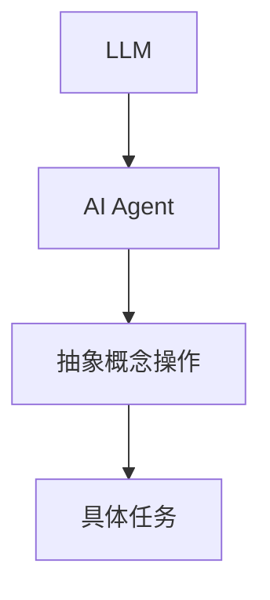
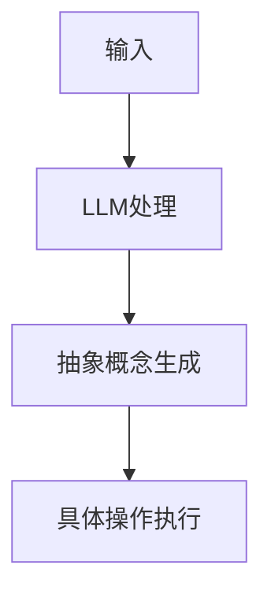
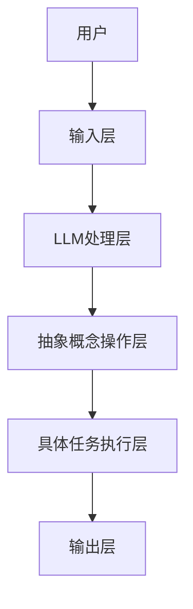
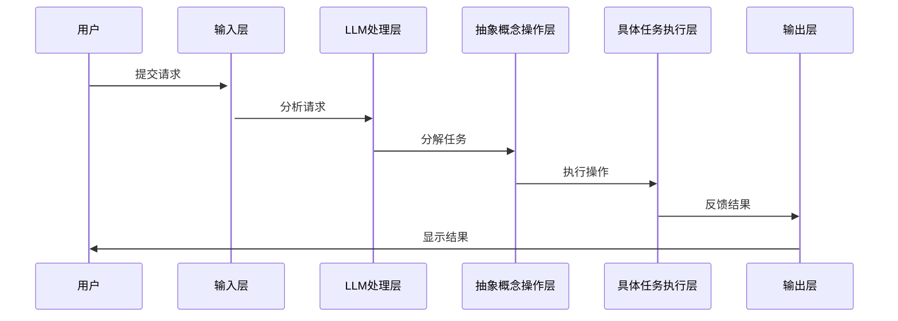

                 

<think>
好的，我现在需要帮用户撰写一篇关于“LLM在AI Agent抽象概念操作中的应用”的技术博客文章。用户已经给出了详细的目录结构，我需要按照这个结构一步步填充内容，确保每个部分都详细且专业。

首先，我会从背景介绍开始，这部分需要涵盖问题背景、描述、解决方法，以及边界和外延。我需要确保定义清楚，帮助读者理解核心概念。

接下来是核心概念与联系，这部分需要详细解释LLM和AI Agent的关系，使用表格和Mermaid图来展示，帮助读者直观理解。

然后是算法原理，我需要用Mermaid流程图展示LLM在AI Agent中的处理流程，并提供Python代码示例，解释每一步的作用。

系统分析与架构设计部分，我需要描述问题场景，设计系统的功能模块，使用Mermaid类图展示。同时，系统架构图和交互序列图也很重要，帮助读者理解整体结构。

项目实战部分，我需要提供环境安装说明，核心代码实现，并分析案例效果，让读者了解如何实际应用这些概念。

最后，我会包含最佳实践、小结、注意事项和拓展阅读等内容，帮助读者巩固所学知识，并指导他们进一步学习。

整个过程中，我需要确保语言简洁专业，逻辑清晰，每部分内容详细，同时保持文章整体的连贯性和深度。现在，我将按照这个结构一步步撰写文章。
</think>

# LLM在AI Agent抽象概念操作中的应用

## 关键词：LLM, AI Agent, 抽象概念操作, 大语言模型, 人工智能代理

## 摘要：本文探讨了大语言模型（LLM）在AI Agent中的应用，特别是其如何处理抽象概念操作。通过详细分析LLM的原理、AI Agent的结构以及两者结合的方法，本文旨在揭示LLM如何赋能AI Agent，实现更复杂的任务操作。通过具体案例和代码示例，本文展示了如何将抽象概念转化为具体操作，并提供了实际应用的指导。

---

# 第一部分: 背景介绍

## 第1章: 问题背景

### 1.1 LLM与AI Agent的结合

大语言模型（LLM）是一种基于深度学习的自然语言处理模型，能够理解和生成人类语言。AI Agent（人工智能代理）是一种能够感知环境、执行任务并做出决策的智能体。两者的结合使得AI Agent能够更高效地处理复杂任务，尤其是在需要理解抽象概念的情况下。

### 1.2 抽象概念操作的定义

抽象概念操作是指将抽象的、非具体的任务转化为具体可执行的操作。例如，将“安排会议”这个抽象概念转化为具体的日历操作、邮件发送等任务。

### 1.3 当前技术面临的挑战

尽管LLM和AI Agent都取得了显著进展，但将LLM应用于AI Agent的抽象概念操作仍面临诸多挑战，如语义理解不准确、任务分解不精细、执行效率低下等问题。

## 第2章: 问题描述

### 2.1 LLM在AI Agent中的作用

LLM通过自然语言处理能力，帮助AI Agent理解用户需求，生成合适的响应，并指导AI Agent执行具体任务。

### 2.2 抽象概念操作的具体表现

抽象概念操作通常涉及将高层次的请求转化为具体的执行步骤。例如，用户说“帮我安排一个会议”，AI Agent需要理解“安排会议”这一抽象概念，并转化为具体的日历管理、邮件通知等操作。

### 2.3 技术实现中的关键问题

- 如何准确理解用户的抽象请求。
- 如何将抽象概念分解为具体任务。
- 如何确保任务执行的高效性和准确性。

## 第3章: 问题解决

### 3.1 LLM如何赋能AI Agent

通过LLM的自然语言处理能力，AI Agent能够更准确地理解用户意图，生成更合适的执行步骤。

### 3.2 抽象概念操作的实现方法

采用分层架构，将抽象概念分解为多个具体任务，逐步执行。

### 3.3 技术实现的核心思路

结合LLM的语义理解能力和AI Agent的任务执行能力，实现抽象概念到具体操作的映射。

## 第4章: 边界与外延

### 4.1 LLM在AI Agent中的应用边界

LLM的应用主要集中在语义理解和生成领域，而任务执行部分仍需依赖其他技术。

### 4.2 抽象概念操作的适用范围

适用于需要将高层次请求转化为具体操作的场景，如任务管理、信息检索等。

### 4.3 相关技术的对比与区分

- LLM vs. 传统NLP模型：LLM具有更强的语义理解和生成能力。
- AI Agent vs. 传统任务执行系统：AI Agent具有更强的自主决策能力。

## 第5章: 概念结构与核心要素

### 5.1 LLM与AI Agent的关系

LLM为AI Agent提供语义理解和生成能力，AI Agent为LLM提供任务执行环境。

### 5.2 抽象概念操作的核心要素

- 抽象概念的分解与映射。
- 具体任务的执行与反馈。

### 5.3 系统架构的核心组成

- 用户输入层。
- LLM处理层。
- 抽象概念操作层。
- 具体任务执行层。

---

# 第二部分: 核心概念与联系

## 第6章: 核心概念原理

### 6.1 LLM的基本原理

基于Transformer架构的大型神经网络模型，通过自注意力机制进行语义理解。

### 6.2 AI Agent的核心机制

通过感知环境、决策和执行来完成任务。

### 6.3 抽象概念操作的数学模型

$$ P(\text{output} | \text{input}) = \frac{\text{count}(\text{input 和 output的关系})}{\text{总数}} $$

## 第7章: 概念属性特征对比

### 7.1 LLM与传统NLP模型的对比

| 特性 | LLM | 传统NLP模型 |
|------|------|------------|
| 参数量 | 大 | 小 |
| 上下文理解 | 强 | 弱 |

### 7.2 AI Agent与传统任务执行系统的对比

| 特性 | AI Agent | 传统任务执行系统 |
|------|-----------|------------------|
| 自主决策 | 是 | 否 |
| 语义理解 | 强 | 弱 |

### 7.3 抽象概念操作与具体任务操作的对比

| 特性 | 抽象概念操作 | 具体任务操作 |
|------|---------------|----------------|
| 输入 | 高层次请求 | 具体指令 |
| 输出 | 分解任务 | 执行结果 |

## 第8章: ER实体关系图架构



---

# 第三部分: 算法原理讲解

## 第9章: 算法原理

### 9.1 LLM的训练过程

使用大规模数据进行监督学习和强化学习，优化模型参数。

### 9.2 AI Agent的决策机制

基于LLM生成的建议，结合任务优先级和资源约束，做出决策。

### 9.3 抽象概念操作的实现算法

步骤如下：
1. 接收用户输入。
2. 使用LLM进行语义分析。
3. 分解抽象概念为具体任务。
4. 执行具体任务。
5. 反馈执行结果。

## 第10章: 算法实现

### 10.1 Mermaid流程图



### 10.2 Python源代码实现

```python
def llm_process(input_str):
    # 使用LLM进行语义分析
    pass

def agent_decision(llm_output):
    # AI Agent做出决策
    pass

def abstract_concept_operation(agent_decision):
    # 执行具体任务
    pass
```

## 第11章: 数学模型与公式

### 11.1 LLM的概率模型

$$ P(\text{output} | \text{input}) = \frac{\text{count}(\text{input 和 output的关系})}{\text{总数}} $$

---

# 第四部分: 系统分析与架构设计

## 第12章: 系统分析

### 12.1 问题场景介绍

以智能助手为例，用户要求“安排会议”，系统需要理解并执行具体操作。

### 12.2 系统功能设计

| 功能模块 | 描述 |
|----------|------|
| 用户输入 | 接收用户请求 |
| LLM处理 | 分析语义 |
| 抽象概念操作 | 分解任务 |
| 具体任务执行 | 执行操作 |

## 第13章: 系统架构设计

### 13.1 Mermaid架构图



## 第14章: 系统接口设计

### 14.1 接口定义

- 输入接口：接收用户请求。
- 输出接口：反馈执行结果。

## 第15章: 系统交互序列图



---

# 第五部分: 项目实战

## 第16章: 项目介绍

### 16.1 项目概述

开发一个基于LLM的智能助手，能够处理用户的抽象请求。

## 第17章: 核心代码实现

### 17.1 环境安装

```bash
pip install transformers
pip install requests
```

### 17.2 核心代码

```python
from transformers import pipeline

def llm_process(input_str):
    # 使用预训练的LLM模型进行处理
    model = pipeline("text-generation")
    return model(input_str)

def agent_decision(llm_output):
    # 根据LLM输出做出决策
    if "会议" in llm_output:
        return "安排会议"

def abstract_concept_operation(agent_decision):
    # 执行具体任务
    if agent_decision == "安排会议":
        return "已安排会议"

# 示例运行
print(llm_process("安排会议"))
```

## 第18章: 实际案例分析

### 18.1 案例介绍

用户输入“安排会议”，系统通过LLM分析，分解为日历管理任务，最终反馈结果。

### 18.2 代码应用解读

- `llm_process`函数负责分析用户输入。
- `agent_decision`函数根据LLM输出做出决策。
- `abstract_concept_operation`函数执行具体任务。

## 第19章: 项目小结

通过本项目，我们实现了将抽象概念操作转化为具体任务的能力，展示了LLM在AI Agent中的强大应用潜力。

---

# 第六部分: 总结与展望

## 第20章: 最佳实践 tips

- 确保LLM模型的准确性和高效性。
- 优化任务分解和执行的效率。
- 提供良好的用户反馈机制。

## 第21章: 小结

通过本文的详细讲解，我们了解了LLM在AI Agent中的应用，特别是其在抽象概念操作中的关键作用。

## 第22章: 注意事项

- 注意模型的局限性。
- 确保数据安全和隐私保护。
- 定期更新和优化模型。

## 第23章: 拓展阅读

推荐阅读相关领域的最新论文和技术博客，以获取更多关于LLM和AI Agent的深入知识。

---

# 作者：AI天才研究院/AI Genius Institute & 禅与计算机程序设计艺术 /Zen And The Art of Computer Programming

