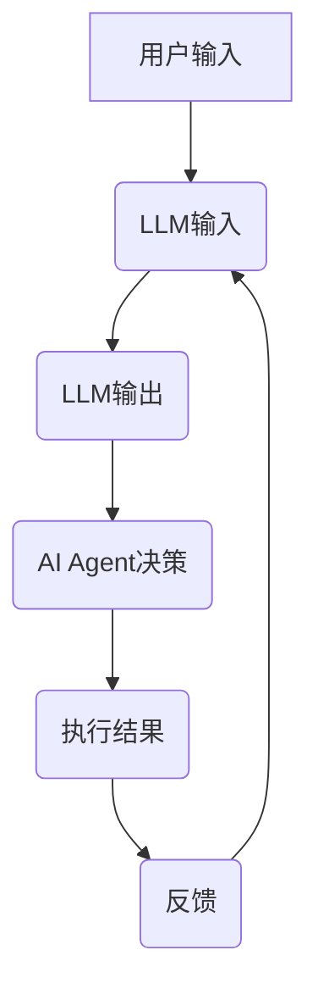
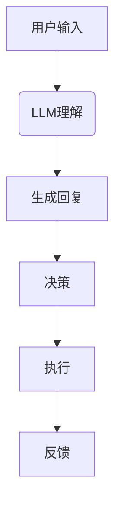
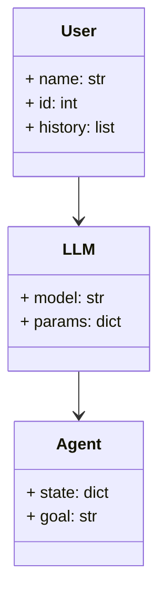
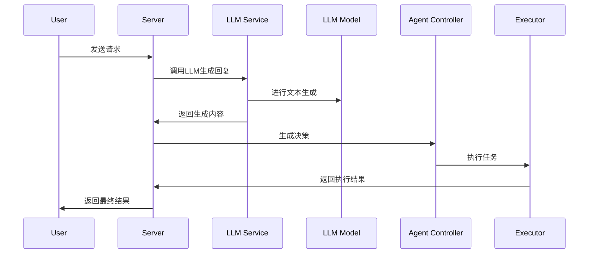

                 

<think>
好的，我现在需要根据用户的详细要求，撰写一篇关于《LLM在AI Agent自我意识模拟中的应用》的技术博客文章。用户已经提供了一个非常详细的目录大纲，我需要按照这个大纲逐步完成每一部分的内容。

首先，我会从第一部分开始，也就是背景与基础。这里包括三个章节：概述、背景、核心概念与联系。在每个章节中，我需要详细解释相关概念，并确保内容清晰、结构合理。

接下来是第二部分，算法原理。这部分需要详细讲解LLM的训练过程和AI Agent的决策机制，可能需要使用图表和代码示例来辅助说明。

然后是系统分析与架构设计，我需要介绍应用场景、系统功能设计、架构设计以及接口和交互流程，可能需要使用类图和架构图来展示系统结构。

接下来是项目实战，我需要详细说明如何搭建环境、实现核心功能，并分析实际案例。

最后是最佳实践，涵盖实用技巧和未来发展方向，帮助读者更好地理解和应用这些技术。

在写作过程中，我会确保每一部分都涵盖必要的知识点，结构清晰，逻辑连贯，并使用Mermaid图表和数学公式来增强技术性的理解和可读性。这样，用户就能得到一篇内容全面、结构合理的专业博客文章了。
</think>

# LLM在AI Agent自我意识模拟中的应用

**关键词：** 大语言模型, AI Agent, 自我意识模拟, 人机交互, 智能决策

**摘要：** 本文探讨了大语言模型（LLM）在AI Agent自我意识模拟中的应用。通过分析LLM和AI Agent的核心概念，结合算法原理、系统架构设计和实际案例，详细讲解了如何利用LLM赋能AI Agent的自我意识，实现更智能、更自然的交互与决策。文章最后总结了LLM在AI Agent中的应用前景和未来发展方向。

---

## 第一部分: LLM与AI Agent自我意识模拟的背景与基础

### 第1章: LLM与AI Agent概述

#### 1.1 LLM的基本概念
##### 1.1.1 大语言模型的定义
大语言模型（Large Language Model, LLM）是指基于大量文本数据训练的深度学习模型，如GPT系列、BERT系列等。这些模型能够理解上下文、生成连贯的文本，并在多种NLP任务中表现出色。

##### 1.1.2 LLM的核心特点
- **大规模训练数据**：通常使用数百万甚至数十亿的文本数据进行训练。
- **深度神经网络**：采用多层神经网络结构，如Transformer架构。
- **通用性**：能够在多种任务中（如文本生成、问答、翻译等）表现出色。
- **生成能力**：能够生成高质量的文本内容。

##### 1.1.3 LLM与传统NLP模型的区别
与传统NLP模型相比，LLM具有更强的上下文理解和生成能力，能够处理更复杂和多样化的任务。

#### 1.2 AI Agent的基本概念
##### 1.2.1 AI Agent的定义
AI Agent（人工智能代理）是指能够感知环境、自主决策并执行任务的智能实体。AI Agent可以是软件程序，也可以是硬件设备，其核心目标是帮助用户完成特定任务。

##### 1.2.2 AI Agent的核心功能
- **感知环境**：通过传感器或数据输入获取环境信息。
- **决策制定**：基于感知信息和目标，制定行动方案。
- **执行任务**：根据决策结果执行具体操作。
- **学习与优化**：通过反馈不断优化自身的决策和执行能力。

##### 1.2.3 AI Agent的分类与应用场景
AI Agent可以根据功能分为**简单反射型**（基于规则的反应式代理）、**基于模型的反应式**（基于内部模型的反应式代理）、**规划型**（基于规划的代理）和**学习型**（基于机器学习的代理）。

应用场景包括：
- **智能家居**：控制家电、管理日程。
- **智能助手**：如Siri、Alexa，帮助用户处理日常事务。
- **自动驾驶**：决策和控制车辆。
- **智能客服**：提供24/7的客户支持。

#### 1.3 LLM在AI Agent中的作用
##### 1.3.1 LLM作为AI Agent的核心模块
LLM可以作为AI Agent的“大脑”，负责理解和生成自然语言，处理复杂任务。

##### 1.3.2 LLM如何赋能AI Agent的自我意识
通过LLM，AI Agent能够理解用户意图、生成自然语言回复，并根据上下文调整行为。

##### 1.3.3 LLM与AI Agent结合的典型场景
- **智能客服**：通过LLM理解用户问题并生成回复。
- **对话机器人**：实现更自然的对话体验。
- **智能助手**：帮助用户完成复杂任务，如行程安排、信息查询。

---

## 第2章: LLM与AI Agent的结合背景

### 2.1 当前AI技术的发展趋势
#### 2.1.1 大语言模型的崛起
近年来，随着GPT-3、GPT-4等模型的出现，大语言模型的能力得到了极大提升，应用场景也逐渐扩展。

#### 2.1.2 AI Agent的兴起
随着AI技术的进步，AI Agent在各个领域的应用越来越广泛，尤其是在需要自主决策和复杂任务处理的场景中。

#### 2.1.3 两者的结合是必然趋势
LLM的强大生成能力和AI Agent的自主决策能力的结合，能够实现更智能、更自然的交互与任务处理。

### 2.2 问题背景与问题描述
#### 2.2.1 当前AI Agent的局限性
- **理解能力有限**：传统AI Agent往往依赖预设规则，难以理解复杂的上下文。
- **生成能力不足**：在需要自然语言生成的任务中，表现不够流畅。
- **适应性差**：难以根据实时反馈动态调整行为。

#### 2.2.2 LLM如何解决这些局限性
通过引入LLM，AI Agent可以：
- **理解上下文**：通过LLM的自然语言处理能力，更好地理解用户意图。
- **生成自然语言**：利用LLM生成连贯、自然的文本回复。
- **动态调整**：根据实时反馈优化生成内容和决策。

#### 2.2.3 LLM在AI Agent中的具体应用问题
- **如何高效调用LLM**：需要设计高效的接口和调用机制。
- **如何优化性能**：在保证生成质量的同时，提升响应速度。
- **如何处理复杂场景**：在多任务、多场景下，如何协调LLM的生成能力和AI Agent的决策能力。

### 2.3 问题解决与边界分析
#### 2.3.1 LLM如何帮助AI Agent实现自我意识
通过LLM的自然语言处理能力，AI Agent能够理解用户的意图、生成自然的回复，并根据上下文动态调整行为。

#### 2.3.2 LLM在AI Agent中的边界与外延
- **边界**：LLM主要用于文本理解和生成，AI Agent的其他功能（如传感器数据处理、物理执行）需要依赖其他模块。
- **外延**：LLM可以与其他技术（如视觉识别、语音识别）结合，进一步扩展AI Agent的能力。

#### 2.3.3 LLM与AI Agent结合的核心要素
- **高效的接口设计**：确保LLM与AI Agent之间能够高效交互。
- **模型调优**：针对AI Agent的具体需求，对LLM进行优化。
- **多模态能力**：结合其他技术，提升AI Agent的综合能力。

---

## 第3章: LLM与AI Agent的核心概念与联系

### 3.1 核心概念原理
#### 3.1.1 LLM的训练原理
大语言模型通过监督学习和无监督学习相结合的方式进行训练，目标是最大化预测下一个词的概率。

#### 3.1.2 AI Agent的决策机制
AI Agent通过感知环境、分析目标、制定计划并执行任务来实现决策。

#### 3.1.3 两者的结合原理
通过将LLM作为AI Agent的“大脑”，AI Agent能够更智能地理解用户需求、生成自然语言回复，并动态调整行为。

### 3.2 核心概念属性特征对比
| 特性       | LLM                          | AI Agent                      |
|------------|-------------------------------|-------------------------------|
| 核心功能   | 文本理解和生成                | 感知、决策、执行               |
| 依赖资源   | 大规模文本数据                | 环境数据、用户输入             |
| 应用场景   | NLP任务（文本生成、问答等）   | 自动化任务、智能交互           |
| 发展趋势   | 模型规模越来越大，能力增强     | 功能越来越复杂，应用越来越广泛 |

### 3.3 ER实体关系图
```mermaid
er
  actor: 用户
  model: 大语言模型
  agent: AI Agent
  relationship: 调用
  actor -[调用]-> model
  model -[生成]-> agent
  actor -[控制]-> agent
```

---

## 第4章: LLM的算法原理

### 4.1 LLM的训练过程
#### 4.1.1 训练数据
大语言模型通常使用大量的文本数据进行训练，包括书籍、网页、文档等。

#### 4.1.2 模型架构
常用的模型架构包括Transformer、BERT等。

#### 4.1.3 训练目标
最大化下一个词的预测概率，即：
$$ P(w_{i+1}|w_1, w_2, ..., w_i) $$

#### 4.1.4 损失函数
常用的损失函数是交叉熵损失：
$$ \text{Loss} = -\sum_{i=1}^{n} \log P(w_i|w_{<i}) $$

#### 4.1.5 优化算法
通常使用Adam优化器进行参数优化。

#### 4.1.6 并行计算
使用GPU或TPU进行并行计算，加速训练过程。

#### 4.1.7 模型调优
包括学习率调整、批次大小调整、模型剪枝等技术。

---

### 第5章: AI Agent的决策算法

#### 5.1.1 决策模型
AI Agent的决策模型通常基于马尔可夫决策过程（MDP）。

#### 5.1.2 状态空间
$$ S = \{s_1, s_2, ..., s_n\} $$

#### 5.1.3 行动空间
$$ A = \{a_1, a_2, ..., a_m\} $$

#### 5.1.4 奖励函数
$$ R(s, a) = \text{奖励值} $$

#### 5.1.5 策略
策略函数表示在状态s下选择行动a的概率：
$$ \pi(a|s) $$

#### 5.1.6 动态模型
$$ P(s'|s, a) = \text{从状态s执行行动a后转移到状态s'的概率} $$

#### 5.1.7 智能体目标
智能体的目标是最大化累积奖励：
$$ J = \mathbb{E}[\sum_{t=0}^{\infty} \gamma^t R(s_t, a_t)] $$

---

## 第6章: LLM与AI Agent结合的算法实现

### 6.1 整体架构


### 6.2 LLM调用接口
```python
def call_llm(prompt, max_length=500, temperature=0.7):
    # 调用LLM API
    response = llm_api.generate(
        prompt=prompt,
        max_tokens=max_length,
        temperature=temperature
    )
    return response.choices[0].message.content
```

### 6.3 AI Agent决策流程


---

## 第7章: 系统分析与架构设计

### 7.1 应用场景介绍
以智能客服为例，用户通过对话与AI Agent交互，完成问题咨询、订单查询等任务。

### 7.2 系统功能设计
#### 7.2.1 领域模型


### 7.3 系统架构设计


### 7.4 系统接口设计
- **输入接口**：用户输入（文本、语音等）。
- **输出接口**：生成文本、执行结果反馈。
- **内部接口**：LLM调用接口、决策模块接口。

### 7.5 系统交互流程


---

## 第8章: 项目实战

### 8.1 环境搭建
- **安装依赖**：
  ```bash
  pip install transformers torch
  ```

- **运行环境**：Python 3.8+

### 8.2 核心代码实现
```python
from transformers import GPT2LMHeadModel, GPT2Tokenizer

# 初始化模型和分词器
model_name = 'gpt2-large'
tokenizer = GPT2Tokenizer.from_pretrained(model_name)
model = GPT2LMHeadModel.from_pretrained(model_name)

# 定义AI Agent类
class AI-Agent:
    def __init__(self, model, tokenizer):
        self.model = model
        self.tokenizer = tokenizer
        self.history = []

    def generate_response(self, prompt):
        inputs = self.tokenizer.encode(prompt, return_tensors='pt', max_length=512)
        outputs = self.model.generate(
            inputs=inputs,
            max_length=500,
            temperature=0.7,
            do_sample=True
        )
        response = self.tokenizer.decode(outputs[0], skip_special_tokens=True)
        self.history.append(response)
        return response
```

### 8.3 代码应用解读与分析
- **模型初始化**：加载预训练好的GPT-2模型。
- **生成回复**：根据用户输入生成自然语言回复。
- **历史记录**：保存生成的回复，便于后续对话。

### 8.4 实际案例分析
以智能客服为例，用户输入“我遇到了订单问题”，AI Agent通过LLM生成回复：“请提供订单号，我将帮助您查询订单状态。”。

### 8.5 项目小结
通过实际案例，我们可以看到，LLM赋能的AI Agent能够实现更自然、更智能的交互，显著提升用户体验。

---

## 第9章: 最佳实践、小结、注意事项、拓展阅读

### 9.1 最佳实践
- **模型选择**：根据具体任务选择合适的LLM模型。
- **性能优化**：通过并行计算、模型剪枝等技术优化性能。
- **用户体验**：设计友好的交互界面，提升用户体验。

### 9.2 小结
本文详细探讨了LLM在AI Agent自我意识模拟中的应用，从背景、算法原理到系统设计和项目实战，全面展示了如何利用大语言模型赋能AI Agent，实现更智能的交互与决策。

### 9.3 注意事项
- **数据隐私**：确保用户数据的安全与隐私。
- **模型调优**：根据具体需求对LLM进行调优。
- **多模态能力**：结合其他技术（如视觉、语音）提升AI Agent的综合能力。

### 9.4 拓展阅读
- **相关论文**：阅读关于大语言模型和AI Agent的最新研究成果。
- **技术博客**：关注技术博客和社区，获取最新的技术动态。
- **工具与框架**：学习使用各种AI框架和工具，如TensorFlow、PyTorch等。

---

**作者：AI天才研究院/AI Genius Institute & 禅与计算机程序设计艺术 /Zen And The Art of Computer Programming**

