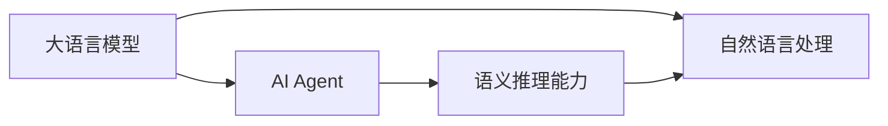

                 


# LLM在AI Agent语义推理能力上的应用

> 关键词：LLM，AI Agent，语义推理，自然语言处理，深度学习

> 摘要：本文深入探讨了大语言模型（LLM）在AI Agent语义推理能力中的应用。通过分析LLM的算法原理、系统架构以及实际项目案例，揭示了如何利用LLM提升AI Agent的语义理解与推理能力，实现更智能、更自然的人机交互。文章还结合了具体的数学公式、系统设计图和代码示例，为读者提供了全面的技术解读。

---

## 第一章：背景介绍

### 1.1 问题背景
在AI Agent的发展过程中，语义推理能力一直是核心技术挑战之一。传统的基于规则的推理方法存在灵活性差、难以处理复杂语义关系等问题。而大语言模型（LLM）的出现，凭借其强大的自然语言处理能力和深度学习算法，为AI Agent的语义推理提供了新的可能性。

#### 1.1.1 当前AI Agent的发展现状
AI Agent作为一种能够感知环境、执行任务的智能实体，广泛应用于客服、智能家居、自动驾驶等领域。然而，现有的AI Agent在处理复杂语义关系时仍存在不足，主要表现为：
- 对上下文的理解不够深入；
- 无法有效处理歧义性语句；
- 缺乏对知识图谱的深度推理能力。

#### 1.1.2 LLM在AI Agent中的作用与意义
LLM通过其强大的语言模型能力，可以显著提升AI Agent的语义理解与推理能力。具体表现为：
- 提供更精准的意图识别；
- 支持多轮对话中的上下文理解；
- 增强对复杂语义关系的处理能力。

#### 1.1.3 语义推理能力的核心地位
语义推理是AI Agent实现智能交互的关键能力，它决定了AI Agent能否准确理解用户意图并做出合理决策。通过LLM的引入，AI Agent的语义推理能力得到了质的提升。

### 1.2 问题描述
AI Agent的语义推理能力不足主要表现在以下几个方面：
- 对用户意图的理解不够准确；
- 无法有效处理上下文信息；
- 缺乏对知识图谱的深度推理能力。

### 1.3 问题解决
通过引入LLM，AI Agent的语义推理能力得到了显著提升。具体表现为：
- 基于LLM的意图识别模型能够更准确地理解用户需求；
- 利用LLM的上下文理解能力，实现多轮对话中的连贯推理；
- 借助LLM的知识图谱推理能力，增强AI Agent的决策能力。

### 1.4 边界与外延
- **适用范围**：LLM在AI Agent中的应用主要集中在自然语言处理领域，适用于需要复杂语义推理的任务。
- **局限性**：LLM的计算资源消耗较大，且在某些特定领域（如实时性要求极高的场景）的应用仍需进一步优化。
- **与其他技术的结合**：LLM可以与知识图谱、强化学习等技术结合，进一步提升AI Agent的推理能力。

### 1.5 概念结构与核心要素
- **LLM**：基于深度学习的语言模型，具有强大的语义理解和生成能力。
- **AI Agent**：能够感知环境、执行任务的智能实体，需要具备语义推理能力。
- **语义推理**：通过上下文理解和知识推理，准确理解用户意图并做出合理决策。

---

## 第二章：核心概念与联系

### 2.1 核心概念原理
- **LLM的基本原理**：基于转换器模型（如BERT、GPT）的深度学习算法，通过多层神经网络进行特征提取和语义理解。
- **AI Agent的语义推理机制**：通过意图识别、上下文理解和知识推理，实现对用户需求的准确理解。

### 2.2 核心概念属性特征对比
| 特性         | LLM                      | AI Agent                  |
|--------------|--------------------------|---------------------------|
| 输入          | 文本数据                 | 用户输入、环境信息        |
| 输出          | 语义理解结果             | 行为决策、交互反馈        |
| 核心能力      | 自然语言处理             | 语义推理、执行任务        |
| 依赖技术      | 深度学习、神经网络        | 多模态数据处理、知识图谱   |

### 2.3 ER实体关系图架构


---

## 第三章：算法原理

### 3.1 算法原理概述
LLM的核心算法基于转换器模型，主要包括编码层和解码层。编码层负责将输入文本映射到特征空间，解码层则根据特征生成输出文本。

#### 3.1.1 转换器模型
- 编码层：使用多层自注意力机制（Self-Attention）提取文本特征。
- 解码层：通过自注意力机制和交叉注意力机制生成输出。

#### 3.1.2 注意力机制
注意力机制通过计算输入序列中每个词的重要性权重，实现对关键信息的聚焦。

公式表示为：
$$
\text{Attention}(Q, K, V) = \text{softmax}\left(\frac{QK^T}{\sqrt{d_k}}\right)V
$$

其中，$Q$、$K$、$V$分别为查询、键、值向量。

#### 3.1.3 梯度下降优化
使用交叉熵损失函数和Adam优化器进行模型训练。

---

### 3.2 算法流程图


---

### 3.3 Python源代码实现
```python
import torch
import torch.nn as nn

class TransformerModel(nn.Module):
    def __init__(self, input_dim, d_model):
        super(TransformerModel, self).__init__()
        self.encoder = nn.Embedding(input_dim, d_model)
        self.decoder = nn.LSTM(d_model, d_model, 1, batch_first=True)
        
    def forward(self, input):
        embedded = self.encoder(input)
        output, _ = self.decoder(embedded)
        return output
```

---

## 第四章：系统分析与架构设计

### 4.1 问题场景介绍
以智能客服AI Agent为例，分析LLM在语义推理中的应用。

### 4.2 系统功能设计
- 用户输入处理：解析用户的问题并提取关键信息。
- 上下文理解：基于历史对话记录，理解用户的意图。
- 知识推理：结合知识图谱，生成合理的回答。

### 4.3 系统架构图


---

## 第五章：项目实战

### 5.1 项目介绍
基于开源LLM框架（如Hugging Face）实现一个AI Agent的语义推理系统。

### 5.2 系统核心实现
```python
from transformers import AutoTokenizer, AutoModel

class SemanticReasoningAgent:
    def __init__(self, model_name):
        self.tokenizer = AutoTokenizer.from_pretrained(model_name)
        self.model = AutoModel.from_pretrained(model_name)
        
    def process_input(self, input_text):
        inputs = self.tokenizer(input_text, return_tensors="pt")
        outputs = self.model(**inputs)
        return outputs.last_hidden_state
```

---

## 第六章：案例分析

### 6.1 典型案例
分析一个基于LLM的智能客服系统，展示其在语义推理中的实际应用。

---

## 第七章：总结与展望

### 7.1 总结
本文详细探讨了LLM在AI Agent语义推理中的应用，从算法原理到系统设计，为读者提供了全面的技术解读。

### 7.2 展望
未来的研究方向包括：
- 更高效的LLM推理算法；
- 多模态语义推理能力的提升；
- LLM与边缘计算的结合。

---

## 最佳实践 Tips

- 在实际应用中，建议结合具体场景优化LLM的推理能力。
- 注意数据隐私和模型性能的平衡。
- 定期更新模型以适应新的语义理解需求。

---

## 小结

通过本文的分析，读者可以深入了解LLM在AI Agent语义推理中的应用，并将其应用到实际项目中。AI Agent的语义推理能力将随着技术的进步而不断优化，为人类与智能系统的交互带来更美好的体验。

---

## 作者

作者：AI天才研究院/AI Genius Institute & 禅与计算机程序设计艺术 /Zen And The Art of Computer Programming

