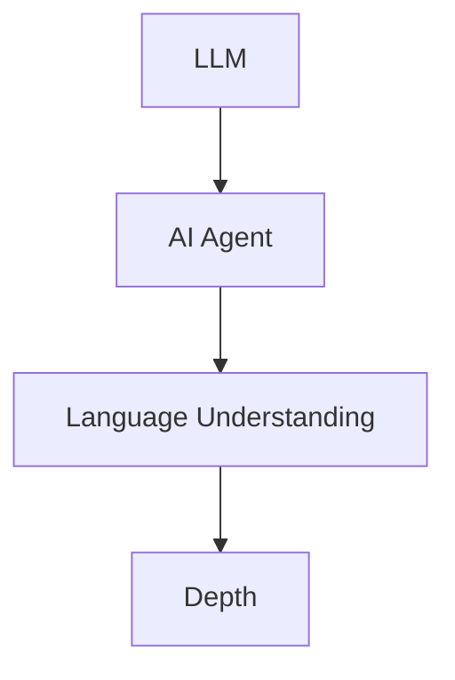
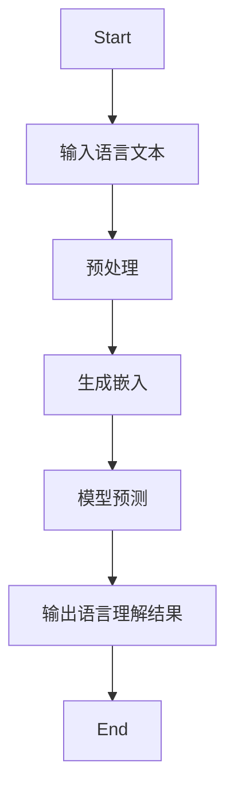
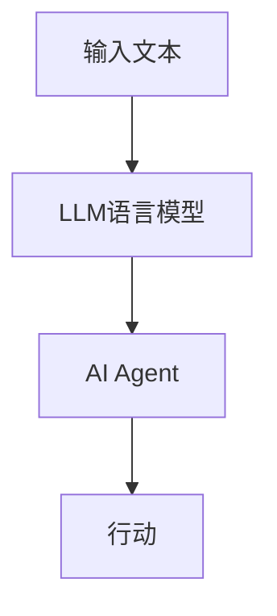

                 


```
# 第一部分: LLM在AI Agent语言理解深度上的提升基础

# 第1章: 背景介绍

## 1.1 问题背景
### 1.1.1 AI Agent与语言理解的定义
### 1.1.2 LLM在AI Agent中的作用
### 1.1.3 当前AI Agent语言理解的挑战

## 1.2 问题描述
### 1.2.1 LLM在AI Agent语言理解中的核心问题
### 1.2.2 现有技术的局限性
### 1.2.3 提升语言理解深度的必要性

## 1.3 问题解决
### 1.3.1 提升语言理解深度的解决方案
### 1.3.2 LLM在AI Agent中的具体应用
### 1.3.3 提升语言理解深度的实际案例

## 1.4 边界与外延
### 1.4.1 LLM在AI Agent中的边界
### 1.4.2 语言理解深度的外延
### 1.4.3 提升语言理解深度的未来方向

## 1.5 概念结构与核心要素组成
### 1.5.1 LLM在AI Agent中的概念结构
### 1.5.2 核心要素的组成
### 1.5.3 概念结构与核心要素的关系

# 第2章: 核心概念与联系

## 2.1 核心概念原理
### 2.1.1 LLM的基本原理
### 2.1.2 AI Agent的基本原理
### 2.1.3 语言理解的核心原理

## 2.2 概念属性特征对比
### 2.2.1 LLM与传统NLP模型的对比
### 2.2.2 AI Agent与传统AI系统的对比
### 2.2.3 语言理解深度的特征对比

## 2.3 ER实体关系图架构


# 第3章: 算法原理讲解

## 3.1 算法原理
### 3.1.1 LLM的训练过程
### 3.1.2 AI Agent的决策过程
### 3.1.3 语言理解深度的算法实现

## 3.2 算法流程图


## 3.3 算法实现
### 3.3.1 算法数学模型
### 3.3.2 代码示例

## 3.4 算法优化
### 3.4.1 模型优化策略
### 3.4.2 训练优化技巧
### 3.4.3 性能优化方法

## 3.5 算法效果评估
### 3.5.1 评估指标
### 3.5.2 实验结果
### 3.5.3 结果分析

# 第4章: 系统分析与架构设计

## 4.1 问题场景介绍
### 4.1.1 项目背景
### 4.1.2 项目目标
### 4.1.3 项目范围

## 4.2 系统功能设计
### 4.2.1 领域模型设计
### 4.2.2 系统架构设计
### 4.2.3 系统功能模块

## 4.3 系统架构设计
### 4.3.1 系统架构图
### 4.3.2 系统模块划分
### 4.3.3 系统接口设计
### 4.3.4 系统交互图

## 4.4 系统实现
### 4.4.1 系统环境搭建
### 4.4.2 系统核心实现
### 4.4.3 系统功能实现
### 4.4.4 系统测试

## 4.5 系统优化
### 4.5.1 系统性能优化
### 4.5.2 系统稳定性优化
### 4.5.3 系统可扩展性优化

# 第5章: 项目实战

## 5.1 项目背景
### 5.1.1 项目目标
### 5.1.2 项目需求
### 5.1.3 项目计划

## 5.2 项目实施
### 5.2.1 环境安装
### 5.2.2 项目核心实现
### 5.2.3 项目代码实现
### 5.2.4 项目测试

## 5.3 项目案例
### 5.3.1 案例分析
### 5.3.2 案例实现
### 5.3.3 案例总结

## 5.4 项目总结
### 5.4.1 项目成果
### 5.4.2 项目经验
### 5.4.3 项目不足
### 5.4.4 项目改进方向

# 第6章: 最佳实践

## 6.1 tips
### 6.1.1 知识点总结
### 6.1.2 经验分享
### 6.1.3 注意事项

## 6.2 小结
### 6.2.1 核心内容回顾
### 6.2.2 未来展望
### 6.2.3 学习建议

## 6.3 注意事项
### 6.3.1 模型使用注意事项
### 6.3.2 系统设计注意事项
### 6.3.3 项目实施注意事项

## 6.4 拓展阅读
### 6.4.1 推荐书籍
### 6.4.2 推荐论文
### 6.4.3 推荐资源

# 作者：AI天才研究院/AI Genius Institute & 禅与计算机程序设计艺术 /Zen And The Art of Computer Programming
</think>

接下来，我将按照上述目录大纲，逐步完成整篇文章的撰写。由于篇幅限制，我将分阶段完成每一部分的内容。以下是第一部分的内容：

---

## 第1章: 背景介绍

### 1.1 问题背景

#### 1.1.1 AI Agent与语言理解的定义

AI Agent（人工智能代理）是指能够感知环境并采取行动以实现目标的智能体。语言理解是AI Agent与人类用户或系统交互的核心能力，决定了其理解和响应用户需求的能力。

#### 1.1.2 LLM在AI Agent中的作用

LLM（大语言模型）通过强大的自然语言处理能力，能够帮助AI Agent更准确地理解输入的文本，生成更符合上下文的响应。

#### 1.1.3 当前AI Agent语言理解的挑战

当前AI Agent的语言理解主要依赖于传统的NLP技术，存在以下问题：
- **理解深度不足**：传统模型难以捕捉语境中的细微差别。
- **动态适应性差**：无法快速适应新场景或领域知识。
- **推理能力有限**：难以进行多步逻辑推理。

### 1.2 问题描述

#### 1.2.1 LLM在AI Agent语言理解中的核心问题

- 如何提升LLM的理解能力，使其能够更好地适应AI Agent的需求。
- 如何优化LLM与AI Agent的交互流程，以提高语言理解的准确性。

#### 1.2.2 现有技术的局限性

- 传统NLP模型缺乏上下文记忆能力。
- AI Agent的决策过程缺乏语言理解的深度支持。

#### 1.2.3 提升语言理解深度的必要性

- 提升AI Agent的用户体验。
- 增强AI Agent在复杂场景中的应用能力。

### 1.3 问题解决

#### 1.3.1 提升语言理解深度的解决方案

- 引入更先进的LLM技术。
- 结合领域知识进行模型微调。

#### 1.3.2 LLM在AI Agent中的具体应用

- 语义理解：通过LLM分析用户的输入，提取意图和实体。
- 对话生成：基于LLM生成符合上下文的回复。

#### 1.3.3 提升语言理解深度的实际案例

- 智能客服：通过LLM理解用户的问题，提供更准确的解决方案。
- 虚拟助手：通过LLM分析用户的指令，执行复杂任务。

### 1.4 边界与外延

#### 1.4.1 LLM在AI Agent中的边界

- LLM仅负责语言理解，不直接参与决策。
- AI Agent的语言理解能力受限于模型的训练数据。

#### 1.4.2 语言理解深度的外延

- 从浅层理解（如关键词提取）到深层理解（如情感分析）。
- 从单一任务理解到多任务联合理解。

#### 1.4.3 提升语言理解深度的未来方向

- 结合多模态信息（如图像、语音）进行更全面的理解。
- 增强模型的推理能力，支持复杂的逻辑推理。

### 1.5 概念结构与核心要素组成

#### 1.5.1 LLM在AI Agent中的概念结构

- **输入**：用户输入的文本。
- **处理**：LLM对文本进行理解和生成。
- **输出**：AI Agent根据理解结果采取行动。

#### 1.5.2 核心要素的组成

- **语言模型**：负责文本的理解和生成。
- **AI Agent**：负责根据理解结果执行任务。
- **交互界面**：用户与AI Agent的交互通道。

#### 1.5.3 概念结构与核心要素的关系

通过Mermaid图展示：



---

接下来，我将继续完成后续章节的内容。如果需要进一步调整或补充，请随时告知！

