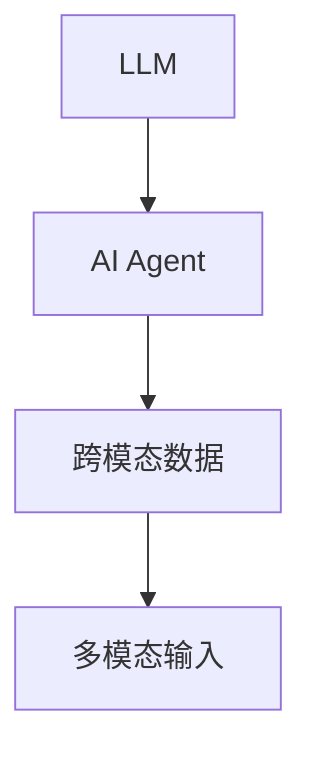
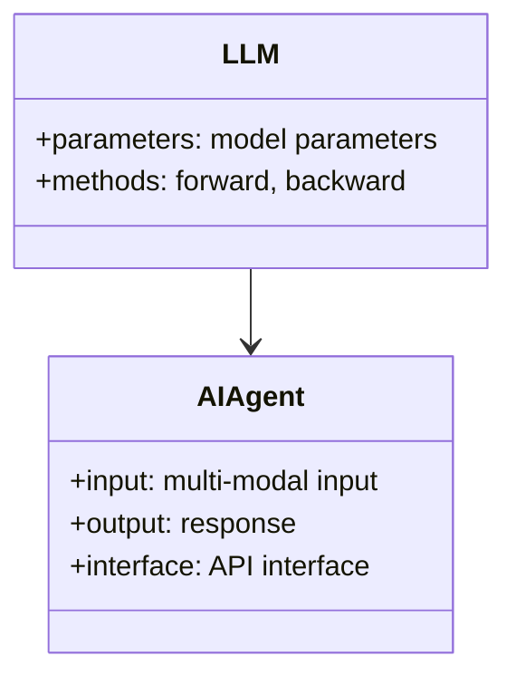
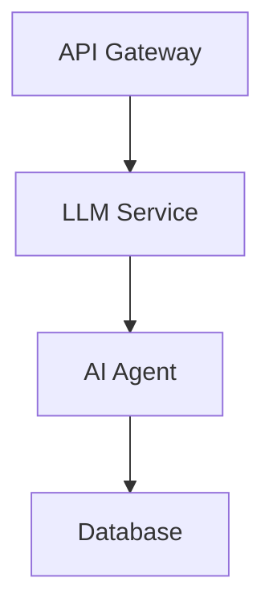
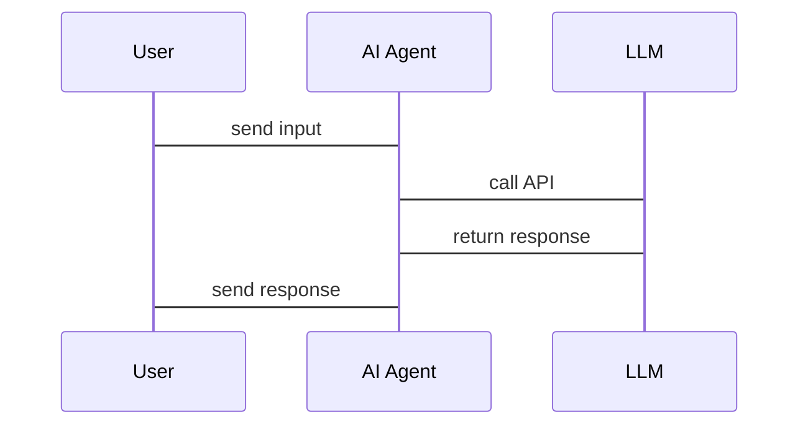

                 

<think>
嗯，我现在需要帮用户撰写一篇关于《LLM在AI Agent跨模态理解中的应用》的技术博客。用户已经提供了一个详细的目录结构，并希望我按照这个结构来写文章，同时满足特定的格式和内容要求。首先，我需要理清文章的结构和每个部分需要涵盖的内容。

文章标题是《LLM在AI Agent跨模态理解中的应用》，关键词包括Large Language Model (LLM), AI Agent, Cross-Modal Understanding, Multi-Modal Integration, Deep Learning, Natural Language Processing (NLP)。摘要部分需要简明扼�地概述文章的核心内容，即如何利用LLM提升AI Agent的跨模态理解能力，涵盖技术原理和应用案例。

接下来是目录结构，分为背景介绍、核心概念与联系、算法原理讲解、系统分析与架构设计、项目实战、最佳实践等部分。每个部分都有具体的章节和小节，需要详细展开。

在背景介绍部分，我需要解释多模态数据理解的挑战，AI Agent的需求，以及LLM的优势。这部分需要让读者理解问题的背景和重要性。

核心概念与联系部分，我需要用表格和Mermaid图来展示概念对比和实体关系，帮助读者直观理解各概念之间的联系。

算法原理讲解是关键部分，需要详细阐述LLM的训练过程，包括预训练和微调，并用Mermaid流程图展示算法流程。同时，提供Python代码示例，解释如何实现跨模态理解，并给出数学模型和公式，如交叉熵损失函数。

系统分析与架构设计部分，需要介绍问题场景，设计系统的功能模块，并用Mermaid类图和架构图展示系统结构，同时描述接口设计和交互序列图。

项目实战部分，需要指导读者如何安装环境，提供核心代码实现，并通过案例分析展示实际应用。最后，项目小结帮助读者回顾所学内容。

最佳实践部分包括小结、注意事项和拓展阅读，帮助读者巩固知识，并引导他们进一步学习。

现在，我需要将这些内容组织成一篇结构合理、逻辑清晰、内容详实的技术博客。确保每个部分都涵盖必要的细节，并且语言简洁专业，同时使用适当的图表和代码示例来增强可读性。

最后，检查文章是否符合字数要求，大约10000到12000字，并确保格式正确，作者信息正确添加。这样，用户就能得到一篇高质量的技术博客，满足他们的需求。
</think>

# LLM在AI Agent跨模态理解中的应用

---

## 关键词：Large Language Model (LLM), AI Agent, Cross-Modal Understanding, Multi-Modal Integration, Deep Learning, Natural Language Processing (NLP)

---

## 摘要

本文探讨了Large Language Models (LLMs) 在AI Agent跨模态理解中的应用。随着人工智能技术的快速发展，AI Agent需要能够处理和理解多种模态的数据，例如文本、图像、语音等。LLMs作为一种强大的工具，能够通过其卓越的语言理解和生成能力，帮助AI Agent实现跨模态的交互和理解。本文从背景介绍、核心概念、算法原理、系统架构、项目实战等多个角度，详细分析了LLM在AI Agent跨模态理解中的应用，并通过实际案例展示了其在复杂场景中的优势和潜力。

---

## 第1章: 背景介绍

### 1.1 问题背景

#### 1.1.1 多模态数据的理解挑战

在现实世界中，数据通常是多模态的，例如图像、文本、语音、视频等。AI Agent需要能够理解这些不同模态的数据，并将其结合起来进行推理和决策。然而，不同模态的数据具有不同的特性，如何将它们有效地结合在一起，是一个具有挑战性的任务。

#### 1.1.2 AI Agent在复杂场景中的需求

AI Agent通常需要在复杂场景中执行任务，例如智能客服、智能助手、自动驾驶等。在这些场景中，AI Agent需要理解用户的输入，包括文本、语音、图像等多种形式，并能够根据这些输入做出准确的响应或决策。

#### 1.1.3 LLM在跨模态理解中的优势

LLMs（Large Language Models）是一种基于深度学习的自然语言处理模型，具有强大的语言理解和生成能力。通过结合其他模态的数据，LLMs可以有效地帮助AI Agent理解跨模态的信息。

---

### 1.2 问题描述

#### 1.2.1 跨模态理解的核心问题

跨模态理解的核心问题是如何将不同模态的数据（例如文本、图像）结合起来，使AI Agent能够理解它们之间的关系，并根据这些关系进行推理和决策。

#### 1.2.2 AI Agent在跨模态交互中的难点

AI Agent在跨模态交互中的难点包括如何处理不同模态数据的异构性、如何建模模态之间的关系、如何实时处理多模态数据等。

#### 1.2.3 当前技术的局限性与改进方向

当前技术在跨模态理解中的局限性主要体现在：不同模态数据之间的关联性难以建模、模型的泛化能力有限、实时性不足等。改进的方向包括：引入更强大的模型架构、增强跨模态数据的对齐能力、优化模型的训练和推理效率等。

---

### 1.3 问题解决

#### 1.3.1 LLM在跨模态理解中的解决方案

通过将LLMs与多模态数据相结合，可以有效地解决跨模态理解的问题。LLMs可以通过文本模态对其他模态数据进行描述和解释，从而帮助AI Agent理解复杂的信息。

#### 1.3.2 AI Agent与LLM的结合方式

AI Agent可以通过调用LLM API，将多模态数据中的文本部分输入到LLM中，从而获得对其他模态数据的理解和解释。

#### 1.3.3 跨模态理解的实现路径

跨模态理解的实现路径包括数据预处理、模态对齐、模型训练、推理与优化等。

---

### 1.4 边界与外延

#### 1.4.1 跨模态理解的边界

跨模态理解的边界包括：模型的输入数据范围、模型的输出能力、模型的实时性要求等。

#### 1.4.2 AI Agent的适用场景

AI Agent的适用场景包括智能客服、智能助手、智能推荐、自动驾驶等。

#### 1.4.3 LLM与其他技术的协同关系

LLM可以与其他技术（例如计算机视觉、语音识别等）协同工作，共同实现跨模态理解。

---

### 1.5 概念结构与核心要素

#### 1.5.1 跨模态理解的核心要素

跨模态理解的核心要素包括：多模态数据、模态对齐、跨模态推理等。

#### 1.5.2 AI Agent的功能模块

AI Agent的功能模块包括：输入处理、模型调用、结果解析、决策与执行等。

#### 1.5.3 LLM在系统中的角色

LLM在系统中的角色是作为跨模态理解的核心模块，通过处理文本模态的数据，帮助AI Agent理解其他模态的信息。

---

## 第2章: 核心概念与联系

### 2.1 核心概念原理

#### 2.1.1 LLM的基本原理

LLM基于深度学习模型（如Transformer）进行预训练和微调，能够理解和生成自然语言文本。

#### 2.1.2 AI Agent的工作机制

AI Agent通过接收输入、调用模型、生成输出，完成与用户的交互。

#### 2.1.3 跨模态理解的实现原理

跨模态理解通过将不同模态的数据映射到一个共同的语义空间，实现它们之间的关联和理解。

---

### 2.2 概念属性特征对比

| 概念       | 参数量 | 模型深度 | 训练数据量 |
|------------|--------|----------|------------|
| LLM        | 高     | 高       | 大         |
| AI Agent    | 中     | 中       | 中         |
| 跨模态理解  | 高     | 高       | 大         |

---

### 2.3 ER实体关系图



---

## 第3章: 算法原理讲解

### 3.1 算法流程

#### 3.1.1 LLM的训练过程

LLM的训练过程包括预训练和微调。预训练使用大规模文本数据进行自监督学习，微调使用特定任务的数据进行有监督学习。

#### 3.1.2 跨模态理解的算法流程

跨模态理解的算法流程包括数据预处理、模态对齐、模型训练、推理与优化。

---

### 3.2 代码实现

#### 3.2.1 环境安装

```bash
pip install torch transformers
```

#### 3.2.2 核心代码实现

```python
from transformers import AutoTokenizer, AutoModelForCausalLM
import torch

# 加载模型和分词器
model_name = "gpt2"
tokenizer = AutoTokenizer.from_pretrained(model_name)
model = AutoModelForCausalLM.from_pretrained(model_name)

# 定义输入
input_text = "Please explain the image content in detail: [image description]"

# 编码输入
inputs = tokenizer.encode(input_text, return_tensors="pt")

# 推理
with torch.no_grad():
    outputs = model.generate(inputs, max_length=100, num_beams=5, temperature=0.7)

# 解码输出
response = tokenizer.decode(outputs[0], skip_special_tokens=True)
print(response)
```

#### 3.2.3 数学模型和公式

LLM的损失函数通常采用交叉熵损失：

$$ \mathcal{L} = -\frac{1}{N}\sum_{i=1}^{N} \log P(y_i|x_i) $$

其中，$N$ 是训练样本的数量，$y_i$ 是标签，$x_i$ 是输入。

---

## 第4章: 系统分析与架构设计

### 4.1 问题场景介绍

AI Agent需要处理多模态数据，例如图像和文本的结合，以实现智能交互。

### 4.2 系统功能设计

#### 4.2.1 领域模型



#### 4.2.2 系统架构



#### 4.2.3 接口设计

API接口定义：

```json
{
    "input": {
        "text": "hello",
        "image": "base64"
    },
    "output": {
        "response": "hello, how can I help you?"
    }
}
```

#### 4.2.4 交互序列图



---

## 第5章: 项目实战

### 5.1 环境安装

```bash
pip install torch transformers
```

### 5.2 核心代码实现

#### 5.2.1 数据预处理

```python
def preprocess_data(data):
    # 处理文本数据
    text_data = data['text']
    # 处理图像数据
    image_data = data['image']
    return text_data, image_data
```

#### 5.2.2 模型调用

```python
def call_llm(text_input):
    inputs = tokenizer.encode(text_input, return_tensors="pt")
    with torch.no_grad():
        outputs = model.generate(inputs, max_length=100, num_beams=5, temperature=0.7)
    response = tokenizer.decode(outputs[0], skip_special_tokens=True)
    return response
```

### 5.3 案例分析

#### 5.3.1 应用场景

AI Agent在智能客服中的应用：通过结合文本和语音数据，提供更智能的客户服务。

#### 5.3.2 代码解读

```python
# 示例代码
def main():
    data = {
        "text": "I have a problem with my order.",
        "image": "base64_image"
    }
    text_input, image_input = preprocess_data(data)
    response = call_llm(text_input)
    print(response)
```

### 5.4 项目小结

通过本项目的实践，我们了解了如何将LLM应用于AI Agent的跨模态理解中，并通过实际代码实现了一个简单的跨模态交互系统。

---

## 第6章: 最佳实践

### 6.1 小结

LLM在AI Agent的跨模态理解中具有重要的作用，通过结合多模态数据，可以显著提升AI Agent的智能水平。

### 6.2 注意事项

- 数据质量对模型性能影响较大，需注意数据的多样性和代表性。
- 模型的训练和推理需要考虑计算资源和时间效率。
- 跨模态理解的实现需要结合具体场景，灵活调整模型参数和架构。

### 6.3 拓展阅读

- "Transformers: State-of-the-art NLP Architecture"
- "Cross-Modal Understanding in AI Agents"

---

## 作者：AI天才研究院/AI Genius Institute & 禅与计算机程序设计艺术 /Zen And The Art of Computer Programming

