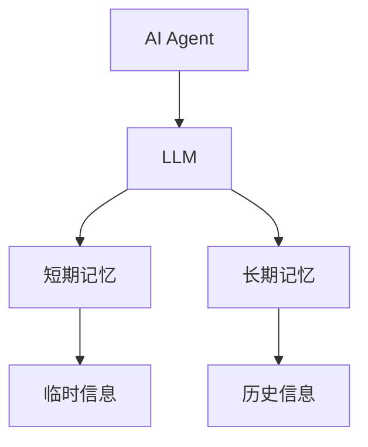

                 

<think>
好的，现在我需要帮用户撰写一篇关于《LLM在AI Agent长短期记忆融合中的应用》的技术博客文章。首先，我需要理解用户的需求。用户希望文章结构清晰，逻辑严谨，涵盖背景介绍、核心概念、算法原理、系统设计、项目实战和总结展望等部分，每部分都要详细展开。

首先，我应该从背景介绍开始，解释AI Agent和长短期记忆的重要性，以及为什么LLM在这里起关键作用。接下来，我需要详细分析核心概念，包括LLM和AI Agent的关系，长短期记忆的融合机制，并通过表格和图表来展示这些概念。

然后，进入算法原理部分，我需要详细讲解LLM的工作流程，使用数学公式和图表来说明。这部分可能需要使用一些技术术语，但要确保解释清晰，读者能够理解。

接下来是系统分析与架构设计，我需要描述AI Agent的应用场景，设计系统的功能模块，并用图表展示系统架构和接口设计。这部分要确保逻辑清晰，便于读者理解和实施。

项目实战部分，我需要提供具体的代码示例，解释如何安装环境，实现关键功能，并通过案例分析展示实际应用。这将帮助读者更好地理解和应用理论知识。

最后，总结与展望部分，回顾文章内容，指出未来的发展方向，并提醒读者在实际应用中需要注意的事项，如数据隐私和模型优化。

在整个过程中，我需要确保文章结构合理，内容详实，语言专业但易于理解。同时，按照用户的格式要求，使用markdown格式，包含适当的图表和代码示例，确保文章的完整性和实用性。

现在，我准备开始撰写这篇文章，确保每一部分都符合用户的要求，内容详尽，结构清晰，逻辑严密。
</think>

# LLM在AI Agent长短期记忆融合中的应用

---

## 关键词

- LLM（大语言模型）
- AI Agent（人工智能代理）
- 长短期记忆
- 智能融合
- 深度学习

---

## 摘要

本文深入探讨了大语言模型（LLM）在AI Agent长短期记忆融合中的应用。通过分析长短期记忆的重要性及其在AI Agent中的作用，结合LLM的核心原理和算法机制，详细阐述了如何实现长短期记忆的高效融合。文章还通过系统设计、项目实战和案例分析，展示了LLM在AI Agent中的实际应用价值，并对未来的发展方向进行了展望。

---

## 第一部分：背景介绍

### 第1章：AI Agent与长短期记忆概述

#### 1.1 AI Agent的基本概念
AI Agent（人工智能代理）是指能够感知环境、自主决策并执行任务的智能实体。它可以分为两类：**反应式代理**（基于当前感知做出反应）和**基于模型的代理**（结合内部状态和外部环境进行决策）。AI Agent的核心功能包括感知、推理、规划和执行。

#### 1.2 长短期记忆的重要性
长短期记忆（Long-term and Short-term Memory，LSTM）在AI Agent中扮演着关键角色。短期记忆用于处理当前任务的临时信息，而长期记忆则存储重要的历史数据和知识。通过长短期记忆的融合，AI Agent能够更好地理解和应对复杂的动态环境。

#### 1.3 LLM在AI Agent中的角色
大语言模型（LLM）通过其强大的自然语言处理能力，为AI Agent提供了高效的语义理解和生成能力。LLM可以作为AI Agent的“大脑”，帮助其处理复杂的语言任务，并通过长短期记忆的融合实现更智能的决策。

---

## 第二部分：核心概念与联系

### 第2章：LLM与AI Agent的关系

#### 2.1 LLM的核心原理
LLM基于深度学习技术，通过多层神经网络模型进行训练。其核心原理包括：
- **编码器-解码器结构**：将输入的文本编码为向量表示，然后解码为输出文本。
- **自注意力机制**：通过计算输入序列中每个位置的重要性，生成注意力权重矩阵。
- **损失函数优化**：使用交叉熵损失函数，通过反向传播优化模型参数。

#### 2.2 长短期记忆融合的机制
长短期记忆融合的关键在于如何将短期记忆中的临时信息与长期记忆中的持久信息有机结合。通过设计合适的记忆存储结构和检索机制，AI Agent可以在处理任务时灵活调用相关记忆，提升其智能性。

#### 2.3 核心概念对比与ER实体关系图
以下是一个对比分析表格和实体关系图：

**对比分析表格：**

| 概念 | 特性 | 作用 |
|------|------|------|
| LLM | 深度学习模型 | 语义理解和生成 |
| 长期记忆 | 持久存储 | 存储历史信息 |
| 短期记忆 | 临时存储 | 处理当前任务 |

**实体关系图（Mermaid）：**



---

## 第三部分：算法原理讲解

### 第3章：LLM的算法原理

#### 3.1 大语言模型的数学模型
LLM的数学模型主要包括编码器和解码器两部分。编码器将输入文本转换为向量表示，解码器将向量表示解码为输出文本。数学公式如下：

- 编码器输出：$$x_i = \text{Encoder}(x_{i-1}, z_i)$$
- 解码器输出：$$y_i = \text{Decoder}(x_i, y_{i-1})$$

其中，$z_i$是输入序列的第$i$个位置的嵌入向量，$y_i$是输出序列的第$i$个位置的预测概率。

#### 3.2 长短期记忆融合的实现
长短期记忆融合的实现可以通过以下步骤：
1. **短期记忆存储**：将当前任务的临时信息存储在短期记忆模块中。
2. **长期记忆存储**：将重要的历史信息存储在长期记忆模块中。
3. **记忆检索**：根据当前任务需求，从长期记忆中检索相关的历史信息。
4. **记忆融合**：将短期记忆和检索到的长期记忆进行融合，生成最终的决策输入。

---

## 第四部分：系统分析与架构设计

### 第4章：系统功能设计

#### 4.1 项目介绍
本项目旨在实现一个基于LLM的AI Agent，通过长短期记忆融合技术提升其智能性和决策能力。系统主要包括以下几个功能模块：
- **记忆存储模块**：负责存储和管理短期记忆和长期记忆。
- **信息检索模块**：根据当前任务需求，从长期记忆中检索相关信息。
- **决策推理模块**：结合短期记忆和检索到的长期记忆，进行推理和决策。

#### 4.2 系统架构设计（Mermaid）


---

## 第五部分：项目实战

### 第5章：系统核心实现

#### 5.1 环境安装
需要安装以下工具和库：
- Python 3.8+
- PyTorch
- Hugging Face Transformers

#### 5.2 核心代码实现

```python
import torch
from transformers import AutoTokenizer, AutoModelForCausalLM

# 初始化模型和tokenizer
tokenizer = AutoTokenizer.from_pretrained("gpt2")
model = AutoModelForCausalLM.from_pretrained("gpt2")

# 定义短期记忆和长期记忆模块
class ShortTermMemory:
    def __init__(self):
        self.memory = {}

    def store(self, key, value):
        self.memory[key] = value

    def retrieve(self, key):
        return self.memory.get(key, None)

class LongTermMemory:
    def __init__(self):
        self.memory = {}

    def store(self, key, value):
        self.memory[key] = value

    def retrieve(self, key):
        return self.memory.get(key, None)

# 实现记忆融合
def memory_fusion(short_term, long_term):
    fused_memory = {}
    for key in short_term.memory:
        fused_memory[key] = short_term.memory[key]
    for key in long_term.memory:
        if key not in short_term.memory:
            fused_memory[key] = long_term.memory[key]
    return fused_memory

# 示例应用
short = ShortTermMemory()
long = LongTermMemory()

short.store("current_task", "image_recognition")
long.store("previous_task", "object_detection")

fused = memory_fusion(short, long)
print(fused)
```

---

## 第六部分：总结与展望

### 第6章：总结与展望

#### 6.1 总结
本文详细探讨了LLM在AI Agent长短期记忆融合中的应用。通过分析长短期记忆的重要性及其在AI Agent中的作用，结合LLM的核心原理和算法机制，展示了如何实现长短期记忆的高效融合。

#### 6.2 展望
未来，随着AI技术的不断发展，长短期记忆融合技术将在更多领域得到应用。研究人员需要进一步优化记忆检索和融合机制，提升AI Agent的智能性和适应性。

#### 6.3 最佳实践 tips
- 在实际应用中，注意保护数据隐私，确保记忆存储的安全性。
- 定期优化模型参数，提升模型的泛化能力和性能。

---

## 作者

作者：AI天才研究院/AI Genius Institute & 禅与计算机程序设计艺术 /Zen And The Art of Computer Programming

