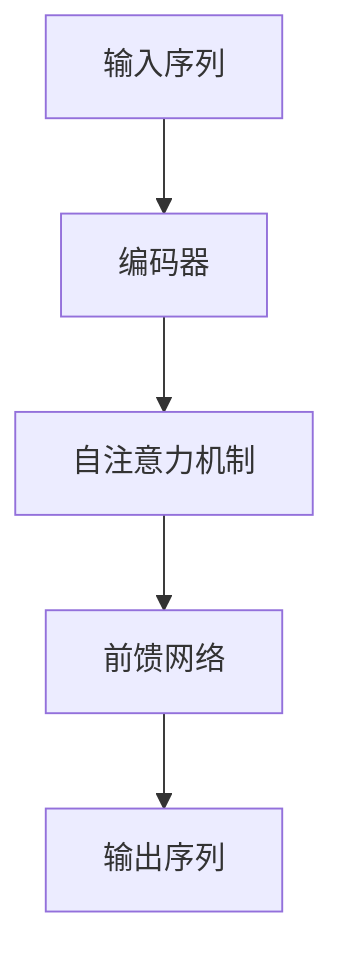
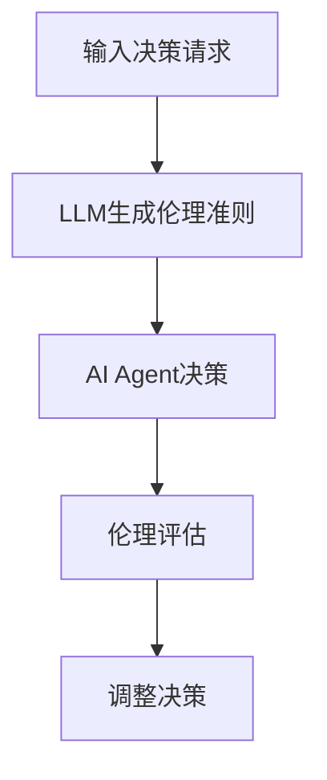
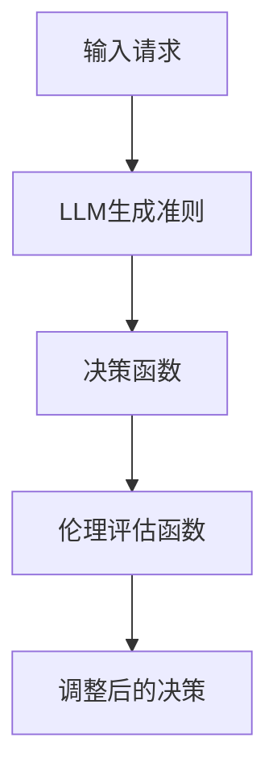
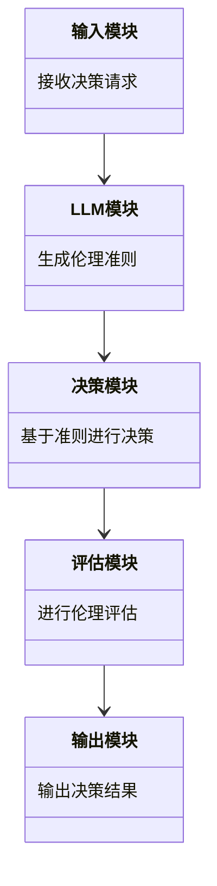
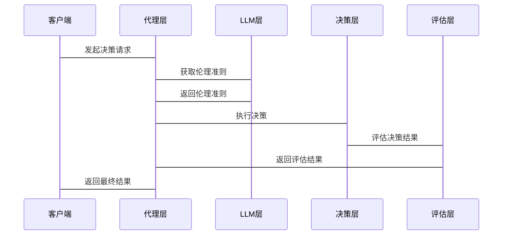

                 


# LLM驱动的AI Agent伦理决策支持系统

> 关键词：LLM，AI Agent，伦理决策，支持系统，人工智能，大语言模型

> 摘要：本文详细探讨了LLM（大语言模型）驱动的AI Agent伦理决策支持系统的构建与应用。通过分析问题背景、核心概念、算法原理、系统架构设计和实际项目案例，本文为读者提供了一套完整的解决方案，并提出了实际应用中的注意事项和未来研究方向。

---

# 第一部分: LLM驱动的AI Agent伦理决策支持系统概述

## 第1章: 问题背景与核心概念

### 1.1 问题背景

#### 1.1.1 AI Agent的定义与现状
AI Agent（人工智能代理）是指能够感知环境、自主决策并执行任务的智能实体。它可以是一个软件程序、机器人或其他智能系统，旨在模拟人类或其他智能体的行为。当前，AI Agent在多个领域得到了广泛应用，如自动驾驶、智能客服、智能家居等。

#### 1.1.2 LLM在AI Agent中的应用
大语言模型（LLM，Large Language Model）如GPT-3、GPT-4等，具有强大的自然语言处理能力，能够理解上下文、生成文本、回答问题等。将LLM与AI Agent结合，可以赋予AI Agent更强的自然语言理解和生成能力，使其能够更好地与人类交互并做出更复杂的决策。

#### 1.1.3 伦理决策的必要性
在AI Agent的实际应用中，决策的伦理性和合规性变得尤为重要。例如，在自动驾驶中，AI Agent需要在紧急情况下做出符合伦理的决策，以最小化伤害。传统的基于规则的决策系统难以应对复杂的伦理问题，而LLM驱动的伦理决策支持系统能够通过上下文理解和生成伦理准则，帮助AI Agent做出更合理的决策。

---

### 1.2 核心概念与问题描述

#### 1.2.1 LLM驱动的AI Agent的定义
LLM驱动的AI Agent是一种结合了大语言模型和AI Agent技术的智能系统。它通过LLM的强大语言处理能力，能够理解复杂的语义信息，并结合AI Agent的自主决策能力，实现更智能、更自然的交互和决策。

#### 1.2.2 伦理决策支持系统的功能
伦理决策支持系统的核心功能包括：
1. **伦理准则生成**：根据输入的场景和问题，生成符合伦理的决策准则。
2. **决策评估**：对AI Agent的决策进行伦理评估，确保决策的合理性和合规性。
3. **动态调整**：根据新的信息或环境变化，动态调整伦理决策策略。

#### 1.2.3 系统的边界与外延
系统的边界包括：
1. 输入：AI Agent的决策请求、环境信息、伦理准则库。
2. 输出：经过伦理评估的决策结果、调整后的伦理准则。
3. 外延：系统可以与其他模块（如知识库、数据库）集成，进一步提升决策的准确性和智能化。

---

### 1.3 核心概念与联系

#### 1.3.1 核心概念原理
通过以下表格，我们可以清晰地看到LLM驱动的AI Agent与伦理决策支持系统的联系：

| **概念**       | **描述**                                                                 |
|----------------|--------------------------------------------------------------------------|
| LLM            | 大语言模型，具备强大的自然语言处理能力。                                   |
| AI Agent       | 具备自主决策能力的智能体。                                                 |
| 伦理决策支持系统 | 通过LLM生成伦理准则，帮助AI Agent做出符合伦理的决策。                   |

#### 1.3.2 概念属性特征对比表格
以下是对LLM和AI Agent的核心属性进行对比：

| **属性**       | **LLM**                     | **AI Agent**                |
|----------------|-----------------------------|------------------------------|
| 核心能力       | 自然语言处理与生成         | 自主决策与执行任务           |
| 伦理决策能力   | 需结合伦理决策支持系统     | 依赖伦理决策支持系统进行决策  |
| 知识库         | 基于训练数据               | 基于知识库与动态输入           |

#### 1.3.3 ER实体关系图架构（Mermaid流程图）
以下是系统的实体关系图：

```mermaid
erd
    actor: 用户
    agent: AI Agent
    llm: 大语言模型
    decision: 决策
    ethics_rule: 伦理准则

    actor --> agent: 发起决策请求
    agent --> llm: 获取语言处理能力
    agent --> decision: 生成决策
    decision --> ethics_rule: 评估伦理合规性
    llm --> ethics_rule: 生成伦理准则
```

---

## 第2章: 算法原理与数学模型

### 2.1 LLM算法原理

#### 2.1.1 大语言模型的基本原理
大语言模型通常基于Transformer架构，通过自注意力机制（Self-Attention）和前馈神经网络（FFN）进行文本生成。其核心公式如下：

$$
\text{Attention}(Q, K, V) = \text{softmax}\left(\frac{QK^T}{\sqrt{d_k}}\right)V
$$

其中，$Q$、$K$、$V$分别为查询、键、值矩阵，$d_k$为键的维度。

#### 2.1.2 常见的大模型算法（如GPT）
GPT模型的训练目标是最小化条件概率：

$$
\mathcal{L} = -\sum_{i=1}^{n} \log p(x_i | x_{<i})
$$

其中，$x_i$表示输入序列中的第$i$个词。

#### 2.1.3 LLM的数学模型（Mermaid流程图）
以下是LLM的数学模型流程图：



---

### 2.2 AI Agent算法原理

#### 2.2.1 AI Agent的基本算法
AI Agent的决策过程通常包括以下几个步骤：
1. **感知环境**：获取环境中的信息。
2. **状态表示**：将环境信息转化为状态表示。
3. **决策选择**：基于状态表示选择最优动作。
4. **执行动作**：将决策结果输出到环境中。

#### 2.2.2 伦理决策算法的实现
伦理决策算法的核心是通过LLM生成伦理准则，并将其融入AI Agent的决策过程中。算法流程如下：



#### 2.2.3 算法的数学模型（Mermaid流程图）
以下是伦理决策算法的数学模型流程图：



---

## 第3章: 系统分析与架构设计

### 3.1 系统功能设计

#### 3.1.1 系统功能模块划分
系统功能模块包括：
1. **输入模块**：接收决策请求和环境信息。
2. **LLM模块**：生成伦理准则。
3. **决策模块**：基于伦理准则进行决策。
4. **评估模块**：对决策结果进行伦理评估。
5. **输出模块**：输出最终的决策结果。

#### 3.1.2 系统功能流程图（Mermaid类图）
以下是系统的功能流程图：



### 3.2 系统架构设计

#### 3.2.1 系统架构图（Mermaid架构图）
以下是系统的架构图：


### 3.3 系统接口设计

#### 3.3.1 系统接口定义
系统接口包括：
1. **代理层接口**：接收决策请求。
2. **LLM层接口**：生成伦理准则。
3. **决策层接口**：执行决策。
4. **评估层接口**：评估决策结果。

#### 3.3.2 接口交互流程图（Mermaid序列图）
以下是接口交互流程图：



---

## 第4章: 项目实战

### 4.1 环境安装与配置

#### 4.1.1 开发环境搭建
推荐使用Python 3.8及以上版本，安装以下库：
- `transformers`：用于加载预训练的LLM模型。
- `torch`：用于深度学习框架。
- `networkx`：用于系统架构设计。

#### 4.1.2 依赖库安装
安装依赖库：
```bash
pip install transformers torch networkx
```

### 4.2 核心代码实现

#### 4.2.1 LLM驱动的AI Agent实现
以下是LLM驱动的AI Agent代码示例：

```python
from transformers import AutoModelForCausalLM, AutoTokenizer
import torch

class AI_Agent:
    def __init__(self, model_name="gpt2"):
        self.model = AutoModelForCausalLM.from_pretrained(model_name)
        self.tokenizer = AutoTokenizer.from_pretrained(model_name)

    def generate_ethics_rule(self, input_text):
        inputs = self.tokenizer.encode(input_text, return_tensors="pt")
        outputs = self.model.generate(inputs, max_length=50)
        return self.tokenizer.decode(outputs[0], skip_special_tokens=True)
```

#### 4.2.2 伦理决策支持系统实现
以下是伦理决策支持系统的代码示例：

```python
class EthicsDecisionSystem:
    def __init__(self, agent):
        self.agent = agent

    def evaluate_decision(self, decision, input_text):
        ethics_rule = self.agent.generate_ethics_rule(input_text)
        # 这里可以实现具体的伦理评估逻辑
        return f"决策：{decision}\n伦理准则：{ethics_rule}"
```

### 4.3 实际案例分析

#### 4.3.1 案例背景介绍
假设我们正在开发一个智能客服系统，AI Agent需要在客户请求中做出符合伦理的决策。

#### 4.3.2 系统实现与分析
在该案例中，AI Agent首先通过LLM生成伦理准则，然后根据准则进行决策，并对决策结果进行伦理评估。

#### 4.3.3 案例总结与优化
通过该案例，我们可以看到LLM驱动的伦理决策支持系统在实际应用中的优势，同时也需要不断优化伦理评估逻辑，以应对更复杂的场景。

---

## 第5章: 最佳实践与小结

### 5.1 最佳实践

#### 5.1.1 开发注意事项
- 确保LLM模型的伦理准则库足够丰富，涵盖各种场景。
- 定期更新模型以适应新的伦理规范和法律法规。
- 在实际应用中，建议与伦理专家合作，确保决策的合规性。

#### 5.1.2 系统优化建议
- 通过分布式架构提升系统的处理能力。
- 引入实时反馈机制，优化伦理决策策略。
- 结合知识图谱，提升决策的准确性和智能化。

#### 5.1.3 伦理决策的常见问题解答
- **Q1：如何确保伦理决策的准确性？**  
  A1：通过不断优化模型和引入多领域的伦理准则。
- **Q2：如何应对动态变化的伦理规范？**  
  A2：通过定期更新模型和与伦理专家合作。
- **Q3：如何处理伦理决策中的模糊性？**  
  A3：通过引入概率模型和多目标优化算法。

### 5.2 小结

LLM驱动的AI Agent伦理决策支持系统是一种结合了大语言模型和人工智能代理技术的智能系统。它通过生成伦理准则并指导决策过程，能够帮助AI Agent在复杂场景中做出更合理的决策。未来，随着技术的不断发展，我们需要进一步优化系统架构，提升伦理决策的准确性和智能化。

---

# 作者：AI天才研究院/AI Genius Institute & 禅与计算机程序设计艺术 /Zen And The Art of Computer Programming

