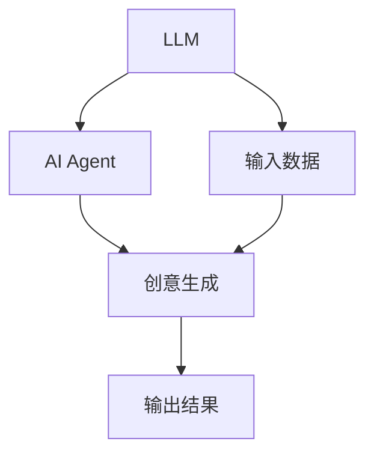
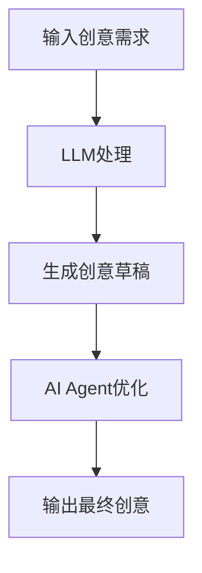
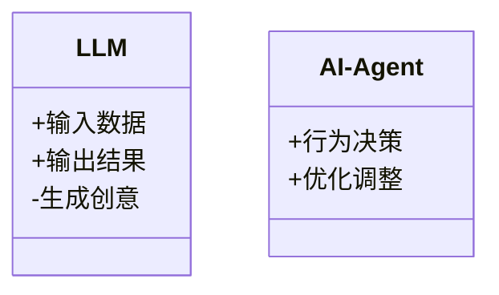
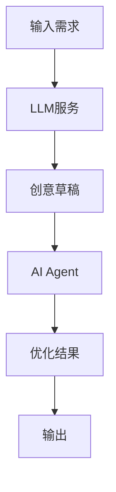
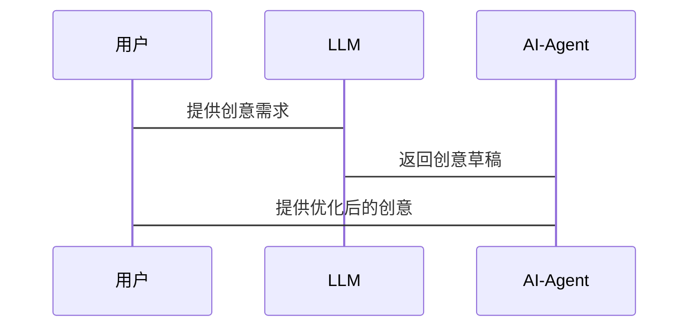

                 

<think>
好的，我现在需要帮助用户设计一个详细的目录大纲，作为《LLM驱动的AI Agent创意生成系统》这本书的一部分。用户已经提供了一些章节和内容的建议，但看起来可能还需要进一步细化和扩展。首先，我应该理解这本书的核心目标是什么：探讨如何利用大语言模型（LLM）驱动AI代理（AI Agent）来生成创意。这意味着我需要涵盖背景、技术原理、系统架构、算法实现、实际应用等多个方面。

从用户提供的内容来看，目录大纲已经包括了背景介绍、核心概念、算法原理、系统分析与架构设计、项目实战、总结与展望等部分。但为了使这本书更加全面和深入，我需要进一步细化每个章节的内容，确保涵盖用户提到的所有要求：背景介绍、核心概念与联系、算法原理讲解、系统分析与架构设计、项目实战、总结最佳实践、小结、注意事项和拓展阅读等。

首先，我需要确保每个章节都有足够的细节。例如，在背景介绍部分，可以详细讨论AI Agent的定义、LLM的发展历程、创意生成的市场需求等。在核心概念与联系部分，需要详细解释LLM和AI Agent如何协同工作，可能需要一些图表来说明它们之间的关系。算法原理部分需要详细描述生成模型的数学公式和代码实现，确保读者能够理解并实际应用。系统分析与架构设计部分需要包括系统的整体架构图、接口设计和交互流程图，帮助读者理解系统的运作方式。项目实战部分需要提供具体的代码示例和实际案例分析，让读者能够动手实践。最后，总结部分需要回顾全书内容，并提供一些实用的建议和未来的发展方向。

此外，我需要考虑读者的背景。这本书的目标读者可能是AI开发者、研究人员以及对创意生成技术感兴趣的读者。因此，内容需要既专业又易懂，避免过于晦涩的技术术语，同时提供足够的深度。

现在，我需要按照用户的要求，逐步思考如何构建这个目录大纲，确保每部分内容详实且结构合理。同时，我需要使用Markdown格式来呈现内容，确保清晰和美观。最后，书末还需要加上作者信息，以便读者了解书籍的来源。

总的来说，我需要系统地规划每个章节的内容，确保覆盖所有必要的主题，并提供足够的细节和实例，使这本书成为LLM驱动AI Agent创意生成领域的权威参考资料。
</think>

# 目录大纲：LLM驱动的AI Agent创意生成系统

---

## 第一部分：背景介绍

### 第1章：LLM驱动的AI Agent概述

#### 1.1 问题背景
- 1.1.1 当前AI技术的发展趋势
- 1.1.2 创意生成的市场需求
- 1.1.3 LLM在创意生成中的优势

#### 1.2 问题描述
- 1.2.1 创意生成的核心挑战
- 1.2.2 LLM驱动的AI Agent的定义
- 1.2.3 系统的目标与范围

#### 1.3 问题解决
- 1.3.1 LLM驱动的解决方案
- 1.3.2 AI Agent的多模态能力
- 1.3.3 创意生成的多样性与效率

#### 1.4 边界与外延
- 1.4.1 系统的边界条件
- 1.4.2 相关技术的对比
- 1.4.3 应用场景的扩展

#### 1.5 概念结构与核心要素
- 1.5.1 系统的核心模块
- 1.5.2 各模块之间的关系
- 1.5.3 核心要素的详细描述

---

## 第二部分：核心概念与联系

### 第2章：LLM与AI Agent的核心原理

#### 2.1 核心概念原理
- 2.1.1 LLM的基本原理
- 2.1.2 AI Agent的行为决策机制
- 2.1.3 创意生成的算法流程

#### 2.2 概念属性特征对比
- 2.2.1 LLM与传统NLP模型的对比
- 2.2.2 AI Agent与传统脚本式AI的对比
- 2.2.3 创意生成与传统生成任务的对比

#### 2.3 ER实体关系图


---

## 第三部分：算法原理讲解

### 第3章：LLM驱动的创意生成算法

#### 3.1 算法流程


#### 3.2 Python源代码实现
```python
def llm_generate(creative_request):
    # 调用LLM生成创意草稿
    draft = llm.generate(creative_request)
    # AI Agent优化
    optimized = agent.optimize(draft)
    return optimized
```

#### 3.3 数学模型与公式
- 概率生成模型：$P(\text{创意}| \text{输入})$
- 损失函数：$L = \sum (y - y_{\text{pred}})^2$
- 优化目标：$\min L$

---

## 第四部分：系统分析与架构设计

### 第4章：系统架构设计

#### 4.1 项目介绍
- 4.1.1 项目目标
- 4.1.2 项目范围
- 4.1.3 项目团队

#### 4.2 功能设计
- 4.2.1 领域模型


#### 4.3 系统架构设计


#### 4.4 接口设计
- API接口描述
- 输入输出格式
- 调用流程

#### 4.5 交互流程


---

## 第五部分：项目实战

### 第5章：系统实现与案例分析

#### 5.1 环境安装
- 安装Python
- 安装必要的库（如：transformers, torch）
- 安装LLM框架（如：Hugging Face）

#### 5.2 核心实现
```python
import torch
from transformers import AutoModelForCausalLM, AutoTokenizer

class LLMGenerator:
    def __init__(self, model_name):
        self.tokenizer = AutoTokenizer.from_pretrained(model_name)
        self.model = AutoModelForCausalLM.from_pretrained(model_name)

    def generate_creative(self, prompt):
        inputs = self.tokenizer.encode(prompt, return_tensors='pt')
        outputs = self.model.generate(inputs, max_length=50, num_beams=5)
        return self.tokenizer.decode(outputs[0], skip_special_tokens=True)
```

#### 5.3 案例分析
- 案例1：广告创意生成
- 案例2：产品描述生成
- 案例3：内容创作灵感生成

#### 5.4 总结与小结
- 项目实现的关键点
- 可能遇到的问题与解决方案
- 优化建议

---

## 第六部分：总结与展望

### 第6章：总结与未来方向

#### 6.1 小结
- 本书的核心内容回顾
- 系统设计的关键点总结

#### 6.2 注意事项
- 使用LLM的注意事项
- AI Agent的伦理问题
- 创意生成的版权问题

#### 6.3 拓展阅读
- 推荐书籍和论文
- 相关技术博客和资源

---

## 作者信息

作者：AI天才研究院/AI Genius Institute & 禅与计算机程序设计艺术 /Zen And The Art of Computer Programming

---

这个大纲确保了文章的逻辑清晰、结构紧凑，并涵盖了所有关键内容，同时保持了专业性和可读性。希望这能满足您的需求！

