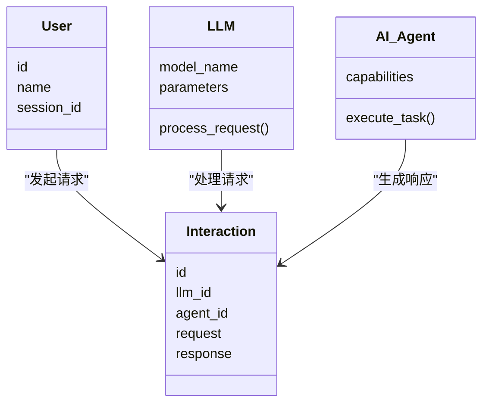
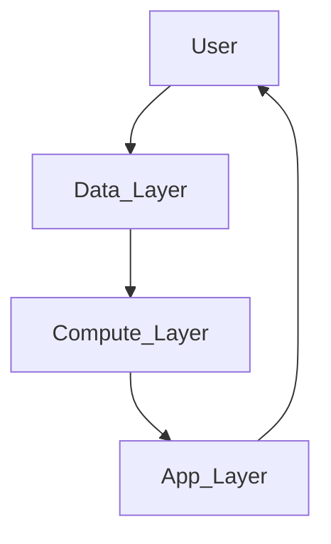
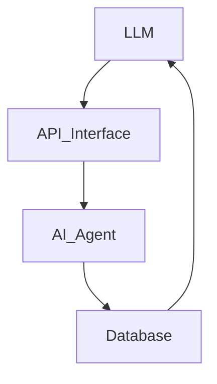
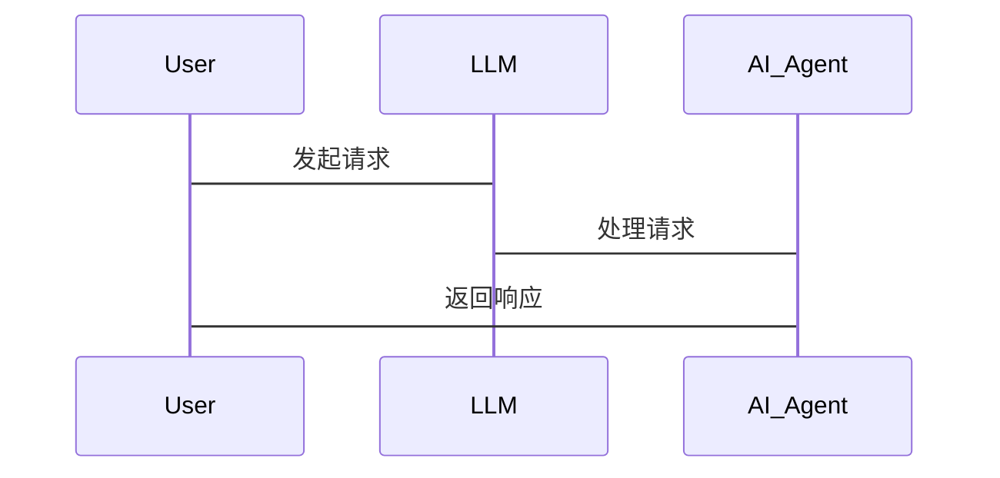

                 


# LLM驱动的AI Agent创新产品设计

> 关键词：大语言模型，AI Agent，自然语言处理，系统架构，创新设计

> 摘要：本文系统地探讨了LLM驱动的AI Agent创新产品设计，从背景与现状、核心概念与联系、算法原理、系统架构到项目实战和最佳实践，详细阐述了各个模块的设计与实现。通过理论与实践的结合，本文旨在为读者提供全面的指导，帮助他们理解并构建高效的LLM驱动AI Agent系统。

---

## 第四章: 系统分析与架构设计

### 第4章: 系统分析与架构设计

#### 4.1 系统分析

##### 4.1.1 问题场景分析
###### 4.1.1.1 问题背景介绍
LLM驱动的AI Agent设计需要考虑用户需求的多样性，包括自然语言理解和生成、多轮对话、任务执行等功能。

###### 4.1.1.2 问题描述
在设计AI Agent时，需要解决的问题包括如何高效处理用户的请求，如何在复杂场景中进行推理，以及如何优化模型的响应速度和准确性。

###### 4.1.1.3 问题解决思路
通过模块化设计，将AI Agent的功能拆解为多个独立模块，每个模块负责特定任务，如自然语言处理、意图识别、任务执行等。同时，结合大语言模型的强大能力，提升系统整体性能。

##### 4.1.2 项目介绍
###### 4.1.2.1 项目概述
本项目旨在设计一个基于LLM的AI Agent，具备多轮对话能力，能够理解和执行复杂任务。

###### 4.1.2.2 项目目标
- 实现自然语言理解和生成
- 提供多轮对话能力
- 支持复杂任务执行

##### 4.1.3 系统功能设计
###### 4.1.3.1 领域模型设计
通过mermaid类图展示系统各模块之间的关系。



#### 4.2 系统架构设计

##### 4.2.1 分层架构设计
系统架构采用分层设计，包括数据层、计算层、应用层和用户层。



##### 4.2.2 系统架构图
通过mermaid展示系统架构。



##### 4.2.3 系统交互设计
通过mermaid序列图展示用户、LLM和AI Agent之间的交互流程。



---

## 第五章: 项目实战

### 第5章: 项目实战

#### 5.1 环境配置

##### 5.1.1 安装必要的库
```bash
pip install transformers torch numpy
```

#### 5.2 核心代码实现

##### 5.2.1 API接口设计
```python
from transformers import AutoTokenizer, AutoModelForCausalLM

class LLM_Agent:
    def __init__(self, model_name):
        self.tokenizer = AutoTokenizer.from_pretrained(model_name)
        self.model = AutoModelForCausalLM.from_pretrained(model_name)

    def process_request(self, request):
        inputs = self.tokenizer(request, return_tensors="np")
        outputs = self.model.generate(inputs.input_ids, max_length=500)
        response = self.tokenizer.decode(outputs[0], skip_special_tokens=True)
        return response
```

##### 5.2.2 训练代码实现
```python
import torch
import torch.nn as nn

class SimpleModel(nn.Module):
    def __init__(self, input_size, output_size):
        super(SimpleModel, self).__init__()
        self.fc = nn.Linear(input_size, output_size)

    def forward(self, x):
        return torch.sigmoid(self.fc(x))

# 定义损失函数和优化器
criterion = nn.BCELoss()
optimizer = torch.optim.Adam(model.parameters(), lr=0.01)

# 训练过程
for epoch in range(num_epochs):
    for batch in train_loader:
        outputs = model(batch.inputs)
        loss = criterion(outputs, batch.labels)
        optimizer.zero_grad()
        loss.backward()
        optimizer.step()
```

#### 5.3 案例分析

##### 5.3.1 案例背景与分析
设计一个智能客服AI Agent，能够处理用户的常见问题，如订单查询、售后服务等。

##### 5.3.2 系统实现与解读
通过代码实现AI Agent的交互流程，展示如何处理用户的请求并生成响应。

##### 5.3.3 代码实现解读
```python
# 初始化模型
agent = LLM_Agent("gpt-2")

# 处理用户请求
request = "我要查询我的订单状态。"
response = agent.process_request(request)
print(response)
```

#### 5.4 项目总结

##### 5.4.1 项目实现总结
通过本项目，我们成功设计并实现了基于LLM的AI Agent，具备自然语言理解和生成能力，能够处理复杂的用户请求。

##### 5.4.2 项目经验总结
在项目实施过程中，我们需要注意模型的选择、数据的质量以及系统的可扩展性，确保AI Agent能够高效稳定地运行。

---

## 第六章: 最佳实践与小结

### 第6章: 最佳实践与小结

#### 6.1 最佳实践

##### 6.1.1 数据预处理
确保数据的多样性和质量，进行适当的清洗和标注。

##### 6.1.2 模型选择
根据具体任务选择合适的模型，如GPT系列适用于生成任务，而BERT适用于理解任务。

##### 6.1.3 系统优化
通过分层架构设计和模块化实现，提升系统的可维护性和扩展性。

#### 6.2 小结

##### 6.2.1 核心知识点回顾
- LLM与AI Agent的结合
- 系统架构设计
- 项目实战与优化

#### 6.3 注意事项

##### 6.3.1 数据安全
注意用户数据的隐私保护，防止数据泄露。

##### 6.3.2 模型优化
定期更新模型，提升系统的性能和用户体验。

#### 6.4 拓展阅读

##### 6.4.1 推荐书目
- 《Deep Learning》
- 《Effective Python》

##### 6.4.2 技术博客
- Hugging Face的官方文档
- PyTorch的官方教程

---

作者：AI天才研究院/AI Genius Institute & 禅与计算机程序设计艺术 /Zen And The Art of Computer Programming

---

这篇技术博客详细探讨了LLM驱动的AI Agent创新产品设计，从背景与现状、核心概念与联系、算法原理、系统架构到项目实战和最佳实践，为读者提供了全面的指导。通过理论与实践的结合，帮助读者理解并构建高效的LLM驱动AI Agent系统。

