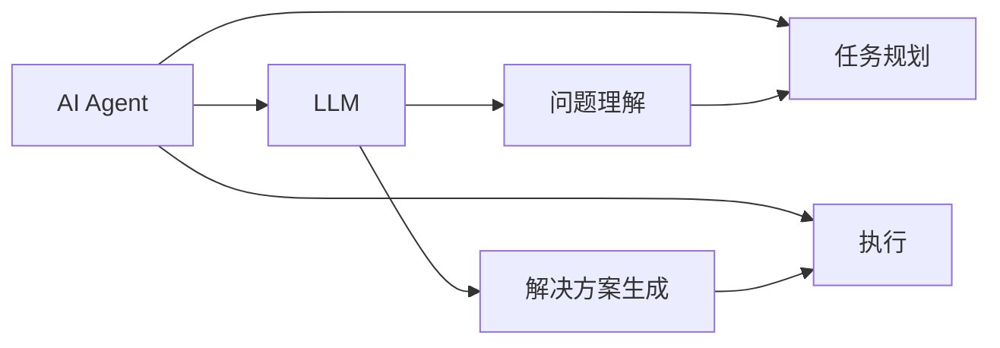
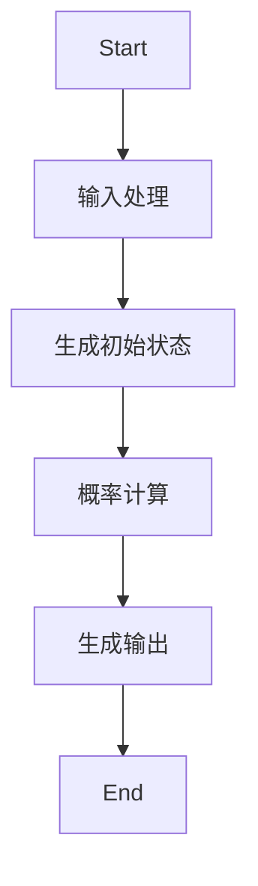
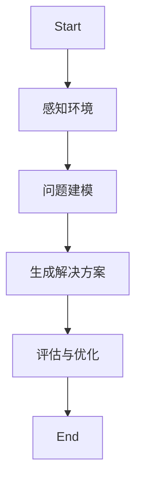
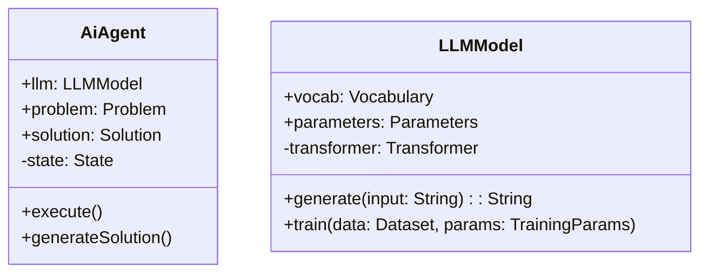
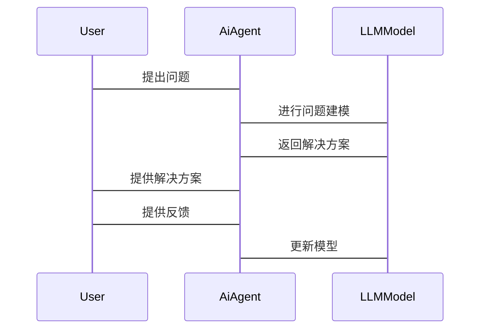

                 

<think>
好的，我现在需要根据用户的要求，撰写一篇名为《LLM驱动的AI Agent创新问题解决技术》的技术博客文章。首先，我需要理解用户的需求，确保文章的结构和内容符合要求。

用户希望文章有以下部分：
1. **文章标题**、**关键词**和**摘要**，放在文章的开头。
2. 目录大纲结构，分为背景介绍、核心概念、算法原理、系统分析与架构设计、项目实战和最佳实践六个部分。
3. 每部分详细展开，包括背景介绍、核心概念、算法流程图、代码实现等。
4. 使用Mermaid图表来展示流程图、类图和架构图。
5. 文章末尾加上作者信息。

首先，我需要确保文章的结构清晰，每部分内容详尽，逻辑连贯。接下来，我会逐步分析每个部分应该包含哪些内容，以及如何详细展开。

在背景介绍部分，我需要解释为什么LLM和AI Agent是当前技术的热点，以及它们在问题解决中的作用。接着，核心概念部分要详细讲解LLM和AI Agent的原理，以及它们之间的关系。算法原理部分需要用图表和代码展示模型的训练过程和决策机制。系统分析与架构设计部分则需要展示系统的组成部分和交互流程。项目实战部分提供具体的代码实现和案例分析，最后的最佳实践部分总结经验，给出建议。

在写作过程中，我要确保使用专业的技术语言，同时保持条理清晰，逻辑严密。对于每个部分，我需要详细展开，避免遗漏关键点。此外，使用Mermaid图表和数学公式可以增强文章的可读性和专业性。

现在，我开始撰写文章，确保每个部分都符合用户的要求，并且内容丰富，结构合理。
</think>

# LLM驱动的AI Agent创新问题解决技术

> 关键词：LLM, AI Agent, 创新问题解决, 大语言模型, 智能代理, 人工智能

> 摘要：本文探讨了如何利用大语言模型（LLM）驱动AI代理（AI Agent）进行创新性问题解决。通过分析LLM和AI Agent的核心原理、系统架构以及实际应用案例，详细阐述了LLM驱动AI Agent的技术实现路径、算法原理和系统设计方法。文章还提供了具体的项目实战和最佳实践，帮助读者理解如何在实际场景中应用这一技术。

---

# 第一部分: 背景介绍

## 第1章: 问题背景与问题描述

### 1.1 问题背景
#### 1.1.1 当前AI技术的发展现状
近年来，人工智能技术取得了显著进展，特别是在大语言模型（LLM）领域，如GPT-3、GPT-4等模型的出现，推动了自然语言处理技术的革新。AI代理（AI Agent）作为连接人与机器的桥梁，也在多个领域展现了其潜力。

#### 1.1.2 LLM的崛起与应用潜力
大语言模型通过大规模数据训练，具备了强大的文本生成和理解能力，能够处理复杂的语言任务。其应用范围涵盖文本生成、对话系统、自动编程等领域，为创新问题解决提供了新的可能性。

#### 1.1.3 AI Agent在问题解决中的作用
AI Agent通过感知环境、分析问题、执行任务，能够帮助人类更高效地解决复杂问题。结合LLM的强大能力，AI Agent可以在多种场景下提供智能化的解决方案。

### 1.2 问题描述
#### 1.2.1 创新问题解决的核心挑战
创新问题解决需要在有限的信息和资源下，找到最优或次优的解决方案。传统的基于规则的方法难以应对复杂多变的场景，而基于LLM的AI Agent则能够通过动态推理和生成能力，提供更灵活的解决方案。

#### 1.2.2 LLM驱动AI Agent的必要性
LLM的强大生成能力和可定制性，使得AI Agent能够适应不同领域和场景的需求，从而提高问题解决的效率和效果。

#### 1.2.3 当前技术的局限性与改进方向
尽管LLM和AI Agent技术取得了显著进展，但在实际应用中仍存在一些挑战，如模型的计算成本高、生成结果的可控性问题等。因此，如何优化LLM驱动的AI Agent，使其更高效、更可靠地解决问题，是当前研究的重要方向。

### 1.3 问题解决的路径与方法
#### 1.3.1 基于LLM的AI Agent技术路线
通过将LLM作为AI Agent的核心模块，结合感知、推理和执行能力，构建一个能够自主解决问题的系统。

#### 1.3.2 创新问题解决的系统性方法
从问题建模、数据采集、模型训练到系统部署，构建一个完整的创新问题解决技术体系。

#### 1.3.3 技术与场景的结合策略
根据不同场景的特点，灵活调整AI Agent的功能模块和参数设置，使其更好地适应实际需求。

### 1.4 边界与外延
#### 1.4.1 LLM驱动AI Agent的边界条件
明确AI Agent的能力边界，避免超出模型能力范围的应用，确保系统的稳定性和可靠性。

#### 1.4.2 技术的适用范围与限制
分析LLM驱动AI Agent技术的适用范围，同时明确其在某些场景下的局限性，如对实时数据的处理能力、多模态信息的整合能力等。

#### 1.4.3 创新问题解决的外延应用
探讨LLM驱动AI Agent技术在不同领域的潜在应用，如教育、医疗、金融等，扩展技术的应用范围。

### 1.5 核心要素与概念结构
#### 1.5.1 LLM的核心要素
- 大规模数据训练
- 概率生成模型
- 参数微调与适应

#### 1.5.2 AI Agent的关键组成部分
- 感知模块：数据采集与解析
- 推理模块：问题建模与生成
- 执行模块：任务规划与执行

#### 1.5.3 创新问题解决的系统架构
- 数据流：输入、处理、输出
- 控制流：任务分解、推理、执行
- 反馈机制：结果评估与优化

---

# 第二部分: 核心概念与联系

## 第2章: 核心概念原理

### 2.1 LLM的基本原理
#### 2.1.1 大语言模型的训练机制
LLM通过预训练（Pre-training）和微调（Fine-tuning）两个阶段进行训练。预训练阶段使用大规模通用数据集，目标是学习语言的普遍规律；微调阶段则在特定任务数据上进行优化，以适应具体应用场景。

#### 2.1.2 概率生成模型的核心思想
LLM基于概率生成模型，通过计算每个可能输出的概率分布，生成最有可能的输出。生成过程可以看作是一个马尔可夫链的过程，每一步生成的字符/词只依赖于之前的上下文。

#### 2.1.3 模型的可解释性与局限性
尽管LLM在生成能力上表现出色，但其可解释性较差，生成结果可能存在偏差或错误。此外，模型的计算成本高，对硬件要求较高。

### 2.2 AI Agent的工作原理
#### 2.2.1 智能代理的基本概念
AI Agent是一个能够感知环境、自主决策并执行任务的智能体。它可以基于状态感知、目标设定和行动规划来完成任务。

#### 2.2.2 基于LLM的决策机制
AI Agent通过LLM生成多种可能的解决方案，评估每个方案的可行性，最终选择最优的执行方案。

#### 2.2.3 多模态交互能力的实现
AI Agent需要处理多种输入输出形式，如文本、语音、图像等。通过结合LLM的文本处理能力和其他模态处理技术，实现多模态交互。

### 2.3 LLM与AI Agent的关系
#### 2.3.1 技术协同的内在逻辑
LLM为AI Agent提供了强大的语言理解和生成能力，而AI Agent则为LLM提供了应用场景和反馈机制，两者相辅相成。

#### 2.3.2 功能互补的实现路径
- LLM负责问题理解和生成解决方案
- AI Agent负责任务规划和执行
- 两者结合实现端到端的创新问题解决

---

### 图2.1: LLM与AI Agent的关系



---

## 第2.3 节: 核心概念属性特征对比

| 概念 | 属性 | 特征 |
|------|------|------|
| LLM  | 模型参数 | 大规模（如GPT-3的175B参数） |
|      | 训练数据 | 大规模通用数据 |
|      | 生成能力 | 强大的文本生成能力 |
| AI Agent | 感知能力 | 多模态输入处理 |
|          | 决策能力 | 基于LLM的生成推理 |
|          | 执行能力 | 任务规划与执行 |

---

## 第2.4 节: ER实体关系图架构

```mermaid
er
    actor[Ai Agent]
    system[LLM]
    problem[创新问题]
    solution[解决方案]
    
    actor --> system: 调用LLM
    system --> problem: 理解问题
    system --> solution: 生成解决方案
    actor --> solution: 执行方案
```

---

# 第三部分: 算法原理讲解

## 第3章: LLM驱动AI Agent的算法原理

### 3.1 LLM的算法流程

#### 图3.1: LLM的算法流程图



#### 代码实现: LLM的训练过程

```python
import torch

# 定义生成模型的参数
d_model = 512
n_head = 8
num_layers = 3
seq_len = 100

# 模型训练过程
class LLMModel(torch.nn.Module):
    def __init__(self, vocab_size):
        super().__init__()
        self.embedding = torch.nn.Embedding(vocab_size, d_model)
        self.decoder = torch.nn.TransformerDecoder(
            torch.nn.TransformerDecoderLayer(d_model, n_head),
            num_layers
        )
        
    def forward(self, x):
        embed = self.embedding(x)
        output = self.decoder(embed, None)
        return output

# 损失函数和优化器
criterion = torch.nn.CrossEntropyLoss()
optimizer = torch.optim.Adam(LLMModel.vocab_size, lr=0.001)

# 训练循环
for epoch in range(num_epochs):
    for batch in dataloader:
        optimizer.zero_grad()
        input_ids, labels = batch
        outputs = model(input_ids)
        loss = criterion(outputs, labels)
        loss.backward()
        optimizer.step()
```

---

### 3.2 AI Agent的算法流程

#### 图3.2: AI Agent的算法流程图



#### 代码实现: AI Agent的决策过程

```python
import torch

# 定义问题建模模块
class ProblemModel:
    def __init__(self):
        self.llm = LLMModel(vocab_size)
    
    def model_problem(self, input):
        # 调用LLM进行问题建模
        with torch.no_grad():
            output = self.llm.generate(input)
        return output

# 定义解决方案生成模块
class SolutionGenerator:
    def generate_solution(self, problem):
        # 调用LLM生成解决方案
        return self.llm(problem)

# AI Agent的决策过程
class AIAgent:
    def __init__(self):
        self.problem_model = ProblemModel()
        self.solution_generator = SolutionGenerator()
    
    def solve_problem(self, input):
        problem = self.problem_model.model_problem(input)
        solution = self.solution_generator.generate_solution(problem)
        return solution
```

---

### 3.3 算法原理的数学模型

#### 3.3.1 LLM的数学模型

$$
P(y|x) = \prod_{i=1}^{n} P(y_i | x_{1...i-1}, y_{1...i-1})
$$

其中，\(x\) 是输入序列，\(y\) 是输出序列，\(y_i\) 是第\(i\)个输出字符。

#### 3.3.2 AI Agent的决策模型

$$
\text{决策} = \arg\max_{y} P(y|x)
$$

其中，\(x\) 是输入问题，\(y\) 是生成的解决方案。

---

# 第四部分: 系统分析与架构设计

## 第4章: LLM驱动AI Agent的系统架构设计

### 4.1 问题场景介绍
在实际应用中，LLM驱动的AI Agent可以用于多种场景，如客服支持、自动编程、教育辅助等。本节以教育辅助场景为例，设计一个基于LLM的AI教育助手。

### 4.2 系统功能设计

#### 图4.1: 系统领域模型



#### 图4.2: 系统架构设计

```mermaid
graph LR
    AiAgent --> LLMModel
    AiAgent --> Problem
    AiAgent --> Solution
    AiAgent --> State
    AiAgent --> execute()
```

---

## 第4.3 节: 系统接口设计

### 接口描述

#### 4.3.1 输入接口
- `problem_input(String input)`: 接收用户输入的问题。
- `context_input(String context)`: 接收上下文信息。

#### 4.3.2 输出接口
- `output_solution(String solution)`: 输出生成的解决方案。
- `feedback(Response feedback)`: 接收用户反馈，用于模型优化。

---

## 第4.4 节: 交互流程图



---

# 第五部分: 项目实战

## 第5章: 项目实战

### 5.1 环境安装与配置
为了运行本项目，需要以下环境：

- Python 3.8+
- PyTorch 1.9+
- Transformers库
- Mermaid图生成工具

安装命令：

```bash
pip install torch transformers
```

### 5.2 核心代码实现

#### 5.2.1 LLM模型实现

```python
from transformers import AutoTokenizer, AutoModelForCausalLM

class LLMModel:
    def __init__(self, model_name):
        self.tokenizer = AutoTokenizer.from_pretrained(model_name)
        self.model = AutoModelForCausalLM.from_pretrained(model_name)
    
    def generate(self, input_str, max_length=50):
        inputs = self.tokenizer.encode(input_str, return_tensors="pt")
        outputs = self.model.generate(inputs, max_length=max_length)
        return self.tokenizer.decode(outputs[0], skip_special_tokens=True)
```

#### 5.2.2 AI Agent实现

```python
class AIAgent:
    def __init__(self, model_name):
        self.llm = LLMModel(model_name)
    
    def solve_problem(self, input_str):
        # 调用LLM生成解决方案
        solution = self.llm.generate(input_str)
        return solution
```

### 5.3 代码应用解读与分析
通过上述代码，我们可以看到AI Agent通过调用LLM模型，完成问题建模和解决方案生成的过程。生成的解决方案可以是文本形式，也可以通过进一步处理转化为具体的执行步骤。

### 5.4 实际案例分析

#### 案例1: 教育辅助场景
用户输入：“如何解决这个数学题？”

AI Agent通过LLM生成详细的解题步骤，并输出给用户。

#### 案例2: 自动编程场景
用户输入：“编写一个计算斐波那契数列的Python函数。”

AI Agent通过LLM生成代码，并验证其正确性。

### 5.5 项目小结
通过本项目，我们可以看到LLM驱动的AI Agent在实际问题解决中的巨大潜力。通过灵活调用LLM模型，AI Agent能够快速生成解决方案，显著提高问题解决的效率和质量。

---

# 第六部分: 最佳实践

## 第6章: 最佳实践

### 6.1 小结
- LLM驱动的AI Agent技术在创新问题解决中具有广阔的应用前景。
- 通过合理设计系统架构和算法流程，可以充分发挥LLM的能力。
- 实际应用中需要结合具体场景，灵活调整模型参数和功能模块。

### 6.2 注意事项
- 模型的计算成本较高，需优化资源使用。
- 生成结果可能存在偏差，需结合领域知识进行校验。
- 数据隐私和安全问题需要重点关注。

### 6.3 拓展阅读
- 《Deep Learning》—— Ian Goodfellow
- 《The Art of Computer Programming》—— Donald Knuth
- 《Large Language Models：A Survey》—— Yoshua Bengio

---

# 结语

通过本文的详细讲解，我们深入探讨了LLM驱动的AI Agent创新问题解决技术的背景、核心概念、算法原理、系统架构以及实际应用。希望本文能够为读者提供有价值的参考，帮助他们在实际项目中更好地应用这一技术。

---

作者：AI天才研究院/AI Genius Institute & 禅与计算机程序设计艺术/Zen And The Art of Computer Programming

