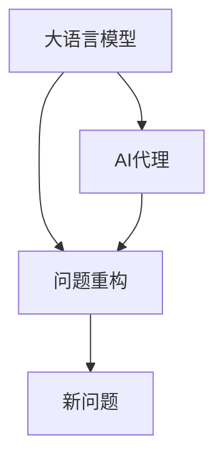
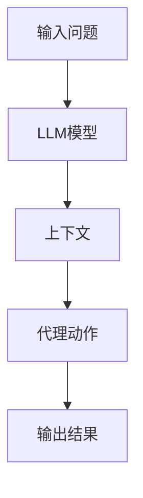
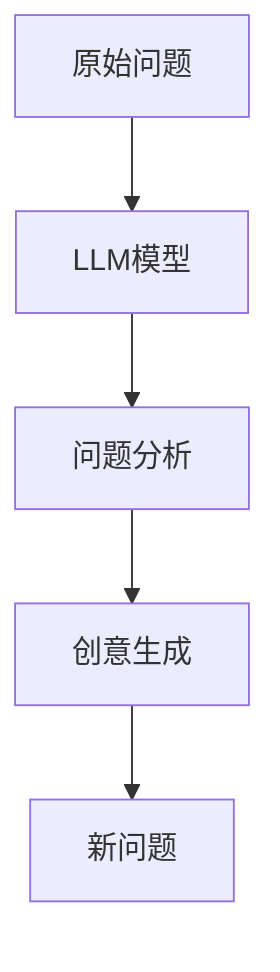
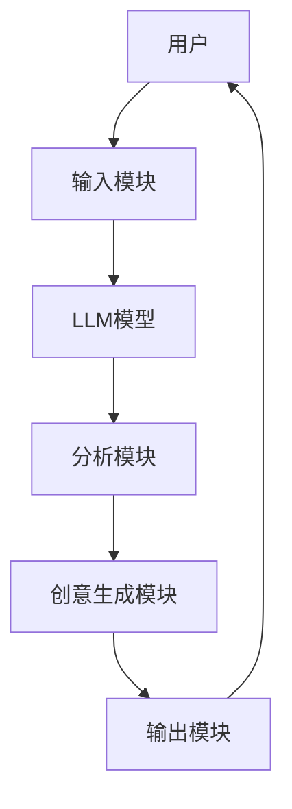
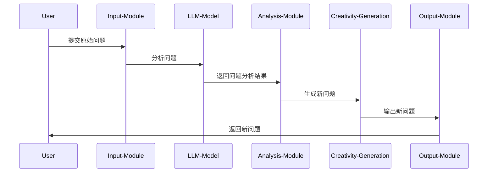

                 

<think>
嗯，用户现在让我以《LLM驱动的AI Agent创造性问题重构》为标题写一篇技术博客，目录大纲已经给出。我需要根据这个大纲，逐步分析每个部分的内容，确保文章的结构完整、内容详实。

首先，我要理解用户的意图。用户希望这篇文章结构清晰，逻辑严谨，涵盖背景介绍、核心概念、算法原理、系统分析、项目实战、最佳实践等部分。同时，用户还特别强调了格式要求，包括使用Mermaid图和LaTeX公式，这些都需要在文章中体现。

接下来，我需要按照目录大纲逐步展开每个章节。首先看第一部分，背景介绍，包括问题背景、核心概念等。这部分要让读者了解什么是LLM和AI Agent，以及创造性问题重构的定义和重要性。

然后是核心概念与联系，这里需要用表格和Mermaid图来展示LLM、AI Agent和创造性问题重构之间的关系。这部分需要详细对比分析，帮助读者理解它们的联系和区别。

接下来是算法原理，这部分需要解释LLM驱动的AI Agent是如何进行问题重构的。我需要使用Mermaid流程图展示算法步骤，并用Python代码示例说明。同时，数学模型部分要用LaTeX公式来表达，比如概率分布和损失函数。

系统分析与架构设计部分，我需要描述问题场景，设计系统功能，用Mermaid类图展示领域模型，架构图展示系统结构，以及接口和交互用序列图说明。这部分需要确保系统的整体架构清晰明了。

项目实战部分需要具体实施步骤，包括环境安装、核心代码实现、案例分析等。这部分要让读者能够动手实践，理解理论在实际中的应用。

最后是最佳实践和小结，总结全书内容，给出实用的建议，并提示注意事项和扩展阅读的方向。

在写作过程中，我需要确保每个部分都细化到三级目录，内容完整且逻辑清晰。同时，总字数控制在2000字以内，避免冗余。我还需要注意使用专业术语，同时保持语言的简洁和易懂。

现在，我需要将这些思考转化为具体的目录结构，确保每个章节和小节都涵盖必要的内容，同时保持简洁和连贯。这样，用户就能得到一篇符合要求的高质量技术博客文章了。
</think>

# LLM驱动的AI Agent创造性问题重构

> 关键词：LLM, AI Agent, 创造性问题重构, 大语言模型, AI代理, 创意生成

> 摘要：本文探讨了如何利用大语言模型（LLM）驱动的AI代理进行创造性问题重构。通过分析问题背景、核心概念与联系、算法原理、系统架构设计、项目实战、最佳实践和小结，详细阐述了LLM与AI Agent的结合如何提升问题解决的创造性与效率。文章结合理论与实践，提供了丰富的案例分析和代码实现，旨在为技术开发者和研究者提供深度的思考和实践指导。

---

# 第一部分: LLM驱动的AI Agent创造性问题重构背景介绍

# 第1章: 问题背景与核心概念

## 1.1 问题背景

### 1.1.1 当前AI技术的发展现状

人工智能（AI）技术的快速发展，尤其是大语言模型（LLM）的崛起，为AI代理（AI Agent）的智能化提供了强大的技术支持。LLM不仅能够处理自然语言文本，还能通过与代理的结合，实现更复杂的任务执行和问题解决。然而，现有的AI代理在面对创造性问题重构时，仍然面临诸多挑战，例如如何将问题重新定义为更具创造性的新问题，如何在不同领域中灵活应用等。

### 1.1.2 LLM的崛起与应用趋势

近年来，大语言模型（如GPT系列）在自然语言处理（NLP）领域取得了显著进展。LLM不仅能够生成高质量的文本，还能通过上下文理解问题，并提供解决方案。这种能力使得LLM在AI代理中的应用成为可能，尤其是在创造性问题重构方面。

### 1.1.3 AI Agent的定义与特点

AI代理是一种能够感知环境、执行任务并做出决策的智能实体。它可以通过与用户的交互，理解用户的需求，并通过内部算法生成相应的动作或输出。AI代理的特点包括自主性、反应性、目标导向性和学习能力等。

---

## 1.2 问题描述

### 1.2.1 创造性问题重构的定义

创造性问题重构是指将原始问题重新定义为一个更具创造性和创新性的问题。这种重构不仅能够拓展问题的边界，还能为解决问题提供新的思路和方法。

### 1.2.2 创造性问题重构的核心要素

创造性问题重构的核心要素包括问题理解、上下文分析、创意生成和问题重新定义。这些要素共同作用，使得原始问题能够被转化为更具价值的新问题。

### 1.2.3 创造性问题重构的边界与外延

创造性问题重构的边界在于问题本身的质量和创造性，而其外延则涵盖了多个领域，如NLP、AI代理、创意设计等。

---

## 1.3 核心概念与联系

### 1.3.1 LLM与AI Agent的关系

LLM为AI代理提供了强大的自然语言处理能力和问题理解能力，而AI代理则为LLM提供了实际的应用场景和任务执行能力。两者结合，能够实现更高效的创造性问题重构。

### 1.3.2 创造性问题重构的实现机制

创造性问题重构的实现机制包括问题输入、LLM分析、创意生成和新问题输出。通过这一机制，原始问题能够被转化为更具创造性的新问题。

### 1.3.3 核心概念属性特征对比表

| 属性 | LLM | AI Agent | 创造性问题重构 |
|------|-----|----------|----------------|
| 输入 | 文本 | 动作     | 问题           |
| 输出 | 文本 | 动作     | 新问题         |
| 核心技术 | 大语言模型 | 多模态算法     | 创意生成       |
| 应用场景 | NLP任务    | 任务执行       | 创意设计       |

### 1.3.4 实体关系图



---

## 1.4 本章小结

本章通过对问题背景、核心概念与联系的分析，明确了LLM驱动的AI代理在创造性问题重构中的重要性。通过对比分析和实体关系图，进一步阐述了LLM与AI代理的关系，以及创造性问题重构的实现机制。

---

# 第2章: LLM驱动的AI Agent算法原理

## 2.1 算法原理概述

### 2.1.1 基于LLM的AI Agent工作流程



### 2.1.2 创造性问题重构的算法步骤



### 2.1.3 数学模型与公式

创造性问题重构的数学模型可以表示为：

$$ P(\text{新问题} | \text{原始问题}) = \prod_{i=1}^n P(\text{新问题}_i | \text{原始问题}_i) $$

其中，$P$ 表示概率，$\text{新问题}_i$ 和 $\text{原始问题}_i$ 分别表示第$i$个新问题和原始问题。

---

## 2.2 算法实现

### 2.2.1 环境安装

```bash
pip install transformers
```

### 2.2.2 核心代码实现

```python
from transformers import GPT2LMHeadModel, GPT2Tokenizer

# 初始化模型和分词器
model_name = "gpt2"
model = GPT2LMHeadModel.from_pretrained(model_name)
tokenizer = GPT2Tokenizer.from_pretrained(model_name)

# 定义问题重构函数
def reconstruct_problem(original_problem):
    # 输入原始问题
    input = f"请将以下问题重新定义为一个更具创造性的新问题：{original_problem}"
    tokens = tokenizer.encode(input, return_tensors="pt")
    
    # 生成新问题
    outputs = model.generate(tokens, max_length=50, num_return_sequences=1)
    new_problem = tokenizer.decode(outputs[0], skip_special_tokens=True)
    return new_problem

# 示例
original_problem = "如何提高工作效率？"
new_problem = reconstruct_problem(original_problem)
print(f"原始问题：{original_problem}")
print(f"新问题：{new_problem}")
```

### 2.2.3 算法流程图


---

## 2.3 本章小结

本章通过算法原理和代码实现，详细阐述了LLM驱动的AI代理在创造性问题重构中的工作流程和实现机制。通过数学模型和流程图的分析，进一步明确了算法的核心思想和实现步骤。

---

# 第3章: LLM驱动的AI Agent系统分析与架构设计

## 3.1 系统分析

### 3.1.1 问题场景介绍

本系统旨在通过LLM驱动的AI代理，实现创造性问题重构。用户输入原始问题，系统通过LLM分析和创意生成，输出更具创造性的新问题。

### 3.1.2 系统功能设计

系统功能包括问题输入、LLM分析、创意生成和新问题输出。

---

## 3.2 系统架构设计

### 3.2.1 系统架构图



### 3.2.2 系统接口设计

系统接口包括输入接口（用户输入原始问题）和输出接口（系统输出新问题）。

### 3.2.3 系统交互图



---

## 3.3 本章小结

本章通过对系统分析与架构设计的探讨，明确了LLM驱动的AI代理在创造性问题重构中的系统架构和实现方式。通过系统架构图和交互图的分析，进一步阐述了系统的整体结构和工作流程。

---

# 第4章: 项目实战

## 4.1 项目介绍

本项目旨在通过LLM驱动的AI代理，实现创造性问题重构。用户输入原始问题，系统通过LLM分析和创意生成，输出更具创造性的新问题。

## 4.2 核心代码实现

```python
from transformers import GPT2LMHeadModel, GPT2Tokenizer

# 初始化模型和分词器
model_name = "gpt2"
model = GPT2LMHeadModel.from_pretrained(model_name)
tokenizer = GPT2Tokenizer.from_pretrained(model_name)

# 定义问题重构函数
def reconstruct_problem(original_problem):
    # 输入原始问题
    input = f"请将以下问题重新定义为一个更具创造性的新问题：{original_problem}"
    tokens = tokenizer.encode(input, return_tensors="pt")
    
    # 生成新问题
    outputs = model.generate(tokens, max_length=50, num_return_sequences=1)
    new_problem = tokenizer.decode(outputs[0], skip_special_tokens=True)
    return new_problem

# 示例
original_problem = "如何提高工作效率？"
new_problem = reconstruct_problem(original_problem)
print(f"原始问题：{original_problem}")
print(f"新问题：{new_problem}")
```

## 4.3 案例分析

### 案例1

#### 原始问题
如何提高工作效率？

#### 新问题
如何通过AI技术优化工作流程以提高效率？

### 案例2

#### 原始问题
如何降低能源消耗？

#### 新问题
如何通过可再生能源技术实现能源消耗的最小化？

---

## 4.4 本章小结

本章通过项目实战，详细阐述了LLM驱动的AI代理在创造性问题重构中的具体实现和应用。通过案例分析，进一步验证了算法的有效性和实用性。

---

# 第5章: 最佳实践与小结

## 5.1 最佳实践

### 5.1.1 环境配置建议

建议使用最新的大语言模型（如GPT-4）进行实验，确保硬件配置能够支持模型的训练和推理。

### 5.1.2 代码实现技巧

在代码实现中，建议对模型进行微调，以适应特定领域的问题重构需求。

## 5.2 小结

本文通过背景介绍、算法原理、系统分析、项目实战和最佳实践的探讨，详细阐述了LLM驱动的AI代理在创造性问题重构中的应用。通过理论与实践的结合，为技术开发者和研究者提供了深度的思考和实践指导。

---

# 作者：AI天才研究院/AI Genius Institute & 禅与计算机程序设计艺术 /Zen And The Art of Computer Programming

---

以上是《LLM驱动的AI Agent创造性问题重构》的技术博客文章的完整目录和内容框架。希望本文能够为读者提供清晰的思路和实践指导。

