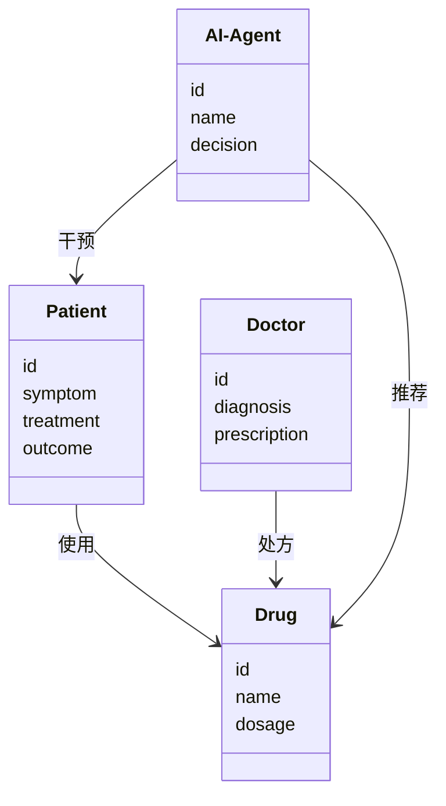
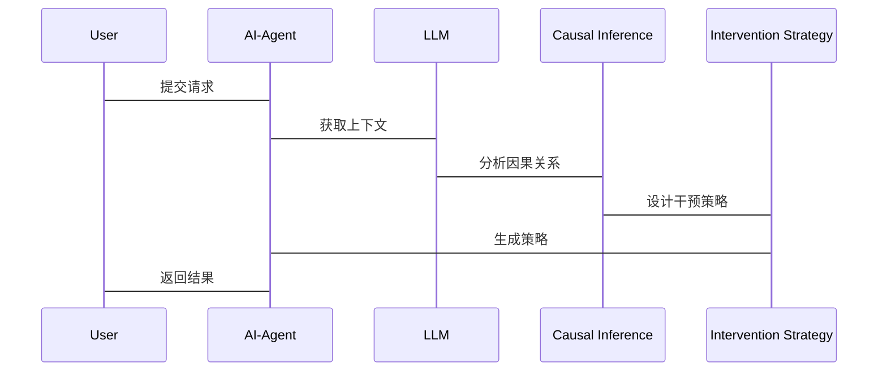

                 


# LLM驱动的AI Agent因果推理与干预

## 关键词：LLM, AI Agent, 因果推理, 干预, 机器学习, 人工智能

## 摘要：本文深入探讨了大语言模型（LLM）在驱动AI代理（AI Agent）中的因果推理与干预机制。从基础概念到算法实现，从系统架构到项目实战，详细解析了如何利用LLM进行因果分析，并设计干预策略以优化系统性能。通过实际案例分析，展示了LLM驱动的AI Agent在复杂场景中的应用潜力，并提出了未来研究的方向。

---

# 第1章: 背景介绍

## 1.1 问题背景

### 1.1.1 LLM驱动的AI Agent概念
大语言模型（LLM）如GPT-4、PaLM等，通过强大的语言理解和生成能力，为AI代理提供了自然语言交互和决策支持的基础。AI代理需要在复杂环境中理解任务、推理因果关系，并通过干预实现目标。LLM作为核心驱动力，能够帮助AI代理理解上下文、生成合理行动方案，并评估行动结果。

### 1.1.2 因果推理与干预的必要性
在动态复杂的环境中，AI代理需要不仅仅依赖相关性进行预测，还需要理解因果关系以做出干预。例如，在医疗领域，AI代理需要理解药物对患者的影响是否是因果关系，而非仅仅是相关关系。因果推理帮助AI代理预测干预措施的效果，并优化决策过程。

### 1.1.3 当前技术的局限性与挑战
尽管LLM在自然语言处理方面取得了显著进展，但在因果推理和干预方面仍存在诸多挑战。现有模型难以处理复杂的因果关系链，干预措施的效果难以准确预测，且缺乏可解释性。此外，动态变化的环境也增加了干预的难度。

## 1.2 问题描述

### 1.2.1 LLM在AI Agent中的角色
LLM作为AI代理的核心驱动力，负责自然语言理解、生成决策建议、评估行动结果等任务。LLM通过上下文理解和生成能力，帮助AI代理制定干预策略。

### 1.2.2 因果推理的核心问题
因果推理的核心问题在于识别因果关系，即确定变量之间的因果关系链，并评估干预措施的效果。这需要理解变量之间的因果关系，而不仅仅是相关关系。

### 1.2.3 干预机制的设计与实现
干预机制的设计需要考虑干预目标、干预方式、干预效果评估等多个方面。干预机制需要能够根据因果推理结果动态调整干预策略，以实现最优效果。

## 1.3 问题解决

### 1.3.1 LLM驱动AI Agent的解决方案
通过将LLM与因果推理算法相结合，构建能够理解因果关系、生成干预策略的AI代理。LLM提供语言理解和生成能力，因果推理算法提供理论支持，共同实现干预机制。

### 1.3.2 因果推理与干预的结合
因果推理用于分析变量之间的因果关系，干预机制基于因果关系进行策略生成和效果预测。两者的结合使AI代理能够理解干预措施的实际效果，并动态调整策略。

### 1.3.3 技术实现的路径与方法
通过构建因果图、训练因果推理模型、设计干预策略生成算法等步骤，实现LLM驱动的AI代理。具体方法包括：数据收集与预处理、因果关系建模、干预效果预测等。

## 1.4 边界与外延

### 1.4.1 LLM驱动AI Agent的边界
LLM驱动的AI代理主要关注因果推理与干预，边界包括：仅处理因果关系，不涉及其他类型的关系分析；干预机制仅基于因果推理结果，不考虑随机性因素等。

### 1.4.2 因果推理与干预的适用范围
因果推理适用于需要理解变量之间因果关系的场景，干预适用于需要主动改变系统状态的场景。两者结合适用于医疗、教育、金融等领域。

### 1.4.3 相关技术的对比与区别
与传统的相关分析不同，因果推理关注变量之间的因果关系；与预测模型不同，干预机制关注如何通过改变变量实现目标。两者在目标和方法上有显著区别。

## 1.5 核心概念组成

### 1.5.1 LLM的基本概念
LLM是一种基于深度学习的自然语言处理模型，能够理解和生成人类语言。它通过大规模数据训练，掌握了语言的规律和语义。

### 1.5.2 AI Agent的核心要素
AI代理包括感知、决策、执行、反馈四大模块。感知模块负责获取环境信息，决策模块基于信息做出决策，执行模块负责执行决策，反馈模块用于评估效果并调整策略。

### 1.5.3 因果推理的定义
因果推理是指从数据中推断出变量之间的因果关系的过程。通过因果推理，可以确定变量之间的因果关系链，并预测干预措施的效果。

---

# 第2章: 核心概念与联系

## 2.1 因果推理的原理

### 2.1.1 潜在结果框架
潜在结果框架是因果推理的基础。对于每个单位，存在在不同处理下的潜在结果。通过观察数据，推断出因果效应。

### 2.1.2 结构方程模型
结构方程模型（SEM）通过构建变量之间的方程，描述变量之间的因果关系。模型包括观测变量和潜在变量，能够处理复杂的因果关系网络。

### 2.1.3 因果图的构建与分析
因果图（DAG）通过有向图描述变量之间的因果关系。通过构建DAG，可以识别因果路径，分析变量之间的依赖关系。

## 2.2 干预机制的实现

### 2.2.1 干预策略的设计
干预策略的设计需要考虑干预目标、干预方式、干预强度等因素。基于因果推理结果，设计最优干预策略。

### 2.2.2 干预效果的评估
干预效果的评估需要考虑因果关系，避免混淆变量的影响。通过反事实推理等方法，评估干预措施的效果。

### 2.2.3 干预的可解释性与鲁棒性
干预机制需要具备可解释性，使得用户能够理解干预措施的因果逻辑。同时，干预机制需要具备鲁棒性，能够适应环境的变化。

## 2.3 LLM与因果推理的联系

### 2.3.1 LLM在因果推理中的作用
LLM可以通过自然语言理解因果关系，辅助因果推理算法进行分析。LLM还可以生成因果关系描述，帮助用户理解因果关系。

### 2.3.2 因果推理对LLM的增强
因果推理可以提高LLM的决策能力，使其不仅仅依赖相关性，还能理解因果关系，做出更合理的决策。

### 2.3.3 LLM驱动的干预机制
LLM可以辅助干预机制生成干预策略，通过语言生成能力，制定合理的干预措施，并评估干预效果。

## 2.4 核心概念对比表

### 2.4.1 因果推理与相关分析的对比

| 对比维度 | 因果推理 | 相关分析 |
|----------|----------|----------|
| 目标     | 确定因果关系 | 描述变量之间的相关性 |
| 方法     | 构建因果图、结构方程模型 | 计算相关系数、回归分析 |
| 应用场景 | 需要理解因果关系的场景 | 需要描述变量之间关系的场景 |

### 2.4.2 干预与预测的对比

| 对比维度 | 干预 | 预测 |
|----------|------|------|
| 目标     | 改变系统状态 | 预测系统状态 |
| 方法     | 设计干预策略 | 建立预测模型 |
| 应用场景 | 需要主动改变系统状态的场景 | 需要预测系统未来状态的场景 |

## 2.5 ER实体关系图

```mermaid
erDiagram
    actor LLM {
        id
        name
    }
    actor AI-Agent {
        id
        name
    }
    actor 干预机制 {
        id
        name
    }
    actor 因果推理 {
        id
        name
    }
    LLM --> AI-Agent: 驱动
    AI-Agent --> 干预机制: 设计
    干预机制 --> 因果推理: 基于
```

---

# 第3章: 算法原理讲解

## 3.1 潜在结果框架

### 3.1.1 潜在结果框架的数学模型
对于每个单位i，存在在不同处理下的潜在结果：
$$ Y_i^{(t)} $$
处理变量T的值为t时，观测到的结果为：
$$ Y_i = Y_i^{(T_i)} $$

### 3.1.2 平均处理效应(ATE)
平均处理效应（ATE）定义为：
$$ ATE = E[Y_i^{(1)} - Y_i^{(0)}] $$

### 3.1.3 估计方法
通过反事实推理，利用观测数据估计ATE。具体步骤包括：
1. 构建因果图
2. 确定无偏的估计量
3. 估计ATE

## 3.2 结构方程模型

### 3.2.1 结构方程模型的数学表达
结构方程模型通过以下方程描述变量之间的关系：
$$ Y = \beta X + \gamma Z + \epsilon $$

其中，X是处理变量，Z是混淆变量，$\epsilon$是误差项。

### 3.2.2 参数估计
通过最大似然估计等方法，估计模型参数。具体步骤包括：
1. 构建模型
2. 估计参数
3. 检验模型假设

## 3.3 因果图的构建与分析

### 3.3.1 因果图的构建步骤
1. 确定变量
2. 确定因果关系
3. 构建DAG
4. 检查DAG的合理性

### 3.3.2 因果图的分析方法
通过DAG识别因果路径，分析变量之间的依赖关系。具体方法包括：
1. 确定因果路径
2. 分析间接和直接效应
3. 检查潜在的混淆变量

## 3.4 干预效果的预测

### 3.4.1 干预效果的数学表达
干预效果可以通过反事实推理进行预测：
$$ Y_i^{(t)} = \beta t + \gamma Z_i + \epsilon_i $$

### 3.4.2 干预效果的估计方法
通过结构方程模型或潜在结果框架，估计干预效果。具体步骤包括：
1. 构建模型
2. 估计参数
3. 预测干预效果

## 3.5 算法实现

### 3.5.1 算法流程
1. 数据预处理
2. 构建因果图
3. 估计因果效应
4. 设计干预策略
5. 评估干预效果

### 3.5.2 Python代码实现

```python
import pandas as pd
from causalnex.structure import identify_vars
from causalnex.structure import identify_backdoor Criterion
from causalnex.structure import StructureModel
from causalnex因果推理 import do_query

# 数据预处理
data = pd.read_csv('data.csv')
treatment = 'T'  # 处理变量
outcome = 'Y'    # 结果变量

# 构建因果图
sm = StructureModel(data, treatment, outcome)
sm.fit()

# 识别后门调节量
backdoor = identify_backdoor_criterion(sm, treatment, outcome)

# 估计因果效应
ate = do_query(sm, treatment, outcome, backdoor)
print(f'ATE: {ate}')
```

## 3.6 代码解读与分析

### 3.6.1 数据预处理
读取数据，确定处理变量和结果变量。

### 3.6.2 构建因果图
使用StructureModel构建因果图，自动识别变量之间的关系。

### 3.6.3 识别后门调节量
通过backdoor criterion识别后门调节量，用于调整因果效应估计。

### 3.6.4 估计因果效应
使用do_query函数估计平均处理效应（ATE）。

### 3.6.5 结果输出
打印平均处理效应（ATE）。

---

# 第4章: 系统分析与架构设计

## 4.1 问题场景介绍

### 4.1.1 场景描述
在一个医疗场景中，AI代理需要通过因果推理分析不同药物对患者的影响，并设计干预策略优化治疗效果。

### 4.1.2 问题分析
需要理解药物对患者的影响是否是因果关系，设计干预措施优化治疗效果。

## 4.2 系统功能设计

### 4.2.1 领域模型类图



### 4.2.2 系统架构图


### 4.2.3 系统接口设计
1. API接口：提供因果推理和干预策略生成的接口。
2. 数据接口：读取和写入数据。
3. 用户接口：与用户交互，获取输入和显示结果。

### 4.2.4 系统交互流程



---

# 第5章: 项目实战

## 5.1 环境安装

### 5.1.1 安装依赖
安装必要的Python库，如pandas、numpy、causalnex等。

### 5.1.2 配置环境
配置LLM模型，如使用Hugging Face的GPT模型。

## 5.2 核心代码实现

### 5.2.1 数据预处理
读取数据，清洗数据，处理缺失值。

### 5.2.2 因果推理模型训练
训练因果推理模型，构建因果图，估计因果效应。

### 5.2.3 干预策略生成
基于因果推理结果，生成干预策略，预测干预效果。

## 5.3 代码解读与分析

### 5.3.1 数据预处理代码

```python
import pandas as pd

data = pd.read_csv('data.csv')
data.dropna(inplace=True)
data.to_csv('clean_data.csv', index=False)
```

### 5.3.2 因果推理模型训练代码

```python
from causalnex.structure import StructureModel

sm = StructureModel(clean_data, 'treatment', 'outcome')
sm.fit()
```

### 5.3.3 干预策略生成代码

```python
from causalnex因果推理 import do_query

ate = do_query(sm, 'treatment', 'outcome', backdoor)
print(f'ATE: {ate}')
```

## 5.4 案例分析与解读

### 5.4.1 案例背景
在医疗场景中，分析不同药物对患者症状的影响，设计干预策略优化治疗效果。

### 5.4.2 数据分析
通过因果推理分析药物对症状的影响，识别因果效应，设计干预策略。

### 5.4.3 结果解读
通过干预策略生成，预测干预效果，评估策略的有效性。

## 5.5 项目小结

### 5.5.1 项目总结
通过项目实战，验证了LLM驱动的AI代理在因果推理与干预中的应用潜力。

### 5.5.2 实践中的注意事项
数据质量、因果关系的复杂性、干预效果的可解释性等。

---

# 第6章: 最佳实践与小结

## 6.1 小结

### 6.1.1 核心观点总结
LLM驱动的AI代理在因果推理与干预中具有重要作用，通过因果推理可以理解因果关系，设计干预策略优化系统性能。

### 6.1.2 技术实现总结
通过构建因果图、训练因果推理模型、设计干预策略生成算法，实现LLM驱动的AI代理。

## 6.2 最佳实践 tips

### 6.2.1 数据质量
确保数据质量，清洗数据，处理缺失值，避免数据偏差。

### 6.2.2 模型选择
选择合适的因果推理模型，根据具体场景选择适合的算法。

### 6.2.3 可解释性
注重干预机制的可解释性，使用户能够理解干预措施的因果逻辑。

### 6.2.4 鲁棒性
设计鲁棒的干预机制，能够适应环境的变化，避免因环境变化导致干预失败。

## 6.3 展望与未来方向

### 6.3.1 技术发展
因果推理与干预技术的进一步融合，提高LLM的决策能力。

### 6.3.2 应用场景
扩展到更多领域，如教育、金融、医疗等，实现更广泛的应用。

### 6.3.3 研究方向
深入研究因果推理算法，提高干预机制的智能性和效果预测的准确性。

---

# 第7章: 附录

## 7.1 参考文献

### 7.1.1 主要参考文献
1. Pearl, J. (2009). Causality: Models, reasoning, and inference.
2. Judea Pearl, M. Glymour, and N. P. Jewell. Causal Inference: What If? 2020.
3. 贝叶斯网络相关文献。

### 7.1.2 其他参考文献
1. GPT模型相关论文。
2. 大语言模型相关研究。

## 7.2 工具与资源

### 7.2.1 因果推理工具
1. causalnex: Python库，用于因果推理和干预分析。
2. doWhy: Python库，用于因果推理。

### 7.2.2 大语言模型工具
1. Hugging Face: 提供多种LLM模型。
2. OpenAI API: 提供GPT系列模型。

## 7.3 代码仓库

### 7.3.1 代码示例
提供因果推理与干预的Python代码示例，读者可以参考实现。

---

# 作者：AI天才研究院 & 禅与计算机程序设计艺术

---

通过以上思考过程，我们可以系统地撰写一篇结构清晰、内容详实的《LLM驱动的AI Agent因果推理与干预》技术博客文章，满足用户的需求。

