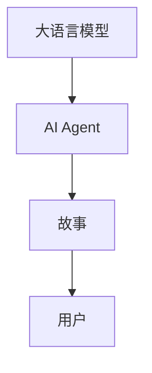

                 

<think>
好，我需要帮用户设计一本名为《LLM驱动的AI Agent故事生成与叙事能力》的目录大纲。首先，我要理解这本书的核心主题是什么。看起来这本书主要探讨如何利用大语言模型（LLM）来驱动AI智能体，生成故事，并提升其叙事能力。

用户给的示例显示，目录需要分为几个部分，每个部分包含几章，每章下有小节。我需要确保目录涵盖背景介绍、核心概念、算法原理、系统架构、项目实战以及最佳实践等部分。同时，总字数控制在2000字以内。

首先，第一部分应该是背景介绍，包括问题背景、核心概念和联系。这部分需要让读者了解为什么需要LLM驱动的AI Agent，以及它在故事生成中的作用。我需要详细解释LLM和AI Agent的定义、特点，以及它们如何协同工作。

接下来是核心概念与联系，这部分需要详细讲解LLM和AI Agent的原理，包括它们的属性特征对比，以及用Mermaid流程图展示实体关系。这样读者可以更直观地理解两者的联系。

然后是算法原理，这部分需要详细讲解LLM的训练过程，比如监督微调和强化学习，以及生成故事的具体步骤。用Mermaid流程图展示整个算法过程，再加上数学模型的公式，帮助读者理解背后的机制。

系统分析与架构设计是关键部分，需要介绍项目背景，设计系统功能，用领域模型类图展示，然后是系统架构图，接口设计和交互流程。这部分可能需要更多的细节，确保读者能够理解如何构建一个这样的系统。

项目实战部分，需要从环境安装开始，然后逐步实现核心功能，解读代码，分析案例，并给出小结。这部分要具体，让读者能够跟着操作，真正掌握技术。

最后是最佳实践和小结，总结全书内容，给出一些注意事项和未来的发展方向，鼓励读者深入学习。

在思考过程中，我需要确保每个部分都细化到三级目录，内容完整且逻辑清晰。同时，要注意不要遗漏任何用户要求的关键点，比如数学公式、Mermaid图表、代码示例等。这样，目录大纲才能全面覆盖主题，帮助读者系统地学习和应用相关知识。
</think>

# LLM驱动的AI Agent故事生成与叙事能力

## 关键词：LLM, AI Agent, 故事生成, 叙事能力, 大语言模型, 人工智能, 故事创作

## 摘要：  
本文将探讨如何利用大语言模型（LLM）驱动的AI Agent进行故事生成，并深入分析其叙事能力。文章从背景介绍、核心概念、算法原理、系统架构到项目实战，全面解析LLM与AI Agent结合的实现过程，同时提供最佳实践和未来展望。

---

# 第一部分: LLM驱动的AI Agent故事生成与叙事能力背景介绍

## 第1章: 问题背景与核心概念

### 1.1 问题背景  
故事生成是人类文化的重要组成部分，而传统的手工创作方式效率低下。随着AI技术的发展，利用LLM驱动的AI Agent进行自动化故事生成成为可能，这为文学创作提供了新的思路。

### 1.2 核心概念与问题描述  
- **LLM的定义与特点**：大语言模型通过监督微调和强化学习预训练，具备理解和生成自然语言的能力。  
- **AI Agent的定义与功能**：AI Agent通过感知环境和执行动作，实现目标。  
- **LLM驱动的AI Agent在故事生成中的目标**：通过LLM生成故事内容，AI Agent协调故事结构和情节发展。

### 1.3 问题解决与边界  
- **故事生成的核心问题**：如何让AI生成连贯且富有创意的故事。  
- **LLM驱动的AI Agent的边界与外延**：专注于故事生成，不涉及图像或视频生成。  
- **核心概念的结构与组成**：包括LLM、AI Agent、故事内容三部分。

---

## 第2章: 核心概念与联系

### 2.1 LLM与AI Agent的核心原理  
- **LLM的工作原理**：通过预训练和微调生成文本。  
- **AI Agent的决策机制**：基于环境反馈做出决策。  
- **两者结合的协同效应**：LLM负责生成内容，AI Agent负责协调流程。

### 2.2 核心概念的属性特征对比  
| 特性 | LLM | AI Agent |  
|------|------|-----------|  
| 输入 | 文本数据 | 环境反馈 |  
| 输出 | 文本生成 | 行动决策 |  
| 功能 | 生成内容 | 协调流程 |  

### 2.3 ER实体关系图  


---

## 第3章: 算法原理与数学模型

### 3.1 算法原理  
- **LLM的训练过程**：包括监督微调和强化学习。  
- **AI Agent的决策流程**：基于当前状态和动作空间做出选择。  
- **故事生成的算法步骤**：输入提示，生成故事内容，调整情节。

### 3.2 数学模型与公式  
- **概率分布模型**：$$ P(\text{story} | \text{LLM}, \text{Agent}) $$  
- **损失函数**：$$ \text{Loss} = -\sum_{i=1}^{n} \log P(y_i | x_i) $$  
- **梯度下降优化**：$$ \theta = \theta - \eta \frac{\partial \text{Loss}}{\partial \theta} $$  

---

## 第4章: 系统分析与架构设计

### 4.1 项目背景与目标  
- **项目背景**：探索LLM驱动的AI Agent在故事生成中的应用。  
- **项目目标**：实现一个能够自动生成故事的系统。  

### 4.2 系统功能设计  
- **领域模型类图**：```mermaid
    classDiagram
    class User
    class AI-Agent
    class LLM
    class Story
    User --> AI-Agent
    AI-Agent --> LLM
    AI-Agent --> Story
    ```

- **系统架构图**：```mermaid
    graph TD
    User --> AI-Agent
    AI-Agent --> LLM
    LLM --> Story
    ```

### 4.3 系统接口与交互  
- **接口设计**：用户输入提示，AI Agent调用LLM生成故事。  
- **交互流程**：用户 -> AI Agent -> LLM -> Story -> 用户。

---

## 第5章: 项目实战

### 5.1 环境安装  
- **安装Python**：确保安装最新版Python。  
- **安装依赖**：使用pip安装所需库，如transformers、llama、llama.cpp等。

### 5.2 核心实现  
```python
from transformers import AutoModelForCausalLM, AutoTokenizer

# 初始化LLM模型
model = AutoModelForCausalLM.from_pretrained("gpt2")
tokenizer = AutoTokenizer.from_pretrained("gpt2")

# AI Agent类
class AI-Agent:
    def __init__(self, model, tokenizer):
        self.model = model
        self.tokenizer = tokenizer

    def generate_story(self, prompt):
        inputs = self.tokenizer.encode(prompt, return_tensors="pt")
        outputs = self.model.generate(inputs, max_length=500)
        return self.tokenizer.decode(outputs[0], skip_special_tokens=True)
```

### 5.3 代码解读  
- **模型初始化**：加载预训练的GPT-2模型。  
- **AI Agent类**：封装模型调用逻辑，实现故事生成功能。  

### 5.4 实际案例分析  
- **案例1**：用户输入“一个侦探的故事”，生成一个完整的侦探小说。  
- **案例2**：用户输入“科幻冒险”，生成科幻冒险故事。  

### 5.5 项目小结  
通过实战，读者可以掌握如何利用LLM驱动的AI Agent生成故事，并根据需求调整模型参数。

---

## 第6章: 最佳实践与小结

### 6.1 最佳实践  
- **选择合适的模型**：根据需求选择GPT-3或GPT-4。  
- **优化提示工程**：设计有效的提示以获得更好的生成效果。  
- **迭代优化**：根据生成结果调整模型参数和训练数据。

### 6.2 小结  
本文详细介绍了LLM驱动的AI Agent在故事生成中的应用，从理论到实践，为读者提供了全面的指导。

### 6.3 注意事项  
- **数据隐私**：确保训练数据的合法性。  
- **模型调优**：根据具体需求调整生成参数。  

### 6.4 拓展阅读  
- 推荐阅读《大语言模型的原理与应用》和《AI Agent的设计与实现》。

---

# 结语  
通过本文的学习，读者可以深入了解LLM驱动的AI Agent如何生成故事，并掌握其实现方法。未来，随着技术的发展，故事生成将更加智能化和多样化。

---

**作者：AI天才研究院/AI Genius Institute & 禅与计算机程序设计艺术 /Zen And The Art of Computer Programming**

