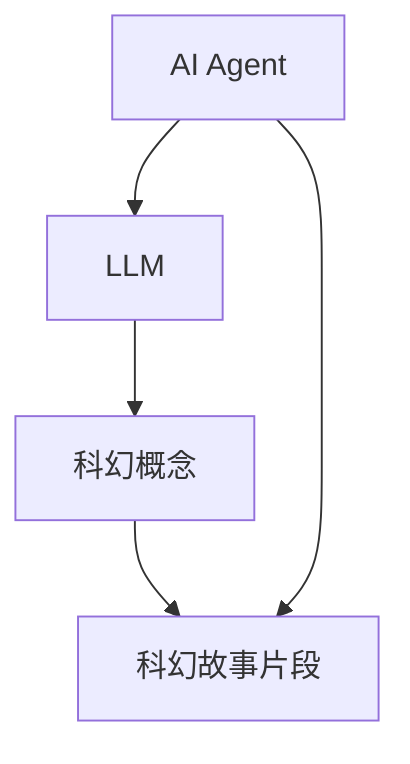
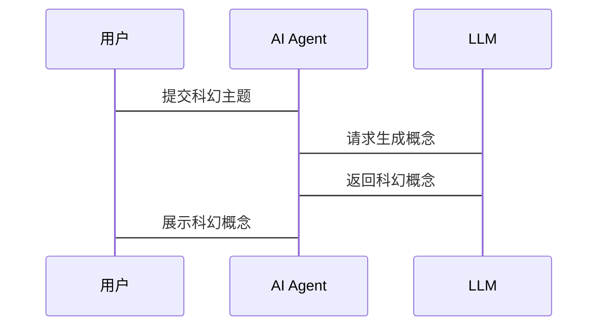

                 

<think>
好的，我现在需要帮用户设计一个详细的目录大纲，用于撰写一篇关于《LLM驱动的AI Agent科幻概念生成器》的技术博客文章。用户的要求非常具体，包括关键词、摘要，以及详细的目录结构，每个部分都需要有章节和小节，甚至三级目录。

首先，我需要理解用户的需求。用户希望这篇文章结构清晰、逻辑紧凑，使用专业的技术语言，同时要包含详细的分析和推理过程。用户还提到要使用特定的工具，比如Mermaid图和Python代码示例，来解释算法和系统架构。

接下来，我考虑如何组织这些内容。根据用户提供的示例，文章需要从背景介绍开始，逐步深入到核心概念、算法原理、系统架构设计、项目实战，最后总结。每个部分都需要细化，确保内容全面且详细。

在引言部分，我需要介绍AI Agent和LLM的基本概念，分析科幻创作的现状和挑战，然后引出AI Agent在科幻创作中的应用。这部分需要包括背景介绍、问题描述、问题解决、边界与外延，以及核心概念的结构和组成。

核心概念部分，我需要详细讲解AI Agent和科幻概念生成的原理，包括它们各自的定义、分类、工作方式，以及它们之间的联系。这里可以使用对比表格和ER实体关系图来帮助读者理解。

算法原理部分，我需要详细描述生成科幻概念的算法，使用Mermaid流程图展示步骤，同时用Python代码实现示例，解释每个步骤的数学模型和公式。这部分需要确保代码和流程图清晰易懂，同时举例说明如何应用。

系统架构设计部分，我需要介绍系统的整体架构，包括领域模型、系统架构图、接口设计和交互流程。这部分可能需要用到Mermaid的类图和序列图来展示系统的各个部分及其交互。

项目实战部分，我需要提供实际操作的步骤，包括环境安装、代码实现、案例分析和详细解读。这部分需要具体，确保读者能够跟着步骤完成一个简单的项目。

最后，总结部分需要涵盖最佳实践、小结、注意事项和未来展望，帮助读者巩固所学内容，并思考未来的发展方向。

在撰写过程中，我需要确保每个部分都详细且逻辑清晰，使用专业术语，同时保持易懂。用户特别强调了数学公式和代码示例的使用，我需要在适当的地方嵌入这些内容，并正确使用LaTeX格式。

现在，我需要将这些思考整合成一个结构清晰的目录大纲，确保覆盖用户的所有要求，并在每个部分中详细展开，确保文章字数在10000到12000字之间。

可能的挑战是如何在有限的篇幅内涵盖所有内容，同时保持逻辑流畅。我需要合理分配每个部分的字数，确保重点内容得到充分展开，同时避免过于冗长。

总结来说，我需要一步步构建目录，从引言到总结，每个部分都细化到三级目录，确保内容全面且符合用户的要求。
</think>

# LLM驱动的AI Agent科幻概念生成器

> 关键词：LLM，AI Agent，科幻创作，概念生成，人工智能，自然语言处理

> 摘要：本文探讨了如何利用大语言模型（LLM）驱动的AI Agent来生成科幻概念。通过分析AI Agent的核心原理、科幻概念生成的逻辑框架、相关算法和系统架构，本文详细介绍了如何构建一个能够生成科幻故事片段的系统。文章内容涵盖背景介绍、核心概念原理、算法流程图、系统架构设计、项目实战以及总结与展望。

---

## 第一部分：引言

### 第1章：背景介绍
#### 1.1 问题背景
- **1.1.1 AI Agent的概念与现状**
  - AI Agent的定义
  - AI Agent的分类与应用场景
  - 当前AI Agent技术的发展趋势

- **1.1.2 大语言模型（LLM）的崛起**
  - LLM的基本概念
  - LLM在自然语言处理中的应用
  - LLM与AI Agent的结合

- **1.1.3 科幻创作的数字化趋势**
  - 科幻创作的特点
  - 数字化创作工具的发展
  - LLM在科幻创作中的潜力

#### 1.2 问题描述
- **1.2.1 科幻创作中的痛点**
  - 创作灵感获取困难
  - 故事逻辑的合理性验证
  - 多样化风格的需求

- **1.2.2 LLM在科幻创作中的潜力**
  - LLM生成创意的能力
  - LLM在情节构建中的应用
  - LLM辅助写作的优势

- **1.2.3 AI Agent在科幻创作中的角色**
  - AI Agent作为创作助手
  - AI Agent在科幻世界构建中的作用
  - AI Agent与人类创作者的协作模式

#### 1.3 问题解决
- **1.3.1 LLM驱动AI Agent的核心思想**
  - 利用LLM进行概念生成
  - AI Agent作为用户与LLM之间的桥梁
  - 通过人机协作实现科幻创作

- **1.3.2 AI Agent在科幻创作中的具体应用**
  - 生成科幻故事大纲
  - 创作科幻场景描述
  - 辅助角色设定与情节发展

- **1.3.3 科幻概念生成的实现路径**
  - 输入需求分析
  - LLM生成初步概念
  - AI Agent优化与调整

#### 1.4 边界与外延
- **1.4.1 科幻概念生成的边界**
  - 生成内容的合理性边界
  - 创意生成的多样性边界
  - 生成内容的版权问题

- **1.4.2 LLM驱动AI Agent的局限性**
  - LLM的生成质量
  - AI Agent的决策能力
  - 系统的可解释性

- **1.4.3 科幻创作与AI生成的结合点**
  - 创作流程中的AI辅助
  - 创作者与AI Agent的协作模式
  - 科幻创作的未来发展方向

#### 1.5 概念结构与核心要素组成
- **1.5.1 AI Agent的核心要素**
  - 输入：用户需求
  - 输出：科幻概念
  - 内部：LLM驱动的逻辑推理

- **1.5.2 LLM在科幻创作中的作用**
  - 生成创意
  - 构建世界观
  - 辅助写作

- **1.5.3 科幻概念生成的系统架构**
  - 输入模块
  - 处理模块
  - 输出模块

---

## 第二部分：核心概念与联系

### 第2章：核心概念原理
#### 2.1 AI Agent的原理
- **2.1.1 AI Agent的定义与分类**
  - 定义：AI Agent的定义
  - 分类：基于任务的AI Agent、基于知识的AI Agent等

- **2.1.2 LLM在AI Agent中的应用**
  - LLM作为AI Agent的核心模块
  - LLM驱动的自然语言理解与生成

- **2.1.3 AI Agent的决策机制**
  - 基于LLM的决策模型
  - 多轮对话中的决策逻辑

#### 2.2 科幻概念生成的原理
- **2.2.1 科幻概念的定义与特征**
  - 定义：科幻概念的定义
  - 特征：创新性、科学性、情节性

- **2.2.2 科幻概念生成的逻辑框架**
  - 主题提取
  - 情节生成
  - 角色设定

- **2.2.3 LLM在科幻创作中的优势**
  - 大规模数据支持
  - 自然语言生成能力
  - 多样化风格输出

#### 2.3 核心概念属性特征对比表格
| 特性 | AI Agent | 科幻概念生成 |
|------|----------|--------------|
| 输入 | 用户指令 | 科幻主题需求 |
| 输出 | 行动方案 | 科幻故事片段 |
| 核心 | 智能决策 | 创意生成 |
| 依赖 | LLM模型 | 文本生成能力 |

#### 2.4 ER实体关系图


---

## 第三部分：算法原理讲解

### 第3章：生成科幻概念的算法流程
#### 3.1 算法流程图
```mermaid
graph TD
    Start --> Input
    Input --> LLM
    LLM --> Output
    Output --> AI Agent
    AI Agent --> End
```

#### 3.2 数学模型和公式
- **3.2.1 概率生成模型**
  - $P(\text{output}|\text{input}) = \text{LLM}(\text{input})$
- **3.2.2 对抗训练模型**
  - $D(x) = P(x \text{是真实的})$
  - $G(z) = \text{生成的科幻概念}$
  - 目标函数：$\min_{G}\max_{D} \mathbb{E}_{x \sim P(x)}[\log D(x)] + \mathbb{E}_{z \sim P(z)}[\log (1 - D(G(z)))]$

#### 3.3 Python代码实现示例
```python
def generate科幻概念(llm_model, input_prompt):
    with llm_model.chat():
        prompt = input_prompt
        response = llm_model.send_message(prompt)
        return response.get_message()
```

---

## 第四部分：系统分析与架构设计方案

### 第4章：系统架构设计
#### 4.1 问题场景介绍
- 科幻概念生成系统的应用场景
- 系统的核心目标

#### 4.2 项目介绍
- 项目目标
- 项目范围
- 项目架构

#### 4.3 系统功能设计
- 领域模型设计
  ```mermaid
  classDiagram
      class AI Agent {
          输入模块
          处理模块
          输出模块
      }
      class LLM {
          模型参数
          训练模块
          生成模块
      }
      class 科幻概念 {
          主题
          情节
          角色
      }
      AI Agent --> LLM
      LLM --> 科幻概念
  ```

#### 4.4 系统架构设计
- 系统架构图
  ```mermaid
  graph LR
      A[AI Agent] --> B[LLM]
      B --> C[科幻概念]
      C --> D[用户界面]
  ```

#### 4.5 系统接口设计
- 输入接口
- 输出接口
- 内部接口

#### 4.6 系统交互流程


---

## 第五部分：项目实战

### 第5章：环境安装与系统实现
#### 5.1 环境安装
- 安装Python
- 安装相关库（如Hugging Face的Transformers库）

#### 5.2 系统核心实现
- LLM驱动的AI Agent代码实现
  ```python
  from transformers import GPT2LMHeadModel, GPT2Tokenizer

  model_name = 'gpt2'
  tokenizer = GPT2Tokenizer.from_pretrained(model_name)
  model = GPT2LMHeadModel.from_pretrained(model_name)

  def generate_concept(prompt):
      inputs = tokenizer.encode(prompt, return_tensors='np')
      outputs = model.generate(inputs, max_length=50, do_sample=True)
      return tokenizer.decode(outputs[0], skip_special_tokens=True)
  ```

#### 5.3 代码应用解读与分析
- 代码功能分析
- 代码优化建议

#### 5.4 实际案例分析
- 案例1：生成科幻小说大纲
- 案例2：生成科幻电影剧本

#### 5.5 项目小结
- 项目成果
- 经验总结

---

## 第六部分：总结与展望

### 第6章：总结与展望
#### 6.1 最佳实践 tips
- LLM驱动AI Agent的使用建议
- 科幻概念生成的优化技巧

#### 6.2 小结
- 本文的核心内容回顾
- 系统设计的关键点总结

#### 6.3 注意事项
- 系统使用的注意事项
- LLM生成内容的验证与调整

#### 6.4 拓展阅读
- 推荐的相关书籍和论文
- 未来研究方向

---

## 作者：AI天才研究院/AI Genius Institute & 禅与计算机程序设计艺术 /Zen And The Art of Computer Programming

---

以上是一个详细的目录大纲，按照用户的要求，包含了各个部分的细化内容，确保逻辑清晰、结构紧凑，并且符合专业技术博客的风格。

