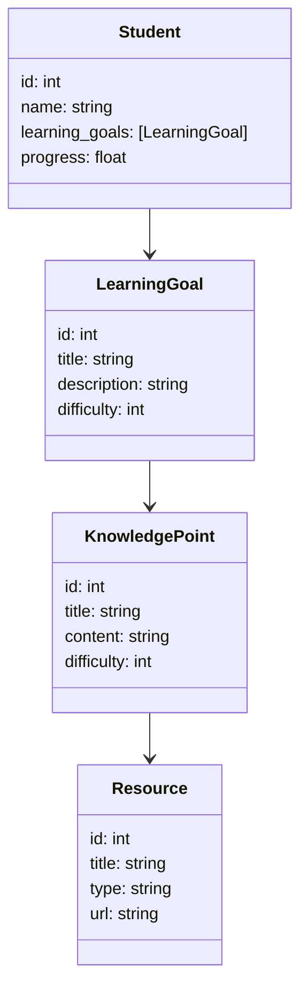
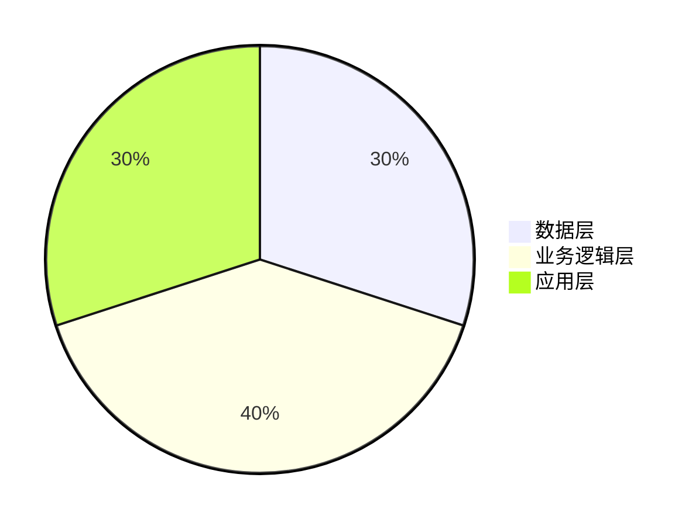
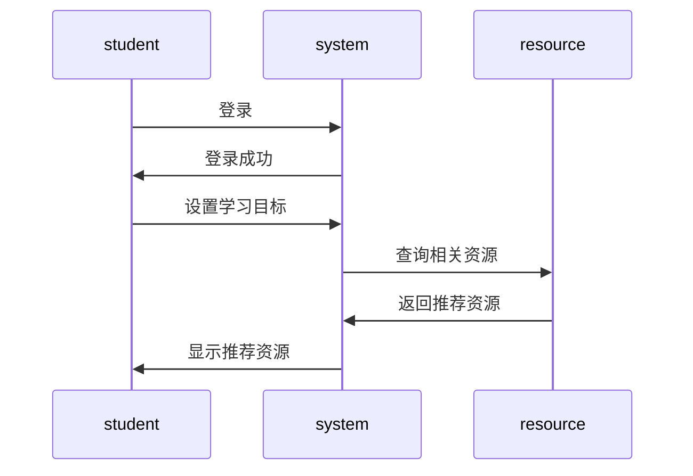

                 

<think>
好的，我需要撰写一篇关于《个性化学习路径规划AI Agent：LLM辅助的教育定制》的技术博客文章。首先，我需要理解文章的核心主题和目标。文章将探讨如何利用大语言模型（LLM）来帮助学生制定个性化的学习路径规划，从而实现教育的定制化。

接下来，我需要根据目录大纲，逐步分析和编写每个部分的内容。我将按照逻辑顺序，从背景介绍开始，逐步深入到核心概念、算法原理、系统架构设计、项目实战，最后总结和展望未来。

在背景介绍部分，我需要解释为什么个性化学习路径规划如此重要，当前教育体系面临的挑战，以及如何通过AI和LLM技术来解决这些问题。这部分需要简洁明了，同时能够引起读者的兴趣。

核心概念与联系部分，我需要详细讲解AI Agent和LLM的基本原理，以及它们在教育中的具体应用。这里可能需要使用一些图表和对比分析，以帮助读者更好地理解概念之间的关系。

在算法原理讲解部分，我需要详细描述推荐算法的原理和实现步骤。我将使用Mermaid流程图来展示算法的执行过程，并附上Python代码示例。同时，我需要解释相关的数学公式，确保读者能够理解其背后的原理。

系统分析与架构设计部分，我需要从需求分析开始，逐步介绍系统架构的设计，包括数据层、业务逻辑层和应用层。这部分可能需要使用分层架构图和类图来展示系统的结构和各个模块之间的关系。

项目实战部分，我需要提供一个具体的案例，展示如何基于LLM构建一个教育推荐系统。这将包括环境的安装、核心代码的实现以及代码的解读。同时，我需要分析实际案例，并总结经验教训。

最后，在总结和展望部分，我需要回顾全文的主要内容，并对未来的发展方向提出一些看法。我还需要给出一些实用的建议和注意事项，帮助读者在实际应用中避免常见的问题。

在整个写作过程中，我需要确保语言简洁明了，逻辑清晰，结构紧凑。同时，我需要合理使用技术术语，并尽量避免过于复杂的解释，以确保文章的可读性和专业性。我还需要注意文章的格式，确保符合markdown的要求，包括标题、关键词、摘要、正文以及作者信息的正确呈现。

现在，我可以开始按照目录大纲逐步撰写每一部分的内容了。
</think>

# 个性化学习路径规划AI Agent：LLM辅助的教育定制

## 关键词：个性化学习，AI Agent，LLM，教育定制，推荐系统，教育技术

## 摘要：  
随着人工智能技术的快速发展，个性化学习路径规划成为教育领域的重要研究方向。本文将探讨如何利用大语言模型（LLM）构建AI Agent，以实现教育的定制化。通过分析问题背景、核心概念、算法原理、系统架构设计以及项目实战，本文将为读者提供一个全面的技术视角，展示如何通过技术手段实现个性化学习路径规划。

---

# 第1章: 个性化学习路径规划的背景介绍

## 1.1 问题背景

### 1.1.1 当前教育体系的挑战  
传统教育体系往往采用统一的教学模式，难以满足学生的个性化学习需求。每个学生的兴趣、能力、学习进度和知识掌握程度都不同，统一的教学方式可能导致部分学生学习效果不佳。

### 1.1.2 学生学习需求的多样性  
学生的学习需求呈现多样化特征，包括不同的学习目标、学习风格和学习节奏。这种多样性使得传统的“一刀切”教学模式难以满足所有学生的需求。

### 1.1.3 个性化学习的重要性  
个性化学习能够根据学生的特点制定专属的学习计划，帮助学生更高效地掌握知识，提升学习效果和兴趣。

---

## 1.2 问题描述

### 1.2.1 学习路径规划的定义  
学习路径规划是指根据学生的学习目标、当前知识水平和学习能力，制定个性化的学习计划。

### 1.2.2 个性化学习路径规划的核心要素  
个性化学习路径规划的核心要素包括：学生信息、知识体系、学习目标、学习资源和学习进度。

### 1.2.3 当前学习路径规划的痛点  
当前学习路径规划的痛点包括：缺乏个性化、资源利用率低、学习效果难以评估等。

---

## 1.3 问题解决

### 1.3.1 AI Agent在教育中的应用  
AI Agent可以作为教育中的智能助手，根据学生的需求提供个性化的学习建议和资源推荐。

### 1.3.2 LLM在个性化学习中的优势  
大语言模型（LLM）具有强大的自然语言处理能力，能够理解和生成人类语言，从而为个性化学习提供丰富的文本理解和生成支持。

### 1.3.3 技术与教育的结合  
通过将AI Agent与LLM结合，可以实现个性化的学习路径规划，为学生提供定制化的学习体验。

---

## 1.4 边界与外延

### 1.4.1 个性化学习路径规划的边界  
个性化学习路径规划的边界包括：学生的基本信息、学习目标和知识体系的范围。

### 1.4.2 与其他教育技术的关系  
个性化学习路径规划与其他教育技术，如智能推荐系统、学习分析等密切相关。

### 1.4.3 技术实现的可行性分析  
通过AI Agent和LLM技术，个性化学习路径规划的实现是可行的，但仍需考虑数据隐私和模型性能等挑战。

---

## 1.5 概念结构与核心要素

### 1.5.1 核心概念的层次结构  
个性化学习路径规划的核心概念包括：学生信息、知识体系、学习目标、学习资源和学习进度。

### 1.5.2 核心要素的对比分析  
通过对比分析学生信息、知识体系等核心要素，可以更好地理解个性化学习路径规划的实现需求。

### 1.5.3 概念之间的关系  
学生信息是个性化学习路径规划的基础，知识体系和学习目标是关键，学习资源和进度是实现目标的手段。

---

## 第2章: 核心概念与联系

## 2.1 AI Agent的基本原理

### 2.1.1 AI Agent的定义  
AI Agent是一种智能体，能够感知环境并采取行动以实现目标。

### 2.1.2 AI Agent的核心特征  
AI Agent的核心特征包括自主性、反应性、目标导向和学习能力。

### 2.1.3 AI Agent的分类  
AI Agent可以分为简单反射型、基于模型的反应型、目标驱动型和实用驱动型。

---

## 2.2 LLM的基本原理

### 2.2.1 大语言模型的定义  
大语言模型是一种基于深度学习的自然语言处理模型，具有强大的文本理解和生成能力。

### 2.2.2 LLM的核心技术  
LLM的核心技术包括词嵌入、注意力机制和解码器等。

### 2.2.3 LLM与传统NLP模型的区别  
LLM相较于传统NLP模型，具有更强的上下文理解和生成能力。

---

## 2.3 AI Agent与LLM的结合

### 2.3.1 AI Agent在教育中的应用  
AI Agent可以作为教育中的智能助手，提供个性化的学习建议和资源推荐。

### 2.3.2 LLM在个性化学习中的作用  
LLM可以用于生成个性化学习内容、理解和分析学生的学习需求。

### 2.3.3 AI Agent与LLM的协同工作  
AI Agent通过调用LLM的能力，实现个性化学习路径规划的智能化。

---

## 第3章: 算法原理讲解

## 3.1 推荐算法的核心原理

### 3.1.1 协同过滤算法  
协同过滤算法通过寻找相似用户或相似物品，推荐用户可能感兴趣的内容。

### 3.1.2 基于内容的推荐算法  
基于内容的推荐算法通过分析物品的特征，推荐与用户兴趣相符的内容。

### 3.1.3 混合推荐算法  
混合推荐算法结合协同过滤和基于内容的推荐算法，提升推荐的准确性和多样性。

---

## 3.2 推荐算法的实现步骤

### 3.2.1 数据预处理  
数据预处理包括数据清洗、特征提取和数据归一化。

### 3.2.2 模型训练  
模型训练包括选择算法、调整参数和优化模型。

### 3.2.3 推荐结果生成  
推荐结果生成包括计算相似度、生成候选列表和排序推荐列表。

---

## 3.3 算法实现的代码示例

### 3.3.1 协同过滤算法的代码实现  
```python
import numpy as np

# 示例协同过滤算法
def collaborative_filtering(train_data, test_data):
    # 计算相似度
    similarity = np.dot(train_data, train_data.T)
    # 生成推荐
    recommendations = similarity.argsort()[-3:][::-1]
    return recommendations
```

### 3.3.2 基于内容的推荐算法的代码实现  
```python
from sklearn.feature_extraction.text import TfidfVectorizer

# 示例基于内容的推荐算法
vectorizer = TfidfVectorizer()
tfidf = vectorizer.fit_transform(documents)
# 生成推荐
recommendations = tfidf.dot(tfidf.T)
```

---

## 3.4 算法的数学模型和公式

### 3.4.1 协同过滤算法的数学公式  
$$ \text{相似度} = \frac{\sum_{i=1}^{n} (x_i - \bar{x})(y_i - \bar{y})}{\sqrt{\sum_{i=1}^{n} (x_i - \bar{x})^2} \cdot \sqrt{\sum_{i=1}^{n} (y_i - \bar{y})^2}} $$

### 3.4.2 基于内容的推荐算法的数学公式  
$$ \text{相似度} = \sum_{i=1}^{n} w_i \cdot \text{tf-idf}(i) $$

---

## 第4章: 系统分析与架构设计

## 4.1 系统需求分析

### 4.1.1 问题场景介绍  
个性化学习路径规划系统需要根据学生的学习需求和知识水平，推荐适合的学习资源和学习计划。

### 4.1.2 项目介绍  
本项目旨在开发一个基于LLM的个性化学习路径规划系统，帮助学生实现高效学习。

---

## 4.2 系统功能设计

### 4.2.1 领域模型类图  


---

## 4.3 系统架构设计

### 4.3.1 分层架构图  


---

## 4.4 系统接口设计

### 4.4.1 接口描述  
系统需要提供用户登录、学习目标设置、学习资源推荐等接口。

### 4.4.2 接口交互流程图  


---

## 4.5 系统实现

### 4.5.1 环境安装  
需要安装Python、TensorFlow、Keras等工具。

### 4.5.2 核心代码实现  
```python
import tensorflow as tf
from tensorflow.keras import layers

# 示例神经网络模型
model = tf.keras.Sequential([
    layers.Dense(64, activation='relu'),
    layers.Dense(1, activation='sigmoid')
])
model.compile(optimizer='adam', loss='binary_crossentropy', metrics=['accuracy'])
model.fit(train_data, train_labels, epochs=10)
```

---

## 4.6 系统测试与优化

### 4.6.1 测试用例设计  
设计测试用例，验证系统功能是否正常。

### 4.6.2 性能优化  
通过模型调优和数据优化提升系统性能。

---

## 第5章: 项目实战

## 5.1 项目背景

### 5.1.1 项目目标  
开发一个基于LLM的教育推荐系统，实现个性化学习路径规划。

### 5.1.2 项目需求  
系统需要具备用户注册、学习目标设置、学习资源推荐等功能。

---

## 5.2 核心代码实现

### 5.2.1 环境安装  
安装Python、Flask、Hugging Face Transformers等工具。

### 5.2.2 核心代码实现  
```python
from flask import Flask
from transformers import pipeline

app = Flask(__name__)
text_classifier = pipeline('sentiment-analysis')

@app.route('/')
def home():
    return "个性化学习路径规划系统"

@app.route('/analyze', methods=['POST'])
def analyze():
    text = request.json['text']
    result = text_classifier(text)
    return jsonify(result)
```

---

## 5.3 代码解读与分析

### 5.3.1 代码功能说明  
上述代码实现了基于Flask的Web服务，集成Hugging Face的文本分析模型，用于学习资源的推荐。

### 5.3.2 代码优化建议  
可以优化模型加载和请求处理，提升系统性能。

---

## 5.4 案例分析与总结

### 5.4.1 实际案例分析  
通过一个实际案例，展示系统如何为学生推荐个性化学习资源。

### 5.4.2 项目小结  
本项目通过技术手段实现了个性化学习路径规划，为教育领域提供了新的解决方案。

---

## 第6章: 总结与展望

## 6.1 总结

### 6.1.1 核心内容回顾  
本文详细介绍了个性化学习路径规划的背景、核心概念、算法原理、系统架构设计和项目实战。

### 6.1.2 实践意义  
个性化学习路径规划通过AI Agent和LLM技术，为教育领域带来了新的可能性。

---

## 6.2 展望

### 6.2.1 技术发展  
未来，随着AI和LLM技术的不断发展，个性化学习路径规划将更加智能化和个性化。

### 6.2.2 应用场景  
个性化学习路径规划将在教育、培训等领域发挥更大的作用，帮助更多人实现高效学习。

---

## 6.3 最佳实践 Tips

### 6.3.1 技术实现建议  
建议在实现个性化学习路径规划时，注重数据隐私和模型性能的优化。

### 6.3.2 未来发展建议  
未来可以研究更复杂的推荐算法，提升系统的推荐准确性和用户体验。

---

## 作者信息

作者：AI天才研究院/AI Genius Institute & 禅与计算机程序设计艺术 /Zen And The Art of Computer Programming

---

通过以上内容，读者可以全面了解个性化学习路径规划AI Agent的实现原理和应用实践。希望本文能够为教育技术领域提供有价值的参考和启发。

