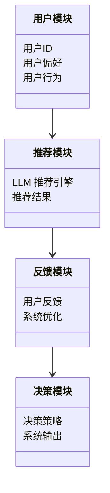

                 


# 个性化推荐 AI Agent：基于 LLM 的精准营销系统

---

## 关键词：个性化推荐、AI Agent、大语言模型、精准营销、LLM、推荐系统、人工智能

---

## 摘要：  
本文详细探讨了基于大语言模型（LLM）的个性化推荐 AI Agent 在精准营销系统中的应用。通过分析 LLM 的算法原理、个性化推荐的核心概念以及 AI Agent 在营销中的角色，本文为读者提供了一个从理论到实践的完整指南。文章涵盖了系统架构设计、算法实现、项目实战以及最佳实践等内容，旨在帮助读者理解如何利用 LLM 构建高效的个性化推荐系统。

---

# 第1章: 个性化推荐与AI Agent 的背景介绍

## 1.1 问题背景与问题描述

### 1.1.1 传统营销的局限性  
传统的营销方式依赖于广泛的广告投放和通用的推荐策略，这种方式不仅效率低下，还难以满足用户的个性化需求。用户在面对海量信息时，容易产生疲劳感，导致营销效果不佳。

### 1.1.2 个性化推荐的需求驱动  
随着互联网的快速发展，用户对个性化体验的需求日益增长。个性化推荐能够提高用户满意度，增强品牌忠诚度，同时帮助企业提高转化率和销售额。

### 1.1.3 AI Agent 在营销中的角色  
AI Agent（人工智能代理）能够实时分析用户行为和偏好，提供个性化的推荐服务。它通过自然语言处理和机器学习技术，帮助企业在营销中实现精准定位和高效决策。

## 1.2 问题解决与边界外延

### 1.2.1 个性化推荐的实现方式  
个性化推荐可以通过协同过滤、基于内容的推荐以及混合推荐等方式实现。AI Agent 的引入使得推荐更加智能化和动态化。

### 1.2.2 AI Agent 的核心功能  
AI Agent 的核心功能包括用户行为分析、实时推荐生成、反馈优化和数据驱动的决策支持。

### 1.2.3 系统的边界与外延  
个性化推荐系统的边界包括用户数据输入、推荐算法、用户反馈输出等。外延则包括数据源的多样性、推荐策略的动态调整以及多场景的应用。

## 1.3 核心概念与组成要素

### 1.3.1 个性化推荐的定义与特征  
个性化推荐是指根据用户的兴趣和行为，实时生成符合其需求的内容或产品推荐。其主要特征包括动态性、精准性和用户交互性。

### 1.3.2 AI Agent 的核心要素  
AI Agent 的核心要素包括数据采集模块、推荐算法模块、反馈优化模块以及决策支持模块。

### 1.3.3 系统架构的核心组成  
系统架构的核心组成包括用户数据采集、推荐算法引擎、反馈分析模块和用户界面模块。

---

## 1.4 本章小结  
本章详细介绍了个性化推荐和 AI Agent 的背景，分析了它们在营销中的重要性，并探讨了系统的边界和核心组成。通过这些内容，读者可以理解为什么个性化推荐和 AI Agent 是当前营销领域的关键技术。

---

# 第2章: 核心概念与联系

## 2.1 AI Agent 的核心原理

### 2.1.1 大语言模型（LLM）的基本原理  
大语言模型通过大量的训练数据学习语言规律，能够生成与上下文相关的文本内容。其核心是基于Transformer的编码器和解码器结构。

### 2.1.2 AI Agent 的决策机制  
AI Agent 通过分析用户行为和数据源信息，利用 LLM 进行决策，生成个性化的推荐结果。

### 2.1.3 个性化推荐的算法基础  
个性化推荐的算法基础包括协同过滤、基于内容的推荐以及混合推荐等方法。

## 2.2 核心概念对比分析

### 2.2.1 个性化推荐与传统推荐的区别  
个性化推荐更加注重用户行为和偏好，而传统推荐主要依赖于物品属性。

### 2.2.2 AI Agent 与传统AI的区别  
AI Agent 具有自主决策和实时交互的能力，而传统AI主要是基于规则的处理。

### 2.2.3 LLM 在推荐系统中的作用  
LLM 通过自然语言处理技术，帮助推荐系统更好地理解和生成个性化内容。

## 2.3 实体关系图（ER图）架构

### 2.3.1 用户与推荐系统的关系  
用户通过与推荐系统交互，提供行为数据和反馈，推荐系统根据这些数据生成个性化推荐。

### 2.3.2 AI Agent 与数据源的关系  
AI Agent 从多种数据源（如用户行为数据、产品信息）中获取数据，用于生成推荐结果。

### 2.3.3 推荐结果与用户反馈的关系  
推荐系统根据用户反馈不断优化推荐策略，形成一个动态调整的闭环系统。

---

## 2.4 本章小结  
本章通过对比分析和实体关系图，详细阐述了个性化推荐和 AI Agent 的核心概念及其相互关系。这为后续的算法实现和系统设计奠定了理论基础。

---

# 第3章: 算法原理与数学模型

## 3.1 大语言模型（LLM）的算法原理

### 3.1.1 LLM 的基本结构  
大语言模型的基本结构包括编码器和解码器，编码器将输入转化为向量表示，解码器根据向量生成输出文本。

### 3.1.2 注意力机制（Attention）  
注意力机制通过计算输入序列中每个位置的重要性，将资源集中在更重要的位置上。其公式为：

$$ \text{Attention}(Q, K, V) = \text{softmax}\left(\frac{QK^T}{\sqrt{d_k}}\right)V $$

其中，$Q$ 是查询向量，$K$ 是键向量，$V$ 是值向量，$d_k$ 是维度数。

### 3.1.3 解码器（Decoder）的实现  
解码器通过自注意力机制生成输出序列，确保生成的文本与输入上下文相关。

## 3.2 个性化推荐的算法实现

### 3.2.1 基于LLM的推荐算法  
基于 LLM 的推荐算法通过生成文本描述来辅助推荐决策。例如，根据用户偏好生成产品描述。

### 3.2.2 基于协同过滤的推荐算法  
协同过滤通过分析用户行为相似性，推荐相似用户的喜欢产品。

### 3.2.3 基于内容的推荐算法  
基于内容的推荐算法通过分析产品属性，推荐与当前产品相似的内容。

## 3.3 数学模型与公式

### 3.3.1 注意力机制的公式推导  
注意力机制的权重计算公式为：

$$ \alpha_i = \text{softmax}\left(\frac{q_i k_j^T}{\sqrt{d_k}}\right) $$

其中，$\alpha_i$ 是第 $i$ 个位置的注意力权重，$q_i$ 是查询向量，$k_j$ 是键向量。

### 3.3.2 推荐系统的损失函数  
推荐系统的损失函数通常采用交叉熵损失：

$$ \mathcal{L} = -\sum_{i=1}^n y_i \log p(y_i) + (1 - y_i) \log (1 - p(y_i)) $$

其中，$y_i$ 是标签，$p(y_i)$ 是预测概率。

### 3.3.3 LLM 的概率分布公式  
大语言模型的概率分布公式为：

$$ P(y|x) = \text{softmax}(f(x)) $$

其中，$f(x)$ 是模型的输出向量。

## 3.4 举例说明与通俗解释

### 3.4.1 注意力机制  
注意力机制通过计算输入序列中每个词的重要性，帮助模型聚焦在关键信息上。例如，在推荐系统中，注意力机制可以帮助模型关注用户的最近行为。

---

## 3.5 本章小结  
本章详细讲解了大语言模型和个性化推荐的核心算法原理，并通过数学公式和实例分析，帮助读者理解这些算法的实现细节。

---

# 第4章: 系统分析与架构设计

## 4.1 问题场景介绍  
本系统旨在通过个性化推荐 AI Agent 提高企业的营销效率和用户满意度。系统需要处理海量数据，并实时生成推荐结果。

## 4.2 系统功能设计

### 4.2.1 领域模型设计  
领域模型包括用户模块、推荐模块、反馈模块和决策模块。



### 4.2.2 系统架构设计  
系统架构采用微服务架构，包括数据采集、推荐引擎、反馈优化和用户界面模块。


### 4.2.3 系统接口设计  
系统接口包括数据采集接口、推荐接口和反馈接口。

### 4.2.4 系统交互设计  
系统交互采用 RESTful API 标准，通过 HTTP 请求实现模块间的通信。

---

## 4.3 本章小结  
本章通过系统架构设计和交互设计，详细描述了个性化推荐 AI Agent 的实现方式。通过微服务架构和模块化设计，确保系统的高效性和可扩展性。

---

# 第5章: 项目实战

## 5.1 环境安装与配置

### 5.1.1 安装 Python 环境  
使用 Anaconda 安装 Python 3.8 或更高版本。

### 5.1.2 安装依赖包  
安装必要的依赖包，如 `transformers`、`numpy`、`pandas` 等。

### 5.1.3 配置 API 接口  
配置推荐系统的 API 接口，确保模块间的通信。

## 5.2 系统核心实现

### 5.2.1 数据采集模块  
实现用户行为数据的采集功能。

```python
import requests

def get_user_behavior(user_id):
    response = requests.get(f"http://data_source/{user_id}")
    return response.json()
```

### 5.2.2 推荐引擎实现  
实现基于 LLM 的推荐算法。

```python
from transformers import GPT2LMHeadModel, GPT2Tokenizer

tokenizer = GPT2Tokenizer.from_pretrained('gpt2')
model = GPT2LMHeadModel.from_pretrained('gpt2')

def generate_recommendation(prompt):
    inputs = tokenizer.encode(prompt, return_tensors='pt')
    outputs = model.generate(inputs, max_length=50, num_return_sequences=1)
    return tokenizer.decode(outputs[0])
```

### 5.2.3 反馈优化模块  
实现用户反馈的收集和优化功能。

```python
def update_recommendation_feedback(feedback):
    # 实现反馈优化逻辑
    pass
```

## 5.3 实际案例分析

### 5.3.1 案例背景  
某电商平台希望通过个性化推荐提高用户购买率。

### 5.3.2 系统实现  
根据用户行为数据，利用 LLM 生成个性化的产品描述，实时推荐给用户。

### 5.3.3 数据分析与优化  
通过 A/B 测试优化推荐策略，提高推荐系统的准确率和用户满意度。

## 5.4 项目总结  
通过本项目，读者可以掌握个性化推荐 AI Agent 的实现方法，并能够将其应用于实际场景中。

---

## 5.5 本章小结  
本章通过项目实战，详细展示了个性化推荐 AI Agent 的实现过程。从环境配置到代码实现，再到案例分析，帮助读者掌握系统的实际应用。

---

# 第6章: 最佳实践与注意事项

## 6.1 最佳实践 tips

### 6.1.1 数据质量的重要性  
确保数据的多样性和准确性，避免偏差。

### 6.1.2 模型调优的技巧  
通过 A/B 测试和网格搜索优化推荐算法。

### 6.1.3 系统性能优化  
使用缓存和分布式计算提高系统的响应速度。

## 6.2 小结  
通过最佳实践，读者可以进一步优化个性化推荐系统的性能和效果。

## 6.3 注意事项

### 6.3.1 数据隐私保护  
确保用户数据的安全性和隐私性。

### 6.3.2 系统稳定性保障  
通过冗余设计和容错机制确保系统的稳定性。

### 6.3.3 反馈机制的完善  
建立完善的用户反馈机制，及时优化推荐策略。

---

## 6.4 拓展阅读  
推荐阅读《大语言模型与推荐系统》、《人工智能在营销中的应用》等书籍。

---

## 作者：AI天才研究院/AI Genius Institute & 禅与计算机程序设计艺术 /Zen And The Art of Computer Programming

