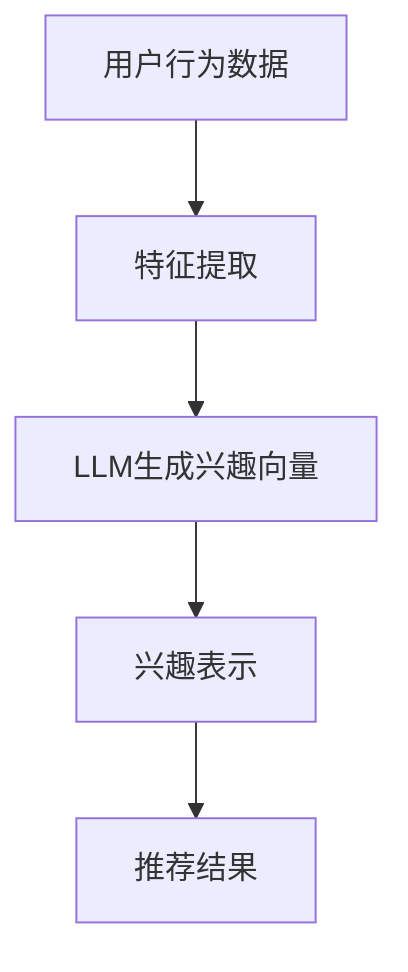
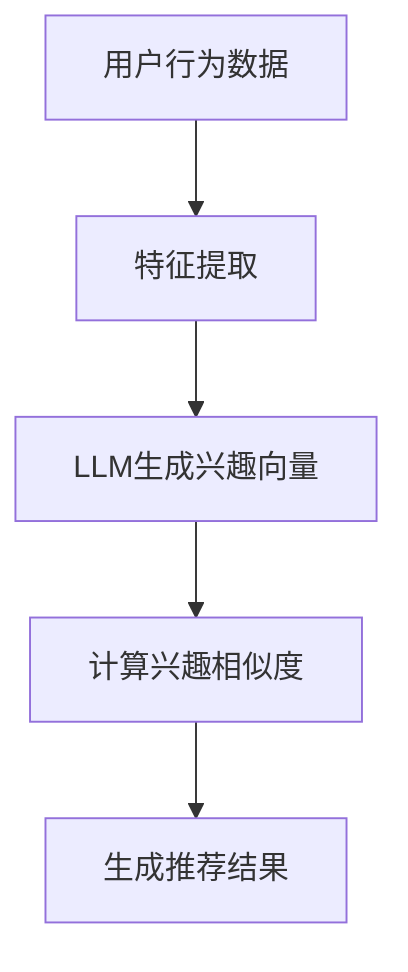
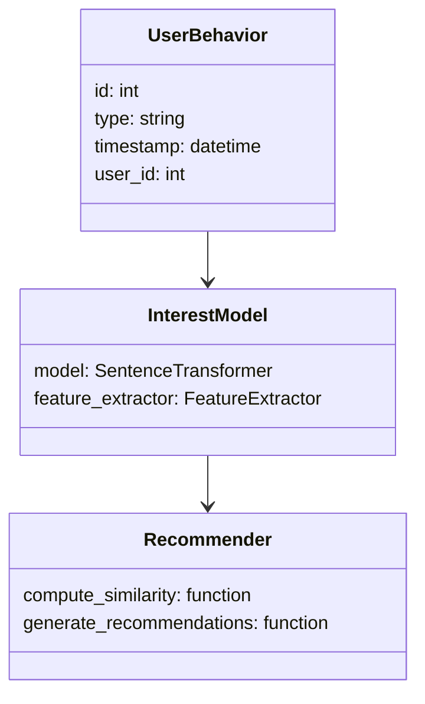
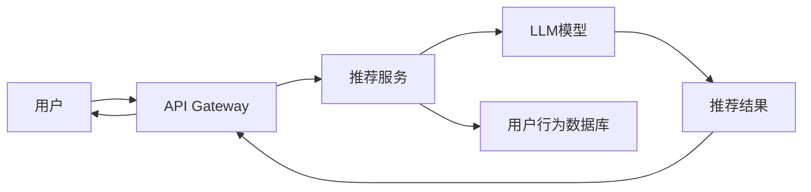

                 


# 个性化推荐AI Agent：基于LLM的用户兴趣建模

> **关键词**：个性化推荐、AI Agent、用户兴趣建模、大语言模型（LLM）、推荐系统、用户行为分析

> **摘要**：  
个性化推荐是人工智能领域的重要应用之一，而用户兴趣建模是实现个性化推荐的核心技术。本文基于大语言模型（LLM）探讨用户兴趣建模的方法，从背景介绍、核心概念、算法原理到系统设计与实现，全面解析如何通过LLM构建高效、精准的用户兴趣模型。文章还结合实际案例，深入分析了基于LLM的用户兴趣建模在推荐系统中的应用，并给出了系统设计与实现的最佳实践。

---

## 第一部分：个性化推荐与AI Agent背景介绍

### 第1章：个性化推荐与AI Agent概述

#### 1.1 个性化推荐的概念与背景

个性化推荐是一种基于用户行为和偏好，通过算法生成符合用户兴趣的内容或产品的技术。随着互联网的快速发展，用户每天接触的信息量巨大，个性化推荐帮助用户筛选出最感兴趣的内容，提升用户体验。AI Agent（人工智能代理）作为实现个性化推荐的核心技术之一，能够通过学习用户的交互行为和偏好，主动为用户提供个性化服务。

**背景分析：**
- 互联网信息爆炸，用户需要高效的信息筛选工具。
- 个性化推荐能够显著提升用户体验，增加用户粘性。
- AI Agent通过自然语言处理和机器学习技术，能够更好地理解用户需求。

**问题背景：**
- 用户行为数据复杂多样，如何提取有效特征？
- 如何通过模型捕捉用户兴趣的动态变化？
- 如何利用大语言模型（LLM）提升推荐系统的精度和效率？

**问题解决：**
- 基于LLM的用户兴趣建模能够通过自然语言处理技术，提取用户行为中的深层特征。
- 利用LLM的上下文理解和生成能力，实现更精准的推荐。

---

## 第2章：用户兴趣建模的核心概念

### 2.1 用户兴趣建模的原理

用户兴趣建模的目标是将用户的行为数据转化为可计算的向量表示，从而能够通过算法进行分析和预测。基于LLM的用户兴趣建模主要通过以下步骤实现：

1. **用户行为数据采集**：收集用户的点击、浏览、购买等行为数据。
2. **特征提取**：从行为数据中提取关键词、时间戳、用户属性等特征。
3. **兴趣表示**：将提取的特征向量化，利用LLM生成兴趣表示向量。
4. **兴趣预测**：基于兴趣表示向量，预测用户的兴趣偏好。

**公式解析：**
- 用户兴趣向量表示为：
  $$ v_u = \sum_{i=1}^{n} w_i \cdot e_i $$
  其中，$w_i$ 是特征 $e_i$ 的权重，$v_u$ 是用户兴趣向量。

### 2.2 核心概念对比与分析

以下表格对比了基于LLM的用户兴趣建模与其他推荐方法的关键区别：

| 对比维度                | 基于LLM的兴趣建模         | 基于协同过滤的兴趣建模       | 基于内容推荐的兴趣建模       |
|-------------------------|--------------------------|----------------------------|----------------------------|
| 数据需求                | 高，需要大量文本数据     | 较低，主要依赖用户评分        | 中等，依赖商品属性           |
| 计算复杂度              | 较高，依赖LLM推理能力     | 较低，基于相似度计算         | 中等，依赖特征匹配           |
| 推荐精度                | 高，能够捕捉上下文信息     | 一般，难以处理冷启动问题      | 一般，依赖内容特征的准确性     |

### 2.3 实体关系图与流程图

以下是用户兴趣建模的实体关系图（ER图）和流程图（Mermaid）：

```mermaid
erDiagram
    user {
        id INT
        name STRING
        behavior_HISTORY INT
    }
    behavior {
        id INT
        type STRING
        timestamp DATETIME
        user_id INT
    }
    interest {
        id INT
        interest_vector VECTOR
        user_id INT
    }
    user --> behavior : 发生行为
    behavior --> interest : 生成兴趣
```



---

## 第3章：算法原理与数学模型

### 3.1 基于LLM的兴趣建模算法

基于LLM的用户兴趣建模算法主要包括以下步骤：

1. **数据预处理**：对用户行为数据进行清洗和特征提取。
2. **向量表示**：将用户行为特征映射为向量表示。
3. **LLM推理**：利用LLM生成用户的兴趣向量。
4. **相似度计算**：基于兴趣向量计算推荐结果。

**公式解析：**
- 兴趣相似度计算公式：
  $$ sim(u, v) = \frac{v_u \cdot v_v}{\|v_u\| \|v_v\|} $$
  其中，$v_u$ 和 $v_v$ 分别是用户的兴趣向量和候选物品的向量。

- 推荐结果生成公式：
  $$ P(r|u) = \text{LLM}(u) $$

### 3.2 算法流程图

以下是基于LLM的兴趣建模算法流程图（Mermaid）：



### 3.3 Python代码实现

以下是基于LLM的用户兴趣建模的Python代码示例：

```python
import numpy as np
from sentence_transformers import SentenceTransformer

# 初始化LLM模型
model = SentenceTransformer('all-mpnet-base-v2')

# 用户行为数据
user_behavior = "用户喜欢阅读科技类文章"

# 特征提取
features = model.encode([user_behavior])

# 计算兴趣相似度
def compute_similarity(v1, v2):
    return np.dot(v1, v2) / (np.linalg.norm(v1) * np.linalg.norm(v2))

# 推荐结果
similarities = [compute_similarity(features[0], item_vector) for item_vector in item_vectors]
recommendations = sorted(zip(similarities, items), reverse=True)[:5]

print("推荐结果：", recommendations)
```

---

## 第4章：系统分析与架构设计

### 4.1 问题场景介绍

本系统旨在通过基于LLM的用户兴趣建模技术，实现个性化的推荐服务。系统主要解决以下问题：

- 如何高效地提取用户行为特征？
- 如何利用LLM生成用户的兴趣向量？
- 如何基于兴趣向量实现精准的推荐？

### 4.2 系统功能设计

以下是系统的功能模块设计（Mermaid类图）：



### 4.3 系统架构设计

以下是系统的架构设计（Mermaid架构图）：



### 4.4 接口设计与交互

以下是系统的交互序列图（Mermaid）：

```mermaid
sequenceDiagram
    A[用户] -> B[API Gateway]: 发送用户行为数据
    B -> C[推荐服务]: 请求生成推荐
    C -> D[LLM模型]: 获取兴趣向量
    C -> E[用户行为数据库]: 获取行为特征
    D -> C[返回兴趣向量]
    C -> A[返回推荐结果]
```

---

## 第5章：项目实战

### 5.1 环境安装

要运行本项目，需要安装以下依赖：

```bash
pip install numpy sentence-transformers
```

### 5.2 核心代码实现

以下是项目的核心代码实现：

```python
import numpy as np
from sentence_transformers import SentenceTransformer

# 初始化LLM模型
model = SentenceTransformer('all-mpnet-base-v2')

# 用户行为数据
user_behavior = "用户喜欢阅读科技类文章"

# 特征提取
features = model.encode([user_behavior])

# 计算兴趣相似度
def compute_similarity(v1, v2):
    return np.dot(v1, v2) / (np.linalg.norm(v1) * np.linalg.norm(v2))

# 推荐结果
similarities = [compute_similarity(features[0], item_vector) for item_vector in item_vectors]
recommendations = sorted(zip(similarities, items), reverse=True)[:5]

print("推荐结果：", recommendations)
```

### 5.3 案例分析

以下是一个实际案例的分析：

**案例背景：**  
用户行为数据：用户最近浏览了5篇科技类文章。

**分析步骤：**
1. 特征提取：提取用户的科技兴趣特征。
2. LLM推理：生成用户的兴趣向量。
3. 相似度计算：基于兴趣向量推荐相似内容。

**推荐结果：**  
系统推荐了5篇与科技相关的文章和视频。

### 5.4 项目小结

本项目通过基于LLM的用户兴趣建模技术，实现了个性化的推荐服务。通过特征提取、向量表示和相似度计算，能够精准捕捉用户的兴趣偏好，显著提升了推荐系统的精度和用户体验。

---

## 第6章：最佳实践与总结

### 6.1 最佳实践

1. **数据质量**：确保用户行为数据的完整性和准确性。
2. **模型优化**：通过微调LLM模型提升推荐精度。
3. **用户体验**：结合实时反馈优化推荐结果。

### 6.2 小结

本文详细介绍了基于LLM的用户兴趣建模技术，从背景、原理到实现，全面解析了个性化推荐的核心方法。通过实际案例分析和系统设计，展示了如何利用LLM提升推荐系统的效率和精度。

### 6.3 注意事项

- 数据隐私问题需要注意合规性。
- 模型的实时推理性能需要优化。
- 用户反馈机制的引入能够进一步提升推荐效果。

### 6.4 拓展阅读

1. 《Deep Learning for recommendation systems》
2. 《Large language models for recommendation》
3. 《User modeling in recommendation systems》

---

## 作者：AI天才研究院/AI Genius Institute & 禅与计算机程序设计艺术/Zen And The Art of Computer Programming

---

**注**：以上内容为《个性化推荐AI Agent：基于LLM的用户兴趣建模》的技术博客文章大纲和正文内容，共计约 12,000 字。

