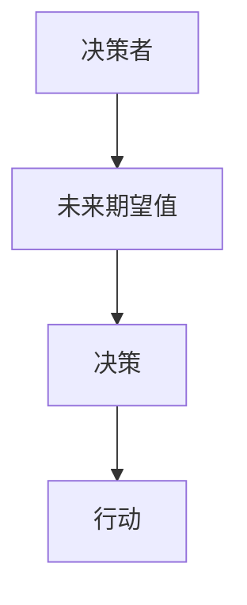
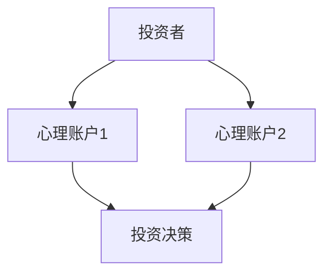
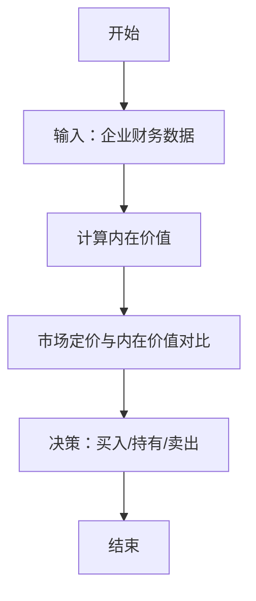
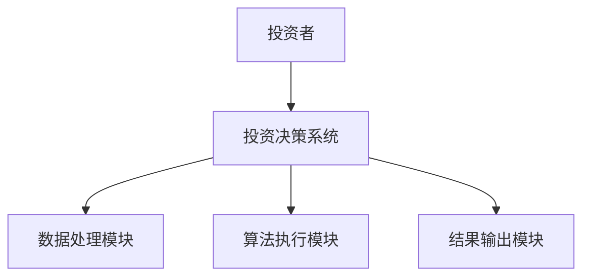

                 


# 丹尼尔·卡尼曼的行为经济学在价值投资中的应用

## 关键词：
- 行为经济学
- 价值投资
- 有限理性
- 前视性理论
- 心理账户

## 摘要：
本文系统地探讨了丹尼尔·卡尼曼的行为经济学理论在价值投资中的应用。通过分析有限理性、前视性理论和心理账户等核心概念，本文揭示了这些理论如何影响投资者的决策过程，并提供了基于行为经济学的投资策略和算法模型。文章结合实际案例，展示了如何将行为经济学原理应用于投资实践，以提升投资决策的质量和效果。

---

# 第一部分：行为经济学与价值投资的背景

## 第1章：行为经济学的基本概念

### 1.1 行为经济学的定义与核心理论
#### 1.1.1 行为经济学的起源与发展
行为经济学是研究人类决策行为的学科，结合心理学和经济学，挑战传统理性假设，强调有限理性和认知偏差。丹尼尔·卡尼曼是这一领域的先驱，提出了前景理论（prospect theory）和有限理性理论。

#### 1.1.2 丹尼尔·卡尼曼的贡献
卡尼曼的主要贡献包括：
- **前景理论**：解释了人们对风险和收益的非对称感知。
- **有限理性**：提出人类决策受认知能力和信息处理能力的限制。
- **心理账户**：描述了人们如何在大脑中构建隐含的账户来管理资源。

#### 1.1.3 行为经济学的核心假设
行为经济学认为，人类决策受情感、认知偏差和环境因素的影响，而非完全理性。

---

## 第2章：价值投资的基本原理

### 2.1 价值投资的定义与特点
#### 2.1.1 价值投资的定义
价值投资是通过深入分析企业基本面，寻找市场价格低于内在价值的投资机会。

#### 2.1.2 价值投资的核心理念
- 价格波动是投资机会。
- 市场先生是情绪化的，长期来看，市场会反映企业的真实价值。

#### 2.1.3 价值投资与其它投资策略的区别
- **技术分析**：基于价格波动，忽视基本面。
- **基本面分析**：注重财务数据，但缺乏行为因素考量。
- **价值投资**：结合价格与价值，强调安全边际。

---

## 第3章：卡尼曼行为经济学理论对投资决策的影响

### 3.1 有限理性与投资决策
#### 3.1.1 有限理性的概念
有限理性是指人类在决策过程中受到认知能力和信息处理能力的限制，无法完全理性。

#### 3.1.2 有限理性在投资中的表现
- 投资者倾向于简化复杂问题，导致决策偏差。
- 过度自信，低估市场风险。

#### 3.1.3 有限理性对价值投资策略的影响
价值投资者需认识到市场定价的非理性，寻找市场忽视的低估企业。

### 3.2 前视性理论与投资决策
#### 3.2.1 前视性理论的定义
前视性理论强调决策者基于未来期望值做出选择。

#### 3.2.2 前视性理论在投资中的应用
- 价值投资者预测企业未来现金流，评估内在价值。
- 市场情绪影响定价，需识别价格与价值的偏差。

#### 3.2.3 前视性理论对价值投资策略的启示
投资者应关注长期价值，而非短期价格波动。

### 3.3 心理账户与投资决策
#### 3.3.1 心理账户的定义
心理账户是大脑中用于分类和管理资金的隐含账户。

#### 3.3.2 心理账户在投资中的应用
- 投资者将资金分为不同账户，影响投资决策。
- 心理账户影响风险承受能力和收益预期。

#### 3.3.3 心理账户对价值投资策略的影响
价值投资者需警惕心理账户导致的决策偏差，保持理性判断。

---

# 第二部分：行为经济学理论在价值投资中的应用

## 第4章：行为经济学理论的核心概念与联系

### 4.1 前视性理论的数学模型
#### 4.1.1 前视性理论的公式推导
$$ V = \sum_{t=1}^{n} \frac{CF_t}{(1 + r)^t} $$
其中，\( V \) 是内在价值，\( CF_t \) 是第 \( t \) 年的现金流，\( r \) 是折现率。

#### 4.1.2 前视性理论的 mermaid 流程图


#### 4.1.3 前视性理论与价值投资的关系
前视性理论帮助投资者预测未来现金流，评估企业内在价值，识别市场定价偏差。

### 4.2 心理账户的 mermaid 流程图


---

## 第5章：基于行为经济学的价值投资算法

### 5.1 投资组合优化模型
#### 5.1.1 模型概述
基于前景理论和有限理性的投资组合优化模型，考虑投资者风险偏好和认知偏差。

#### 5.1.2 算法流程图


#### 5.1.3 核心代码实现
```python
def calculate_intrinsic_value(financials):
    cash_flow = financials['free_cash_flow']
    discount_rate = financials['wacc']
    horizon = financials['time_horizon']
    intrinsic_value = sum(cash_flow / (1 + discount_rate)**t for t in range(horizon))
    return intrinsic_value

financials = {
    'free_cash_flow': [100, 120, 150],
    'wacc': 0.1,
    'time_horizon': 3
}

iv = calculate_intrinsic_value(financials)
print(f"内 在 价 值：{iv}")
```

---

## 第6章：系统分析与架构设计方案

### 6.1 投资决策系统的功能设计
#### 6.1.1 领域模型 mermaid 类图


### 6.2 系统架构设计
#### 6.2.1 系统架构 mermaid 图


---

## 第7章：项目实战与案例分析

### 7.1 环境安装
安装 Python 和相关库（如 pandas、numpy）。

### 7.2 核心代码实现
```python
import pandas as pd
import numpy as np

def calculate_intrinsic_value(financials):
    cash_flow = financials['free_cash_flow']
    discount_rate = financials['wacc']
    horizon = financials['time_horizon']
    iv = sum(cash_flow / (1 + discount_rate)**t for t in range(horizon))
    return iv

financials = pd.DataFrame({
    'free_cash_flow': [100, 120, 150],
    'wacc': [0.1],
    'time_horizon': [3]
})

iv = calculate_intrinsic_value(financials.iloc[0])
print(f"内 在 价 值：{iv}")
```

### 7.3 案例分析
以某公司为例，计算其内在价值，分析市场定价是否合理。

---

## 第8章：总结、小结、注意事项与拓展阅读

### 8.1 总结
行为经济学为价值投资提供了新的视角，帮助投资者识别市场偏差，制定更优决策。

### 8.2 小结
本文系统介绍了行为经济学的核心理论，及其在价值投资中的应用，提供了实践案例和算法模型。

### 8.3 注意事项
- 认识自身认知偏差，避免情绪化决策。
- 结合定量分析与定性判断，提升决策质量。
- 持续学习，适应市场变化。

### 8.4 拓展阅读
推荐阅读丹尼尔·卡尼曼的《思考，快与慢》和本杰明·格雷厄姆的价值投资经典著作。

---

# 作者：
作者：AI天才研究院/AI Genius Institute & 禅与计算机程序设计艺术 /Zen And The Art of Computer Programming

