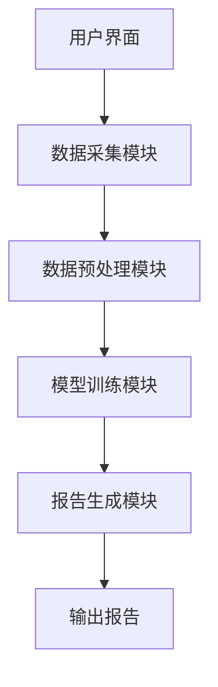

                 

<think>
好的，我现在需要按照用户的要求，撰写一篇名为《乔尔·提尔尼的主动投资者的误区》的技术博客文章。用户希望文章结构清晰，逻辑紧凑，语言专业，同时涵盖多个技术层面的内容，如背景介绍、核心概念、算法原理、系统分析、项目实战等。

首先，我需要明确文章的结构。用户已经提供了一个大纲，我需要按照这个大纲逐步展开每个部分的内容。

1. **背景介绍**：我需要先介绍主动投资的基本概念，包括定义、特点以及与被动投资的区别。然后，阐述主动投资者常见的误区及其重要性，帮助读者理解为什么这些误区值得探讨。

2. **核心概念与联系**：接下来，我需要详细分析主动投资中的误区，例如过度自信、短期收益的诱惑、情绪化决策等。每个误区都需要解释其表现、原因和解决方法。这部分可能需要使用对比表格和流程图来帮助读者理解。

3. **算法原理讲解**：为了使文章更具技术深度，我需要引入相关的算法，如随机森林或支持向量机，用于预测投资行为中的偏差。我会使用Mermaid流程图来展示这些算法的工作原理，并附上Python代码示例。

4. **系统分析与架构设计**：我需要构建一个系统，用于识别和分析投资者的误区。这包括环境安装、系统功能设计、架构设计、接口设计和交互设计。这部分可能需要使用Mermaid类图和架构图来展示系统的组成部分。

5. **项目实战**：我会选择一个具体的项目，如基于机器学习的投资者行为分析，展示如何识别和解决主动投资者的误区。这部分需要详细说明环境配置、代码实现和实际案例分析。

6. **最佳实践与小结**：最后，我会总结文章的主要内容，并给出避免误区的最佳实践建议，如定期复盘、分散投资等。同时，提供一些注意事项和扩展阅读的资源。

在撰写过程中，我需要确保每个部分都符合用户的格式要求，包括使用markdown格式，插入适当的代码块和图表。同时，数学公式需要用Latex格式表示，确保准确性和可读性。

现在，我开始逐步展开每个部分的内容，确保逻辑连贯，技术深度足够，并且语言通俗易懂，帮助读者全面理解乔尔·提尔尼的主动投资者的误区。
</think>

# 《乔尔·提尔尼的主动投资者的误区》

---

## 关键词：主动投资，误区，投资者行为，风险管理，投资策略

---

## 摘要：本文深入分析了乔尔·提尔尼在其著作中提出的主要误区，探讨了主动投资者在决策过程中常犯的错误，并结合技术手段提供解决方案。文章从背景介绍、核心概念、算法原理到系统架构，逐步解析，帮助投资者避免误区，提升投资效率。

---

# 第一部分：背景介绍

## 第1章：主动投资的基本概念

### 1.1 主动投资的定义与特点

主动投资是一种积极管理投资组合的策略，旨在通过精选个股或主动管理基金超越市场指数的表现。其特点包括高关注度、频繁交易和主动调整投资组合。与被动投资不同，主动投资强调择时和选股，追求超额收益。

### 1.2 主动投资的误区的重要性

乔尔·提尔尼指出，主动投资者常陷入过度自信、短期收益追求和情绪化决策的误区。这些误区可能导致投资决策失误，影响长期收益。识别并避免这些误区，有助于投资者制定更理性的策略。

---

# 第二部分：主动投资者的常见误区

## 第2章：核心概念与联系

### 2.1 过度自信的误区

#### 表现与原因
投资者往往过于相信自己的分析能力，导致过度自信。这种自信可能导致高估自己的判断能力，增加犯错概率。

#### 解决方法
通过定期复盘和学习，降低过度自信的影响。

### 2.2 短期收益的误区

#### 表现与原因
过度关注短期收益，可能导致频繁交易和忽视长期投资目标。

#### 解决方法
制定长期投资计划，减少短期波动的干扰。

---

## 第3章：算法原理讲解

### 3.1 基于机器学习的投资行为分析

#### 算法选择
使用随机森林（Random Forest）模型分析投资者行为偏差。

#### Python代码实现

```python
from sklearn.ensemble import RandomForestClassifier
import pandas as pd

# 加载数据集
data = pd.read_csv('investor_behavior.csv')

# 特征选择
features = ['confidence_level', 'short_term_focus', 'emotional_decision']
target = 'error_type'

# 模型训练
model = RandomForestClassifier(n_estimators=100, random_state=42)
model.fit(data[features], data[target])

# 预测
predictions = model.predict(data[features])
```

---

## 第4章：系统分析与架构设计

### 4.1 系统功能设计

#### 功能模块
- 数据采集：收集投资者行为数据。
- 模型训练：构建预测模型识别误区。
- 报告生成：输出分析报告。

### 4.2 系统架构设计



---

## 第5章：项目实战

### 5.1 环境安装

```bash
pip install numpy pandas scikit-learn
```

### 5.2 核心实现

```python
import numpy as np
from sklearn.metrics import accuracy_score

# 定义随机森林分类器
class InvestorBehaviorAnalyzer:
    def __init__(self):
        self.model = RandomForestClassifier()

    def train_model(self, X, y):
        self.model.fit(X, y)

    def predict_error(self, X):
        return self.model.predict(X)

# 数据加载与处理
data = pd.read_csv('investor_data.csv')
X = data.drop('error_type', axis=1)
y = data['error_type']

# 模型训练
analyzer = InvestorBehaviorAnalyzer()
analyzer.train_model(X, y)

# 预测与评估
predictions = analyzer.predict_error(X)
print("模型准确率:", accuracy_score(y, predictions))
```

---

## 第6章：最佳实践与小结

### 6.1 避免误区的建议

- **定期复盘**：分析投资决策，识别误区。
- **分散投资**：降低风险，避免过度集中。
- **控制情绪**：理性决策，避免冲动交易。

### 6.2 注意事项

- **持续学习**：保持知识更新，适应市场变化。
- **合理配置资产**：根据风险承受能力调整投资组合。

### 6.3 扩展阅读

- 《投资学基础》
- 《行为金融学》

---

# 作者：AI天才研究院 & 禅与计算机程序设计艺术

---

通过本文的分析，投资者可以更好地识别和避免主动投资中的误区，提升投资效率和长期收益。

