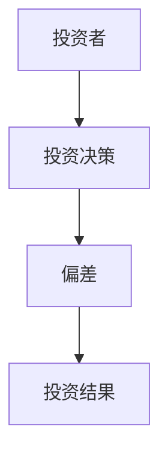
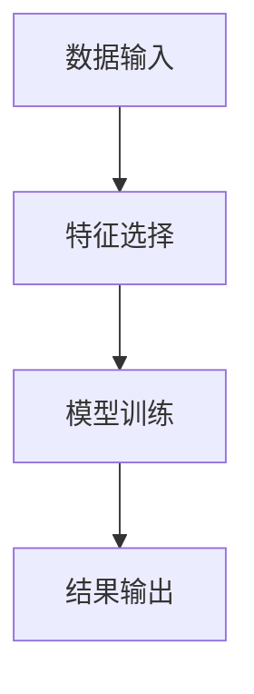
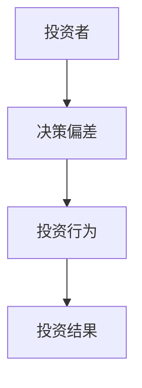

                 


# 乔尔·提林加斯特的投资决策偏差纠正

> 关键词：投资决策偏差，乔尔·提林加斯特，决策纠正，投资策略，偏差分析，算法设计

> 摘要：本文将探讨投资决策中的偏差问题，分析常见偏差类型及其影响，并通过算法设计和系统架构提供纠正策略。结合具体案例，展示如何通过技术手段优化投资决策。

---

# 第一部分: 投资决策偏差概述

## 第1章: 投资决策偏差的背景与重要性

### 1.1 投资决策偏差的定义与类型

#### 1.1.1 投资决策偏差的定义
投资决策偏差是指投资者在做出投资决策时，由于心理、认知或情绪等因素的影响，导致决策偏离理性或最优选择的现象。这些偏差可能导致投资者做出错误的投资决策，进而影响投资收益。

#### 1.1.2 常见的投资决策偏差类型
1. **确认偏差（Confirmation Bias）**：投资者倾向于寻找支持自己已有观点的信息，而忽略相反的证据。
2. **过度自信偏差（Overconfidence Bias）**：投资者对自己判断的准确性过度自信，可能导致冒险行为。
3. **损失厌恶（Loss Aversion）**：投资者对损失的厌恶程度超过对收益的追求，导致在决策时过于保守。
4. **代表性偏差（Representativeness Bias）**：投资者根据某事物的代表性特征来判断其概率，忽略其他相关信息。
5. **可得性偏差（Availability Bias）**：投资者根据容易回忆的信息做出决策，而这些信息可能并不具有代表性。

#### 1.1.3 投资决策偏差的产生原因
- **心理因素**：投资者的贪婪、恐惧等情绪影响决策。
- **认知局限**：人类认知能力有限，难以处理复杂信息。
- **外部环境**：市场波动、信息过载等外部因素干扰。

### 1.2 投资决策偏差的影响

#### 1.2.1 偏差对投资结果的影响
- **收益损失**：错误决策导致投资收益低于预期。
- **风险增加**：偏差可能导致投资者承担过高的风险。
- **市场波动**：大量投资者的偏差行为加剧市场波动。

#### 1.2.2 偏差对投资者心理的影响
- **情绪波动**：偏差导致投资者情绪化决策，影响心理稳定。
- **决策疲劳**：连续的错误决策导致投资者心理疲惫，影响后续决策。

#### 1.2.3 偏差对投资策略的影响
- **策略偏离**：偏差导致投资策略偏离预定目标。
- **策略失效**：长期偏差行为导致投资策略失效，影响长期收益。

### 1.3 投资决策偏差纠正的必要性

#### 1.3.1 纠正偏差的意义
- **提高投资收益**：纠正偏差有助于做出更理性的投资决策，提高收益。
- **降低投资风险**：通过纠正偏差，投资者能够更好地识别和管理风险。
- **提升决策质量**：纠正偏差有助于投资者做出更高质量的决策，增强决策能力。

#### 1.3.2 纠正偏差的方法与路径
- **自我反思**：投资者需要定期反思自己的决策，识别偏差。
- **学习与培训**：通过学习投资知识和相关心理学知识，提高决策能力。
- **技术辅助**：利用技术手段，如算法和系统工具，辅助决策。

#### 1.3.3 纠正偏差的长期价值
- **长期收益提升**：纠正偏差有助于投资者长期获得稳定收益。
- **风险管理优化**：通过纠正偏差，投资者能够更好地管理风险，实现稳健投资。
- **决策能力提升**：长期纠正偏差有助于投资者提升整体决策能力，适应复杂多变的市场环境。

---

## 第2章: 投资决策偏差的核心概念与联系

### 2.1 投资决策偏差的核心原理

#### 2.1.1 偏差的形成机制
- **心理机制**：投资者的心理因素，如贪婪和恐惧，导致偏差的形成。
- **认知机制**：认知局限性和信息处理能力不足，影响决策。
- **外部机制**：市场环境和信息传播方式也会影响偏差的形成。

#### 2.1.2 偏差与投资决策的关系
- **相互作用**：偏差影响决策，决策反过来也会影响偏差的形成。
- **动态变化**：在不同的市场环境下，偏差的表现形式和影响程度会发生变化。

#### 2.1.3 偏差的数学模型
我们可以用概率论和统计学的方法来描述偏差。例如，损失厌恶可以用风险偏好模型来表示：
$$ R = \text{损失厌恶系数} \times \text{损失概率} $$

其中，$R$ 表示风险厌恶程度，损失概率和损失厌恶系数共同决定了投资者对风险的敏感程度。

### 2.2 偏差类型对比分析

#### 2.2.1 理论基础对比
- **确认偏差**：基于认知心理学的理论，强调信息选择的倾向。
- **过度自信偏差**：基于行为金融学的理论，强调自我认知的偏差。
- **损失厌恶**：基于 prospect theory 的理论，强调损失和收益的非对称性。

#### 2.2.2 实际案例对比
通过具体案例分析不同偏差的表现形式和影响程度。例如：
- **案例1**：投资者在股票市场中，由于确认偏差，只关注正面信息，忽略负面信息，导致投资亏损。
- **案例2**：投资者由于过度自信，盲目跟风投资，导致重大损失。

#### 2.2.3 数据特征对比
通过数据分析，对比不同偏差的特征，例如：
- 确认偏差：数据分布不均，信息选择性明显。
- 过度自信偏差：决策风险过高，收益与风险不匹配。
- 损失厌恶：投资组合过于保守，错失潜在收益。

### 2.3 投资决策偏差的ER实体关系图



---

## 第3章: 投资决策偏差纠正的算法原理

### 3.1 行为分析算法

#### 3.1.1 算法步骤

1. **数据采集**：收集投资者的决策数据，包括投资行为、市场反应等。
2. **特征提取**：提取与偏差相关的特征，如情绪指标、认知指标等。
3. **模型训练**：利用机器学习算法，训练行为分析模型。
4. **结果反馈**：根据模型结果，反馈偏差信息，帮助投资者纠正偏差。

#### 3.1.2 Python代码实现

```python
import pandas as pd
from sklearn.model_selection import train_test_split
from sklearn.linear_model import LogisticRegression

# 数据加载
data = pd.read_csv('investor_data.csv')

# 特征提取
X = data[['greed', 'fear', 'confidence']]
y = data['bias']

# 数据分割
X_train, X_test, y_train, y_test = train_test_split(X, y, test_size=0.2)

# 模型训练
model = LogisticRegression()
model.fit(X_train, y_train)

# 模型预测
predictions = model.predict(X_test)
```

#### 3.1.3 算法流程图



### 3.2 偏差预测模型

#### 3.2.1 算法流程

1. **数据预处理**：清洗数据，处理缺失值和异常值。
2. **特征工程**：构建特征，如市场情绪指标、投资者行为指标等。
3. **模型构建**：使用深度学习模型，如LSTM，预测偏差。
4. **结果分析**：分析模型预测结果，评估模型性能。

#### 3.2.2 数学模型与公式

$$ P(bias) = \frac{N}{M} $$

其中，$N$ 是偏差发生次数，$M$ 是总决策次数。

#### 3.2.3 算法流程图


---

## 第4章: 投资决策偏差纠正的系统架构设计

### 4.1 系统功能设计

#### 4.1.1 领域模型



---

## 第5章: 项目实战

### 5.1 环境配置

#### 5.1.1 工具安装
安装必要的工具和库，例如Python、Pandas、Scikit-learn等。

### 5.2 核心实现

#### 5.2.1 代码实现

```python
import pandas as pd
from sklearn.model_selection import train_test_split
from sklearn.linear_model import LogisticRegression

# 数据加载
data = pd.read_csv('investor_data.csv')

# 特征提取
X = data[['greed', 'fear', 'confidence']]
y = data['bias']

# 数据分割
X_train, X_test, y_train, y_test = train_test_split(X, y, test_size=0.2)

# 模型训练
model = LogisticRegression()
model.fit(X_train, y_train)

# 模型预测
predictions = model.predict(X_test)
```

#### 5.2.2 代码解读与分析
通过代码实现行为分析算法，帮助投资者识别和纠正偏差。

### 5.3 案例分析

#### 5.3.1 投资者案例
通过具体案例分析，展示如何通过算法纠正投资决策偏差。

### 5.4 项目小结

---

## 第6章: 总结与展望

### 6.1 内容总结
总结全文内容，强调纠正投资决策偏差的重要性。

### 6.2 未来展望
展望未来，提出进一步研究的方向，如更复杂的算法和系统优化。

---

## 附录

### 附录A: 工具安装指南

### 附录B: 数据集说明

### 附录C: 参考文献

---

# 作者：AI天才研究院 & 禅与计算机程序设计艺术

---

通过以上目录大纲，我们可以看到，文章从投资决策偏差的背景、核心概念、算法原理、系统架构到项目实战，进行了全面而深入的探讨。文章不仅提供了理论知识，还通过具体案例和代码实现，帮助读者更好地理解和应用这些知识。希望这篇文章能够为投资者提供有价值的参考，帮助他们在投资决策中减少偏差，实现更稳健的投资收益。

