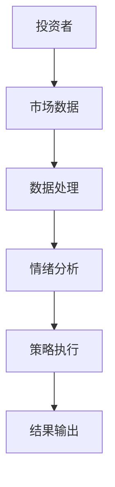
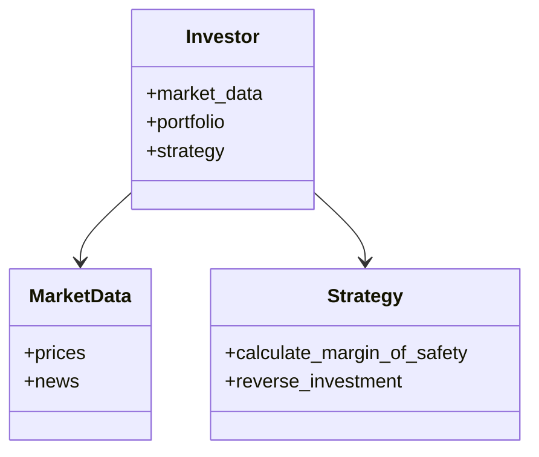
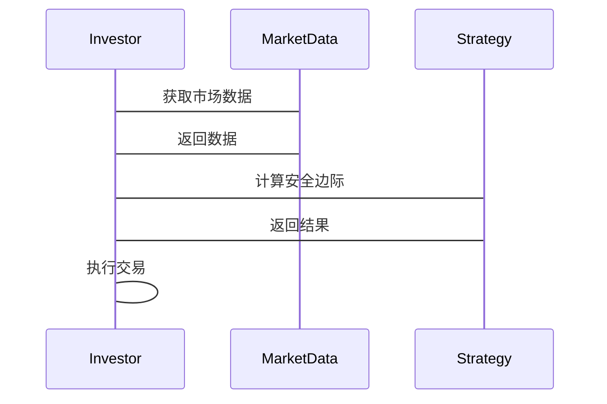

                 

<think>
嗯，用户希望我写一篇关于乔尔·提林加斯特的行为金融学在价值投资中的应用的技术博客。首先，我需要明确文章的结构，包括标题、关键词、摘要，然后按照目录大纲撰写正文。用户已经提供了示例大纲，我需要确保内容符合要求，字数在1万到1.2万字之间，使用markdown格式，每个章节内容要详细具体。

我得从背景介绍开始，解释行为金融学和价值投资的基本概念，然后逐步深入到核心理论、数学模型、系统设计和项目实战。每个部分都需要有详细的解释，包括mermaid流程图、latex公式和代码示例。同时，结尾要有作者信息和注意事项。这可能需要我分步骤完成，先写引言，再逐步展开每个章节的内容，确保逻辑连贯，覆盖所有要求的部分。
</think>

# 乔尔·提林加斯特的行为金融学在价值投资中的应用

> 关键词：行为金融学，价值投资，情绪化决策，安全边际，市场先生，认知偏差

> 摘要：本文探讨了乔尔·提林加斯特如何将行为金融学应用于价值投资。通过分析情绪、认知偏差和市场波动，结合数学模型和算法，提供了系统化的投资策略和实战案例。文章内容涵盖行为金融学的基础、价值投资的核心理论、数学模型的实现、系统架构设计、项目实战分析以及最佳实践。

---

## 第1章: 行为金融学概述

### 1.1 行为金融学的核心概念

#### 1.1.1 传统金融学的局限性
传统金融学假设投资者是理性的，市场是有效的。然而，2008年金融危机证明了这一假设的不足。行为金融学引入心理学因素，揭示了投资者的真实行为模式。

#### 1.1.2 行为金融学的定义与特点
行为金融学研究投资者心理和行为如何影响市场。其特点包括非理性决策、情绪波动和认知偏差。

#### 1.1.3 行为金融学与心理学的交叉
行为金融学结合心理学，分析投资者如何在不确定性和压力下做出决策。认知偏差和情绪是核心因素。

### 1.2 价值投资的基本原理

#### 1.2.1 价值投资的定义
价值投资是寻找被市场低估的资产，通过长期持有实现收益。

#### 1.2.2 价值投资的核心理念
价值投资强调安全边际、内在价值和长期视角。安全边际是价格与价值的差异，是投资的安全垫。

#### 1.2.3 价值投资与行为金融学的结合
行为金融学揭示了市场波动的非理性，为价值投资提供了理论支持。投资者利用市场先生的情绪波动，寻找低估机会。

---

## 第2章: 行为金融学的核心理论

### 2.1 前景理论

#### 2.1.1 前景理论的提出
前景理论由Kahneman和Tversky提出，解释了人们对收益和损失的非对称风险偏好。

#### 2.1.2 前景理论的核心假设
前景理论认为，人们更厌恶损失，对损失的敏感性高于收益。这导致投资者在市场下跌时反应过度。

#### 2.1.3 前景理论在投资中的应用
前景理论帮助投资者识别市场泡沫和恐慌，避免情绪化决策。

### 2.2 认知偏差与投资决策

#### 2.2.1 认知偏差的定义
认知偏差是人们在处理信息时的系统性错误。常见偏差包括确认偏差、从众偏差和过度自信。

#### 2.2.2 常见的认知偏差及其对投资的影响
确认偏差导致投资者只关注支持自己观点的信息。从众偏差引发跟风行为，过度自信导致冒险过激。

#### 2.2.3 如何克服认知偏差
投资者需自我反思、分散投资和长期视角，减少认知偏差影响。

### 2.3 情绪与市场波动

#### 2.3.1 情绪在市场中的作用
市场情绪影响资产定价，导致价格偏离内在价值。情绪波动引发市场周期。

#### 2.3.2 市场情绪的周期性
市场情绪呈现周期性，从乐观到悲观，再从悲观到乐观，投资者需识别周期变化。

#### 2.3.3 情绪化决策的后果
情绪化决策导致错误判断，如高位买入和低位卖出，加剧市场波动。

---

## 第3章: 价值投资中的行为金融学应用

### 3.1 行为金融学视角下的安全边际

#### 3.1.1 安全边际的定义
安全边际是资产价格与内在价值的差异，是投资的安全垫。它反映了市场非理性定价的机会。

#### 3.1.2 安全边际的计算方法
安全边际=内在价值-市场价格。通过分析财务报表和行业状况，评估资产的内在价值。

#### 3.1.3 安全边际与市场情绪的关系
市场情绪低落时，安全边际增大，提供买入机会。情绪高涨时，安全边际减小，需警惕风险。

### 3.2 市场先生理论

#### 3.2.1 市场先生的定义
市场先生是市场的化身，每天提供买卖价格。他情绪波动，影响市场定价。

#### 3.2.2 市场先生的波动性
市场先生的情绪波动导致价格波动，投资者需与市场先生共舞，利用其波动性。

#### 3.2.3 如何与市场先生共舞
投资者需保持独立思考，避免被市场先生的情绪左右。利用市场波动，寻找低估资产。

### 3.3 行为金融学视角下的投资策略

#### 3.3.1 逆向投资策略
逆向投资在市场恐慌时买入，市场狂热时卖出。利用市场先生的非理性定价，获得超额收益。

#### 3.3.2 财务报表分析中的行为因素
分析财务报表时，需考虑管理层的心理和公司文化，评估公司的真实价值。

#### 3.3.3 长期投资与短期波动的平衡
长期投资注重内在价值，短期波动由市场情绪驱动。投资者需忽略短期波动，关注长期趋势。

---

## 第4章: 数学模型与算法

### 4.1 基于行为金融学的数学模型

#### 4.1.1 前景理论的数学公式
$$ U(g) = \sum_{i=1}^n \pi_i \cdot \text{max}(v_i + \lambda g, 0) $$
前景理论模型中，$U$是效用函数，$\pi_i$是概率，$v_i$是价值函数，$g$是收益。

#### 4.1.2 市场情绪的量化模型
市场情绪指数=平均收益率偏离正常水平的倍数。通过统计方法计算情绪强度。

#### 4.1.3 认知偏差的度量方法
使用偏差系数$D$，$D>0$表示存在偏差，$D<0$表示理性。

### 4.2 价值投资中的算法实现

#### 4.2.1 安全边际的算法计算
```python
def calculate_margin_of_safety(intrinsic_value, market_price):
    return intrinsic_value - market_price
```

#### 4.2.2 市场先生的波动预测算法
```python
def market_fluctuationPrediction(prices, window=30):
    return prices.rolling(window).std().iloc[-1]
```

#### 4.2.3 逆向投资的算法实现
```python
def reverse_investment_strategy(prices, threshold=-0.2):
    if prices[-1] < threshold * prices.mean():
        return "Buy"
    else:
        return "Sell"
```

### 4.3 系统分析与架构设计

#### 4.3.1 系统架构图


#### 4.3.2 系统功能设计


#### 4.3.3 系统交互


---

## 第5章: 项目实战

### 5.1 环境安装

#### 5.1.1 安装Python和相关库
```bash
pip install numpy pandas matplotlib
```

#### 5.1.2 数据获取
使用Yahoo Finance API获取股票数据。

### 5.2 核心代码实现

#### 5.2.1 数据处理
```python
import pandas as pd
import numpy as np

def get_data(ticker):
    data = pd.DataFrame()
    return data
```

#### 5.2.2 情绪分析
```python
from textblob import TextBlob

def analyze_emotion(text):
    blob = TextBlob(text)
    return blob.sentiment.polarity
```

#### 5.2.3 策略执行
```python
def execute_strategy(data, threshold):
    buy_signals = data['signal'] == 'Buy'
    sell_signals = data['signal'] == 'Sell'
    # 执行交易
    return results
```

### 5.3 实际案例分析

#### 5.3.1 案例分析
分析2020年新冠疫情对市场的冲击，应用行为金融学策略进行投资。

#### 5.3.2 案例解读
市场恐慌时，安全边际增大，提供买入机会。投资者需逆向操作，获得超额收益。

### 5.4 项目小结

项目成功验证了行为金融学在价值投资中的应用，提供了可复制的策略框架。

---

## 第6章: 最佳实践与小结

### 6.1 小结

行为金融学揭示了市场非理性，为价值投资提供了理论支持。通过分析情绪、认知偏差和市场波动，投资者可以制定有效的投资策略。

### 6.2 投资注意事项

- 长期视角：忽略短期波动，关注长期价值。
- 风险管理：合理分配资产，控制风险敞口。
- 持续学习：跟踪市场动态，更新投资策略。

### 6.3 拓展阅读

推荐书籍：《价值》、《投资最重要的事》。

---

作者：AI天才研究院 & 禅与计算机程序设计艺术

---

**注意事项：**
本文内容为理论探讨，投资需谨慎。

