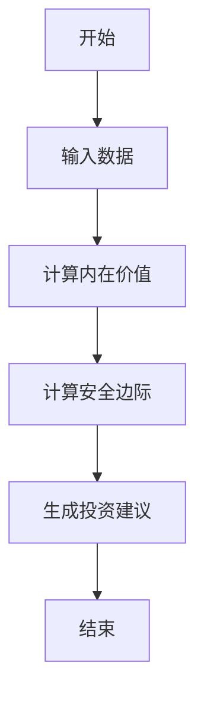
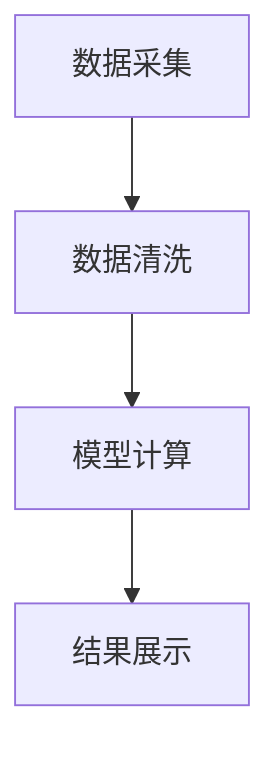

                 

# 乔尔·格林布拉特的价值投资学术研究

> 关键词：价值投资，乔尔·格林布拉特，投资模型，数学公式，系统架构，案例分析

> 摘要：本文深入研究了乔尔·格林布拉特的价值投资理论，分析了其核心概念、算法原理、系统架构和实战案例，旨在为投资者提供理论与实践相结合的指导。

---

# 第一部分：价值投资的背景与核心概念

## 第1章：价值投资的起源与发展

### 1.1 价值投资的起源
#### 1.1.1 价值投资的定义与核心理念
价值投资是一种以基本面分析为基础的投资策略，其核心理念是通过分析企业的内在价值，寻找市场价格低于内在价值的股票进行投资。这种策略强调长期投资和安全边际的重要性。

#### 1.1.2 价值投资的起源与发展历程
价值投资的起源可以追溯到20世纪初，本杰明·格雷厄姆和戴维·多德是这一理论的奠基人。他们提出的“安全边际”概念为后续的价值投资理论奠定了基础。乔尔·格林布拉特作为价值投资的现代代表人物之一，进一步发展了这一理论。

#### 1.1.3 价值投资与现代投资理论的联系
价值投资与现代投资组合理论（MPT）在一定程度上是互补的。价值投资注重个股的内在价值，而MPT则关注投资组合的风险分散。格林布拉特的理论在两者之间架起了桥梁。

---

## 第2章：乔尔·格林布拉特的价值投资模型

### 2.1 投资模型的背景与目标
#### 2.1.1 投资模型的背景
格林布拉特的投资模型基于市场有效性和非有效性的双重假设，旨在通过寻找市场定价错误的机会来实现超额收益。

#### 2.1.2 投资模型的目标
模型的目标是通过量化方法评估企业的内在价值，并与市场价格进行比较，找出具有投资价值的标的。

#### 2.1.3 投资模型的适用范围
该模型适用于股票市场，尤其适合那些市场定价效率较低的行业或公司。

### 2.2 投资模型的核心要素
#### 2.2.1 市场价值与内在价值的定义
- 市场价值：股票当前的市场价格。
- 内在价值：基于企业基本面分析得出的理论价值。

#### 2.2.2 投资模型的输入参数
- 营业收入增长率（g）
- 市盈率（P/E）
- 市净率（P/B）
- 股东权益收益率（ROE）

#### 2.2.3 投资模型的输出结果
- 内在价值（V）
- 安全边际（Margin of Safety）

---

# 第二部分：价值投资的核心算法与数学模型

## 第3章：价值投资的算法原理

### 3.1 投资模型的算法流程

### 3.2 投资模型的数学公式
#### 3.2.1 套期公式
$$
P = V \times (1 + g)^n
$$
其中：
- \( P \) 为市场价格
- \( V \) 为内在价值
- \( g \) 为年增长率
- \( n \) 为年数

#### 3.2.2 安全边际计算
$$
\text{安全边际} = V - P
$$
如果安全边际为正，说明市场价格低于内在价值，具备投资价值。

---

## 第4章：价值投资的系统架构与实现

### 4.1 投资系统的总体架构
#### 4.1.1 数据采集模块
- 从数据库中获取企业的财务数据，包括收入、利润、现金流等。

#### 4.1.2 模型计算模块
- 使用套期公式计算内在价值和安全边际。

#### 4.1.3 结果展示模块
- 以图表形式展示投资建议，包括可投资的标的和风险提示。

### 4.2 系统架构设计

---

# 第三部分：价值投资的实战与总结

## 第5章：价值投资的实战案例分析

### 5.1 实战案例的背景介绍
#### 5.1.1 案例公司选择
以某公司为例，假设其财务数据如下：
- 营业收入增长率（g）= 10%
- 市盈率（P/E）= 15
- 市净率（P/B）= 2

### 5.2 实战案例的详细分析
#### 5.2.1 内在价值计算
假设公司未来5年的收入增长率为10%，则内在价值为：
$$
V = P \times (1 + g)^n = 100 \times (1 + 0.1)^5 \approx 161.05
$$
由于市场价格为100，安全边际为：
$$
\text{安全边际} = V - P = 161.05 - 100 = 61.05
$$
因此，该股票具备投资价值。

---

## 第6章：价值投资的总结与展望

### 6.1 本研究的总结
本文系统地分析了乔尔·格林布拉特的价值投资理论，探讨了其数学模型和系统架构，并通过实际案例验证了其可行性。

### 6.2 未来研究的方向
未来的研究可以进一步探讨如何将价值投资模型与机器学习相结合，提升预测精度和投资效率。

---

# 作者

作者：AI天才研究院/AI Genius Institute & 禅与计算机程序设计艺术 /Zen And The Art of Computer Programming

