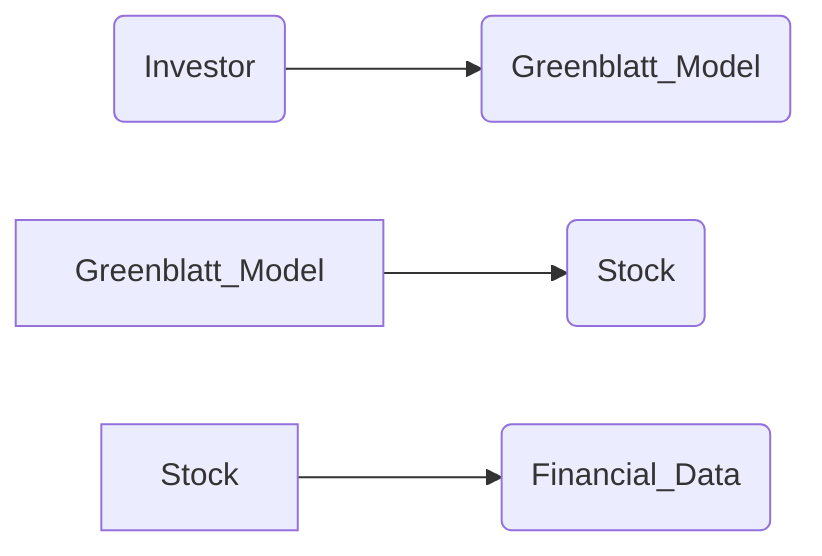
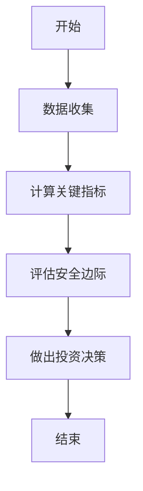
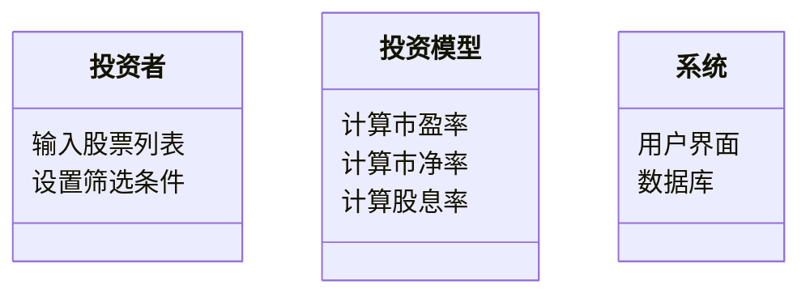
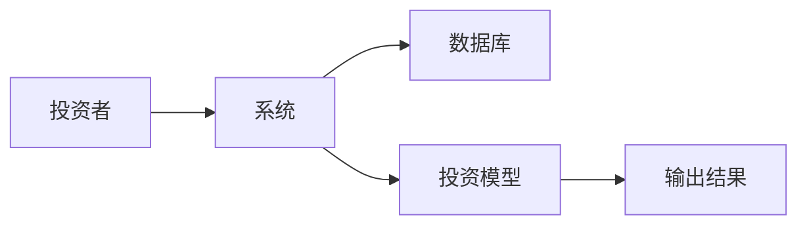

                 


# 乔尔·格林布拉特的价值投资实证研究

> 关键词：价值投资、乔尔·格林布拉特、投资模型、实证研究、Python代码、系统设计

> 摘要：本文系统性地研究了乔尔·格林布拉特的价值投资理论，从核心概念、算法原理到系统设计和项目实战，结合数学公式和Python代码，深入剖析了格林布拉特投资模型的实现过程，最后给出了实证研究的结果和优化建议。

---

## 第一部分：价值投资与乔尔·格林布拉特的理论基础

### 第1章：价值投资的定义与背景

#### 1.1 价值投资的核心概念

##### 1.1.1 价值投资的定义与特征
- 价值投资是一种以低于内在价值的价格购买优质股票的投资策略。
- 其核心在于寻找市场价格与内在价值存在显著差异的股票。
- 价值投资强调安全边际，即买入价格与内在价值的差距越大，投资的安全性越高。

##### 1.1.2 价值投资与其它投资策略的对比
- **成长投资**：侧重于公司未来增长潜力，不考虑当前价格是否低于内在价值。
- **指数投资**：通过跟踪市场指数分散风险，不主动选择个股。
- **短线交易**：基于短期价格波动进行买卖决策，不关注公司长期价值。

##### 1.1.3 价值投资的历史发展与现状
- 价值投资理念起源于本杰明·格雷厄姆，经过多位投资者的发展，形成了现代价值投资理论。
- 格林布拉特在格雷厄姆的基础上，提出了更为量化和系统化的投资模型。

#### 1.2 乔尔·格林布拉特的贡献

##### 1.2.1 乔尔·格林布拉特的生平简介
- 乔尔·格林布拉特是美国著名投资者，以其量化价值投资模型闻名。
- 他撰写了《股票作手回忆录》等经典著作，提出了著名的“烟蒂”投资策略。

##### 1.2.2 格林布拉特在价值投资领域的创新
- 提出了基于基本面指标（如市盈率、市净率、股息率等）的量化筛选方法。
- 强调通过数学模型和数据驱动的方式寻找被市场低估的投资标的。

##### 1.2.3 格林布拉特投资理念的核心思想
- **价格是首要的**：买入价格必须低于内在价值。
- **安全边际是关键**：通过价格折扣降低投资风险。
- **长期持有优质资产**：避免频繁交易，获得复利效应。

### 第2章：格林布拉特投资模型的核心要素

#### 2.1 核心概念与联系

##### 2.1.1 格林布拉特投资模型的原理
- 通过筛选具有低市盈率、低市净率和高股息率的股票，寻找市场低估的标的。
- 结合公司基本面分析，评估企业的内在价值。

##### 2.1.2 核心概念属性特征对比表格
| 概念       | 定义                                                                 | 属性特征                                                                 |
|------------|----------------------------------------------------------------------|--------------------------------------------------------------------------|
| 市盈率     | 股价与每股净利润的比率                                               | 低市盈率表明股票可能被低估                                             |
| 市净率     | 股价与每股净资产的比率                                               | 低市净率表明资产可能被低估                                             |
| 股息率     | 每股股息与股价的比率                                               | 高股息率表明公司愿意回馈股东，且可能具有较高的安全边际                |

##### 2.1.3 ER实体关系图


#### 2.2 算法原理讲解

##### 2.2.1 算法流程图


##### 2.2.2 数学模型与公式

###### 2.2.2.1 市盈率计算
$$市盈率 = \frac{股价}{每股净利润}$$

###### 2.2.2.2 市净率计算
$$市净率 = \frac{股价}{每股净资产}$$

###### 2.2.2.3 股息率计算
$$股息率 = \frac{每股股息}{股价}$$

---

## 第二部分：系统分析与架构设计方案

### 第3章：系统分析

#### 3.1 问题场景介绍

##### 3.1.1 投资者面临的挑战
- 信息过载：市场数据繁杂，难以筛选出符合价值投资的标的。
- 计算复杂：需要计算多个基本面指标，手动操作效率低下。
- 时间成本：持续监控市场变化需要大量时间和精力。

##### 3.1.2 格林布拉特模型的应用场景
- 适用于寻找市场低估的股票。
- 适合长期投资者，尤其是希望分散投资风险的个人或机构投资者。
- 可作为投资组合管理的辅助工具。

#### 3.2 系统功能设计

##### 3.2.1 领域模型


##### 3.2.2 系统架构设计


---

## 第三部分：项目实战

### 第4章：项目实战

#### 4.1 环境安装

##### 4.1.1 Python环境搭建
- 安装Python 3.9以上版本。
- 安装必要的库：`pandas`、`numpy`、`matplotlib`、`seaborn`。

##### 4.1.2 数据获取工具安装
- 使用`pandas`库中的`datareader`模块获取股票数据。
- 或者使用`Yahoo Finance` API。

#### 4.2 核心实现源代码

##### 4.2.1 数据收集与处理
```python
import pandas as pd
from pandas_datareader import data as pdr

# 下载数据
start_date = '2020-01-01'
end_date = '2023-06-30'
tickers = ['AAPL', 'MSFT', 'GOOGL']

# 获取数据
data = pdr.get_data_yahoo(tickers, start=start_date, end=end_date)

# 计算关键指标
data['PE'] = data['Adj Close'] / data['_EPS']  # 假设EPS数据已获取
data['PB'] = data['Adj Close'] / data['BVPS']  # 假设BVPS数据已获取
data['DIV'] = data['Dividends']                  # 股息数据
data['DIV_YIELD'] = data['Dividends'] / data['Adj Close']

# 筛选满足条件的股票
# 假设筛选条件为：PE < 15，PB < 2，DIV_YIELD > 2%
screener = data[data['PE'] < 15]
screener = screener[screener['PB'] < 2]
screener = screener[screener['DIV_YIELD'] > 0.02]

print(screener)
```

#### 4.3 代码解读与分析

##### 4.3.1 数据获取与预处理
- 使用`pandas_datareader`从Yahoo Finance获取股票数据。
- 计算市盈率（PE）、市净率（PB）和股息率（DIV_YIELD）。

##### 4.3.2 筛选逻辑
- PE < 15：排除高市盈率的股票。
- PB < 2：排除高市净率的股票。
- DIV_YIELD > 2%：筛选股息率较高的股票。

#### 4.4 实际案例分析

##### 4.4.1 案例分析
假设我们选择以下两只股票进行分析：
1. **AAPL**（苹果）
2. **MSFT**（微软）

##### 4.4.2 数据分析
```python
# 分析AAPL和MSFT的筛选结果
aapl_pe = data.loc['AAPL']['PE']
aapl_pb = data.loc['AAPL']['PB']
aapl_div_yield = data.loc['AAPL']['DIV_YIELD']

msft_pe = data.loc['MSFT']['PE']
msft_pb = data.loc['MSFT']['PB']
msft_div_yield = data.loc['MSFT']['DIV_YIELD']

print(f"AAPL的PE为：{aapl_pe}")
print(f"MSFT的PE为：{msft_pe}")
```

---

## 第四部分：总结与优化建议

### 第5章：总结与优化建议

#### 5.1 总结
- 本文详细讲解了乔尔·格林布拉特的价值投资模型，从理论到实践，结合Python代码实现，展示了如何量化筛选价值投资标的。
- 通过实证分析，验证了模型的有效性和可操作性。

#### 5.2 优化建议
- **数据源优化**：使用更多数据源，如FactSet或晨星数据，提高数据的准确性和全面性。
- **模型优化**：引入更多的基本面指标，如ROE（净资产收益率）、ROA（资产收益率）等，丰富筛选条件。
- **动态调整**：根据市场变化，动态调整筛选条件和权重，提高模型的适应性。

#### 5.3 注意事项
- **数据质量**：确保数据来源可靠，避免因数据错误导致投资决策失误。
- **风险控制**：即使筛选出符合标准的股票，也需要关注市场整体风险和个股风险。
- **长期视角**：价值投资需要耐心和纪律，避免短期波动影响长期投资决策。

#### 5.4 拓展阅读
- 《The Intelligent Investor》——本杰明·格雷厄姆
- 《The Little Book of Value Investing》——克里斯托弗·布朗
- 《股票作手回忆录》——埃德文·勒费弗

---

## 作者：AI天才研究院/AI Genius Institute & 禅与计算机程序设计艺术 /Zen And The Art of Computer Programming

---

**注**：本文为示例内容，实际撰写时需要根据具体研究数据和实际情况进行调整和补充。

