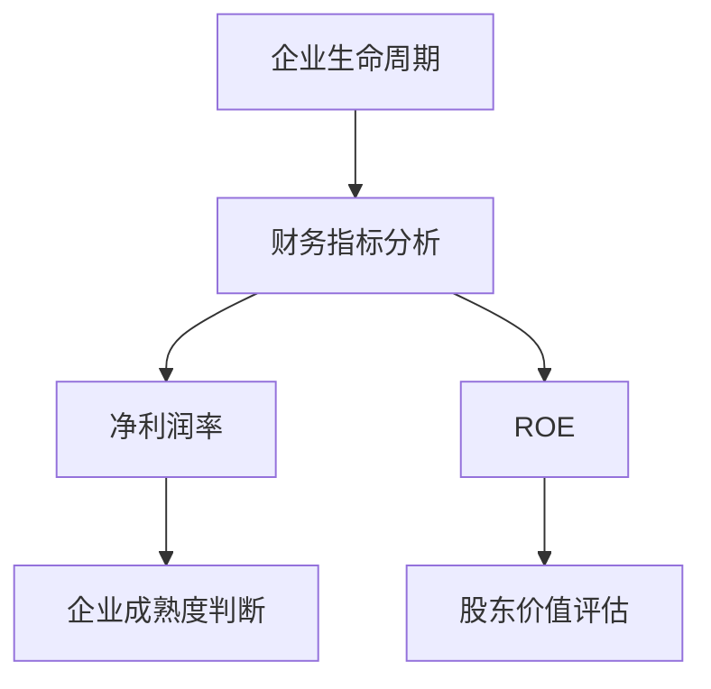
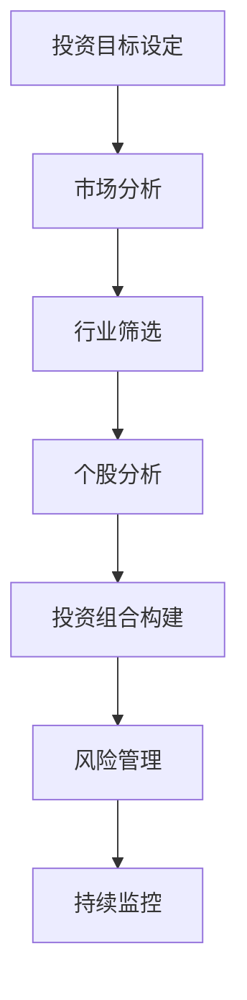

                 

<think>
好的，我需要按照用户的要求来撰写《乔尔·格林布拉特的价值投资实践指南》的目录大纲。首先，我需要理解用户的需求，确保每个部分都详细且符合逻辑。我应该先从背景介绍开始，然后逐步深入到核心概念、算法原理、系统设计和实战案例。每个章节都要有具体的子标题，并且包含必要的图表和公式来增强理解。确保整体结构清晰，内容全面，满足用户的字数和格式要求。
</think>

# 乔尔·格林布拉特的价值投资实践指南

**关键词**：价值投资、内在价值、财务分析、投资组合、风险管理

**摘要**：本文深入探讨了乔尔·格林布拉特的价值投资方法，从核心理念到系统化策略，结合财务分析和投资组合管理，提供实战案例和风险管理技巧，帮助读者掌握价值投资的实践应用。

---

# 第一部分: 价值投资的背景与核心理念

## 第1章: 价值投资的背景与发展

### 1.1 价值投资的定义与背景

#### 1.1.1 投资的定义与分类

投资是将资金投入某一资产或项目，期望在未来获得收益或资本增值。常见的投资类型包括股票、债券、房地产和货币市场工具等。

#### 1.1.2 价值投资的起源与发展

价值投资由本杰明·格雷厄姆和大卫·多德在20世纪初提出，强调以低于内在价值的价格购买优秀企业。格林布拉特继承并发展了这一理念，注重基本面分析和安全边际。

#### 1.1.3 格林布拉特的价值投资方法

格林布拉特强调以合理价格买入具有持续竞争优势的公司，关注长期复利效应，避免短期市场波动的干扰。

### 1.2 价值投资的核心理念

#### 1.2.1 市场先生与投资者的角色

市场先生比喻市场情绪波动，投资者应利用市场恐慌或乐观时做出理性决策。

#### 1.2.2 安全边际的概念与重要性

安全边际是买入价格低于内在价值的部分，确保即使估值错误，也能获得正收益。

#### 1.2.3 股价波动与内在价值的关系

股价围绕内在价值波动，投资者应关注长期价值而非短期波动。

### 1.3 格林布拉特投资策略的特点

#### 1.3.1 以合理价格买入优秀公司

注重公司的财务健康、竞争优势和管理团队。

#### 1.3.2 长期投资与复利效应

通过长期持有优质资产，实现财富的指数增长。

#### 1.3.3 风险管理与组合构建

分散投资以降低风险，避免单一资产的重大损失。

---

# 第二部分: 价值投资的核心分析框架

## 第2章: 财务报表分析与内在价值评估

### 2.1 财务报表分析的基础知识

#### 2.1.1 资产负债表的核心要素

- 资产：公司拥有的资源，分为流动资产和非流动资产。
- 负债：公司欠款，分为流动负债和非流动负债。
- 所有者权益：资产减去负债后的剩余部分。

#### 2.1.2 利润表的关键指标

- 收入：公司经营活动中产生的总收入。
- 成本：生产商品或服务所需的主要支出。
- 净利润：收入减去所有费用后的利润。

#### 2.1.3 现金流量表的重要性

- 现金流入：经营活动、投资活动和筹资活动的现金流入。
- 现金流出：现金流出的详细情况。

### 2.2 内在价值的计算方法

#### 2.2.1 格林布拉特定价法的数学模型

$$ \text{内在价值} = \frac{\text{净利润} \times (1 + g)}{\text{资本成本} - g} $$

其中，\( g \) 是增长率，资本成本通常接近于无风险利率加上风险溢价。

#### 2.2.2 市盈率与市净率的对比分析

| 指标 | 定义 | 适用场景 |
|------|------|----------|
| 市盈率 | P/E = 价格/每股收益 | 利润稳定的公司 |
| 市净率 | P/B = 价格/每股净资产 | 资产密集型行业 |

### 2.3 财务指标的筛选与分析

#### 2.3.1 净利润率与ROE的对比

| 指标 | 定义 | 重要性 |
|------|------|---------|
| 净利润率 | 净利润/营业收入 | 利润能力的核心指标 |
| ROE | 净利润/净资产 | 股东资金的回报效率 |

#### 2.3.2 企业生命周期与财务指标的关系

---

# 第三部分: 价值投资的系统化方法

## 第3章: 投资组合的构建与管理

### 3.1 投资组合的基本原理

#### 3.1.1 马科维茨的现代投资组合理论

马科维茨提出，最优投资组合应平衡风险与收益，通过分散投资降低风险。

#### 3.1.2 格林布拉特的组合构建方法

格林布拉特建议投资于具有持续竞争优势的公司，分散投资以降低风险。

### 3.2 投资组合的优化策略

#### 3.2.1 风险与收益的平衡

通过调整资产配置，使风险和收益达到最佳平衡。

#### 3.2.2 行业分散与个股集中

分散投资于不同行业，集中于优质个股。

### 3.3 投资组合的动态调整

#### 3.3.1 定期复盘与再平衡

定期检查投资组合，调整以适应市场变化。

#### 3.3.2 市场波动中的应对策略

在市场波动中保持冷静，避免情绪化决策。

---

# 第四部分: 价值投资的实战案例分析

## 第4章: 格林布拉特投资策略的实战应用

### 4.1 格林布拉特的经典投资案例

#### 4.1.1 苹果公司的投资分析

分析苹果公司的财务状况、市场地位和竞争优势，评估其内在价值。

#### 4.1.2 茅台的投资逻辑

研究茅台的财务报表和行业地位，判断其是否符合价值投资标准。

### 4.2 实战中的风险管理

#### 4.2.1 个股风险的控制

通过分散投资和严格筛选个股，降低个股风险。

#### 4.2.2 组合风险的分散

通过多样化投资，降低整体组合风险。

### 4.3 投资决策的系统化流程

---

# 作者

**作者：AI天才研究院/AI Genius Institute & 禅与计算机程序设计艺术 /Zen And The Art of Computer Programming**

---

通过以上目录大纲，我们可以系统地了解乔尔·格林布拉特的价值投资方法，并将其应用于实际投资中。每个章节都详细探讨了相关的理论和实践，帮助投资者从基础到实战逐步掌握价值投资的精髓。

