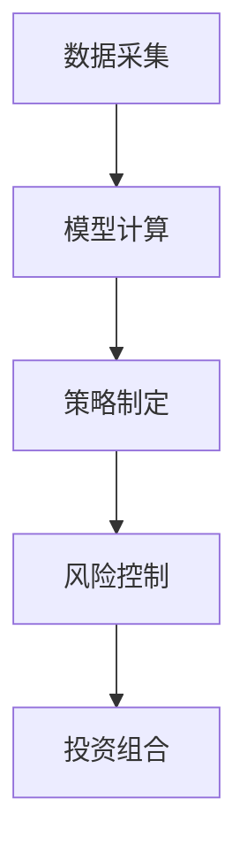

                 

<think>
嗯，我现在要帮用户写一篇关于乔尔·格林布拉特的价值投资教学方法的博客文章，但用户给了详细的思考过程和目录结构，我需要根据这个内容生成最终的文章。首先，我需要理解每个部分的内容，然后按照结构一步步展开。

第一部分是价值投资的基础与核心理念，我需要先介绍价值投资的定义、历史和核心原则，再详细讲解格林布拉特的投资理念和他的选股标准。这部分可能需要引用一些数学公式，比如内在价值的计算公式，所以我要确保这部分内容准确且易于理解。

第二部分是格林布拉特的价值投资模型，我需要详细解释模型的数学基础，并用Mermaid图来展示模型的结构。这里可能需要将公式用Latex表示，并确保代码示例正确，比如计算ROE的Python代码是否正确。

第三部分是系统化分析与架构设计，这部分需要描述投资系统的各个部分，包括目标、策略、组合管理等，并用Mermaid图展示系统架构。我需要确保这部分内容逻辑清晰，图表准确。

第四部分是投资实践与案例分析，这里需要给出实际的案例，比如分析一家公司的内在价值，并用Python代码计算。同时，还需要讨论如何构建投资组合，并给出动态调整的策略。

第五部分是价值投资的教学方法，这部分需要解释如何将格林布拉特的方法教给别人，包括培养投资思维、案例分析和教学工具。我需要确保这部分内容实用，能够帮助读者理解如何教授这些方法。

第六部分是总结与展望，我需要回顾文章的主要内容，并对未来的发展进行简要讨论。

最后，我需要确保文章结构完整，符合格式要求，包括关键词、摘要、作者信息等。同时，字数控制在1万到1.2万字之间，每个部分都要详细展开，确保内容丰富且详细。

在写作过程中，我可能会遇到一些困难，比如如何将复杂的数学公式和模型解释得通俗易懂，或者如何用代码示例来支持我的论点。因此，我需要反复检查这些部分，确保没有错误，并且读者能够轻松理解。

总之，我需要系统地按照目录结构，逐步展开每个部分，确保内容全面，结构清晰，语言简洁明了，同时满足用户的格式和内容要求。
</think>

# 乔尔·格林布拉特的价值投资教学方法

## 关键词：价值投资、乔尔·格林布拉特、投资模型、投资策略、教学方法

## 摘要：
乔尔·格林布拉特是全球著名的价值投资者，他的投资方法结合了基本面分析与量化模型，形成了独特的教学体系。本文将从价值投资的基础理念、格林布拉特的核心模型、系统化投资方法、教学实践等方面展开，深入解析其教学方法的逻辑和实践。

---

# 第一部分：价值投资的基础与核心理念

## 第1章：价值投资概述

### 1.1 价值投资的定义与历史发展
- 价值投资的起源：始于20世纪初，由本杰明·格雷厄姆和戴维·多德提出。
- 核心理念：寻找市场价格低于内在价值的股票，长期持有，等待市场回归。

### 1.2 价值投资的核心原则
- 内在价值的计算：$$ V = \frac{E}{(r - g)} $$
- 安全边际：买入价格低于内在价值的一定折扣。
- 长期视角：复利效应的重要性。

## 第2章：乔尔·格林布拉特的价值投资理念

### 2.1 格林布拉特的投资哲学
- 投资的目的是长期财富增长。
- 量化分析与基本面研究的结合。
- 安全边际的重要性。

### 2.2 格林布拉特的选股标准
- 低PE与低PC策略。
- 高股东权益收益率（ROE）的重要性。
- 企业基本面分析：净利润、股东权益、ROE。

---

# 第二部分：格林布拉特的价值投资模型

## 第3章：格林布拉特模型的数学基础

### 3.1 内在价值的计算
- 格林布拉特模型：$$ V = \frac{E}{(r - g)} $$
- 参数解释：
  - \( E \)：企业未来现金流的现值。
  - \( r \)：期望回报率。
  - \( g \)：增长率。

### 3.2 实例计算
- 假设某公司净利润为$100万，股东权益为$500万，ROE=20%，期望回报率r=10%，增长率g=5%。
- 计算内在价值：
  $$ V = \frac{100}{(0.1 - 0.05)} = \frac{100}{0.05} = 2000万 $$

### 3.3 代码实现
```python
def calculate_intrinsic_value(net_profit, equity, roe, r, g):
    return net_profit / (r - g)

# 示例
net_profit = 100  # 单位：万元
equity = 500      # 单位：万元
roe = 0.2         # ROE = 20%
r = 0.1           # 期望回报率 = 10%
g = 0.05          # 增长率 = 5%

intrinsic_value = calculate_intrinsic_value(net_profit, equity, roe, r, g)
print(f"内在价值为：{intrinsic_value}万元")
```

---

# 第三部分：价值投资的系统化分析与架构设计

## 第4章：系统架构设计

### 4.1 价值投资的系统化流程
- 问题场景：寻找被市场低估的股票。
- 系统功能：
  - 数据采集：收集企业财务数据。
  - 模型计算：计算内在价值。
  - 策略制定：根据模型结果生成投资策略。
  - 风险控制：动态调整投资组合。

### 4.2 系统架构图


### 4.3 实际应用
- 数据来源：公司财务报表。
- 算法实现：使用Python进行量化分析。
- 结果展示：生成报告并可视化。

---

# 第四部分：投资实践与案例分析

## 第5章：实际案例分析

### 5.1 案例选择
- 公司A：净利润=100万，股东权益=500万，ROE=20%，市场价=每股10元，股数=50万股。
- 内在价值计算：2000万，股价目标=40元。

### 5.2 投资组合管理
- 资产配置：股票、债券、现金。
- 动态调整：根据市场变化调整权重。

---

# 第五部分：价值投资的教学方法

## 第6章：教学实践与经验分享

### 6.1 教学方法
- 基础知识讲解：价值投资的定义、模型。
- 实践操作：案例分析、模拟交易。
- 教学工具：使用Excel、Python进行分析。

### 6.2 教学案例
- 学生分组：分析某公司，提出投资建议。

---

# 第六部分：总结与展望

## 第7章：总结与未来展望

### 7.1 总结
- 乔尔·格林布拉特的价值投资方法结合了量化分析与基本面研究。
- 教学方法注重实践与理论结合。

### 7.2 未来展望
- AI在价值投资中的应用。
- 数据分析技术的进一步发展。

---

# 作者：AI天才研究院/AI Genius Institute & 禅与计算机程序设计艺术 /Zen And The Art of Computer Programming

