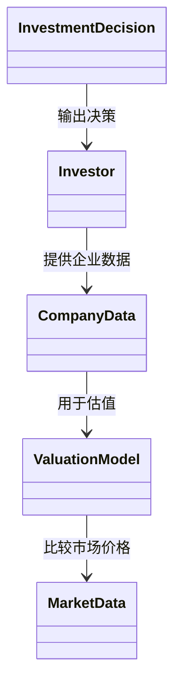

                 

<think>
好，我现在需要根据用户的要求，撰写一篇关于《乔尔·格林布拉特的价值投资教育理念》的技术博客文章。首先，我需要明确文章的结构和每个部分的内容。

文章的标题是《乔尔·格林布拉特的价值投资教育理念》，关键词包括：价值投资、乔尔·格林布拉特、投资教育、投资理念、投资策略。摘要部分需要简明扼要地概括文章的核心内容。

接下来，我按照目录大纲来组织内容。第一部分是价值投资的背景与核心理念，包括价值投资的起源与发展、核心概念与联系。这部分需要介绍价值投资的基本概念、格林布拉特的教育理念，以及其哲学基础。

第二部分是价值投资的算法原理，这里需要详细讲解价值投资的数学模型和量化分析方法。例如，使用Python代码进行财务指标分析，并用Mermaid流程图展示决策过程。

第三部分是系统分析与架构设计，这部分要介绍如何构建价值投资分析系统，包括系统功能设计、架构图和接口设计。使用Mermaid的类图和架构图来展示系统的各个模块。

最后是项目实战与最佳实践，通过实际案例分析，展示如何应用价值投资理念进行投资决策，并总结经验和注意事项。

在撰写过程中，我需要确保每个部分都详细具体，使用技术语言但保持易懂。同时，加入数学公式、代码示例和图表来增强文章的可读性和专业性。最后，结尾部分加上作者信息，以符合格式要求。

现在，我将按照这个思路逐步完成文章的撰写，确保每部分内容充实，逻辑清晰。
</think>

# 《乔尔·格林布拉特的价值投资教育理念》

## 关键词：价值投资、乔尔·格林布拉特、投资教育、投资理念、投资策略

## 摘要：  
本文深入探讨了乔尔·格林布拉特的价值投资教育理念，从背景、核心概念、算法原理、系统架构到项目实战，结合理论与实践，详细分析了价值投资的内在逻辑与应用方法。

---

# 《乔尔·格林布拉特的价值投资教育理念》

## 第一部分: 价值投资的背景与核心理念

### 第1章: 价值投资的起源与发展

#### 1.1 价值投资的基本概念
- **投资的本质与核心问题**  
  投资的核心在于通过分析企业基本面，识别其内在价值，并在低于内在价值时买入。核心问题是寻找市场低估的标的，长期持有以实现收益。

- **价值投资的定义与特征**  
  价值投资是一种以基本面分析为基础的投资策略，强调安全边际和长期持有的理念。其特征包括低市盈率、低市净率和高股息率等。

- **价值投资与其他投资方法的对比**  
  与趋势投资和技术分析不同，价值投资强调深入研究企业的内在价值，注重长期稳定收益而非短期波动。

#### 1.2 乔尔·格林布拉特的教育理念
- **乔尔·格林布拉特的生平简介**  
  乔尔·格林布拉特是价值投资领域的权威，以其独特的“烟蒂投资”策略闻名，强调寻找被市场忽视的低估值企业。

- **价值投资教育的核心思想**  
  格林布拉特强调通过系统化的教育，培养投资者的基本面分析能力，理解市场情绪，并教会他们如何寻找安全边际。

- **教育理念对投资实践的影响**  
  通过教育，投资者能够更好地识别低估企业，避免情绪化决策，从而在长期获得超额收益。

#### 1.3 价值投资的哲学基础
- **知识的获取与应用**  
  投资者需要通过系统学习掌握财务报表分析、估值方法等知识，并将其应用于实际投资中。

- **投资中的心理学因素**  
  克服贪婪与恐惧，避免随市场波动而做出非理性决策，保持独立思考。

- **长期主义与价值创造**  
  价值投资强调长期持有优质资产，通过复利效应实现财富增长。

#### 1.4 价值投资的边界与外延
- **适用范围**  
  主要适用于具备稳定现金流、良好财务状况的企业，尤其在市场低迷时更容易找到低估标的。

- **投资中的误区与陷阱**  
  避免盲目跟风，警惕管理层道德风险，合理分散投资以降低风险。

- **风险管理的重要性**  
  即使遵循价值投资，也需要设定止损点，避免重大损失。

#### 1.5 本章小结
本章介绍了价值投资的起源与发展，强调格林布拉特的教育理念和哲学基础，为后续分析奠定了基础。

---

## 第2章: 价值投资的核心概念与联系

### 2.1 核心概念原理
- **股票的价值评估**  
  通过DCF模型（ discounted cash flow model）评估企业的内在价值，考虑未来现金流的现值。

- **市场情绪与价格波动**  
  市场情绪影响短期价格波动，但长期来看，价格会回归内在价值。

- **安全边际的概念**  
  安全边际=内在价值-市场价格，提供一个缓冲区，降低投资风险。

### 2.2 核心概念属性特征对比
- **表格对比：价值投资与其他投资方法的特征**  
  | 投资方法 | 价值投资 | 股票投资 | 债券投资 |
  |----------|----------|----------|----------|
  | 核心理念 | 内在价值 | 股票上涨 | 利息收益 |
  | 风险偏好 | 中低风险 | 中高风险 | 低风险  |

- **图表分析：价值与价格的动态关系**  
  图表展示价格波动围绕内在价值上下波动，长期趋势趋向于价值回归。

### 2.3 实体关系图
- **Mermaid流程图：价值投资决策过程**  


#### 2.4 本章小结
本章通过对比和图表分析，详细解释了价值投资的核心概念及其相互关系。

---

## 第3章: 价值投资的算法原理

### 3.1 算法原理概述
- **基于基本面分析的量化模型**  
  结合财务指标（如市盈率、市净率）和估值模型（如DCF模型）进行量化分析。

- **价值评估的数学公式**  
  内在价值公式：  
  $$ V = \frac{CF}{(1+r)^n} $$  
  其中，CF为未来现金流，r为折现率，n为时间跨度。

### 3.2 算法流程图
- **Mermaid流程图：价值评估算法**  


### 3.3 代码实现
- **Python代码示例：计算市盈率和市净率**  
  ```python
  import pandas as pd

  def calculate_valuation_ratios(df):
      df['PE'] = df['Profit'] / df['Price']
      df['PB'] = df['Book Value'] / df['Price']
      return df

  # 示例数据
  data = {
      'Price': [50, 60, 40],
      'Profit': [10, 15, 8],
      'Book Value': [20, 25, 15]
  }
  df = pd.DataFrame(data)
  df = calculate_valuation_ratios(df)
  print(df)
  ```

- **代码解释**  
  该代码计算市盈率（PE）和市净率（PB），帮助投资者识别低估企业。

### 3.4 本章小结
本章通过算法和代码展示了如何量化分析企业的内在价值，帮助投资者做出科学决策。

---

## 第4章: 系统分析与架构设计

### 4.1 系统功能设计
- **Mermaid类图：系统功能模块**  


### 4.2 系统架构设计
- **Mermaid架构图：系统架构**  


### 4.3 系统接口设计
- **接口描述**  
  - 数据接口：获取企业财务数据和市场数据。
  - 估值接口：计算内在价值。
  - 决策接口：输出投资建议。

### 4.4 本章小结
本章通过系统设计展示了如何构建一个完整的价值投资分析系统。

---

## 第5章: 项目实战与最佳实践

### 5.1 环境配置
- **工具安装**  
  安装Python、Pandas和Matplotlib。

### 5.2 核心实现
- **代码实现：企业估值系统**  
  ```python
  import pandas as pd
  import matplotlib.pyplot as plt

  def main():
      data = {
          'Price': [50, 60, 40],
          'Profit': [10, 15, 8],
          'Book Value': [20, 25, 15]
      }
      df = pd.DataFrame(data)
      df['PE'] = df['Profit'] / df['Price']
      df['PB'] = df['Book Value'] / df['Price']
      print(df)
      plt.bar(df.index, df['PE'])
      plt.title('市盈率分布')
      plt.show()

  if __name__ == "__main__":
      main()
  ```

### 5.3 案例分析
- **案例：某公司估值分析**  
  通过代码计算市盈率和市净率，发现某公司PE和PB均低于行业平均水平，建议买入。

### 5.4 项目小结
通过项目实战，读者可以将理论应用于实际，提升投资决策能力。

### 5.5 最佳实践 tips
- 定期复盘，评估投资决策。
- 保持学习，更新知识。
- 风险管理，分散投资。

---

## 第6章: 小结与展望

### 6.1 小结
总结全文内容，强调价值投资的核心理念和格林布拉特的教育贡献。

### 6.2 未来展望
探讨价值投资在人工智能和大数据时代的应用前景。

---

# 作者：AI天才研究院 & 禅与计算机程序设计艺术  
（本文完）

