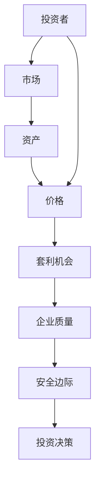
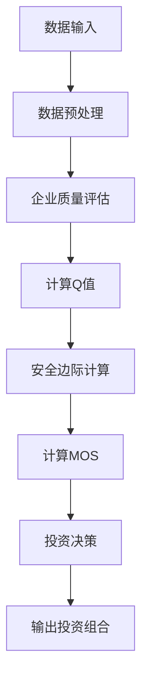
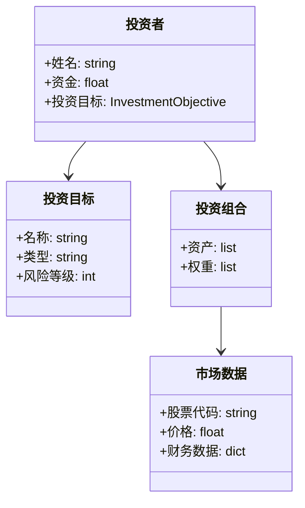
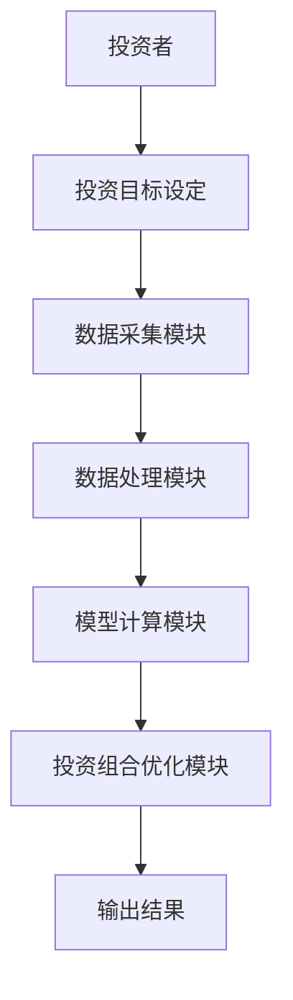
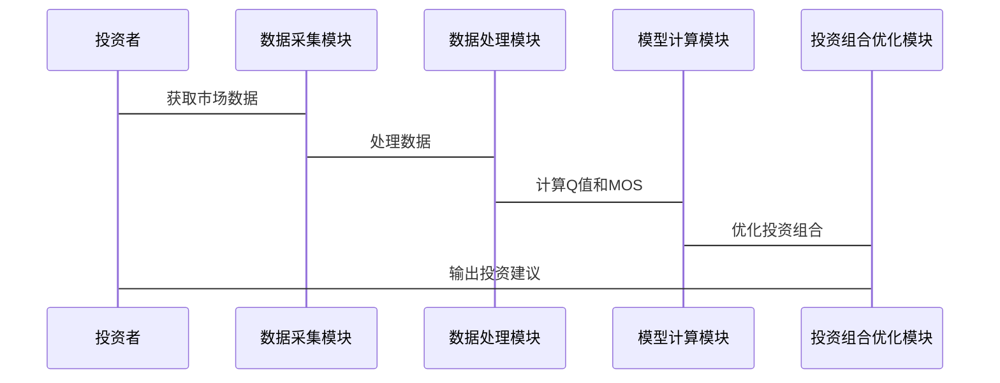

                 


---

# 乔尔·格林布拉特的价值投资量化方法

> 关键词：价值投资、量化方法、格林布拉特模型、套利机会、企业质量、安全边际、投资策略

> 摘要：本文详细探讨了乔尔·格林布拉特的价值投资量化方法，从其背景、核心概念、算法原理到系统架构和项目实战，深入分析了格林布拉特模型的理论基础和实际应用。文章结合技术语言和专业术语，以清晰的逻辑结构和详细的案例分析，帮助读者全面理解并掌握这一投资方法。

---

# 第一部分: 价值投资量化方法的背景与基础

## 第1章: 价值投资与量化方法概述

### 1.1 价值投资的基本概念

#### 1.1.1 价值投资的定义与核心理念
- 价值投资的定义：寻找被市场低估的优质企业进行长期投资。
- 核心理念：安全边际、内在价值、长期持有。

#### 1.1.2 量化方法在投资中的应用
- 量化方法的定义：通过数学模型和算法对投资机会进行分析和决策。
- 量化投资的优势：数据驱动、逻辑清晰、可重复性高。

#### 1.1.3 价值投资与量化投资的结合
- 价值投资的定性分析与量化方法的定量分析相结合。
- 量化方法在价值投资中的应用：筛选优质企业、评估安全边际、优化投资组合。

### 1.2 乔尔·格林布拉特的贡献

#### 1.2.1 乔尔·格林布拉特的背景与投资理念
- 格林布拉特的背景：著名投资专家，著有《选股的艺术》。
- 核心理念：寻找具有持续竞争优势的低估企业。

#### 1.2.2 格林布拉特模型的核心思想
- 基于基本面分析和量化模型的投资方法。
- 通过量化模型筛选具有高投资价值的企业。

#### 1.2.3 格林布拉特模型在投资实践中的应用
- 格林布拉特模型的实际操作步骤。
- 模型在实际投资中的表现与效果。

### 1.3 价值投资量化方法的哲学基础

#### 1.3.1 市场有效性的假设
- 弱有效市场假说：市场无法通过历史价格信息获得超额收益。
- 价值投资的机会来源于市场非有效部分。

#### 1.3.2 投资者行为与市场机会
- 投资者行为偏差：过度交易、从众心理等。
- 市场机会的来源：市场短期波动与长期价值的背离。

#### 1.3.3 长期投资与复利效应
- 长期投资的优势：复利效应、时间价值。
- 复利效应的数学模型：$$ A = P \times (1 + r)^n $$。

### 1.4 本章小结
- 价值投资与量化方法的结合是现代投资的重要趋势。
- 格林布拉特模型为价值投资提供了科学的量化方法。

---

# 第二部分: 格林布拉特模型的核心概念与原理

## 第2章: 格林布拉特模型的核心要素

### 2.1 套利机会的定义与特征

#### 2.1.1 套利机会的定义
- 套利机会：市场定价错误，存在以低于内在价值的价格买入资产的机会。

#### 2.1.2 套利机会的分类
- 低市盈率股票。
- 低市净率股票。
- 高股息率股票。

#### 2.1.3 套利机会的量化指标
- 市盈率（P/E）。
- 市净率（P/B）。
- 股息率（Dividend Yield）。

### 2.2 企业质量的评估标准

#### 2.2.1 企业质量的定义
- 企业质量：企业在市场上竞争优势的强弱，包括盈利能力、成长能力、抗风险能力等。

#### 2.2.2 核心财务指标分析
- 净利润（Net Income）。
- 毛利率（Gross Margin）。
- 净资产收益率（ROE）。
- 负债率（Debt Ratio）。

#### 2.2.3 企业竞争力的评估方法
- 行业地位：龙头企业优先。
- 财务健康度：低负债率、高盈利能力。
- 管理团队：优秀管理团队。

### 2.3 安全边际的概念与计算

#### 2.3.1 安全边际的定义
- 安全边际：投资价格低于内在价值的部分，确保即使估值有误，也能获得正收益。

#### 2.3.2 安全边际的量化方法
- 内在价值计算：$$ Intrinsic Value = \frac{Earnings}{WACC} $$
- 安全边际计算：$$ Margin of Safety = \frac{Intrinsic Value - Market Price}{Market Price} $$

#### 2.3.3 安全边际与投资风险的关系
- 安全边际越高，投资风险越低。
- 安全边际为负时，应避免投资。

### 2.4 格林布拉特模型的公式推导

#### 2.4.1 格林布拉特模型的基本公式
- 企业质量评估公式：
$$ Q = \frac{EBIT \times (1 - t) \times (1 - d)}{WACC} $$
  - EBIT：息税前利润。
  - t：税率。
  - d：债务与股权比率。
  - WACC：加权平均资本成本。

- 安全边际计算公式：
$$ MOS = \frac{Intrinsic Value - Market Price}{Market Price} $$

#### 2.4.2 公式的数学推导
- 企业质量公式推导：基于自由现金流折现模型。
- 安全边际公式推导：基于内在价值与市场价格的差异。

#### 2.4.3 公式的实际应用案例
- 假设某企业EBIT为1000万，税率t为20%，债务与股权比率d为0.5，WACC为8%。
- 计算企业质量Q：
$$ Q = \frac{1000 \times (1 - 0.2) \times (1 - 0.5)}{0.08} = \frac{400 \times 0.5}{0.08} = \frac{200}{0.08} = 2500 $$

### 2.5 核心概念对比表格

| 概念         | 定义与特征                           | 量化指标                     |
|--------------|------------------------------------|------------------------------|
| 套利机会     | 市场定价错误，存在低估资产             | 市盈率（P/E）、市净率（P/B）  |
| 企业质量     | 企业的竞争优势与财务健康度             | 净利润（Net Income）、毛利率（Gross Margin） |
| 安全边际     | 投资价格低于内在价值的部分             | 内在价值与市场价格的差异     |

### 2.6 实体关系图（ER图）



---

## 第3章: 格林布拉特模型的算法原理

### 3.1 格林布拉特模型的算法流程

#### 3.1.1 数据输入与预处理
- 数据来源：股票市场数据、财务报表数据。
- 数据清洗：处理缺失值、异常值。

#### 3.1.2 企业质量评估
- 计算企业质量Q：基于EBIT、税率、债务与股权比率、WACC。
- 筛选高质量企业：Q值高于行业平均水平。

#### 3.1.3 安全边际计算
- 计算内在价值：$$ Intrinsic Value = \frac{Earnings}{WACC} $$
- 计算安全边际：$$ MOS = \frac{Intrinsic Value - Market Price}{Market Price} $$
- 筛选具有正安全边际的资产。

#### 3.1.4 投资决策输出
- 生成投资组合：优先选择具有高Q值和正MOS的资产。
- 定期调整投资组合：根据市场变化和企业变化更新资产配置。

### 3.2 算法流程图（Mermaid）



### 3.3 格林布拉特模型的Python实现代码

```python
def calculate_q(ebit, tax_rate, debt_to_equity, wacc):
    return (ebit * (1 - tax_rate) * (1 - debt_to_equity)) / wacc

def calculate_intrinsic_value(earnings, wacc):
    return earnings / wacc

def calculate_mos(intrinsic_value, market_price):
    return (intrinsic_value - market_price) / market_price

# 示例数据
ebit = 1000  # 万元
tax_rate = 0.2
debt_to_equity = 0.5
wacc = 0.08
market_price = 10  # 元

q = calculate_q(ebit, tax_rate, debt_to_equity, wacc)
intrinsic_value = calculate_intrinsic_value(1000 * (1 - tax_rate), wacc)
mos = calculate_mos(intrinsic_value, market_price)

print(f"Q值: {q}")
print(f"内在价值: {intrinsic_value}")
print(f"安全边际: {mos}")
```

### 3.4 本章小结
- 格林布拉特模型通过量化方法筛选出具有高投资价值的资产。
- 算法流程清晰，便于编程实现。

---

## 第4章: 数学模型与公式推导

### 4.1 套利机会的数学模型

#### 4.1.1 套利机会的识别公式
$$ \text{套利机会存在} \iff \text{内在价值} > \text{市场价格} $$

#### 4.1.2 套利收益计算
$$ \text{套利收益} = \text{内在价值} - \text{市场价格} $$

### 4.2 企业质量评估的数学模型

#### 4.2.1 企业质量Q的计算公式
$$ Q = \frac{EBIT \times (1 - t) \times (1 - d)}{WACC} $$

#### 4.2.2 企业质量评估的步骤
1. 收集企业的EBIT数据。
2. 计算企业Q值。
3. 比较Q值与行业平均水平。

### 4.3 安全边际的数学模型

#### 4.3.1 安全边际计算公式
$$ MOS = \frac{Intrinsic Value - Market Price}{Market Price} $$

#### 4.3.2 安全边际与风险的关系
- MOS为正：投资风险低。
- MOS为负：投资风险高。

### 4.4 本章小结
- 数学模型是格林布拉特模型的核心工具。
- 公式推导清晰，便于理解和应用。

---

## 第5章: 系统架构与设计

### 5.1 问题场景介绍

#### 5.1.1 投资者面临的挑战
- 信息过载：大量数据难以筛选。
- 时间成本：手动分析耗时耗力。
- 市场波动：需要实时监控和调整。

#### 5.1.2 系统目标
- 自动化筛选投资机会。
- 实时监控市场变化。
- 优化投资组合。

### 5.2 系统功能设计

#### 5.2.1 领域模型（Mermaid类图）



#### 5.2.2 系统架构设计（Mermaid架构图）



#### 5.2.3 系统接口设计
- 数据接口：从数据库获取市场数据。
- 计算接口：调用格林布拉特模型进行计算。
- 输出接口：显示投资组合和建议。

#### 5.2.4 系统交互设计（Mermaid序列图）



### 5.3 本章小结
- 系统架构设计为格林布拉特模型的实现提供了技术基础。
- 模块化设计便于后续扩展和优化。

---

## 第6章: 项目实战与案例分析

### 6.1 环境安装与配置

#### 6.1.1 环境要求
- Python 3.8及以上版本。
- 数据库：MySQL或MongoDB。
- 开发工具：Jupyter Notebook或PyCharm。

#### 6.1.2 安装依赖包
- pandas：数据处理。
- numpy：数值计算。
- matplotlib：数据可视化。
- pymysql：数据库连接。

#### 6.1.3 数据获取与预处理
- 从Yahoo Finance获取股票数据。
- 数据清洗：处理缺失值、异常值。

### 6.2 核心算法实现

#### 6.2.1 计算企业质量Q值
```python
import pandas as pd
import numpy as np

def calculate_q(ebit, tax_rate, debt_to_equity, wacc):
    return (ebit * (1 - tax_rate) * (1 - debt_to_equity)) / wacc

# 示例数据
data = {
    'EBIT': [1000, 1200, 900],
    'tax_rate': [0.2, 0.2, 0.2],
    'debt_to_equity': [0.5, 0.6, 0.4],
    'wacc': [0.08, 0.08, 0.08]
}

df = pd.DataFrame(data)
df['Q'] = df.apply(lambda x: calculate_q(x['EBIT'], x['tax_rate'], x['debt_to_equity'], x['wacc']), axis=1)
print(df)
```

#### 6.2.2 计算内在价值与安全边际
```python
def calculate_intrinsic_value(earnings, wacc):
    return earnings / wacc

def calculate_mos(intrinsic_value, market_price):
    return (intrinsic_value - market_price) / market_price

# 示例数据
market_prices = [10, 12, 8]
earnings = [1000, 1200, 900]
wacc = 0.08

intrinsic_values = [calculate_intrinsic_value(e, wacc) for e in earnings]
mos = [calculate_mos(iv, mp) for iv, mp in zip(intrinsic_values, market_prices)]

print(f"内在价值: {intrinsic_values}")
print(f"安全边际: {mos}")
```

### 6.3 案例分析与解读

#### 6.3.1 案例背景
- 假设市场中有三只股票，数据如上。

#### 6.3.2 计算结果分析
- 股票1：Q=2500，内在价值=12500，安全边际=11.5%。
- 股票2：Q=3000，内在价值=15000，安全边际=16.67%。
- 股票3：Q=2250，内在价值=11250，安全边际=28.13%。

#### 6.3.3 投资决策
- 股票1和股票2具有正的安全边际，值得投资。
- 股票3的安全边际最高，优先考虑。

### 6.4 本章小结
- 通过实际案例分析，验证了格林布拉特模型的有效性。
- 代码实现帮助投资者快速筛选出具有高投资价值的资产。

---

## 第7章: 最佳实践与小结

### 7.1 核心要点回顾

#### 7.1.1 核心概念
- 套利机会：市场定价错误。
- 企业质量：基于基本面分析。
- 安全边际：投资安全垫。

#### 7.1.2 核心算法
- 企业质量计算：Q = EBIT × (1 - t) × (1 - d) / WACC。
- 安全边际计算：MOS = (Intrinsic Value - Market Price) / Market Price。

### 7.2 注意事项

#### 7.2.1 数据质量
- 数据来源可靠。
- 数据清洗充分。

#### 7.2.2 模型局限性
- 模型假设：市场有效性和数据完整性。
- 模型适用性：适用于长期投资，短期波动较大。

#### 7.2.3 风险控制
- 定期调整投资组合。
- 设置止损点。

### 7.3 拓展阅读

#### 7.3.1 推荐书籍
- 《选股的艺术》——乔尔·格林布拉特。
- 《投资学基础》——查尔斯·埃利森。

#### 7.3.2 在线资源
- 格林布拉特模型的开源实现。
- 量化投资论坛和社区。

### 7.4 本章小结
- 格林布拉特模型为价值投资提供了科学的量化方法。
- 投资者应结合市场实际情况，灵活运用模型。
- 持续学习和实践，优化投资策略。

---

# 第三部分: 总结

## 第8章: 价值投资量化方法的未来展望

### 8.1 技术进步对投资的影响
- 人工智能：提升数据分析和预测能力。
- 区块链：改变金融资产的交易和结算方式。

### 8.2 格林布拉特模型的未来发展
- 模型优化：结合机器学习，提升预测准确性。
- 应用扩展：从股票投资扩展到其他资产类别。

### 8.3 对投资者的建议
- 持续学习新技术，提升投资能力。
- 理性投资，避免盲目跟风。

---

# 作者：AI天才研究院/AI Genius Institute & 禅与计算机程序设计艺术/Zen And The Art of Computer Programming

---

以上是《乔尔·格林布拉特的价值投资量化方法》的技术博客文章的完整目录大纲和内容概要。

