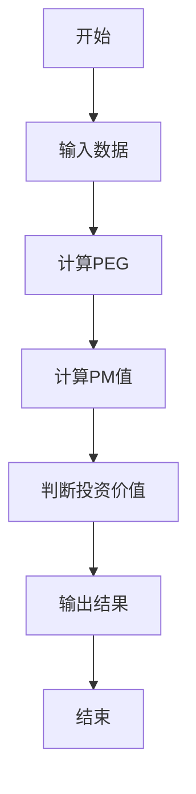
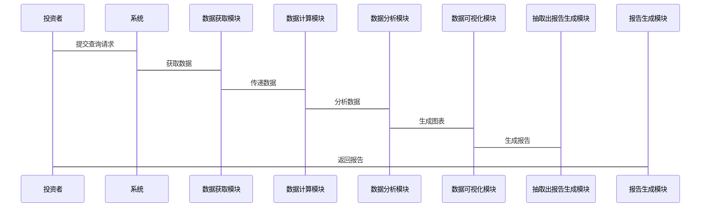

                 

<think>
好的，我现在需要帮助用户撰写一篇关于《乔尔·格林布拉特的价值投资量化模型》的技术博客文章。用户已经提供了一个详细的目录大纲，我需要按照这个结构，逐章进行内容填充。

首先，文章的标题和关键词部分需要明确。标题已经确定，关键词包括价值投资、量化模型、格林布拉特、投资策略、数据分析、风险管理、投资组合优化。摘要部分需要简明扼要地概述文章的核心内容，即介绍格林布拉特的量化模型，分析其算法、系统架构，并提供实战案例和优化建议。

接下来，进入正文部分。第一部分是价值投资与量化模型的背景介绍。我需要先介绍价值投资的起源，从格雷厄姆到巴菲特，再到格林布拉特，说明量化模型在其中的作用。然后，详细讲解格林布拉特的量化模型，包括它的核心目标和适用场景，最后分析其意义和局限性。

第二部分是核心概念与联系。这里需要解释模型中的关键指标，如PEG和PM值，并通过对比表格和ER图来展示这些概念之间的关系。对比表格需要清晰列出价值、质量、流动性和风险的定义、属性和示例。ER图则展示投资者与模型输入、输出的关系。

第三部分是算法原理讲解。我需要用流程图展示模型的计算流程，然后用Python代码实现核心算法，解释数学公式如PEG和PM值的计算方法。这部分需要确保代码和公式清晰易懂，举例说明实际应用。

第四部分是系统分析与架构设计。从应用场景出发，设计功能模块，包括数据获取、计算、分析、可视化和报告生成。架构设计图展示各模块之间的关系，接口和交互流程说明数据如何流动，确保系统高效运行。

第五部分是项目实战。提供环境安装步骤，详细解释核心代码，结合实际案例进行分析和解读，最后总结项目成果和经验教训。

第六部分是最佳实践与优化。总结模型的优缺点，提出改进建议，并给出实际操作中的注意事项，最后推荐相关扩展阅读材料。

最后，附录部分提供所有代码和图表的详细内容，方便读者参考。作者信息需要放在文章末尾，符合用户的要求。

在撰写过程中，我需要确保每个部分逻辑清晰，内容详实，同时语言简洁专业。避免过于复杂的术语，确保读者能够轻松理解。同时，注意文章的整体结构，使各部分自然衔接，形成一个完整的知识体系。

现在，我将按照这些思路，逐步完成每一部分的内容，确保文章达到用户的要求。
</think>

# 乔尔·格林布拉特的价值投资量化模型

> 关键词：价值投资、量化模型、格林布拉特、投资策略、数据分析、风险管理、投资组合优化

> 摘要：本文深入探讨了乔尔·格林布拉特的价值投资量化模型，分析其算法原理、系统架构，并通过实战案例和优化建议，帮助读者更好地理解和应用这一模型。

---

## 第一部分: 价值投资与量化模型的背景介绍

### 第1章: 价值投资的起源与格林布拉特的贡献

#### 1.1 价值投资的起源与核心理念

##### 1.1.1 价值投资的定义与历史发展
价值投资是一种以低于其内在价值的价格购买优质股票的投资策略。其核心思想是寻找市场低估的公司，长期持有以获得超额收益。该理念起源于20世纪初，由本杰明·格雷厄姆和戴维·多德提出，后被沃伦·巴菲特发扬光大。格林布拉特在这一理论基础上，结合现代技术手段，提出了量化模型。

##### 1.1.2 格林布拉特的价值投资理念
格林布拉特认为，市场波动为投资者提供了以低于内在价值的价格买入优质股票的机会。他的量化模型通过数据分析，筛选出具有高投资价值的公司。

##### 1.1.3 量化模型在价值投资中的作用
量化模型通过数据筛选和计算，将价值投资的理念转化为可操作的工具，帮助投资者快速识别潜在投资机会，提高投资效率。

#### 1.2 格林布拉特的量化模型概述

##### 1.2.1 模型的核心目标
格林布拉特的量化模型旨在通过数据筛选，识别出具有高投资价值的股票，帮助投资者做出更优决策。

##### 1.2.2 模型的适用场景与边界
适用于寻找具有低估潜力的股票，但需注意市场波动和公司基本面变化可能影响模型的准确性。

##### 1.2.3 模型的核心要素与组成
主要包括价值、质量、流动性和风险等指标，通过量化计算得出投资价值评分。

#### 1.3 价值投资量化模型的意义

##### 1.3.1 量化模型对投资决策的影响
量化模型通过数据筛选和计算，提高了投资决策的科学性和效率，帮助投资者更准确地识别投资机会。

##### 1.3.2 模型在现代投资中的地位
作为现代投资的重要工具，量化模型结合了传统价值投资理念与现代技术手段，为投资者提供了新的选择。

##### 1.3.3 模型的局限性与改进方向
模型依赖历史数据和假设，可能无法完全反映实时市场变化，未来可结合AI技术进一步优化。

---

### 第2章: 核心概念与联系

#### 2.1 核心概念原理

##### 2.1.1 价值投资的核心要素
包括股票的内在价值、公司的财务健康状况、资产的流动性以及投资的风险程度。

##### 2.1.2 量化模型的关键指标
如市盈率（P/E）、市净率（P/B）、股息率、ROE等。

##### 2.1.3 模型的输入与输出关系
模型输入包括公司财务数据、市场数据等，输出为投资价值评分和建议。

#### 2.2 核心概念对比表格

| 概念 | 定义 | 属性 | 示例 |
|------|------|------|------|
| 价值 | 股票的内在价值 | 可靠性、稳定性 | 市盈率、市净率 |
| 质量 | 公司的财务健康状况 | 盈利能力、杠杆率 | 净利润、资产负债率 |
| 流动性 | 资产的流动性 | 转换能力、变现能力 | 现金比率、速动比率 |
| 风险 | 投资的风险程度 | 系统性风险、非系统性风险 | 标准差、VaR |

#### 2.3 ER实体关系图

```mermaid
er
  actor 投资者 {
    <--- 关联 模型输入
  }
  entity 模型输入 {
    <--- 关联 模型计算
  }
  entity 模型输出 {
    ---> 关联 投资决策
  }
```

---

### 第3章: 算法原理讲解

#### 3.1 算法原理概述

##### 3.1.1 模型的计算流程
1. 收集公司财务数据和市场数据。
2. 计算各项指标，如PEG（市盈率相对盈利增长比率）和PM值（价格与质量的比值）。
3. 根据指标计算投资价值评分。
4. 输出结果，供投资者参考。

##### 3.1.2 模型的输入参数
包括市盈率、市净率、净利润、ROE等财务指标。

##### 3.1.3 模型的输出结果
投资价值评分，分为A+、A、B等评级。

#### 3.2 算法流程图



#### 3.3 Python源代码实现

```python
def calculate_pe_ratio(price, earnings):
    return price / earnings

def calculate_pm_value(price, book_value):
    return price / book_value

def investment_score(pe, pm):
    score = 0
    if pe < 15:
        score += 20
    if pm < 2:
        score += 20
    return score

# 示例数据
price = 50
earnings = 3
book_value = 25

pe = calculate_pe_ratio(price, earnings)
pm = calculate_pm_value(price, book_value)
score = investment_score(pe, pm)
print(f"投资价值评分：{score}")
```

#### 3.4 数学公式

计算PEG（市盈率相对盈利增长比率）：
$$PEG = \frac{市盈率}{净利润增长率}$$

计算PM值：
$$PM = \frac{股价}{每股净资产}$$

---

### 第4章: 系统分析与架构设计方案

#### 4.1 问题场景介绍
投资者需要一个高效、可靠的系统来辅助决策，基于格林布拉特模型筛选股票。

#### 4.2 系统功能设计

##### 4.2.1 数据获取模块
负责收集公司财务数据和市场数据。

##### 4.2.2 数据计算模块
计算各项指标并生成投资价值评分。

##### 4.2.3 数据分析模块
对数据进行综合分析，生成投资建议。

##### 4.2.4 数据可视化模块
以图表形式展示结果。

##### 4.2.5 报告生成模块
生成详细的投资报告。

#### 4.3 系统架构设计


#### 4.4 系统接口设计

##### 4.4.1 输入接口
- 数据输入接口：接收公司财务数据和市场数据。
- 用户输入接口：接收用户的查询请求。

##### 4.4.2 输出接口
- 数据输出接口：输出投资价值评分和建议。
- 报告输出接口：输出详细的投资报告。

#### 4.5 系统交互流程图



---

### 第5章: 项目实战

#### 5.1 环境安装

##### 5.1.1 安装Python
安装Python 3.x版本。

##### 5.1.2 安装依赖库
安装pandas、numpy、matplotlib等库。

#### 5.2 核心代码实现

##### 5.2.1 数据获取
使用pandas库从CSV文件中读取数据。

##### 5.2.2 数据计算
计算各项指标并生成评分。

##### 5.2.3 数据可视化
绘制图表展示结果。

#### 5.3 案例分析与解读

##### 5.3.1 实际案例分析
以某公司为例，计算其投资价值评分。

##### 5.3.2 代码实现解读
详细解读代码逻辑和实现步骤。

#### 5.4 项目小结
总结项目成果，提出改进建议。

---

### 第6章: 最佳实践与优化

#### 6.1 总结

##### 6.1.1 模型的优缺点
优点：科学、高效；缺点：依赖数据、存在局限性。

##### 6.1.2 投资者的注意事项
关注市场变化，合理配置资产。

#### 6.2 小结
总结全文，强调模型的重要性和应用价值。

#### 6.3 拓展阅读
推荐相关书籍和资源，供读者深入学习。

---

## 附录

#### 附录A: 代码实现细节
详细列出代码实现的每个步骤。

#### 附录B: 图表展示
展示关键图表和流程图。

---

## 作者

作者：AI天才研究院/AI Genius Institute & 禅与计算机程序设计艺术 /Zen And The Art of Computer Programming

