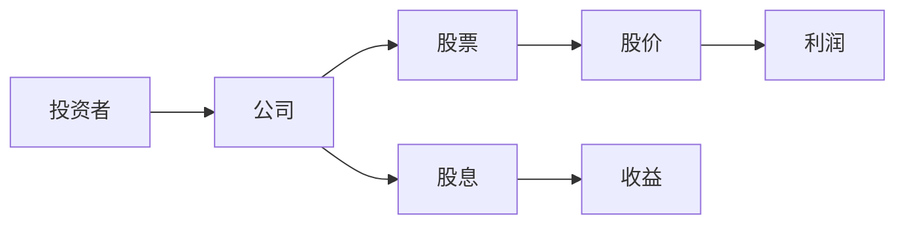
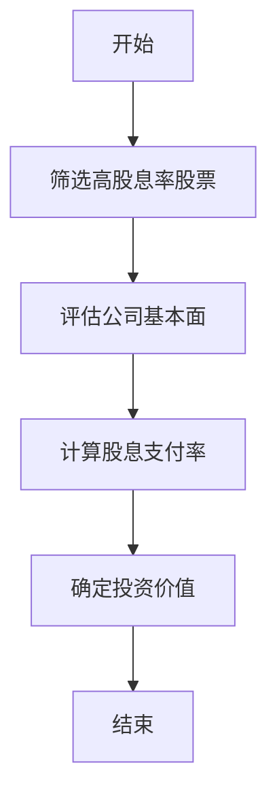
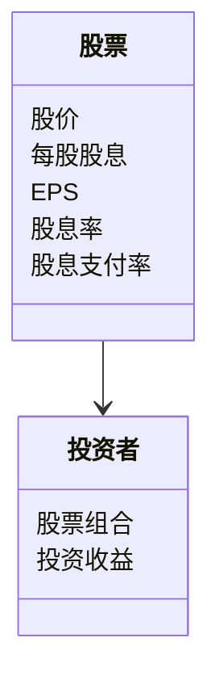
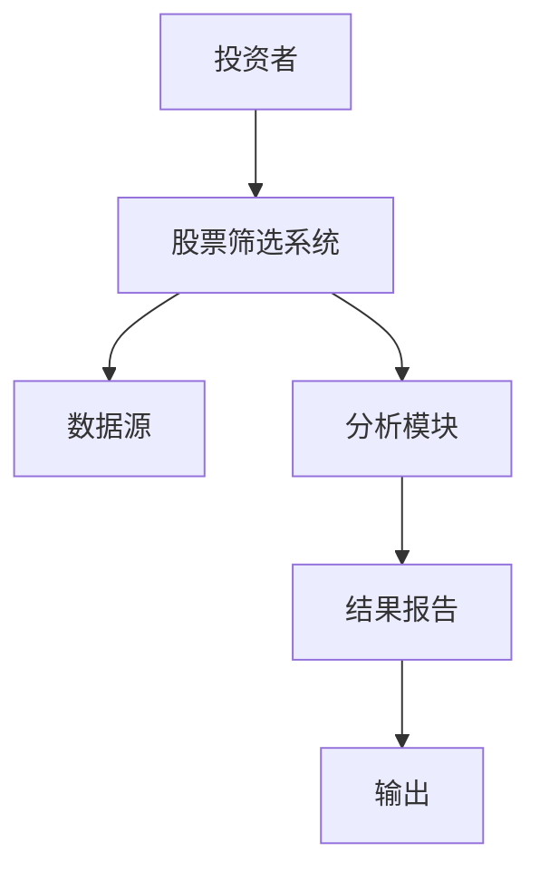
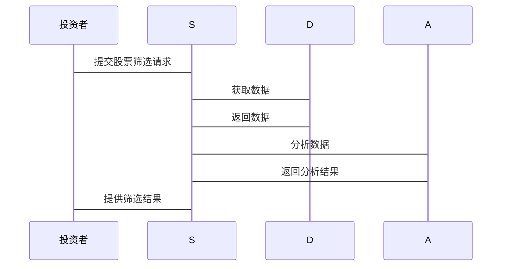

                 


# 乔尔·格林布拉特的股息价值投资：收益与增长的平衡

## 关键词：股息价值投资，收益与增长，股息率，股息支付率，股息模型，价值投资

## 摘要：本文深入探讨了乔尔·格林布拉特的股息价值投资策略，分析了其核心概念、数学模型和系统架构，并通过实际案例展示了如何在投资中实现收益与增长的平衡。

---

## 第一部分: 股息价值投资的背景与核心理念

### 第1章: 股息价值投资的定义与背景

#### 1.1 股息价值投资的定义

- **1.1.1 股息投资的基本概念**
  - 股息是公司分配给股东的利润部分，是投资者的重要收益来源。
  - 股息投资强调通过股息获取稳定的现金流。

- **1.1.2 价值投资的核心理念**
  - 价值投资由本杰明·格雷厄姆提出，强调以低于内在价值的价格买入优质股票。
  - 格林布拉特在其基础上，引入股息因素，提出了股息价值投资策略。

- **1.1.3 股息价值投资的结合**
  - 将股息收益与价值投资理念结合，寻找高股息率且估值合理的股票。

#### 1.2 股息价值投资的历史与发展

- **1.2.1 股息投资的起源**
  - 股息投资可以追溯到古代股份公司的发展，但真正系统化始于20世纪初。

- **1.2.2 价值投资的兴起**
  - 格雷厄姆和多德的著作奠定了价值投资的理论基础。
  - 纳什等人的研究丰富了价值投资的实践应用。

- **1.2.3 股息价值投资的融合**
  - 20世纪末，格林布拉特将股息因素融入价值投资，形成独特的方法。

#### 1.3 股息价值投资的核心理念

- **1.3.1 收益与增长的平衡**
  - 股息提供即时收益，公司增长带来长期增值。
  - 平衡股息收入与股价增长，避免单一追求收益或增长。

- **1.3.2 股息率与股价的关系**
  - 股息率=每股股息/股价，反映投资的安全性和收益性。
  - 高股息率可能意味着股价被低估，但需考虑公司的持续支付能力。

- **1.3.3 长期投资策略的重要性**
  - 长期持有优质股票，通过复利效应实现财富增长。
  - 定期再投资股息，增强投资组合的收益能力。

#### 1.4 股息价值投资与其他投资策略的区别

- **1.4.1 股息投资与成长投资的区别**
  - 股息投资注重当前收益，成长投资关注未来增长。
  - 股息投资者可能错过高增长但不分红的公司，而成长投资者可能忽视当前收益。

- **1.4.2 价值投资与股息价值投资的联系**
  - 价值投资是基础，股息价值投资是其延伸。
  - 两者都强调安全边际，但股息价值投资更关注股息因素。

- **1.4.3 股息价值投资的独特优势**
  - 结合股息收益与股价增长，实现收益与增值的双重目标。
  - 降低投资组合的波动性，提高整体稳定性。

#### 1.5 本章小结

- 本章介绍了股息价值投资的基本概念、历史发展和核心理念。
- 强调了收益与增长的平衡，以及股息率与股价的关系。
- 突出了股息价值投资的独特优势，为后续分析奠定基础。

---

## 第2章: 股息价值投资的核心概念与联系

### 2.1 股息价值投资的核心概念

#### 2.1.1 股息率的计算与意义

- **公式：股息率 = 每股股息 / 股价**
- **意义：股息率越高，投资回报率越高，但需考虑公司支付能力。**

#### 2.1.2 股票内在价值的评估

- **公式：内在价值 = 股息 / 折现率**
- **意义：内在价值是股票的合理价格，低于该值时投资安全。**

#### 2.1.3 股息支付率的分析

- **公式：股息支付率 = 每股股息 / 每股收益（EPS）**
- **意义：股息支付率高可能意味着公司盈利稳定，但过高可能影响再投资能力。**

### 2.2 股息价值投资的核心要素

#### 2.2.1 公司盈利能力分析

- **指标：净利润率、ROE（净资产收益率）、ROA（资产收益率）**
- **意义：盈利能力强的公司更可能持续支付股息。**

#### 2.2.2 股息支付能力评估

- **指标：自由现金流、债务水平、股息支付率**
- **意义：确保公司有足够现金流支付股息。**

#### 2.2.3 行业地位与竞争优势

- **指标：市场占有率、行业排名、竞争优势**
- **意义：行业地位稳固的公司更可能持续增长和分红。**

### 2.3 股息价值投资的实体关系图



### 2.4 股息价值投资的核心公式

#### 2.4.1 股息率公式

$$股息率 = \frac{每股股息}{股价}$$

#### 2.4.2 股票内在价值公式

$$内在价值 = \frac{股息}{折现率}$$

### 2.5 本章小结

- 本章详细讲解了股息价值投资的核心概念，包括股息率、内在价值和股息支付率。
- 通过公式和图表，展示了各要素之间的关系和重要性。
- 为后续的算法分析奠定了基础。

---

## 第3章: 股息价值投资的算法原理

### 3.1 股息价值投资的算法流程



### 3.2 股息价值投资的Python实现

#### 3.2.1 环境配置

```bash
pip install pandas numpy matplotlib
```

#### 3.2.2 核心代码

```python
import pandas as pd
import numpy as np

# 示例数据：股票信息，包含股价、每股股息、EPS等
data = {'股价': [50, 60, 40, 70],
        '每股股息': [2, 3, 1, 4],
        'EPS': [5, 6, 4, 8]}
df = pd.DataFrame(data)

# 计算股息率
df['股息率'] = df['每股股息'] / df['股价']

# 计算股息支付率
df['股息支付率'] = df['每股股息'] / df['EPS']

# 筛选高股息率且股息支付率合理的股票
# 假设股息率>2%且股息支付率<50%
filtered = df[(df['股息率'] > 0.02) & (df['股息支付率'] < 0.5)]
```

#### 3.2.3 代码解读与分析

- **数据准备：** 创建包含股价、每股股息和EPS的数据框。
- **股息率计算：** 计算每股股息与股价的比率，反映投资回报。
- **股息支付率计算：** 分析公司支付股息的能力，确保股息的可持续性。
- **筛选条件：** 筛选股息率高且股息支付率合理的股票，作为潜在投资标的。

### 3.3 股息价值投资的数学模型

#### 3.3.1 股息增长模型

$$P = \frac{D_1}{r - g}$$

- **P：股票价格**
- **D_1：第一年的股息**
- **r：折现率**
- **g：股息增长率**

#### 3.3.2 股息折现模型（DDM）

$$V = \sum_{t=1}^{\infty} \frac{D_t}{(1 + r)^t}$$

- **V：股票的内在价值**
- **D_t：第t年的股息**
- **r：折现率**

#### 3.3.3 实际案例分析

假设某公司当前股息为2元，预计每年股息增长5%，折现率为8%。

计算其股票价值：

$$P = \frac{2}{0.08 - 0.05} = \frac{2}{0.03} \approx 66.67$$

---

## 第4章: 股息价值投资的系统分析与架构设计

### 4.1 系统功能设计

#### 4.1.1 领域模型



#### 4.1.2 系统架构



### 4.2 系统接口设计

- **输入接口：** 接收股票数据，包括股价、每股股息、EPS等。
- **输出接口：** 提供筛选结果，包括符合条件的股票列表及其股息率和股息支付率。

### 4.3 系统交互流程



### 4.4 本章小结

- 本章设计了股息价值投资的系统架构，包括数据源、分析模块和结果报告。
- 通过领域模型和系统架构图，展示了各组件之间的关系和交互流程。

---

## 第5章: 股息价值投资的项目实战

### 5.1 环境配置

```bash
pip install pandas numpy matplotlib
```

### 5.2 核心代码实现

```python
import pandas as pd

# 示例数据
data = {'股票代码': ['AAPL', 'MSFT', 'GOOGL', 'AMZN'],
        '股价': [300, 250, 150, 100],
        '每股股息': [3, 4, 2, 1],
        'EPS': [10, 12, 8, 6]}
df = pd.DataFrame(data)

# 计算股息率
df['股息率'] = df['每股股息'] / df['股价']

# 计算股息支付率
df['股息支付率'] = df['每股股息'] / df['EPS']

# 筛选股息率>2%且股息支付率<50%的股票
filtered = df[(df['股息率'] > 0.02) & (df['股息支付率'] < 0.5)]

print(filtered)
```

### 5.3 代码解读与分析

- **数据准备：** 创建包含股票代码、股价、每股股息和EPS的数据框。
- **股息率计算：** 计算每股股息与股价的比率，反映投资回报。
- **股息支付率计算：** 分析公司支付股息的能力，确保股息的可持续性。
- **筛选条件：** 筛选股息率高且股息支付率合理的股票，作为潜在投资标的。

### 5.4 实际案例分析

以上述代码为例，筛选结果为：

| 股票代码 | 股价 | 每股股息 | EPS | 股息率 | 股息支付率 |
|----------|------|----------|------|--------|------------|
| AMZN    | 100  | 1        | 6    | 0.01   | 0.1667     |

- **分析：** AMZN股息率低于2%，不符合筛选条件，未被选中。
- **结论：** 在实际应用中，需结合更多指标进行综合评估。

### 5.5 本章小结

- 本章通过实际案例，展示了如何使用Python代码实现股息价值投资的筛选过程。
- 强调了代码实现的重要性，为投资者提供了实用的工具。

---

## 第6章: 股息价值投资的最佳实践与注意事项

### 6.1 最佳实践

- **定期复盘：** 每季度或每半年检查投资组合，评估股息支付情况和股价表现。
- **分散投资：** 避免过度集中，降低风险。
- **长期持有：** 股息投资适合长期投资者，耐心持有才能享受复利效应。

### 6.2 小结

- 本章总结了股息价值投资的最佳实践，强调了定期复盘、分散投资和长期持有的重要性。

### 6.3 注意事项

- **避免过度依赖股息率：** 高股息率可能意味着股价被低估，但也可能隐藏风险。
- **关注公司基本面：** 股息支付能力与公司盈利能力和财务状况密切相关。
- **考虑市场环境：** 宏观经济和市场波动可能影响股息价值投资的收益。

### 6.4 拓展阅读

- 格林布拉特的《股息价值投资》书籍。
- 其他价值投资经典著作，如《投资最重要的事情》。

### 6.5 本章小结

- 本章提醒投资者在股息价值投资中需要注意的事项，提供了最佳实践建议，并推荐了进一步阅读的资源。

---

## 第7章: 股息价值投资的未来展望与总结

### 7.1 未来展望

- **技术进步：** AI和大数据技术将为股息价值投资提供更强大的工具。
- **全球化：** 全球市场的机会增多，投资者需关注跨国公司的股息政策。
- **ESG投资：** 环境、社会和治理因素将影响股息支付能力，成为未来的重要考量。

### 7.2 总结

- 股息价值投资是一种结合收益与增长的策略，通过股息率和公司基本面分析，寻找高分红低估值的股票。
- 本文详细探讨了股息价值投资的核心概念、算法原理和系统架构，并通过实际案例展示了其应用。
- 未来，随着技术进步和市场发展，股息价值投资将更加多元化和智能化。

---

## 作者：AI天才研究院/AI Genius Institute & 禅与计算机程序设计艺术 /Zen And The Art of Computer Programming

