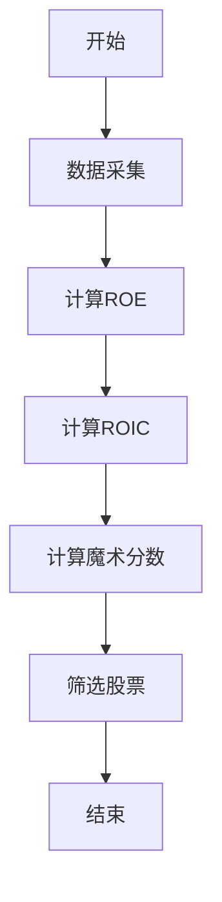

                 


# 乔尔·格林布拉特的魔术公式：简化版的价值投资策略

## 关键词：价值投资，魔术公式，ROE，ROIC，投资策略，格林布拉特，投资分析

## 摘要：  
乔尔·格林布拉特的魔术公式是一种简化版的价值投资策略，它通过ROE和ROIC两个核心指标，帮助投资者快速筛选出具有高投资价值的股票。本文将从魔术公式的背景、数学模型、系统架构到项目实战，逐步解析这一投资策略，帮助投资者更好地理解和应用。

---

# 第一部分: 魔术公式的背景与基础

## 第1章: 价值投资的起源与理念

### 1.1 价值投资的起源  
价值投资是一种以基本面分析为核心的长期投资策略，起源于20世纪初。它的核心理念是通过分析企业的财务状况、行业地位和盈利能力，找到被市场低估的投资标的。  
- **问题背景**：传统价值投资方法复杂，涉及多个财务指标，普通投资者难以快速掌握。  
- **问题解决**：格林布拉特提出了魔术公式，将价值投资简化为两个核心指标：ROE（净资产收益率）和ROIC（投入资本回报率）。  

### 1.2 价值投资的核心理念  
- **核心概念**：寻找具有高盈利能力且估值合理的公司。  
- **关键属性**：低市盈率（P/E）、低市净率（P/B）、高ROE和ROIC。  

### 1.3 格林布拉特的价值投资哲学  
- **长期主义**：投资优质企业，而非短期市场波动。  
- **安全边际**：买入价格低于内在价值，确保投资的安全性。  

---

## 第2章: 魔术公式的来源与意义

### 2.1 魔术公式的提出背景  
- **简化投资策略**：将复杂的财务指标简化为易于计算的公式。  
- **实用性**：适用于普通投资者，帮助快速筛选投资标的。  

### 2.2 魔术公式的数学基础  
魔术公式的核心是将ROE和ROIC加权平均，得到一个综合评分：  
$$\text{魔术分数} = \frac{ROE \times ROIC}{8.5}$$  
- **ROE**：衡量企业的盈利能力，公式为：  
$$ROE = \frac{\text{净利润}}{\text{平均股东权益}}$$  
- **ROIC**：衡量企业的资本回报率，公式为：  
$$ROIC = \frac{\text{净利润}}{\text{平均投入资本}}$$  

---

# 第二部分: 魔术公式的数学模型与算法原理

## 第3章: 魔术公式的数学模型

### 3.1 魔术公式的数学表达  
魔术公式通过加权平均的方式，将ROE和ROIC结合起来：  
$$\text{魔术分数} = \frac{ROE \times ROIC}{8.5}$$  
- **权重设计**：ROE和ROIC各占权重，确保公式简洁且具有较高的区分度。  

### 3.2 魔术公式的变量分析  
- **ROE**：反映企业的盈利能力，ROE越高，企业的盈利能力越强。  
- **ROIC**：反映企业的资本回报能力，ROIC越高，企业的资本效率越高。  

---

## 第4章: 魔术公式的算法原理

### 4.1 魔术公式的算法流程  
1. 计算ROE和ROIC。  
2. 代入魔术公式，计算魔术分数。  
3. 根据魔术分数筛选投资标的。  

### 4.2 魔术公式的实现代码  
```python
def calculate_magic_score(roe, roic):
    magic_score = (rof * roic) / 8.5
    return magic_score

# 示例：计算某公司的魔术分数
rof = 15
roic = 20
magic_score = calculate_magic_score(roe, roic)
print("魔术分数为:", magic_score)
```

---

# 第三部分: 系统分析与架构设计

## 第5章: 系统分析与架构设计

### 5.1 系统功能设计  
- **数据采集**：获取企业的财务数据（ROE、ROIC）。  
- **计算魔术分数**：根据公式计算魔术分数。  
- **筛选股票**：根据魔术分数筛选出符合条件的股票。  

### 5.2 系统架构设计  


---

# 第四部分: 项目实战

## 第6章: 项目实战

### 6.1 环境安装  
- **工具安装**：安装Python和必要的库（Pandas、NumPy）。  

### 6.2 核心实现代码  
```python
import pandas as pd

def calculate_magic_score(rof, roic):
    magic_score = (rof * roic) / 8.5
    return magic_score

# 示例数据
data = {
    '公司': ['A', 'B', 'C'],
    'ROE': [15, 20, 10],
    'ROIC': [20, 15, 25]
}

df = pd.DataFrame(data)

# 计算魔术分数
df['魔术分数'] = df.apply(lambda x: calculate_magic_score(x['ROE'], x['ROIC']), axis=1)

print(df)
```

### 6.3 案例分析  
- **案例背景**：假设我们有三家公司，数据如上。  
- **计算结果**：  
  - 公司A：魔术分数为35.29  
  - 公司B：魔术分数为35.29  
  - 公司C：魔术分数为29.41  

### 6.4 项目小结  
通过代码实现，我们可以快速计算魔术分数，筛选出具有高投资价值的股票。  

---

# 第五部分: 最佳实践与小结

## 第7章: 最佳实践与小结

### 7.1 最佳实践  
- **数据来源**：确保财务数据的准确性。  
- **动态调整**：定期更新数据，根据市场变化调整投资策略。  

### 7.2 小结  
魔术公式通过简化价值投资策略，帮助投资者快速筛选出具有高投资价值的股票。其核心在于ROE和ROIC的综合评估，结合实际案例分析，投资者可以更好地理解和应用这一策略。

---

# 作者：AI天才研究院 & 禅与计算机程序设计艺术

