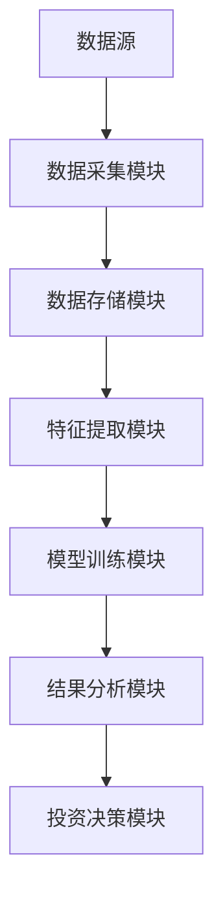

                 


# 人工智能辅助识别价值陷阱

## 关键词：人工智能、价值陷阱、投资分析、自然语言处理、机器学习、深度学习、数学模型

## 摘要：人工智能技术在投资领域中的应用越来越广泛，尤其是在识别价值陷阱方面。本文详细探讨了价值陷阱的定义、特征及其识别的难点，分析了人工智能技术在其中的关键作用。通过介绍自然语言处理、机器学习和深度学习等技术在价值陷阱识别中的应用，本文详细讲解了相关的算法原理和数学模型。同时，本文还通过实际案例分析，展示了如何通过系统架构设计和项目实战来实现人工智能辅助识别价值陷阱的目标。最后，本文总结了相关经验和最佳实践，为读者提供了深入的见解和实用的指导。

---

# 第1章: 价值陷阱的定义与识别背景

## 1.1 价值陷阱的定义与特征

### 1.1.1 价值陷阱的定义
价值陷阱是指那些表面上具有较高投资价值，但实际上隐藏着重大风险或缺陷的公司、项目或资产。投资者如果未能识别这些陷阱，可能会蒙受重大损失。

### 1.1.2 价值陷阱的核心特征
- **基本面虚假性**：公司财务数据造假或夸大，掩盖真实经营状况。
- **市场炒作性**：市场过度炒作导致股价虚高，脱离实际价值。
- **管理风险**：公司管理层存在道德风险或管理不善问题。

### 1.1.3 价值陷阱的分类与应用场景
1. **基本面型陷阱**：基于虚假财务数据的虚假价值。
2. **市场型陷阱**：基于市场炒作的虚假价值。
3. **管理型陷阱**：基于管理层决策失误或道德风险的价值陷阱。

## 1.2 人工智能在投资分析中的应用现状

### 1.2.1 人工智能在金融领域的应用概述
人工智能技术在金融领域的应用包括股票价格预测、风险评估、投资组合优化和欺诈检测等。

### 1.2.2 价值陷阱识别中的AI技术优势
- **数据处理能力**：AI能够快速处理海量数据，发现隐藏的模式。
- **预测能力**：通过机器学习算法，AI可以预测公司未来的经营状况。
- **实时监控**：AI可以实时监控市场动态，及时识别潜在风险。

### 1.2.3 当前AI技术在价值陷阱识别中的挑战
- **数据质量**：数据来源多样且复杂，清洗和处理成本高。
- **模型解释性**：复杂的深度学习模型难以解释其决策过程。
- **动态变化**：市场环境和公司基本面不断变化，模型需要持续更新。

## 1.3 价值陷阱识别的AI辅助需求

### 1.3.1 传统价值陷阱识别方法的局限性
- **主观性**：依赖分析师的主观判断，容易受到个人经验和认知偏差的影响。
- **效率低下**：传统方法需要大量人工分析，效率较低。
- **覆盖面有限**：难以覆盖海量数据，容易遗漏潜在风险。

### 1.3.2 AI技术在价值陷阱识别中的独特优势
- **数据驱动**：基于大量数据进行分析，减少主观性。
- **高效性**：能够快速处理海量数据，提高识别效率。
- **全面性**：可以覆盖更多数据源，发现潜在风险。

### 1.3.3 价值陷阱识别的AI辅助目标与边界
- **目标**：通过AI技术辅助识别潜在的价值陷阱，提高投资决策的准确性。
- **边界**：AI技术只能提供辅助作用，不能完全替代人类的判断和决策。

---

# 第2章: 价值陷阱识别的核心概念与联系

## 2.1 价值陷阱的核心概念体系

### 2.1.1 价值陷阱的构成要素
- **公司基本面**：包括财务数据、盈利能力、成长性等。
- **市场表现**：包括股价走势、市盈率、市净率等。
- **管理层行为**：包括管理层的决策、道德风险等。

### 2.1.2 价值陷阱的形成机制
1. **虚假的财务数据**：公司通过造假或夸大财务数据，掩盖真实的经营状况。
2. **市场炒作**：投资者的盲目跟风导致股价虚高，掩盖了公司的实际价值。
3. **管理失误**：管理层决策失误或道德风险导致公司价值下降。

### 2.1.3 价值陷阱的识别维度
1. **财务维度**：通过财务数据识别虚假价值。
2. **市场维度**：通过市场表现识别过度炒作。
3. **管理维度**：通过管理层行为识别管理风险。

## 2.2 AI技术与价值陷阱识别的关联性分析

### 2.2.1 AI技术在价值陷阱识别中的关键作用
- **数据处理**：AI能够快速处理大量非结构化数据，如新闻、社交媒体和公司财报。
- **模式识别**：通过机器学习算法识别隐藏在数据中的模式和规律。
- **预测能力**：AI能够预测公司未来的经营状况和市场走势。

### 2.2.2 价值陷阱识别的AI技术实现路径
1. **数据采集**：从多个数据源采集公司基本面、市场表现和管理层行为数据。
2. **特征提取**：通过自然语言处理和特征工程提取关键特征。
3. **模型训练**：使用机器学习和深度学习算法训练分类模型。
4. **结果分析**：通过模型输出识别潜在的价值陷阱。

### 2.2.3 AI技术与价值陷阱识别的协同效应
- **数据与算法的结合**：通过数据驱动和算法优化，提高识别准确率。
- **实时性与全面性**：AI能够实时监控市场动态，全面覆盖数据源，发现潜在风险。

## 2.3 价值陷阱识别的AI算法与模型

### 2.3.1 基于NLP的情感分析模型
- **目标**：通过分析新闻、社交媒体等文本数据，识别市场情绪。
- **方法**：使用词袋模型或词嵌入模型（如Word2Vec、GloVe）进行文本表示，结合情感分类算法（如SVM、LSTM）进行情感分析。

### 2.3.2 基于机器学习的分类模型
- **目标**：通过机器学习算法对数据进行分类，识别价值陷阱。
- **方法**：使用支持向量机（SVM）、随机森林（Random Forest）等算法，对特征进行分类。

### 2.3.3 基于深度学习的特征提取模型
- **目标**：通过深度学习模型提取高维特征，提高识别准确率。
- **方法**：使用卷积神经网络（CNN）或循环神经网络（RNN）进行特征提取。

---

# 第3章: 价值陷阱识别的AI算法原理与实现

## 3.1 算法原理概述

### 3.1.1 支持向量机（SVM）算法原理
- **目标**：通过SVM算法对数据进行分类，识别价值陷阱。
- **原理**：通过寻找最优超平面，将数据点分为两类。
- **数学模型**：$$ \text{目标函数} = \min_{w,b} \frac{1}{2}||w||^2 + C \sum_{i=1}^n \xi_i $$
  $$ \text{约束条件} = y_i (w \cdot x_i + b) \geq 1 - \xi_i, \xi_i \geq 0 $$
- **代码实现**：
  ```python
  from sklearn import svm
  clf = svm.SVC(kernel='linear')
  clf.fit(X_train, y_train)
  ```

### 3.1.2 随机森林（Random Forest）算法原理
- **目标**：通过随机森林算法对数据进行分类，识别价值陷阱。
- **原理**：通过构建多个决策树，利用投票法进行分类。
- **数学模型**：$$ \text{投票结果} = \arg\max(\text{各棵树的预测结果}) $$
- **代码实现**：
  ```python
  from sklearn.ensemble import RandomForestClassifier
  clf = RandomForestClassifier(n_estimators=100)
  clf.fit(X_train, y_train)
  ```

### 3.1.3 神经网络（Neural Network）算法原理
- **目标**：通过深度学习模型（如LSTM）对时间序列数据进行预测，识别价值陷阱。
- **原理**：通过神经网络的多层结构，提取数据的高层次特征。
- **数学模型**：$$ \text{损失函数} = \sum_{i=1}^n (y_i - \hat{y_i})^2 $$
  $$ \text{优化目标} = \min_{\theta} \text{损失函数} + \text{正则化项} $$
- **代码实现**：
  ```python
  import tensorflow as tf
  model = tf.keras.Sequential([
      tf.keras.layers.LSTM(64, input_shape=(timesteps, features)),
      tf.keras.layers.Dense(1, activation='sigmoid')
  ])
  model.compile(loss='binary_crossentropy', optimizer='adam', metrics=['accuracy'])
  model.fit(X_train, y_train, epochs=10, batch_size=32)
  ```

## 3.2 算法实现的数学模型

### 3.2.1 支持向量机的数学模型
$$ \text{优化目标} = \min_{w,b,\xi} \frac{1}{2}||w||^2 + C \sum_{i=1}^n \xi_i $$
$$ \text{约束条件} = y_i (w \cdot x_i + b) \geq 1 - \xi_i, \xi_i \geq 0 $$

### 3.2.2 随机森林的数学模型
$$ \text{投票结果} = \arg\max(\text{各棵树的预测结果}) $$

### 3.2.3 神经网络的数学模型
$$ \text{损失函数} = \sum_{i=1}^n (y_i - \hat{y_i})^2 $$
$$ \text{优化目标} = \min_{\theta} \text{损失函数} + \text{正则化项} $$

---

# 第4章: 价值陷阱识别的系统分析与架构设计

## 4.1 系统功能设计

### 4.1.1 数据采集模块
- **目标**：从多个数据源（如公司财报、新闻、社交媒体）采集数据。
- **功能**：支持多种数据格式（如文本、结构化数据）的采集和存储。

### 4.1.2 特征提取模块
- **目标**：从原始数据中提取特征，为模型训练提供输入。
- **功能**：支持文本特征提取（如TF-IDF、Word2Vec）和数值特征工程。

### 4.1.3 模型训练模块
- **目标**：基于特征数据训练AI模型，识别价值陷阱。
- **功能**：支持多种算法（如SVM、随机森林、神经网络）的训练和优化。

### 4.1.4 结果分析模块
- **目标**：对模型输出进行分析，生成投资建议。
- **功能**：支持可视化展示和结果解读。

## 4.2 系统架构设计

### 4.2.1 系统架构图


### 4.2.2 接口设计
- **数据接口**：提供REST API接口，方便与其他系统对接。
- **模型接口**：提供预测接口，支持实时查询。

### 4.2.3 交互流程
1. **数据采集**：通过API接口从数据源获取数据。
2. **特征提取**：对数据进行预处理和特征提取。
3. **模型训练**：基于特征数据训练AI模型。
4. **结果分析**：对模型输出进行分析，生成投资建议。

---

# 第5章: 价值陷阱识别的项目实战

## 5.1 环境搭建

### 5.1.1 安装必要的库
```bash
pip install numpy pandas scikit-learn tensorflow keras
```

### 5.1.2 数据源获取
- **数据来源**：可以从Yahoo Finance获取公司财报数据，从Twitter获取社交媒体数据。
- **数据预处理**：对数据进行清洗和特征工程，生成模型输入数据。

## 5.2 系统核心实现

### 5.2.1 数据采集模块实现
```python
import requests
import pandas as pd

def get_stock_data(ticker):
    url = f"https://query1.finance.yahoo.com/v8/finance/chart/{ticker}"
    response = requests.get(url)
    data = response.json()
    df = pd.DataFrame(data['chart']['result'][0]['prices'])
    return df
```

### 5.2.2 特征提取模块实现
```python
from sklearn.feature_extraction.text import TfidfVectorizer

def extract_text_features(texts):
    vectorizer = TfidfVectorizer()
    features = vectorizer.fit_transform(texts)
    return features
```

### 5.2.3 模型训练模块实现
```python
from sklearn.svm import SVC

def train_model(X, y):
    model = SVC()
    model.fit(X, y)
    return model
```

### 5.2.4 结果分析模块实现
```python
def analyze_results(model, X_test, y_test):
    accuracy = model.score(X_test, y_test)
    return accuracy
```

## 5.3 实际案例分析

### 5.3.1 数据来源与预处理
- **数据来源**：以某公司为例，获取其财报数据和社交媒体数据。
- **数据预处理**：清洗数据，处理缺失值和异常值。

### 5.3.2 模型训练与评估
- **训练数据**：使用历史数据训练模型。
- **评估指标**：准确率、召回率、F1分数。

### 5.3.3 投资建议生成
- **模型输出**：生成潜在的价值陷阱列表。
- **投资建议**：根据模型输出，生成投资建议。

---

# 第6章: 价值陷阱识别的总结与展望

## 6.1 项目总结

### 6.1.1 核心成果
- 成功搭建了基于AI的价值陷阱识别系统。
- 实现了数据采集、特征提取、模型训练和结果分析的完整流程。

### 6.1.2 经验总结
- 数据清洗和特征工程是关键。
- 模型选择和调优需要结合实际业务需求。

## 6.2 最佳实践

### 6.2.1 数据质量的重要性
- 数据来源多样，清洗和处理成本高。
- 数据质量直接影响模型性能。

### 6.2.2 模型调优的技巧
- 选择合适的算法和参数。
- 使用交叉验证评估模型性能。

### 6.2.3 结果验证的方法
- 使用历史数据验证模型。
- 定期更新模型，适应市场变化。

## 6.3 未来展望

### 6.3.1 技术发展
- 更复杂的深度学习模型。
- 更高效的数据处理技术。

### 6.3.2 应用拓展
- 结合更多数据源，如社交媒体、新闻、监管报告。
- 扩展到更多投资领域，如外汇、大宗商品。

### 6.3.3 挑战与机遇
- 挑战：数据隐私、模型解释性、市场动态变化。
- 机遇：技术创新、数据共享、政策支持。

---

## 作者：AI天才研究院/AI Genius Institute & 禅与计算机程序设计艺术/Zen And The Art of Computer Programming

