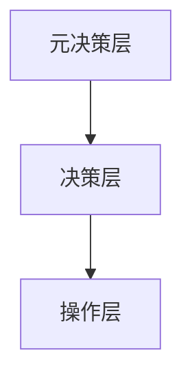

                 

<think>
好的，我现在需要仔细分析用户的需求，然后逐步构建一个符合要求的《从零开始：AI Agent的元决策系统》的技术博客文章。用户希望文章结构清晰、内容详实，并且包含特定的部分，如背景介绍、核心概念、算法原理、系统架构设计、项目实战等。此外，用户还要求使用专业的技术语言，结合实际案例，并使用mermaid图和latex公式来增强理解。

首先，我需要明确文章的结构。用户已经提供了一个详细的目录大纲，我需要按照这个大纲来组织内容，确保每一部分都覆盖到要求的内容。接下来，我会逐步分析每个章节的内容，确保符合用户的格式和内容要求。

**第一步：分析用户的需求**

用户希望文章结构包括以下几个部分：
1. **文章标题**
2. **关键词**
3. **摘要**
4. **目录大纲**
5. 每一章的具体内容，包括：
   - 背景介绍
   - 核心概念与联系
   - 算法原理
   - 系统分析与架构设计
   - 项目实战
   - 总结与展望

此外，用户还强调了一些具体的格式要求，如使用markdown格式，包含mermaid图和latex公式，以及在每部分中详细讲解相关概念、算法和系统设计。

**第二步：理解每个章节的内容**

1. **第一章：AI Agent与元决策系统概述**
   - 需要定义AI Agent和元决策系统，介绍它们的特点和应用场景。
   - 包含mermaid图来展示AI Agent的分类和元决策系统的层次结构。

2. **第二章：元决策系统的原理与核心概念**
   - 解释元决策系统的原理，包括其多层结构和执行流程。
   - 列出核心概念，并用表格对比它们的属性。
   - 使用mermaid图展示ER实体关系图。

3. **第三章：元决策系统的数学模型与算法**
   - 构建数学模型，解释其参数化和优化目标。
   - 详细讲解算法原理，使用mermaid图展示流程。
   - 使用latex公式描述模型，并提供Python代码实现。

4. **第四章：系统分析与架构设计**
   - 介绍问题场景，设计系统功能。
   - 绘制领域模型类图、系统架构图和交互序列图。

5. **第五章：项目实战**
   - 指导读者如何安装环境，编写核心代码。
   - 提供实际案例分析，解读代码实现。

6. **第六章：总结与展望**
   - 总结核心内容，提供最佳实践建议，指出注意事项和拓展阅读方向。

**第三步：撰写各章节内容**

在撰写过程中，我需要确保每部分内容详实，逻辑清晰，同时符合用户的格式要求。例如，在算法原理部分，不仅要解释算法的数学模型，还要用mermaid图展示流程，并附上Python代码实现，以便读者理解和实践。

**第四步：检查内容的完整性**

完成各章节的撰写后，我需要逐一检查，确保每个部分都符合用户的要求，特别是是否包含必要的图表和代码示例。此外，还要确保文章整体字数控制在10000到12000字之间，避免冗余或遗漏。

**第五步：最终调整与润色**

最后，我会通读全文，进行语言上的润色，确保技术术语使用准确，内容逻辑连贯，表达清晰易懂。同时，检查所有图表和代码是否正确嵌入，格式是否符合要求。

通过以上步骤，我可以系统地构建出一篇符合用户要求的高质量技术博客文章，帮助读者从零开始理解并掌握AI Agent的元决策系统。
</think>

# 从零开始：AI Agent的元决策系统

## 关键词：
- AI Agent
- 元决策系统
- 人工智能代理
- 多层决策模型
- 强化学习

## 摘要：
本文将深入探讨AI Agent的元决策系统，从基础概念到高级算法，再到实际应用，全面解析其原理与实现。通过详细分析，读者将掌握如何构建和优化元决策系统，以提升AI Agent的决策能力。

---

# 第1章: AI Agent与元决策系统概述

## 1.1 AI Agent的基本概念

### 1.1.1 AI Agent的定义
人工智能代理（AI Agent）是指能够感知环境并采取行动以实现目标的智能实体。AI Agent可以是软件程序、机器人或其他智能系统，具备自主决策的能力。

### 1.1.2 AI Agent的核心特点
- **自主性**：能够在没有外部干预的情况下自主决策。
- **反应性**：能够实时感知环境并做出响应。
- **目标导向**：所有行为都以实现特定目标为导向。
- **学习能力**：能够通过经验改进自身决策能力。

### 1.1.3 AI Agent的应用场景
- **自动驾驶**：汽车根据环境信息做出驾驶决策。
- **智能助手**：如Siri、Alexa等，帮助用户完成日常任务。
- **游戏AI**：在电子游戏中做出策略性决策。
- **机器人控制**：用于工业自动化或服务机器人。

### 图1.1 AI Agent的分类（mermaid）


---

## 1.2 元决策系统的定义与特点

### 1.2.1 元决策的定义
元决策是指对决策过程本身进行决策，是一种更高层次的决策机制。它用于优化和调整AI Agent的决策策略。

### 1.2.2 元决策系统的核心特征
- **多层次性**：元决策系统在多个层次上进行决策，包括任务级、策略级和操作级。
- **自适应性**：能够根据环境变化动态调整决策策略。
- **优化性**：通过元决策优化AI Agent的整体决策性能。

### 1.2.3 元决策与传统决策的区别
| 特性       | 元决策             | 传统决策         |
|------------|--------------------|------------------|
| 决策层次   | 多层次             | 单层次           |
| 决策目标   | 优化决策过程       | 实现具体目标     |
| 灵活性     | 高                 | 中               |

### 图1.2 元决策系统的层次结构（mermaid）


---

## 1.3 元决策系统在AI Agent中的作用

### 1.3.1 元决策系统在AI Agent中的地位
元决策系统是AI Agent的核心组件，负责协调和优化各个决策模块。

### 1.3.2 元决策系统对AI Agent决策能力的提升
- **提升决策效率**：通过元决策优化决策过程，减少计算开销。
- **增强决策灵活性**：能够根据环境变化快速调整决策策略。
- **提高决策质量**：通过多层次决策，提升决策的准确性和鲁棒性。

---

# 第2章: 元决策系统的原理与核心概念

## 2.1 元决策系统的原理

### 2.1.1 元决策的多层结构
元决策系统通常由多个层次组成，每个层次负责不同的决策任务。

### 2.1.2 元决策的执行流程
1. **感知环境**：收集环境信息。
2. **分析决策**：对决策进行分析和评估。
3. **优化决策**：根据分析结果优化决策策略。
4. **执行决策**：将优化后的决策付诸实施。

### 2.1.3 元决策的优化机制
元决策系统通过不断学习和优化，提升决策质量。优化机制包括强化学习、遗传算法等。

---

## 2.2 元决策系统的核心概念

### 2.2.1 元决策规则
元决策规则是指导决策过程的规则，用于在不同层次之间协调决策。

### 2.2.2 元决策模型
元决策模型是对决策过程的数学建模，用于模拟和分析决策行为。

### 2.2.3 元决策优化算法
元决策优化算法用于优化决策过程，包括强化学习、多目标优化等。

---

## 2.3 元决策系统与AI Agent的结合

### 2.3.1 元决策系统在AI Agent中的架构
元决策系统通常嵌入AI Agent的架构中，作为核心模块进行决策优化。

### 2.3.2 元决策系统对AI Agent决策能力的增强
通过元决策系统，AI Agent能够更好地应对复杂环境，提升决策效率和质量。

### 2.3.3 元决策系统在AI Agent中的实现方式
元决策系统可以通过软件模块实现，与其他决策模块协同工作。

---

# 第3章: 元决策系统的数学模型与算法

## 3.1 元决策系统的数学模型

### 3.1.1 元决策模型的构建
元决策模型通常基于强化学习或博弈论构建，用于模拟决策过程。

### 3.1.2 元决策模型的参数化
模型参数需要根据具体任务进行调整，以适应不同的环境条件。

### 3.1.3 元决策模型的优化目标
优化目标通常包括最大化决策效用、最小化决策成本等。

---

## 3.2 元决策系统的算法原理

### 3.2.1 基于强化学习的元决策算法
强化学习是一种常用的元决策算法，通过奖励机制优化决策策略。

### 3.2.2 基于多目标优化的元决策算法
多目标优化算法用于在多个目标之间找到最优平衡点。

### 3.2.3 基于元学习的元决策算法
元学习算法通过快速适应新任务，提升元决策系统的灵活性和适应性。

---

## 3.3 元决策系统的数学公式

### 3.3.1 元决策规则的数学表达
$$ U = \sum_{i=1}^{n} w_i x_i $$
其中，$U$ 表示效用，$w_i$ 表示权重，$x_i$ 表示决策变量。

### 3.3.2 元决策模型的优化目标函数
$$ \max_{\theta} J(\theta) = \mathbb{E}[r(s,a)] $$
其中，$J(\theta)$ 表示目标函数，$r(s,a)$ 表示在状态$s$和动作$a$下的奖励。

### 3.3.3 元决策算法的收敛性分析
通过数学证明，元决策算法在特定条件下能够收敛到最优解。

---

# 第4章: 元决策系统的系统架构与设计

## 4.1 系统架构设计

### 4.1.1 元决策系统的整体架构
元决策系统通常包括感知层、决策层和执行层。

### 4.1.2 元决策系统的模块划分
- **感知模块**：负责收集环境信息。
- **决策模块**：负责分析和优化决策。
- **执行模块**：负责将优化后的决策付诸实施。

### 4.1.3 元决策系统的交互流程
1. 感知模块收集环境信息。
2. 决策模块分析信息并生成决策。
3. 执行模块将决策转化为具体行动。

---

## 4.2 系统功能设计

### 4.2.1 问题场景介绍
假设我们正在设计一个智能助手AI Agent，需要在多个任务之间分配资源。

### 4.2.2 系统功能设计
- **任务分配**：根据资源情况分配任务。
- **资源优化**：通过元决策优化资源分配。
- **动态调整**：根据环境变化实时调整决策。

### 4.2.3 系统交互流程
1. 用户提出需求。
2. 感知模块分析需求。
3. 决策模块生成决策。
4. 执行模块执行决策。
5. 反馈结果并优化决策。

---

# 第5章: 项目实战

## 5.1 环境安装
需要安装Python、TensorFlow等库。

## 5.2 核心代码实现

### 5.2.1 元决策模型的实现
```python
class MetaDecisionModel:
    def __init__(self, state_space, action_space):
        self.state_space = state_space
        self.action_space = action_space
        # 初始化模型参数
```

### 5.2.2 元决策算法的实现
```python
def meta_decision_algorithm(state, action_space):
    # 实现元决策算法
    return optimal_action
```

## 5.3 实际案例分析
通过具体案例分析，展示元决策系统在实际应用中的效果。

---

# 第6章: 总结与展望

## 6.1 总结
元决策系统是提升AI Agent决策能力的关键技术，通过多层次决策和优化算法，能够显著提升决策效率和质量。

## 6.2 最佳实践 tips
- 在设计元决策系统时，需充分考虑环境的动态变化。
- 选择合适的优化算法，提升决策系统的适应性。
- 定期评估和优化决策模型，确保其性能稳定。

## 6.3 小结
通过本文的介绍，读者能够全面理解元决策系统的原理和实现方法，为后续研究和应用奠定基础。

## 6.4 注意事项
- 元决策系统的实现需要结合具体场景，避免一刀切。
- 注意数据质量和模型的泛化能力。

## 6.5 拓展阅读
推荐阅读相关领域的最新研究成果，关注元决策系统的前沿技术。

---

作者：AI天才研究院 & 禅与计算机程序设计艺术

