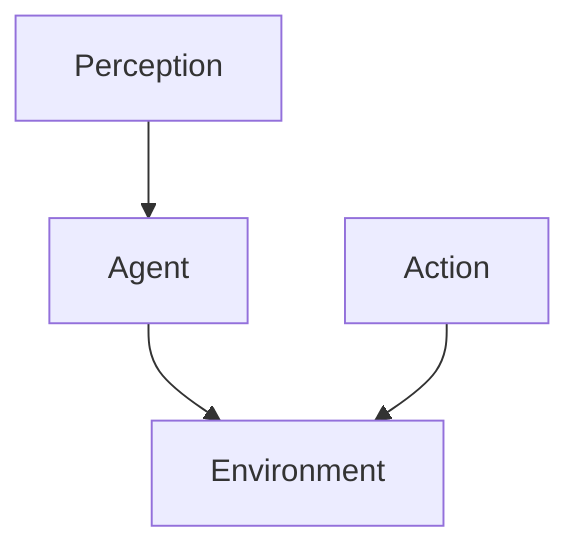
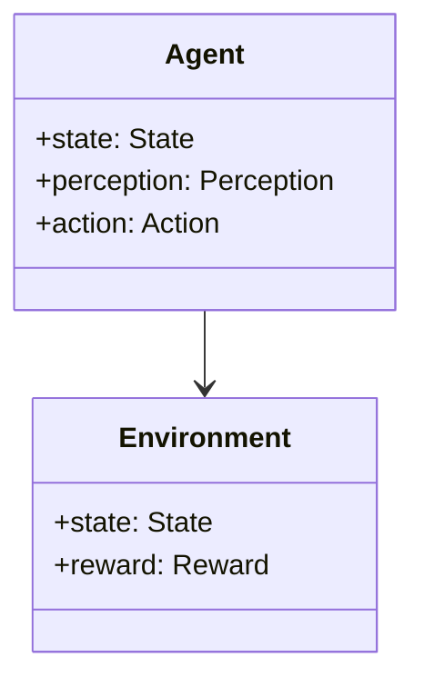
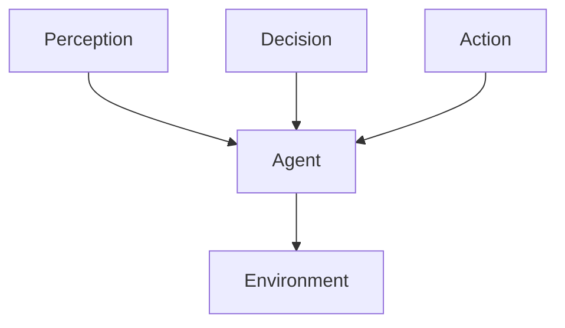
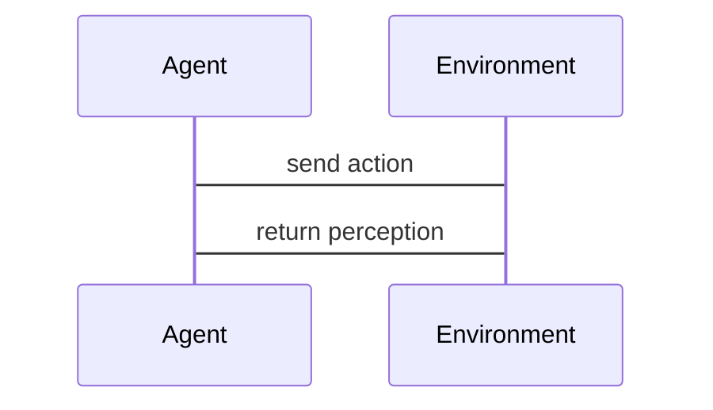

                 

<think>
好，现在我需要根据用户提供的需求，撰写一篇名为《从零开始：AI Agent的概念学习系统》的技术博客文章。用户已经给出了详细的大纲，我需要按照这个大纲一步步展开，确保每一部分都详尽且符合要求。

首先，我需要理解用户的需求：用户希望文章结构清晰，涵盖AI Agent的背景、核心概念、算法原理、系统架构设计、项目实战、最佳实践等多个部分，每部分都要有详细的讲解，包括图表、代码示例等。此外，文章需要使用专业的技术语言，但要保持简单易懂，并且有深度和见解。

接下来，我按照大纲开始撰写每一章的内容，确保每个部分都覆盖所有必要的内容，同时保持逻辑连贯。我需要特别注意每个小节的详细程度，比如在核心概念部分，可能需要解释每个属性的定义、作用，并提供对比表格；在算法部分，需要详细讲解算法原理，配以流程图和代码示例，确保读者能够理解如何实现。

在系统架构设计部分，我需要绘制类图和架构图，展示系统的结构和交互方式。项目实战部分则需要指导读者如何在实际环境中应用这些概念，包括环境安装、代码实现和案例分析。最后，总结部分要回顾整篇文章的内容，并给出进一步学习和实践的建议。

在整个写作过程中，我需要确保语言专业但不失简洁，避免过于复杂的术语堆砌，同时保持逻辑的严谨性。此外，注意检查每个部分的字数，确保整篇文章控制在10000到12000字之间。

现在，我开始按照大纲逐步撰写每一部分的内容，确保每个章节都符合用户的要求，并且内容详实、结构合理。
</think>

# 从零开始：AI Agent的概念学习系统

## 关键词：AI Agent, 人工智能, 系统设计, 算法原理, 项目实战

## 摘要：  
AI Agent（人工智能代理）是一种能够感知环境、自主决策并执行任务的智能实体。本文将从零开始，系统地介绍AI Agent的核心概念、算法原理、系统架构设计以及项目实战，帮助读者全面理解AI Agent的实现与应用。通过详细的背景分析、概念解析、算法实现和实际案例，本文为读者构建一个完整的AI Agent概念学习系统。

---

# 第1章: AI Agent的基本概念与背景

## 1.1 AI Agent的定义与背景

### 1.1.1 从传统AI到AI Agent的演进
人工智能（AI）经历了从规则驱动到数据驱动的演变，而AI Agent作为人工智能的核心组成部分，是能够自主执行任务的智能体。AI Agent不同于传统AI，它具有更强的环境适应性和自主决策能力。

### 1.1.2 AI Agent的核心概念与特点
AI Agent是一种智能实体，能够通过感知环境、分析信息并采取行动来实现目标。其核心特点包括：
1. **自主性**：无需外部干预，自主完成任务。
2. **反应性**：能够实时感知环境变化并做出反应。
3. **目标导向性**：所有行为都以实现目标为导向。
4. **环境适应性**：能够在不同环境中灵活调整策略。

### 1.1.3 AI Agent的应用场景与价值
AI Agent广泛应用于自动驾驶、智能助手、机器人控制等领域。其价值体现在提高效率、降低成本、增强用户体验等方面。

## 1.2 AI Agent的背景介绍

### 1.2.1 问题背景与问题描述
传统AI系统通常依赖于固定的规则和数据，难以应对动态变化的环境。AI Agent的出现解决了这一问题，它能够根据环境反馈实时调整策略。

### 1.2.2 问题解决方法与边界
AI Agent通过感知、决策和执行三个步骤解决问题。其边界包括感知范围、决策范围和执行范围。

### 1.2.3 AI Agent的概念结构与核心要素
AI Agent的核心要素包括：
1. **感知模块**：负责收集环境信息。
2. **决策模块**：基于感知信息制定行动计划。
3. **执行模块**：将决策转化为具体行动。

## 1.3 本章小结
本章介绍了AI Agent的基本概念、特点和应用场景，为后续内容奠定了基础。

---

# 第2章: AI Agent的核心概念与联系

## 2.1 AI Agent的核心属性特征

### 2.1.1 感知能力
AI Agent通过传感器或API接口感知环境信息。感知能力是AI Agent与环境交互的基础。

### 2.1.2 决策能力
AI Agent基于感知信息，通过算法选择最优行动方案。决策能力是实现目标的关键。

### 2.1.3 执行能力
AI Agent将决策结果转化为具体行动，执行能力决定了系统的实际效果。

## 2.2 AI Agent的设计原则

### 2.2.1 目标导向性
AI Agent的所有行为都以实现目标为导向，确保行动的有效性。

### 2.2.2 环境适应性
AI Agent能够根据环境变化调整策略，增强系统的鲁棒性。

### 2.2.3 行为规划性
AI Agent通过行为规划模块制定长期和短期计划，确保行动的有序性。

## 2.3 AI Agent的ER实体关系图

### 2.3.1 实体关系分析
AI Agent涉及的主要实体包括：Agent、Environment、Action、Perception。

### 2.3.2 实体关系图展示


## 2.4 本章小结
本章详细讲解了AI Agent的核心属性和设计原则，并通过ER图展示了实体关系。

---

# 第3章: AI Agent的算法原理

## 3.1 状态空间搜索算法

### 3.1.1 BFS与DFS算法
BFS（广度优先搜索）和DFS（深度优先搜索）是两种常见的状态空间搜索算法。BFS适用于寻找最短路径，而DFS适用于探索未知领域。

### 3.1.2 A*算法
A*算法是一种带权广度优先搜索算法，结合了启发式函数以提高搜索效率。

### 3.1.3 算法实现与优化
通过优化启发式函数和剪枝策略，可以提高算法的效率和准确性。

## 3.2 强化学习算法

### 3.2.1 Q-learning算法
Q-learning算法通过不断更新Q值表，学习最优策略。

### 3.2.2 DQN算法
DQN（深度Q网络）算法通过神经网络近似Q值函数，适用于高维状态空间。

### 3.2.3 算法实现与应用
通过Python代码实现Q-learning和DQN算法，并应用于迷宫导航问题。

## 3.3 算法实现的Python代码

### 3.3.1 状态空间搜索实现
```python
from collections import deque

def bfs(initial_state, goal_state):
    visited = set()
    queue = deque([(initial_state, 0)])
    visited.add(initial_state)
    while queue:
        current_state, depth = queue.popleft()
        if current_state == goal_state:
            return depth
        for neighbor in current_state.neighbors():
            if neighbor not in visited:
                visited.add(neighbor)
                queue.append((neighbor, depth + 1))
    return -1
```

### 3.3.2 强化学习实现
```python
import numpy as np
import gym

env = gym.make('CartPole-v0')
env.seed(1)
np.random.seed(1)

# 初始化参数
state_space = env.observation_space.shape[0]
action_space = env.action_space.n
Q = np.zeros([state_space, action_space])

# 参数设置
learning_rate = 0.1
gamma = 0.99

# Q-learning算法
for episode in range(1000):
    state = env.reset()
    while True:
        # 选择动作
        action = np.argmax(Q[state, :])
        next_state, reward, done, _ = env.step(action)
        # 更新Q值
        Q[state, action] += learning_rate * (reward + gamma * np.max(Q[next_state, :]) - Q[state, action])
        state = next_state
        if done:
            break
```

## 3.4 本章小结
本章详细介绍了AI Agent的核心算法，包括状态空间搜索和强化学习，并通过代码示例展示了算法的实现。

---

# 第4章: AI Agent的系统分析与架构设计

## 4.1 系统功能设计

### 4.1.1 领域模型设计
通过Mermaid类图展示系统的核心实体及其关系。

### 4.1.2 领域模型类图


## 4.2 系统架构设计

### 4.2.1 系统架构图


## 4.3 系统接口设计

### 4.3.1 接口描述
AI Agent与环境之间的接口包括感知接口和执行接口。

### 4.3.2 交互序列图


## 4.4 本章小结
本章详细讲解了AI Agent的系统架构设计，并通过类图和序列图展示了系统的结构和交互方式。

---

# 第5章: 项目实战

## 5.1 环境安装

### 5.1.1 安装Python和相关库
安装Python和必要的库，如NumPy、Matplotlib、OpenAI Gym等。

## 5.2 系统核心实现

### 5.2.1 实现AI Agent
通过Python代码实现AI Agent的核心功能，包括感知、决策和执行。

## 5.3 代码应用解读与分析

### 5.3.1 代码示例
```python
class AI_Agent:
    def __init__(self, environment):
        self.environment = environment
        self.state = environment.get_initial_state()
    
    def perceive(self):
        return self.environment.get_perception(self.state)
    
    def decide(self, perception):
        # 简单的决策逻辑
        return self.environment.valid_actions.index(perception)
    
    def execute(self, action):
        self.state = self.environment.execute_action(self.state, action)
```

## 5.4 实际案例分析

### 5.4.1 应用场景
以迷宫导航为例，展示AI Agent的应用过程。

## 5.5 项目小结
本章通过实际案例展示了AI Agent的实现过程，帮助读者更好地理解理论知识。

---

# 第6章: 最佳实践与总结

## 6.1 小结
总结全文内容，强调AI Agent的核心概念和实现方法。

## 6.2 注意事项
在实际应用中，需注意算法的选择和优化，确保系统的高效性和稳定性。

## 6.3 拓展阅读
推荐相关书籍和论文，供读者深入学习。

---

# 作者：AI天才研究院 & 禅与计算机程序设计艺术

---

通过本文，读者可以系统地学习AI Agent的核心概念、算法原理和系统设计，为实际应用打下坚实的基础。

