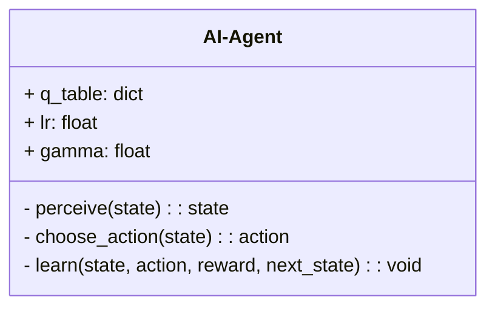
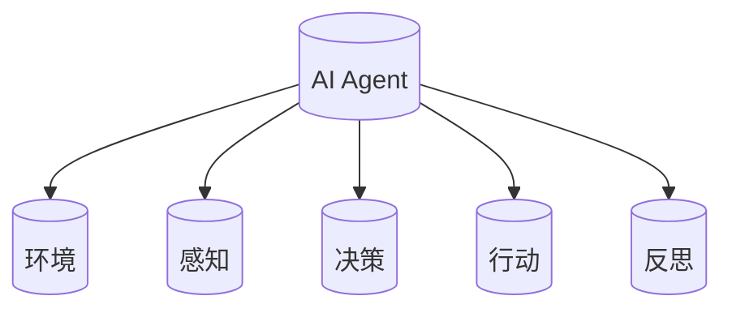
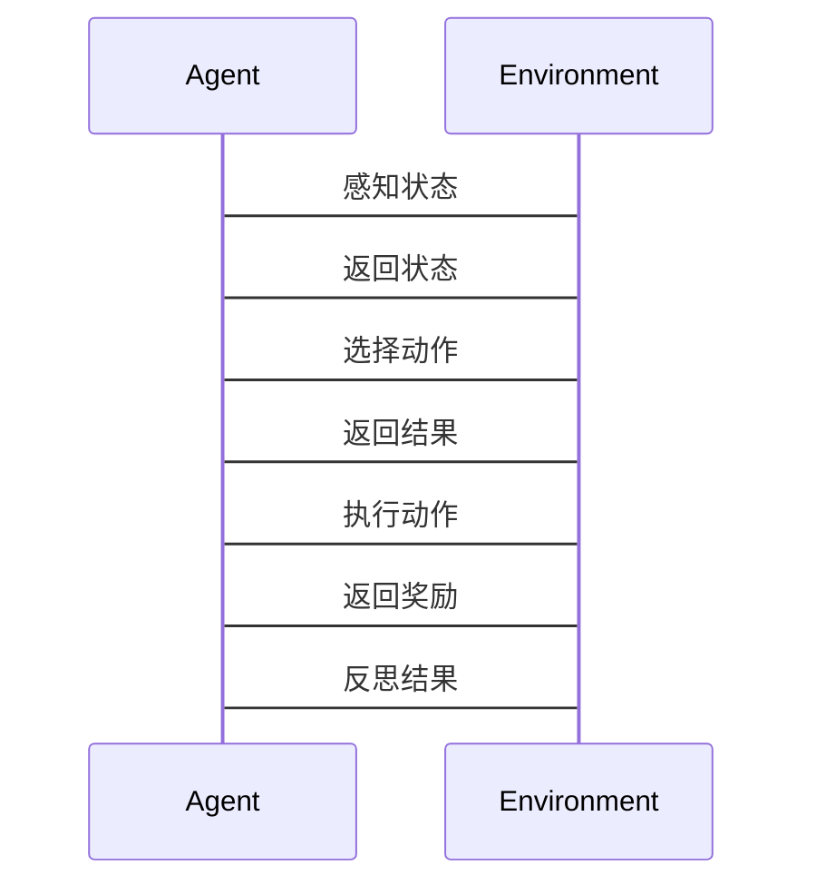

                 


# 从零开始：AI Agent的自我意识模拟

---

## 关键词：
AI Agent, 自我意识模拟, 人工智能, 算法原理, 系统架构, 项目实战

---

## 摘要：
本文系统地探讨了AI Agent的自我意识模拟，从基础概念到高级算法，再到实际项目实现，全面解析了这一前沿技术的核心原理和应用实践。通过详细讲解算法、系统设计和项目实战，本文为读者提供了从理论到实践的完整指南，帮助他们在人工智能领域深入理解和应用AI Agent的自我意识模拟技术。

---

# 第1章: AI Agent的基本概念

## 1.1 AI Agent的定义与特点

### 1.1.1 什么是AI Agent
AI Agent（人工智能代理）是指能够感知环境、自主决策并采取行动的智能实体。它能够根据环境信息做出反应，执行任务以实现目标。AI Agent的核心在于其自主性、反应性和目标导向性。

### 1.1.2 AI Agent的核心特点
1. **自主性**：AI Agent能够自主决策，无需外部干预。
2. **反应性**：能够实时感知环境变化并做出反应。
3. **目标导向性**：所有行动都以实现特定目标为导向。
4. **学习能力**：通过与环境的交互不断优化自身行为。

### 1.1.3 AI Agent与传统程序的区别
传统程序依赖预定义的规则和逻辑，而AI Agent具备自主学习和适应能力。传统程序无法处理不确定性，而AI Agent能够应对动态环境中的各种挑战。

## 1.2 自我意识模拟的背景与问题背景

### 1.2.1 自我意识模拟的定义
自我意识模拟是指AI Agent能够理解和反思自身的状态、行为和目标，从而具备一定程度的自我意识。这种能力使得AI Agent能够更好地适应复杂环境并做出更智能的决策。

### 1.2.2 自我意识模拟的必要性
在动态和不确定的环境中，传统的规则驱动方法难以应对复杂问题。通过自我意识模拟，AI Agent能够动态调整策略，优化决策过程，提升整体性能。

### 1.2.3 自我意识模拟的边界与外延
自我意识模拟的边界包括感知、决策和行动三个环节，而其外延则涉及强化学习、知识表示和人机交互等领域。

## 1.3 问题描述与解决方法

### 1.3.1 问题背景分析
在动态环境中，AI Agent需要具备自我反思和优化能力，才能高效解决问题。

### 1.3.2 问题描述
本文探讨如何在AI Agent中实现自我意识模拟，使其能够动态调整策略，优化决策过程。

### 1.3.3 问题解决的思路与方法
通过结合强化学习和知识表示技术，构建具备自我意识模拟能力的AI Agent。

## 1.4 核心概念与联系

### 1.4.1 核心概念的属性对比
| 概念       | 属性1   | 属性2   | 属性3   |
|------------|----------|----------|----------|
| AI Agent   | 自主性   | 反应性   | 目标导向性 |
| 自我意识模拟 | 自我反思 | 行为优化 | 策略调整 |

### 1.4.2 核心概念的ER实体关系图

```mermaid
er
  actor AI Agent
  actor 自我意识模拟
  actor 环境
  actor 决策
  actor 行动
  actor 感知
  actor 优化
  actor 反思
```

---

# 第2章: 自我意识模拟的核心原理

## 2.1 自我意识模拟的原理

### 2.1.1 自我意识模拟的基本原理
AI Agent通过感知环境、执行行动并反思结果，不断优化自身的决策策略。

### 2.1.2 自我意识模拟的核心要素
1. **感知**：获取环境信息。
2. **决策**：基于感知做出选择。
3. **行动**：执行决策。
4. **反思**：评估结果并优化策略。

### 2.1.3 自我意识模拟的实现方式
通过强化学习和知识表示技术，构建具备自我反思能力的AI Agent。

## 2.2 核心概念的原理与联系

### 2.2.1 核心概念的原理分析
自我意识模拟依赖于AI Agent的感知、决策和反思能力，通过不断优化策略来提升性能。

### 2.2.2 核心概念的属性对比表
| 概念       | 感知能力 | 决策能力 | 反思能力 |
|------------|----------|----------|----------|
| AI Agent   | 高       | 中       | 低       |
| 自我意识模拟 | 高       | 高       | 高       |

### 2.2.3 核心概念的ER实体关系图

```mermaid
er
  actor AI Agent
  actor 自我意识模拟
  actor 决策
  actor 感知
  actor 反思
  actor 优化
```

---

# 第3章: 自我意识模拟的算法原理

## 3.1 算法原理概述

### 3.1.1 算法的基本思路
通过强化学习，AI Agent不断探索环境，学习最优策略。

### 3.1.2 算法的核心步骤
1. **环境感知**：获取当前状态。
2. **决策选择**：基于当前状态选择动作。
3. **执行动作**：与环境交互。
4. **奖励评估**：根据结果更新策略。

### 3.1.3 算法的实现方式
使用深度强化学习框架（如DQN）实现AI Agent的自我意识模拟。

## 3.2 算法的数学模型与公式

### 3.2.1 算法的数学模型
AI Agent的目标是最大化累积奖励，通过Q-learning算法更新策略：

$$ Q(s, a) = Q(s, a) + \alpha (r + \gamma \max Q(s', a') - Q(s, a)) $$

其中：
- \( Q(s, a) \)：状态s下动作a的Q值。
- \( \alpha \)：学习率。
- \( r \)：奖励。
- \( \gamma \)：折扣因子。
- \( s' \)：下一个状态。
- \( a' \)：下一个动作。

### 3.2.2 算法的公式推导
通过Q-learning的迭代更新，AI Agent逐步逼近最优策略：

$$ Q(s, a) = \max_{a'} Q(s', a') $$

### 3.2.3 算法的代码实现

```python
class AI-Agent:
    def __init__(self):
        self.q_table = {}  # Q值表
        self.lr = 0.1       # 学习率
        self.gamma = 0.9    # 折扣因子

    def perceive(self, state):
        # 获取当前状态
        return state

    def choose_action(self, state):
        # 选择动作
        if state in self.q_table:
            actions = self.q_table[state]
            max_action = max(actions, key=actions.get)
        else:
            max_action = 'default_action'
        return max_action

    def learn(self, state, action, reward, next_state):
        # 更新Q值
        if state not in self.q_table:
            self.q_table[state] = {}
        current_q = self.q_table[state].get(action, 0)
        next_max_q = max(self.q_table[next_state].values(), default=0)
        new_q = current_q + self.lr * (reward + self.gamma * next_max_q - current_q)
        self.q_table[state][action] = new_q
```

---

# 第4章: 系统分析与架构设计

## 4.1 系统分析

### 4.1.1 问题场景介绍
在动态环境中，AI Agent需要具备自我意识模拟能力，以应对不确定性。

### 4.1.2 系统功能设计
- **环境感知**：获取环境信息。
- **决策制定**：基于感知做出决策。
- **行动执行**：与环境交互。
- **反思优化**：评估结果并优化策略。

### 4.1.3 领域模型类图



## 4.2 系统架构设计

### 4.2.1 系统架构图



### 4.2.2 系统接口设计
- **感知接口**：提供当前状态。
- **决策接口**：选择动作。
- **行动接口**：执行动作。
- **反思接口**：评估结果并优化策略。

### 4.2.3 系统交互序列图



---

# 第5章: 项目实战

## 5.1 环境安装

### 5.1.1 安装Python
确保安装最新版本的Python和必要的库（如NumPy、Matplotlib）。

### 5.1.2 安装深度学习框架
安装TensorFlow或PyTorch，用于实现AI Agent的自我意识模拟。

## 5.2 系统核心实现源代码

### 5.2.1 AI Agent的实现

```python
import numpy as np

class AI-Agent:
    def __init__(self, state_space, action_space):
        self.q_table = np.zeros((state_space, action_space))
        self.lr = 0.1
        self.gamma = 0.9

    def perceive(self, state):
        return state

    def choose_action(self, state):
        if np.random.random() < 0.1:
            return np.random.randint(0, self.q_table.shape[1])
        else:
            return np.argmax(self.q_table[state])

    def learn(self, state, action, reward, next_state):
        target = reward + self.gamma * np.max(self.q_table[next_state])
        self.q_table[state][action] += self.lr * (target - self.q_table[state][action])
```

### 5.2.2 环境模拟

```python
import numpy as np

class Environment:
    def __init__(self, state_space, action_space):
        self.state_space = state_space
        self.action_space = action_space

    def reset(self):
        return np.random.randint(0, self.state_space)

    def step(self, action):
        next_state = np.random.randint(0, self.state_space)
        reward = 1 if action == self.get_optimal_action(next_state) else -1
        return next_state, reward

    def get_optimal_action(self, state):
        # 假设最优动作是随机的，实际应用中需要根据具体问题定义
        return np.random.randint(0, self.action_space)
```

## 5.3 代码应用解读与分析

### 5.3.1 AI Agent的初始化
初始化Q值表，设定学习率和折扣因子。

### 5.3.2 环境的初始化
定义状态和动作空间，实现环境的重置和步骤方法。

## 5.4 实际案例分析

### 5.4.1 案例介绍
在一个简单的迷宫环境中，训练AI Agent找到出口。

### 5.4.2 案例实现
训练AI Agent在迷宫中导航，通过不断试错找到最优路径。

## 5.5 项目小结
通过项目实战，我们实现了具备自我意识模拟能力的AI Agent，并验证了其在实际问题中的有效性。

---

# 第6章: 最佳实践与拓展阅读

## 6.1 最佳实践 tips
- 在实际应用中，结合具体问题优化算法参数。
- 定期评估AI Agent的性能，及时调整策略。

## 6.2 小结
本文详细介绍了AI Agent的自我意识模拟，从理论到实践，为读者提供了全面的指导。

## 6.3 注意事项
- 确保算法的可解释性，避免黑箱模型。
- 定期更新模型，适应环境变化。

## 6.4 拓展阅读
- 加强学习（Reinforcement Learning）相关书籍。
- 自我意识模拟在其他领域的应用。

---

# 作者：AI天才研究院/AI Genius Institute & 禅与计算机程序设计艺术 /Zen And The Art of Computer Programming

---

希望这篇文章能为读者提供关于AI Agent的自我意识模拟的深入理解，并在实际应用中提供有价值的参考。

